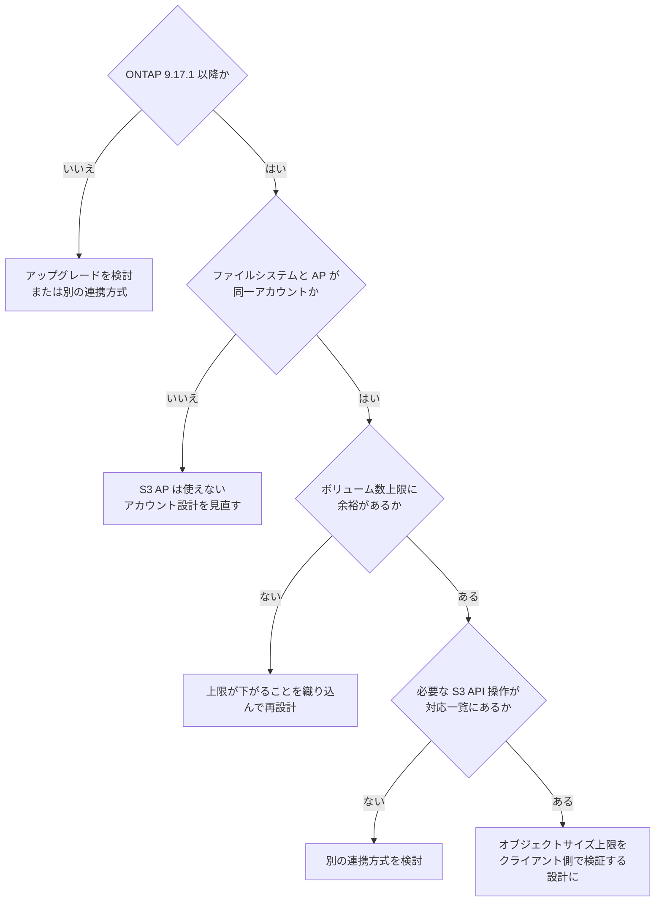

# FSx for ONTAP S3 AP は「S3 として使える」わけではない

[🏠 リポジトリトップ](../../../../../README.md) | [Domain — データ活用](../README.md)

---

## 結論

FSx for ONTAP S3 AP を使えば、ファイルデータを S3 API で読めます。ただし **Amazon S3 バケットに付ける Access Point とは制約が違います。** 「S3 として扱える」前提で設計すると、次の 3 点で詰まります。

| 制約 | 影響 |
|---|---|
| **ONTAP 9.17.1 以降が必須** | 既存ファイルシステムのバージョンが下回る場合、まずアップグレードの検討が必要です |
| **同一 AWS アカウント所有が必須** | クロスアカウントで他アカウントのボリュームに AP を作れません。**アカウント分離を前提とした設計は成立しません** |
| **同一リージョンが必須** | 対象ボリュームと同じリージョンにしか作れません |

さらに見落としやすい点があります。**S3 AP を使うとファイルシステムあたりのボリューム数上限が下がります。**

> **Evidence**: `documented` — 上記はすべて AWS 公式ドキュメントの記載に基づきます。
> **オブジェクトサイズの実測値は別扱いです**（後述）。適用前に自環境で確認してください。

---

## ボリューム数上限が下がる

S3 AP を使う場合、ボリューム数の上限が下がります。**容量設計をボリューム数の上限ぎりぎりで組んでいると、S3 AP の導入で上限に当たります。**

| 構成 | 通常 | S3 AP 使用時 |
|---|---|---|
| 第 2 世代（1 HA ペア） | 500 | **491** |
| 第 2 世代（2 HA ペア） | 1,000 | **975** |
| 第 2 世代（12 HA ペア） | 1,000 | **903** |
| 第 1 世代 | 500 | **491** |

HA ペアが多いほど減少幅が大きくなります。**「ペアを増やせばボリュームも増やせる」ではありません。**

S3 Access Point 自体の数は、リージョンあたりアカウントあたり既定 10,000 です。これは Amazon S3 のサービスクォータで、Service Quotas から引き上げ可能です。同じ値が **1 つのファイルシステムまたはボリュームに付けられる AP 数の上限**でもあります。

---

## S3 として扱えない部分

| 観点 | 実際 |
|---|---|
| 対応する S3 API 操作 | バケット向け Access Point と同一ではありません。**対応操作の一覧を確認してください** |
| ストレージクラス | FSx for ONTAP ボリューム上のファイルは `StorageClass` が `FSX_ONTAP` として識別されます。`STANDARD` 等を前提にした処理は動きません |
| クロスアカウント（AP の**作成**） | 不可。ファイルシステムと AP は同一アカウント所有が必須です |
| クロスアカウント（AP 経由の**データアクセス**） | **可能です。** AP ポリシーで許可すれば別アカウント・別組織のプリンシパルから読めます（実測）。[S3 Access Point の権限設計 — 評価順序と、絞り込みを担う 2 つの層](../../security-governance/notes/access-point-authorization-layers.md#クロスアカウントのデータアクセスは成立する) を参照 |
| S3 Event Notifications | 使えません。イベント駆動が必要なら Amazon EventBridge Scheduler によるポーリングか FPolicy を選びます |

**`StorageClass` を条件分岐に使っている既存コードは、そのままでは動きません。** 分析基盤やデータパイプラインを繋ぐ前に確認してください。

---

## AWS ドキュメントに載っていない実測の制約

**ここは公式ドキュメントの記載ではなく、姉妹リポジトリでの実測に基づきます。** このノートの `documented` 区分の外にあります。**自環境で必ず再確認してください。**

| 実測された挙動 | 実務上の意味 |
|---|---|
| オブジェクトサイズの上限は**バイナリ単位**（ドキュメント上の "GB" 表記と一致しない） | 境界値ぎりぎりの設計は破綻します |
| 単一 `PutObject` と `UploadPart` あたり 5 GiB、オブジェクト全体で 50 GiB | Amazon S3 本体（単一 PUT 5 GB / オブジェクト最大 50 TB）とは桁が違います |
| 全体サイズの超過は `CompleteMultipartUpload` の時点で初めて判定される | **全ペイロードを転送し終えた後に失敗します。** 転送時間と転送料が無駄になります |

最後の 1 点が運用に効きます。**クライアント側で事前にサイズを検証してください。** サーバー側の判定を待つと、大きいオブジェクトほど失敗コストが大きくなります。

実測の詳細と再現手順は [FSx-for-ONTAP-S3AccessPoints-Serverless-Patterns](https://github.com/Yoshiki0705/FSx-for-ONTAP-S3AccessPoints-Serverless-Patterns) にあります。**このリポジトリでは数値を再掲せずリンクします。** 実測値は測定環境と一体で意味を持つため、切り離して引用すると誤用されます。

---

## 撤去のときに詰まる — ボリュームは AWS 側からしか消せなくなる

**ここも実測です。** 導入時ではなく撤去時に効くため、検証環境を作る前に知っておく価値があります。

**S3 AP を一度取り付けたボリュームは、AP を全部外した後も ONTAP 側からは削除できません。**

```text
Cannot delete volume "..." in SVM "..." because it is associated with the following
object store NAS buckets: "amazon-fsx-<volume-id>"
```

| 確認したこと | 結果 |
|---|---|
| バケット名の由来 | **ボリューム ID と完全一致。** AP 単位ではなくボリューム単位に作られ、AP を外しても残ります |
| AP を全部削除したあと | 拒否は続きます。数時間後も同じです |
| ボリュームを online・マウント済みに戻す | 拒否は続きます |
| AP を再取り付けして正しい順序で外す | 拒否は続きます。**AP のライフサイクルとは独立しています** |
| `aws fsx delete-volume` | **成功します。** ボリュームとバケットが一緒に消えます |

**運用手順書への含意は 1 つです。S3 AP を取り付けたボリュームの撤去は、AWS 側の API で行ってください。** ONTAP CLI の `volume delete` を前提にした手順書は、この経路では詰まります。ONTAP 側で offline にしてから AWS 側で消す、という順序も不要です（online のまま `aws fsx delete-volume` で通ります）。

### 見えないものを「無い」と読まないこと

この件で測れた副産物があり、こちらのほうが応用範囲が広いです。

| リーダー | このバケット / S3 サーバをどう見せるか |
|---|---|
| ONTAP REST `/protocols/s3/buckets` | 列挙しない |
| ONTAP CLI `vserver object-store-server bucket show` | 列挙しない |
| ONTAP REST `/svm/svms`（`s3` フィールド） | S3 サーバを `enabled` として**見せる** |
| ONTAP REST `/protocols/s3/services` | 同じ SVM を**列挙しない** |

**AWS が管理するオブジェクトは、標準の ONTAP S3 ビューから隠れています。** バケットの不在を 2 つのリーダーで確認しても、両方が同じ盲点を持っていました。

NetApp が文書化している [NAS バケット構成の削除手順](https://docs.netapp.com/us-en/ontap/revert/remove-nas-bucket-task.html) は `vserver object-store-server bucket delete -vserver <svm> -bucket <bucket>` を使いますが、**対象を列挙できないのでこの経路には適用できません。** 同種の症状の KB は [Cannot delete volume "because this volume is associated with object store bucket"](https://kb.netapp.com/onprem/ontap/da/S3/Cannot_delete_volume_%22because_this_volume_is_associated_with_object_store_bucket%22) にありますが、解決手順の本文は NetApp Support のログインが必要で、本ノート作成時点では参照できていません。

> **Evidence**: この節は `verified`（実測）です。AWS / NetApp のドキュメントには、S3 AP を取り付けたボリュームの削除順序についての記載を見つけられていません。**未確認は「そう仕様である」ことを意味しません。** 自環境で撤去手順を通してから本番設計に組み込んでください。

---

## 判断フロー



---

## 自分の環境で確かめる

| # | 手順 | 確認できること |
|---|---|---|
| 1 | ファイルシステムの ONTAP バージョンを確認する | 9.17.1 以降という前提を満たすか |
| 2 | 対象ボリュームと AP のアカウント・リージョンを確認する | 同一所有・同一リージョンの要件 |
| 3 | 現在のボリューム数と上限を比較する | S3 AP 導入で上限に当たらないか |
| 4 | 使う予定の S3 API 操作を対応一覧と突き合わせる | 実装前に非対応を見つける |
| 5 | 想定する最大オブジェクトサイズで実際に転送を試す | **上限の判定タイミングを含めて確認する** |

手順 5 は**成功だけでなく失敗も試してください。** 上限を超えるオブジェクトで、どの時点でどのエラーが返るかを見ておくと、クライアント側の検証を正しく設計できます。

AD 参加済み SVM で S3 AP を使う場合、データ操作には AD ドメインコントローラーへの到達性が必要です。**`HeadBucket` は AD が到達不能でも成功するため、疎通確認には使えません。** データ操作（`ListObjectsV2` など）で確認してください。この挙動も上記の姉妹リポジトリに記録があります。

---

## よくある誤解

| 誤解 | 実際 |
|---|---|
| S3 バケットと同じように使える | 対応する API 操作、ストレージクラス、クロスアカウントの扱いが異なります |
| どのバージョンの FSx for ONTAP でも使える | ONTAP 9.17.1 以降が必須です |
| 他アカウントのボリュームに AP を作れる | 作れません。ファイルシステムと AP は同一アカウント所有が必須です |
| 同一アカウント所有が必須なので、他アカウントからデータも読めない | **読めます。** 制約は作成側です。AP ポリシーで許可すれば別組織のアカウントからも通ります（実測） |
| S3 AP を有効にしてもボリューム数上限は変わらない | 下がります。HA ペアが多いほど減少幅が大きくなります |
| オブジェクトサイズ上限は Amazon S3 と同じ | 桁が違います。全体で 50 GiB 水準です（実測、姉妹リポジトリ参照） |
| サイズ超過は転送前に弾かれる | 全体サイズの判定は `CompleteMultipartUpload` 時点です。**転送し終えてから失敗します** |
| S3 Event Notifications でイベント駆動にできる | 使えません。EventBridge Scheduler によるポーリングか FPolicy を選びます |

---

## 参照した一次情報

| 論点 | 出典 |
|---|---|
| ONTAP 9.17.1 以降、同一アカウント、同一リージョンの各要件 | [AWS: Access points naming rules, restrictions, and limitations](https://docs.aws.amazon.com/fsx/latest/ONTAPGuide/access-point-for-fsxn-restrictions-limitations-naming-rules.html) |
| S3 AP 使用時のボリューム数上限、AP 数のクォータ | [AWS: Quotas](https://docs.aws.amazon.com/fsx/latest/ONTAPGuide/limits.html) |
| `StorageClass` が `FSX_ONTAP`、対応 API 操作の一覧の所在 | [AWS: Using access points](https://docs.aws.amazon.com/fsx/latest/ONTAPGuide/access-points-for-fsxn-usage-examples.html) |
| オブジェクトサイズ上限と判定タイミング（**実測 / ドキュメント外**） | [FSx-for-ONTAP-S3AccessPoints-Serverless-Patterns](https://github.com/Yoshiki0705/FSx-for-ONTAP-S3AccessPoints-Serverless-Patterns) |

---

## 関連ドキュメント

- [Domain — データ活用](../README.md) — このモジュールのハブ
- [Domain — マルチプロトコル・ID](../../multiprotocol-identity/) — AD 参加済み SVM での前提
- [Playbook 02 — 設計](../../../playbooks/02-design/) — 不可逆な項目（`NetworkOrigin` など）は設計時に確定します
- [本番投入前レビュー](../../../playbooks/04-build/checklists/pre-production-review.md) — S3 AP 関連の確認項目
- [公開されている一次情報と事例の入口](../../../case-studies/public-references.md) — 姉妹リポジトリの位置づけ
- [知見の分類ポリシー](../../../evidence-policy.md)

---

[🏠 リポジトリトップ](../../../../../README.md) | [Domain — データ活用](../README.md)
