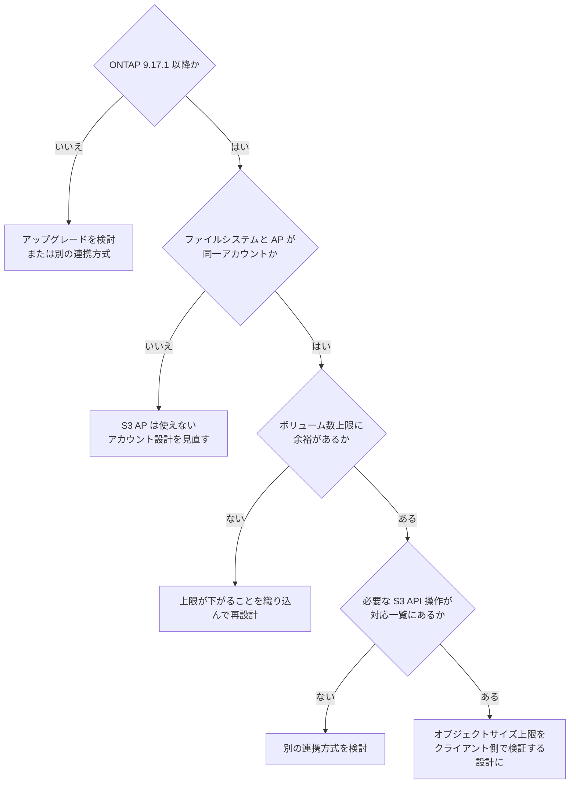

# FSx for ONTAP S3 Access Points は S3 として使えるか？

使えません。前提条件と S3 との差分があり、ボリューム数上限も下がります。

## このノートで学べること

- S3 Access Points の前提条件（ONTAP 9.17.1 以降・同一アカウント同一リージョン）とボリューム数上限の低下
- 条件付き書き込み・Versioning・Lifecycle・Object Lock・Event Notifications が非対応で、S3 として設計すると詰まる箇所

## このノートが答えないこと

- オブジェクトサイズ上限の単位（"GB" 表記の解釈は `open`）や撤去時のバケット削除の帰属（`open`）
- WORM 要件を満たす保持設計の可否判断（SnapLock は不可逆なため別途承認が要る）

## 前提レベル

advanced

## 本文

<a id="fsx-for-ontap-s3-ap-はs3-として使えるわけではない"></a>

[🏠 リポジトリトップ](../../../../../README.md) | [Domain — データ活用](../README.md)

---

### 結論

FSx for ONTAP S3 AP を使えば、ファイルデータを S3 API で読めます。ただし **Amazon S3 バケットに付ける Access Point とは制約が違います。** 「S3 として扱える」前提で設計すると、次の 3 点で詰まります。

| 制約 | 影響 |
|---|---|
| **ONTAP 9.17.1 以降が必須** | 既存ファイルシステムのバージョンが下回る場合、まずアップグレードの検討が必要です |
| **作成時は同一 AWS アカウント所有が必須** | 他アカウントのボリュームに AP を作れません。別アカウントからのデータ利用は別の論点で、AP ポリシーと呼び出し元の identity-based ポリシーの両方が許可すれば成立します |
| **同一リージョンが必須** | 対象ボリュームと同じリージョンにしか作れません |

さらに見落としやすい点があります。**S3 AP を使うとファイルシステムあたりのボリューム数上限が下がります。**

> **Evidence**: `documented` — 上記はすべて AWS 公式ドキュメントの記載に基づきます。
> **オブジェクトサイズの実測値は別扱いです**（後述）。適用前に自環境で確認してください。

---

### 下がるボリューム数上限

S3 AP を使う場合、ボリューム数の上限が下がります。**容量設計をボリューム数の上限ぎりぎりで組んでいると、S3 AP の導入で上限に当たります。**

| 構成 | 通常 | S3 AP 使用時 |
|---|---|---|
| 第 2 世代（1 HA ペア） | 500 | **491** |
| 第 2 世代（2 HA ペア） | 1,000 | **975** |
| 第 2 世代（12 HA ペア） | 1,000 | **903** |
| 第 1 世代 | 500 | **491** |

HA ペアが多いほど減少幅が大きくなります。**「ペアを増やせばボリュームも増やせる」ではありません。**

S3 Access Point 自体の数は、リージョンあたりアカウントあたり既定 10,000 です。これは Amazon S3 のサービスクォータで、Service Quotas から引き上げ可能です。同じ値が **1 つのファイルシステムまたはボリュームに付けられる AP 数の上限**でもあります。

---

### S3 として扱えない部分

| 観点 | 実際 |
|---|---|
| 対応する S3 API 操作 | バケット向け Access Point と同一ではありません。**設計を変える差分は下の[対応表を読むときに効く差分](#対応表を読むときに効く差分)にあります** |
| ストレージクラス | FSx for ONTAP ボリューム上のファイルは `StorageClass` が `FSX_ONTAP` として識別されます。`STANDARD` 等を前提にした処理は動きません |
| クロスアカウント（AP の**作成**） | 不可。ファイルシステムと AP は同一アカウント所有が必須です |
| クロスアカウント（AP 経由の**データアクセス**） | **可能です。** AP ポリシーで許可すれば別アカウント・別組織のプリンシパルから読めます（実測）。[S3 Access Point の権限設計 — 評価順序と、絞り込みを担う 2 つの層](../../security-governance/notes/access-point-authorization-layers.md#クロスアカウントデータアクセスの成立) を参照 |
| S3 Event Notifications | 使えません。**FPolicy は代替になりません**（下記の実測制約を参照）。Amazon EventBridge Scheduler によるポーリングか、ONTAP のネイティブ監査ログを起点にします |

**`StorageClass` を条件分岐に使っている既存コードは、そのままでは動きません。** 分析基盤やデータパイプラインを繋ぐ前に確認してください。

---

### 対応表を読むときに効く差分

**[対応表](https://docs.aws.amazon.com/fsx/latest/ONTAPGuide/access-points-for-fsxn-object-api-support.html)の全行はここに写しません。** AWS 自身が partial list と明記しているので写しても網羅にならず、**写した表は更新されないまま残ります。** ここに置くのは**設計を変える行だけ**です。**2026-09-14 に全文を確認しました。**

#### パターンごと成立しない 4 つの不在

| 使えないもの | 成立しなくなるパターン |
|---|---|
| **条件付き書き込み**（conditional writes） | **`If-None-Match` / `If-Match` による楽観的排他が使えません。** 「同じキーが既にあれば書かない」「読んだときの版のままなら書く」を S3 の側で表現できないので、**上書き競合の防止をアプリケーション側かファイル側のロックに移す必要があります** |
| **Object Versioning**（`ListObjectVersions` も非対応） | **世代管理を S3 の機能で持てません。** 版が要るなら ONTAP の Snapshot 側で設計します |
| **Object Lifecycle** | **経過日数による移行・削除の自動化ができません。** 階層化は FabricPool 側の仕組みで、ライフサイクルルールとは別の設定です |
| **Object Lock**（`PutObjectRetention` / `PutObjectLegalHold` も非対応） | **WORM をこの経路では表現できません。** 必要なら SnapLock で、**これは不可逆なので保持期間を名指しした承認が要ります**（[不可逆な操作の承認は作業の承認とは別に取る](../../security-governance/notes/irreversible-operations-need-separate-approval.md)） |

**他に非対応なのは** ACL（`bucket-owner-full-control` 以外）、Object Annotations、Requester Pays、Static Website Hosting、MFA delete、`RestoreObject`、そしてバケット設定の読み取り系（`GetBucketAcl` / `GetBucketCors` / `GetBucketPolicy` / `GetBucketNotificationConfiguration`）です。**`GetBucketNotificationConfiguration` が非対応であることは、イベント通知が無いことと同じ側の事実です。**

#### 完全性の検証がそのままでは移らないこと

**ETag もチェックサムも、Amazon S3 で使っていた形では使えません。**

| 項目 | この経路での挙動 |
|---|---|
| **ETag** | オブジェクト内容のハッシュですが、**MD5 ダイジェストではありません。** メタデータの変更では変わりません |
| **チェックサム** | アップロード時に指定すると**転送中の検証には使われます。** ただし**値はボリュームに保存されず、応答にも返らず、ダウンロード時の検証には使われません** |

**収集パイプラインが完全性を ETag の突き合わせやチェックサムの再検証で担保しているなら、そこは作り直しになります。** 「S3 に置いたから同じ検証ができる」とは読めません。

#### コピーの範囲が同一 Access Point 内に限られること

`CopyObject` と `UploadPartCopy` は**同一リージョンのコピーで、かつコピー元とコピー先が同一の Access Point 内にある場合に限り**対応します。**別の Access Point へ、あるいは Amazon S3 のバケットへ直接コピーする形にはなりません。** `CopyObject` では `x-amz-object-annotation-directive` ヘッダーも非対応です。

#### Presign が対応に変わっていること

**対応表は現在 `Presign` を Supported としています**（2026-09-14 に確認）。**署名付き URL による短命・資格情報なしのアクセスがこの経路で使えます。** ブラウザ経路を自分で組む場合の選択肢に入ります（[エンドユーザーがデータに届く経路](../../../playbooks/02-design/notes/how-end-users-reach-the-data.md#ブラウザ経路を自分で組む場合の選択肢)）。

> **このリポジトリでは測っていません。** 隣のリポジトリが 2026-08-19 に `PutObject` / `HeadObject` / `GetObject` の 3 つで成功を実測していますが、**その時点の対応表は非対応としており、記録も「対応表が非対応としている間は依存させない」という条件付きの助言でした。** 表が変わったのでその条件は解けましたが、**実測は表の変更より前です。** 依存する前に自環境で確認してください。

**この節を「非対応の網羅」として引かないでください。** 上のとおり元の表が partial list です。**「X ができない」の根拠にするときは、表が網羅でないことを添えてください。**

---

### AWS ドキュメントに載っていない実測の制約

**ここは公式ドキュメントの記載ではなく、姉妹リポジトリでの実測に基づきます。** このノートの `documented` 区分の外にあります。**自環境で必ず再確認してください。**

| 実測された挙動 | 実務上の意味 |
|---|---|
| オブジェクトサイズの上限は**バイナリ単位**（ドキュメント上の "GB" 表記と一致しない） | 境界値ぎりぎりの設計は破綻します |
| 単一 `PutObject` と `UploadPart` あたり 5 GiB、オブジェクト全体で 50 GiB | Amazon S3 本体（単一 PUT 5 GB / オブジェクト最大 50 TB）とは桁が違います |
| 全体サイズの超過は `CompleteMultipartUpload` の時点で初めて判定される | **全ペイロードを転送し終えた後に失敗します。** 転送時間と転送料が無駄になります |
| **50 GiB は書き込みの上限で、読み取りの上限ではありません** | **下の[方向で非対称なサイズ上限](#方向で非対称なサイズ上限)。** ファイル側で作った 50 GiB 超のファイルは、S3 API で取得できます |
| **AP 経由の操作は FPolicy 通知を発火しない。`mandatory` 指定の同期ポリシーでも遮断されない** | FPolicy を前提にしたリアルタイム検知・DLP・遮断は、この経路に効きません。**同じボリュームを NFS / SMB で触れば発火します** — 適合するかは書き込みが着地するプロトコルで決まり、読む側は判定に入りません（[FPolicy が適合するかは、データをどう読むかではなく、どう書くかで決まる](fpolicy-fits-by-how-writes-land.md)） |
| AP 経由の操作は ONTAP ネイティブ監査ログには記録される。ただし要求者は記録されない | 「何が操作されたか」は追えます。「誰が」は追えません。要求元の IAM プリンシパルは、[CloudTrail の S3 データイベント](https://docs.aws.amazon.com/AmazonS3/latest/userguide/access-points-monitoring-logging.html)を構成すると Access Point 経由のリクエストとして記録できます |
| AP 経由の書き込みは ARP が検知する | ランサムウェア検知については、FPolicy の穴を ARP が埋めます（実測: AP 経由で書いた高エントロピーオブジェクトが suspect として記録、2026-08-26 / ONTAP 9.18.1P3D1 / ARP/AI。**手順と件数の所在は [この経路を見ない FPolicy](../../security-governance/notes/access-point-authorization-layers.md#この経路を見ない-fpolicy) 側に書いてあります** — 件数はこちらでは持ちません）。**観測された検知理由は高エントロピーのみで、他の理由で検知されるかは測っていません。** 改名・削除のレートも ARP の検知入力ですが、**閾値がサージ判定なので同じようには効きません**（[暗号化を伴わない攻撃](../../data-protection/notes/snaplock-and-layered-ransomware-readiness.md#暗号化を伴わない攻撃)）。**ただし検知は遮断ではありません。** ベンダーの応答手順は警告・Snapshot・管理者による分類で、**書き込みを拒否する段がありません**（[ベンダーのドキュメント](https://docs.netapp.com/us-en/ontap/anti-ransomware/index.html)は「detecting and warning」と記載、2026-09-05 に確認）。遮断は AP ポリシーと IAM の側で表現してください |
| **同一 SVM に ONTAP のオブジェクトストアサーバーがあると AP を作成できない** | 下記のとおり自環境で実測。ONTAP の S3 機能と S3 AP は**同じ SVM では併存しませんでした** |
| **オブジェクトタグの一部の Unicode 文字が `InvalidTag` で拒否される** | 後述のとおり**不具合**であり、意図された制限ではありません。修正までタグ値を ASCII に限定してください |
| **`UploadPartCopy` が同一 AP 内のコピーで `NoSuchKey` を返す** | 後述のとおり**不具合**です。copy-source のキーにパーセントエンコード対象の文字（`/` など）が含まれる場合に発生します |

#### 方向で非対称なサイズ上限

**50 GiB を「オブジェクトサイズの上限」として読むと、経路を 1 つ落とします。** AWS の記載は書き込みだけを縛っています。

> Maximum object size is 50 GiB for uploads, but you can download objects larger than that

| 経路 | 50 GiB を超えるオブジェクト |
|---|---|
| S3 API で書く | **作れません。** `CompleteMultipartUpload` で失敗します |
| NFS / SMB で書いたものを S3 API で読む | **取得できます** |

**つまり収集を S3 API に寄せた設計でも、大きいファイルだけファイル側で作れば S3 から読めます。** これは実測されています（2026-09-11、`ap-northeast-1`、第 1 世代 `SINGLE_AZ_1` / 128 MBps、SSD 1,024 GiB、ボリューム 70 GiB / UNIX、NFSv3、S3 AP は `NetworkOrigin=VPC` / `FileSystemIdentityType=UNIX`）。**50 GiB + 1 バイト（53,687,091,201 バイト）の全体 GET が成功し、Range GET も先頭・末尾ともに成功しました。**

**同一セッションにコントロールが置かれています。** 1 GiB のファイルを同じ手順で取得して成功しており、**経路が生きていることを示さずに大きい側だけ測ると、失敗したときに「50 GiB 超だから」と「経路が壊れていた」を区別できません。**

> **所要 537 秒を読み取り性能として引かないでください。** 測定対象のファイルは `truncate` で作った疎ファイル（`blocks=0`）です。S3 から見えるサイズは apparent size で決まるので**サイズ上限の判定には影響しませんが、ディスクを読んでいません。** また**引用元は ONTAP のバージョンを記録し忘れており、環境を消したあとなので取得できないと明記しています。**

出典は [収集層の上限値](https://github.com/Yoshiki0705/S3-Burst-on-ONTAP-Files/blob/main/docs/ja/reference/limits/s3-access-point.md) です。**このリポジトリでは再測定していません。**

#### ONTAP の機能と併用したときに測られたこと

**AP を付けたボリュームで ONTAP の機能が使えるかは、対照付きで測られています。** 以下は隣のリポジトリの実測（UNIX スタイル、identity は UNIX / `root`）で、**このリポジトリでは再測定していません**（[S3 Access Point 経路で ONTAP の機能は使えるか](https://github.com/Yoshiki0705/S3-Burst-on-ONTAP-Files/blob/main/docs/ja/reference/limits/s3ap-interoperability.md)）。

| 機能 | 結果 |
|---|---|
| qtree | 作成でき、`--delimiter /` の `CommonPrefixes` に現れる。**AP を持たない対照ボリュームと差は出ません** |
| tree クォータ | 有効。**S3 経由で書いたファイルが files used に計上されます** |
| FlexClone（ボリューム単位） | 作成でき、**クローンにも AP を取り付けられます。** クローン経由の PUT は親に現れません |
| FlexClone（ファイル単位） | S3 側から**通常のオブジェクトとして見え、読め、上書きできます。** S3 が書いていないファイルでも同じです |
| FlexGroup | AP を取り付けられ、PUT / GET / LIST とマルチパートが通り、**スナップショットとクローンも作れました** |

**設計に効くのは、この 2 つの失敗の形です。**

| 症状 | 実際の原因 |
|---|---|
| PUT が HTTP 507 `InsufficientCapacity` / `Maximum storage capacity of file system has been reached.` を返す | **qtree のファイル数クォータです。ファイルシステムは満杯ではありません。** files の上限を 10 → 50 に上げただけで、拒否された同一キー・同一ボディの PUT が通りました |
| ファイル単位クローンが何も作らない | **`POST /api/storage/file/clone` は 202 とジョブ UUID を返しますが、その UUID が解決できません**（`404 entry doesn't exist`、ジョブ一覧 166 件を検索しても該当なし）。ボリューム作成とボリュームクローンは同一セッションで 200 と `state=success` を返しており、権限の問題ではありません。**成否は宛先ファイルを見て判定してください** |

**1 行目のエラー文は運用判断を誤らせます。** 507 と「ファイルシステムの容量上限」を読んだ担当者はファイルシステムの拡張を検討します。**クォータを使うなら、この応答が何を意味するかを runbook に書いてください。**

**2 行目は、このリポジトリが別の箇所で記録している形と同じです** — 拒否が成功の形で返り、値を読み直すまで分かりません（[分割の単位が決めているのは、後で決め直せない範囲](../../../playbooks/02-design/notes/the-split-decides-what-cannot-be-revisited.md#分けても独立にならない-2-つの経路)）。

**副産物が 1 つあります。** AP を取り付けたボリュームの直下に、S3 レイヤーが作る内部ディレクトリ `____NTAP_S3_MAPPING` が現れ、**NFS / SMB から見えます。** 収集層のボリュームを人が覗く運用では、これが何かを説明できるようにしておいてください。

#### オブジェクトストアサーバーとの併存不可

**S3 AP をアタッチするとき、FSx for ONTAP は対象ボリュームが属する SVM 上に管理用のオブジェクトストアサーバーを作成します。** その SVM に既に別のオブジェクトストアサーバーが存在すると、この作成が失敗し、AP は `FAILED` で終わります。

| 確認したこと | 結果 |
|---|---|
| 同一 SVM 内での回避策 | **見つけられませんでした**（`open`）。既存のオブジェクトストアサーバーを削除すると作成できることは実測しています |
| 制約の適用単位 | **SVM 単位** |
| 回避策 | **オブジェクトストアサーバーが無い別の SVM のボリュームに AP をアタッチする** |
| 別 SVM 側の前提 | `vserver add-protocols -vserver <svm> -protocols s3` で S3 プロトコルを有効化しておく |

**つまり ONTAP S3 を使っている SVM は現構成のまま残し、S3 AP は別 SVM のボリュームに向ける、という分離になります。** 既存の S3 クライアントが利用中のサーバーを止める必要はありません。

**ただしこの回避策が使えない用途が 1 つあります。監査ログの取得です。** ファイルアクセス監査の宛先は `vserver audit` の `-destination` で指定するパスで、**監査対象ボリュームと同一 SVM の名前空間内に置く必要があります。** したがって EVTX を S3 AP 経由で読みたい場合、AP は当該 SVM のボリュームにアタッチするしかなく、**その SVM に既にオブジェクトストアサーバーがあると別 SVM へ逃げられません。**

| 用途 | 別 SVM への回避 |
|---|---|
| 任意のデータを S3 AP で公開する | **使える** |
| **同一 SVM の監査ログ（EVTX）を S3 AP で読む** | **使えない**（宛先が SVM をまたげない） |

この場合の選択肢は、既存のオブジェクトストアサーバーを削除するか、**S3 AP 以外の取得経路を使う**ことです。ONTAP REST のファイル API でマウント無しに EVTX を取得できることは実測しています（[監査宛先が枯渇するとクライアントアクセスは止まる](../../security-governance/notes/audit-log-space-and-client-access.md#監査ログの取り出し)）。

> **Evidence**: 制約そのものは実測（`verified`、2026-09-01）。**この排他が SVM 単位なのか別の粒度なのか、
> および内部の機構は当方で確かめられていないため `open` です。** 前提条件および制約としてドキュメントへの
> 記載を要望として起票済みです（2026-09-02 起票）。**本ノート作成時点で公開ドキュメントには未記載です。**

#### 不具合として区分された 2 件

上の表のうち 2 件は、AWS サポートから**仕様ではなく不具合であるという判断**を得ています。**制限として設計に織り込むのではなく、修正を待つ対象として扱ってください。** 区別が要るのは、恒久的な制限なら回避策を設計に固定しますが、不具合なら修正後に解除できるためです。

| 事象 | 区分 | 現時点の扱い |
|---|---|---|
| オブジェクトタグのキー / 値に含まれる特定の Unicode 文字が `InvalidTag` で拒否される | **ONTAP 側の不具合**（NetApp KB [CONTAP-771956](https://kb.netapp.com/on-prem/ontap/da/S3/S3-Issues/CONTAP-771956)）。将来の ONTAP バージョンで修正予定 | タグ値を ASCII に限定する |
| 同一 AP 内のコピーで `UploadPartCopy` が `NoSuchKey` を返す | **AWS 側の不具合**。ドキュメントの誤りではありません。修正が進行中 | **採用できる回避策がありません**（下記「到達性を決めるのは設定値」を参照） |

**`UploadPartCopy` の失敗には対照付きの実測があります。** [検証記録](https://github.com/Yoshiki0705/S3-Burst-on-ONTAP-Files/blob/main/docs/ja/verification/s3ap-operations.md)（2026-08-19、ap-northeast-1、`SINGLE_AZ_1` / 128 MBps、UNIX）で、**同一の `CopySource` を与えた `CopyObject` が同一実行内で成功しています。** つまり `NoSuchKey` は署名や権限や手順の誤りではなく、この API 呼び出しに固有です。**自分の環境で同じ症状に当たったときは、まず `CopyObject` を対照として流してください** — 通れば経路と権限は正常で、切り分けが 1 手で済みます。

**ただし出どころの記録は、`UploadPartCopy` そのものの対応可否を未判定としています。** 別 AP をソースとするコピーは `CopyObject` でも拒否されるため、「同一 AP 内では失敗する」ことと「この API が非対応である」ことを、その測定では分離できていません。**不具合という区分は AWS サポートの判断であって、この測定から導いた結論ではありません。**

**オブジェクトタグは Amazon S3 と同等の Unicode 対応が意図された仕様です。** したがって現在拒否される文字があることは仕様ではありません。ASCII への限定は修正までの回避策であり、恒久的な設計制約として文書化すると、修正後も不要な制限を残すことになります。

#### 到達性を決めるのは設定値

**`UploadPartCopy` は、自分のコードがそれを呼ぶかどうかでは決まりません。**

Spark / S3A で書く経路がこの不具合に当たるかを決めているのは `fs.s3a.multipart.threshold` です。
Hadoop はこの値を「**rename されるファイルの partition size も制御する。rename は source の
コピーを伴うため**」と記載しています。**つまり rename は常に 1 回の `CopyObject` ではなく、
出力 part がしきい値を超えると `UploadPartCopy` になります。**

そのため到達性は 3 つの設定の組み合わせで決まり、**どれか 1 つを見ても分かりません。**

| 設定 | 効き方 |
|---|---|
| `fs.s3a.multipart.threshold` | この値を超える part の rename が `UploadPartCopy` を使います |
| 出力 part のサイズ（例: `spark.sql.files.maxPartitionBytes`） | しきい値との大小関係を決めます |
| output committer | 未指定なら **rename ベースの既定**が有効で、rename が発生します |

**しきい値の下に出力 part を保つのが、この経路で唯一反転可能な対処です。** 修正が入った時点で
元に戻せます。

#### 採用できない回避策を回避策として書かないこと

**このノートは以前、回避策を「copy-source のキーにパーセントエンコード対象の文字を含めない」と
書いていました。** そのうえで「`/` を含むプレフィックス設計と両立しない」とも書いていました。
**両立しないと自分で書いたものを回避策の欄に残していたことになります。**

`/` を使わないキー設計は、このリポジトリが扱うどのプレフィックス設計とも両立しません。そして
**不具合が修正された後も残ります。** 恒久的な設計制約として文書化すると、修正後に不要な制限が
残る——これはオブジェクトタグの ASCII 限定について書いたのと同じ理屈で、**`UploadPartCopy` の側に
適用していませんでした。**

**採用できないものは回避策ではなく、この経路が使えないという事実です。** 同一 AP 内のコピー自体は
サポートされている操作なので、失敗を仕様と読んで別経路を設計すると余計な作りになります。

> **Evidence**: `documented` — `fs.s3a.multipart.threshold` が rename の partition size も制御する
> という記述は Hadoop のドキュメントに基づきます。**到達性の分析は、この 3 設定を持つ実装を運用して
> いる sibling プロジェクトからの報告**です（2026-09-07、
> [Issue #121](https://github.com/Yoshiki0705/FSx-for-ONTAP-Lakehouse-Integrations/issues/121)）。
> **著者による実測は含みません。**

オブジェクトサイズの上限についても補足があります。上の表が**バイナリ単位である**という読みは、拒否される境界の実測と整合します。**ただし公開ドキュメントの表記は "GB" なので、単位の解釈そのものは `open` です。** 表記の明確化を要望として起票済みです。数値そのものはこのノートでは再掲しません（後述）。

#### `read_timeout` の既定値で足りること

**このノートは以前、ここを未確認として「自環境で `read_timeout` の挙動を測ってください」と書いていました。取り下げます。答えは公開ドキュメントにありました。**

[Amazon S3 の `CompleteMultipartUpload` API リファレンス](https://docs.aws.amazon.com/AmazonS3/latest/API/API_CompleteMultipartUpload.html)に、**処理中は接続がタイムアウトしないように Amazon S3 が定期的に空白文字を送る**と記載されています。**つまりレスポンスはアセンブリ完了後に初めて返るのではなく、処理中も流れています。** したがって**オブジェクトサイズに比例した `read_timeout` の下限を設ける必要はありません。**

**あわせて、本ノートが以前書いていた「SDK の既定値では失敗する」という推論も誤りでした。** 推論としては既に撤回していましたが、上記により結論としても否定されています。**同じページを最初に読んでいれば、測定を勧める必要はありませんでした。**

**そして 200 が返ることは成功を意味しません。** 同じページに、**初回の `200 OK` を送った後でもリクエストは失敗し得る**こと、**`200 OK` のレスポンスは成功とエラーのどちらも含み得る**こと、**エラーレスポンスが `200 OK` の中に埋め込まれ得る**ことが記載されています。

| 呼び出し方 | エラー検出の責任 |
|---|---|
| AWS SDK | **SDK が埋め込みエラーを検出**し、設定に従ってエラーハンドリング（必要に応じた再試行を含む）を適用します |
| API を直接呼ぶ | **自分でレスポンスの内容を解析する必要があります。** ステータスコードだけで判定すると、失敗を成功として扱います |

**これは FSx for ONTAP S3 AP 固有ではなく、Amazon S3 の汎用バケットについて文書化されている挙動です。** S3 互換の経路を使う限り同じ扱いが必要になります。

**残っている未確認は 1 点です。アセンブリ中にクライアントが接続を中断した場合、サービスがアセンブリを完了させるのか中止するのかは、上記のページにも記載がありません。** これはタイムアウト後の正しい動作（オブジェクトの存在を再確認するのか、再試行するのか）を決めます。AWS サポートに照会中で、回答待ちです（2026-09-09 時点）。**上記のとおり既定値ではタイムアウトしないため、この分岐に入るのは例外的な経路に限られます。**

> **Evidence**: 拒否・失敗の挙動そのものは実測（`verified`、2026-08-02 および 2026-08-26、ap-northeast-1）。
> **意図された制限なのか不具合なのか、修正の予定があるのかは公開情報から判断できないため `open` です。**
> 不具合として扱ってほしい旨は起票済みです（オブジェクトタグは 2026-09-02、`UploadPartCopy` とサイズ上限は
> 2026-08-26 起票）。**本ノート作成時点で、いずれも公開ドキュメントには未記載です。** 修正の提供や
> ドキュメント更新は公開されるまで未反映として扱ってください。

サイズの 1 点は運用に効きます。**クライアント側で事前にサイズを検証してください。** サーバー側の判定を待つと、大きいオブジェクトほど失敗コストが大きくなります。

監視の 3 点はセキュリティ設計に効きます。**機構ごとに答えが違うため、「ストレージ層の制御は全部効く」も「S3 経路は何も見えない」もどちらも誤りです。** 何を担保したいかで使う機構が変わります。

実測の詳細と再現手順は [FSx-for-ONTAP-S3AccessPoints-Serverless-Patterns](https://github.com/Yoshiki0705/FSx-for-ONTAP-S3AccessPoints-Serverless-Patterns) にあります。**このリポジトリでは数値を再掲せずリンクします。** 実測値は測定環境と一体で意味を持つため、切り離して引用すると誤用されます。

---

### 撤去時の停滞 — AWS 側からしか消せなくなるボリューム

**ここも実測です。** 導入時ではなく撤去時に効くため、検証環境を作る前に知っておく価値があります。

**S3 AP を一度取り付けたボリュームは、AP を全部外した後も ONTAP 側からは削除できません。**

```text
Cannot delete volume "..." in SVM "..." because it is associated with the following
object store NAS buckets: "amazon-fsx-<volume-id>"
```

| 確認したこと | 結果 |
|---|---|
| バケット名の由来 | **ボリューム ID と完全一致。** AP 単位ではなくボリューム単位に作られ、AP を外しても残ります |
| AP を全部削除したあと | 拒否は続きます。数時間後も同じです |
| ボリュームを online・マウント済みに戻す | 拒否は続きます |
| AP を再取り付けして正しい順序で外す | 拒否は続きます。**AP のライフサイクルとは独立しています** |
| `aws fsx delete-volume` | **成功します。** ボリュームとバケットが一緒に消えます |

**取り付けが失敗した場合も同じ状態になります。** 2026-09-01 に再現しました。`CreateAndAttachS3AccessPoint` が `AVAILABLE` に到達せず `FAILED` で終わった AP でも、バケットの関連付けは作られていました。

| 確認したこと | 結果 |
|---|---|
| AP の `Lifecycle` | **`FAILED`**（同一 SVM の ONTAP S3 サーバが理由。[前節](#aws-ドキュメントに載っていない実測の制約)の併存不可） |
| `DetachAndDeleteS3AccessPoint` | 成功。`DescribeS3AccessPointAttachments` から消えます |
| その後の ONTAP `volume delete` | **拒否**。`amazon-fsx-<volume-id>` を理由に挙げます |
| `aws fsx delete-volume` | **成功** |

**「作成に失敗したのだから何も残っていない」は成立しません。** 失敗した AP のために作ったボリュームを片付ける段で詰まります。検証環境を何度も作り直す場面ほど当たりやすい経路です。

**運用手順書への含意は 1 つです。S3 AP を取り付けた、あるいは取り付けようとしたボリュームの撤去は、AWS 側の API で行ってください。** ONTAP CLI の `volume delete` を前提にした手順書は、この経路では詰まります。ONTAP 側で offline にしてから AWS 側で消す、という順序も不要です（online のまま `aws fsx delete-volume` で通ります）。

#### 観測できた範囲と、そこから言えないこと

当初は原因不明の残存物として記録していました。実測で分かったのは次の範囲です。

| 項目 | 当環境での観測 |
|---|---|
| バケット名 | `amazon-fsx-fsvol-<ボリューム ID>`（`verified`） |
| デタッチ時 | **削除されない**（`verified`） |
| 作成処理が途中で失敗した場合 | **削除されない**（`verified`） |
| ONTAP CLI からの削除 | 関連付けが残っている間は失敗する（`verified`） |
| FSx for ONTAP API / コンソールからの削除 | 成功し、バケットも一緒に消える（`verified`） |
| バケットを独立に消す経路 | **見つけられませんでした**（`open`。存在しないことの確認ではありません） |
| バケット削除がどちらの処理に属するか | **`open`。** 上の非対称から Amazon FSx 側の削除処理に含まれると読めますが、当方では確かめられません |

**実務上の結論は観測だけで足ります。** バケットを独立に消す経路が見つからず、ONTAP CLI では失敗し、
FSx for ONTAP API では成功する。だから撤去は AWS 側の API で行います。**エラー文言は ONTAP が出力する
ものなので、改善を求める先も ONTAP 側の表示になります。**

AP 作成失敗時・削除時に関連付けを確実に解除することを改善要望として、また「AP をアタッチしたボリュームは
ONTAP CLI から削除できない場合がある / その場合は FSx for ONTAP API・コンソールから削除する」を
ドキュメント記載の要望として、それぞれ起票済みです（2026-09-02 起票）。**バケットが ONTAP CLI から
確認できない点も同じ起票に含めています。**

#### 見えないものを「無い」と読まないこと

この件で測れた副産物があり、こちらのほうが応用範囲が広いです。

| リーダー | このバケット / S3 サーバをどう見せるか |
|---|---|
| ONTAP REST `/protocols/s3/buckets` | 列挙しない |
| ONTAP CLI `vserver object-store-server bucket show` | 列挙しない |
| ONTAP REST `/svm/svms`（`s3` フィールド） | S3 サーバを `enabled` として**見せる** |
| ONTAP REST `/protocols/s3/services` | 同じ SVM を**列挙しない** |

**AWS が管理するオブジェクトは、標準の ONTAP S3 ビューから隠れています。** バケットの不在を 2 つのリーダーで確認しても、両方が同じ盲点を持っていました。

**この盲点が FSx for ONTAP が管理するオブジェクトに固有かどうかは、当方では確かめていません。** 利用者が手動で作成した `type nas` のバケットが `/protocols/s3/buckets` や `vserver object-store-server bucket show` に現れるかを試していないためで、ここは `open` です。**どちらであっても切り分けの結論は変わりません。** これらのリーダーに何も出ないことを「バケットは無い」と読んではいけません。もし利用者作成のバケットが見えるのであれば、同じコマンドで自分の作ったものが見えるぶん、管理バケットが見えないことに気づきにくくなります。

NetApp が文書化している [NAS バケット構成の削除手順](https://docs.netapp.com/us-en/ontap/revert/remove-nas-bucket-task.html) は `vserver object-store-server bucket delete -vserver <svm> -bucket <bucket>` を使いますが、**対象を列挙できないのでこの経路には適用できません。** 同種の症状の KB は [Cannot delete volume "because this volume is associated with object store bucket"](https://kb.netapp.com/onprem/ontap/da/S3/Cannot_delete_volume_%22because_this_volume_is_associated_with_object_store_bucket%22) にありますが、解決手順の本文は NetApp Support のログインが必要で、本ノート作成時点では参照できていません。

> **Evidence**: 挙動と「FSx for ONTAP API から削除すると通る」ことは `verified`（実測、2026-09）。
> **バケット削除がどちらの処理に属するかは `open`** で、上の非対称からの推論にとどまります。
> **公開ドキュメントには本ノート作成時点で未記載**で、記載追加は要望として起票済みの段階です。
> **起票は公開ではないため、ドキュメントに反映されるまでは「未記載の挙動」として扱ってください。**
> 自環境で撤去手順を通してから本番設計に組み込んでください。

---

### 判断フロー



---

### よくある誤解

| 誤解 | 実際 |
|---|---|
| S3 バケットと同じように使える | 対応する API 操作、ストレージクラス、クロスアカウントの扱いが異なります |
| どのバージョンの FSx for ONTAP でも使える | ONTAP 9.17.1 以降が必須です |
| 他アカウントのボリュームに AP を作れる | 作れません。ファイルシステムと AP は同一アカウント所有が必須です |
| 同一アカウント所有が必須なので、他アカウントからデータも読めない | **読めます。** 制約は作成側です。AP ポリシーで許可すれば別組織のアカウントからも通ります（実測） |
| S3 AP を有効にしてもボリューム数上限は変わらない | 下がります。HA ペアが多いほど減少幅が大きくなります |
| オブジェクトサイズ上限は Amazon S3 と同じ | 桁が違います。全体で 50 GiB 水準です（実測、姉妹リポジトリ参照） |
| サイズ超過は転送前に弾かれる | 全体サイズの判定は `CompleteMultipartUpload` 時点です。**転送し終えてから失敗します** |
| 50 GiB を超えるオブジェクトはこの経路では扱えない | **書き込みだけです。** ファイル側で作った 50 GiB 超のファイルは S3 API で取得できます（実測、50 GiB + 1 バイト） |
| ETag を突き合わせれば完全性を検証できる | **MD5 ダイジェストではありません。** チェックサムも保存されず応答に返らないので、**ダウンロード時の検証には使えません** |
| `If-None-Match` で上書き競合を防げる | **条件付き書き込みが非対応です。** 排他はアプリケーション側かファイル側のロックに移します |
| S3 のライフサイクルで階層化を自動化できる | **非対応です。** 階層化は FabricPool 側の別の設定です |
| 署名付き URL は使えない | **対応表は現在 Supported としています**（2026-09-14 に確認）。以前は非対応と記載されていました |
| `CopyObject` で別の Access Point やバケットへコピーできる | **同一 Access Point 内の同一リージョンコピーに限られます** |
| S3 Event Notifications でイベント駆動にできる | 使えません。EventBridge Scheduler によるポーリングか、ONTAP ネイティブ監査ログを起点にします |
| S3 Event が無くても FPolicy で代替できる | **できません。** AP 経由の操作は FPolicy 通知を発火せず、`mandatory` 指定でも遮断されません（実測） |
| FPolicy はイベントソースとして使えない | **使えます。** 効かないのは AP 経由の書き込みに対してだけで、**NFS / SMB で着地する書き込みには動きます**（[書き込みの着地経路で決まること](fpolicy-fits-by-how-writes-land.md)） |

---

### 参照した一次情報

| 論点 | 出典 |
|---|---|
| ONTAP 9.17.1 以降、同一アカウント、同一リージョンの各要件 | [AWS: Access points naming rules, restrictions, and limitations](https://docs.aws.amazon.com/fsx/latest/ONTAPGuide/access-point-for-fsxn-restrictions-limitations-naming-rules.html) |
| S3 AP 使用時のボリューム数上限、AP 数のクォータ | [AWS: Quotas](https://docs.aws.amazon.com/fsx/latest/ONTAPGuide/limits.html) |
| `StorageClass` が `FSX_ONTAP`、対応 API 操作の一覧の所在 | [AWS: Using access points](https://docs.aws.amazon.com/fsx/latest/ONTAPGuide/access-points-for-fsxn-usage-examples.html) |
| **`Presign` が Supported であること**、条件付き書き込み / Object Versioning / Object Lifecycle / Object Lock / Object Annotations / Requester Pays / Static Website Hosting / MFA delete / `RestoreObject` / バケット設定の読み取り系が非対応であること、`CopyObject` と `UploadPartCopy` が同一 Access Point 内の同一リージョンコピーに限られること、ETag が MD5 ダイジェストでないこと、チェックサムが保存も返却もされずダウンロード時の検証に使われないこと、50 GiB がアップロードの上限でダウンロードには上限がないこと、表が partial list であること | [AWS: Access point compatibility](https://docs.aws.amazon.com/fsx/latest/ONTAPGuide/access-points-for-fsxn-object-api-support.html)（**2026-09-14 に全文確認**） |
| オブジェクトサイズ上限と判定タイミング（**実測 / ドキュメント外**） | [FSx-for-ONTAP-S3AccessPoints-Serverless-Patterns](https://github.com/Yoshiki0705/FSx-for-ONTAP-S3AccessPoints-Serverless-Patterns) |

---

### 関連ドキュメント

- [Domain — データ活用](../README.md) — このモジュールのハブ
- [FPolicy が適合するかは、データをどう読むかではなく、どう書くかで決まる](fpolicy-fits-by-how-writes-land.md) — **上表の「FPolicy は代替になりません」の肯定側**。NFS / SMB で着地する書き込みには動き、そのときの運用要件
- [SnapMirror の宛先は break せずに S3 API で読める](serving-a-replication-destination-over-s3.md) — 複製先に AP を取り付ける経路。**FlexCache の Cache Volume には取り付けられません**
- [LUN の中身はファイルプロトコルに現れない](../../block-storage/notes/lun-contents-do-not-reach-file-protocols.md) — **ブロックのデータは AP の対象外**。分析するまでの 4 段
- [ブロックからファイルへ運ぶ経路の比較](../../../reference/comparison/block-to-file-routes.md) — AP を転送先にする経路の `hypothesis` を含みます
- [Domain — マルチプロトコル・ID](../../multiprotocol-identity/) — AD 参加済み SVM での前提
- [Playbook 02 — 設計](../../../playbooks/02-design/) — 不可逆な項目（`NetworkOrigin` など）は設計時に確定します
- [本番投入前レビュー](../../../playbooks/04-build/checklists/pre-production-review.md) — S3 AP 関連の確認項目
- [公開されている一次情報と事例の入口](../../../case-studies/public-references.md) — 姉妹リポジトリの位置づけ
- [知見の分類ポリシー](../../../evidence-policy.md)

---

[🏠 リポジトリトップ](../../../../../README.md) | [Domain — データ活用](../README.md)

## 自環境での確認手順

| # | 手順 | 確認できること |
|---|---|---|
| 1 | ファイルシステムの ONTAP バージョンを確認する | 9.17.1 以降という前提を満たすか |
| 2 | 対象ボリュームと AP のアカウント・リージョンを確認する | 同一所有・同一リージョンの要件 |
| 3 | 現在のボリューム数と上限を比較する | S3 AP 導入で上限に当たらないか |
| 4 | 使う予定の S3 API 操作を対応一覧と突き合わせる | 実装前に非対応を見つける |
| 5 | 想定する最大オブジェクトサイズで実際に転送を試す | **上限の判定タイミングを含めて確認する** |

手順 5 は**成功だけでなく失敗も試してください。** 上限を超えるオブジェクトで、どの時点でどのエラーが返るかを見ておくと、クライアント側の検証を正しく設計できます。疎通確認では `HeadBucket` だけに依存せず、`ListObjectsV2` などのデータ操作も確認してください（AD 到達不能時に `HeadBucket` だけ成功するという主張は `open`）。

手順 1 の ONTAP バージョンは、次の読み取り専用コマンドで確認できます。

```bash
curl -sk -u fsxadmin "https://<management-endpoint>/api/cluster?fields=version"
```

### 期待結果

```text
version.generation.major が 9.17.1 以上でなければ Access Point を作れない
(AWS CLI の describe-file-systems はバージョンを None で返すことがあるため、ONTAP REST で読む)
```

このコマンドはクラスタのバージョンを読むだけで、ファイルシステムにも Access Point にも変更を加えません。オブジェクトサイズ上限（実測）や撤去手順は本文の該当節を、検証環境で先に通してください。

## Read next

[コピーを増やさずにデータへ届けるにはどうするか？](reaching-data-without-copies.md)
