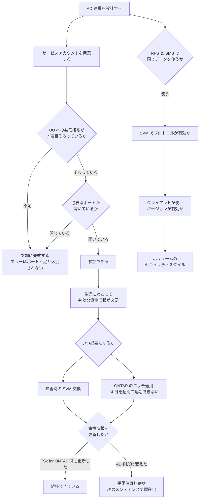

# AD への依存は参加時ではなく生涯続く

[🏠 リポジトリトップ](../../../../../README.md) | [Domain — マルチプロトコル・ID](../README.md)

---

## 結論

**Amazon FSx はファイルシステムの生涯にわたって有効なサービスアカウントを必要とします。** 参加が終われば不要になるものではありません。 <!-- allow:naming - AWS のサービス名 -->

理由は、**FSx for ONTAP が AD への unjoin と rejoin を必要とする作業があるから**です。ドキュメントが挙げているのはこれらです。

- **障害が発生したファイルシステムまたは SVM の交換**
- **NetApp ONTAP ソフトウェアのパッチ適用**

つまり **サービスアカウントの資格情報が失効していても、平常時は何も起きません。** 顕在化するのは次のメンテナンスウィンドウか、障害時です。**そしてパッチ適用は 14 日を超えて延期できません。** 関係は [メンテナンスは 14 日を超えて延期できない](../../../playbooks/05-operate/notes/maintenance-cannot-be-deferred.md) にあります。

**「AD 連携は動いているから大丈夫」は、平常時にしか成り立たない判断です。**

> **Evidence**: `documented` — 必要な委任権限、生涯にわたる要件、失敗時のエラーと原因は AWS 公式ドキュメントの記載に基づきます。
> **到達不能時の挙動をすべて網羅したものではありません。** 自環境での確認手順は
> 「[自分の環境で確かめる](#自分の環境で確かめる)」にあります。

---

## サービスアカウントに必要な委任権限

**参加先の OU に対して、最低限これらの権限が委任されている必要があります。**

| 権限 |
|---|
| パスワードのリセット |
| アカウントによるデータの読み取り・書き込みを制限する権限 |
| 計算機オブジェクトに `msDS-SupportedEncryptionTypes` プロパティを設定する権限 |
| DNS ホスト名への書き込み（検証済み） |
| サービスプリンシパル名への書き込み（検証済み） |
| **計算機オブジェクトの作成と削除** |
| アカウント制限の読み取りと書き込み（検証済み） |

**「ドメイン参加ができる権限」だけでは足りません。** 上の一覧には、参加後の管理に必要なものが含まれています。

資格情報は **AWS Secrets Manager に格納してシークレットの ARN を渡す方法が推奨されています。** 平文で渡すこともできますが、推奨ではありません。テンプレートでの扱いは [シークレットの扱い](../../../playbooks/04-build/notes/what-iac-cannot-reach.md#シークレットの扱い) にあります。

---

## やってはいけない 2 つの操作

**どちらも SVM を `misconfigured` にします。**

| 操作 | 結果 |
|---|---|
| SVM 作成後に、Amazon FSx が OU 内に作成した計算機オブジェクトを移動する <!-- allow:naming - AWS のサービス名 --> | **SVM が misconfigured になります** |
| SVM が参加している状態で Active Directory を削除する | **SVM が misconfigured になります** |

1 行目は AD 側の整理作業で起こりがちです。**OU の構成を変える計画があるなら、FSx for ONTAP が作成したオブジェクトを対象外にしてください。**

---

## 参加が失敗する原因は 2 つに絞られます

参加に失敗すると、ドキュメントに記載された次のエラーが返ります。原因として名指しされているのは 2 つです。

| 原因 | 確認すること |
|---|---|
| **ポート要件が満たされていない** | ネットワーク構成要件を確認し、必要なポートで通信できるようにします |
| **サービスアカウントの権限不足** | 指定した OU に対して、上記の委任権限があるかを確認します |

**エラーメッセージはこの 2 つを区別しません。** どちらも同じ文面になるため、**両方を順に確認する**のが手順として正しい進め方です。

修正後は、SVM の Active Directory 構成を更新して参加を再試行します。

---

## 同一データを NFS と SMB で共有する条件

**「両方のプロトコルが有効」だけでは足りません。** 条件は 3 層あります。

| 層 | 条件 | 確認方法 |
|---|---|---|
| SVM | 対象のプロトコルが有効になっている | `vserver show-protocols` |
| プロトコルのバージョン | クライアントが使うバージョンが有効 | `vserver nfs show`（v3 / v4.0 / 4.1 が個別に有効・無効） |
| ボリューム | セキュリティスタイルが権限評価のモデルを決める | [セキュリティスタイルが権限評価のモデルを決める](security-style-and-permission-evaluation.md) |

**バージョンの層が見落とされます。** 例えば **NFS v3 が無効になっていると、v3 でのマウントは `requested NFS version or transport protocol is not supported` で失敗します。** SVM で NFS 自体は有効なのに失敗するため、原因が分かりにくい失敗です。

有効なバージョンは `vserver nfs show` で確認できます。特定のバージョンを有効化するには `vserver nfs modify` を使います。**これは ONTAP CLI の操作です。**

### 必要なポートはバージョンで違います

| バージョン | 必要なポート |
|---|---|
| NFS v3 | 2049、111、635、4045、4046、4049（TCP / UDP） |
| NFS v4 | **TCP 2049 のみ** |

**v3 のほうが必要なポートが多いです。** セキュリティグループを v4 前提で絞っている環境に v3 のクライアントを持ち込むと、マウントできません。

---

## AD が到達不能になると何が起きるか

**平常時のデータアクセスと、管理作業とで影響が違います。**

| 影響を受けるもの | 内容 |
|---|---|
| SVM の交換（障害時） | **unjoin と rejoin が必要なため、有効なサービスアカウントがないと実行できません** |
| ONTAP のパッチ適用 | 同様に unjoin と rejoin を伴います |
| SMB / NFS の Kerberos 転送時暗号化 | **AD または LDAP への参加が前提です。** [転送時の暗号化に前提条件があります](../../security-governance/notes/what-the-platform-gives-and-what-stays-yours.md#転送時の暗号化に前提条件があります) |
| SVM の状態 | AD を削除すると `misconfigured` になります |

**構成情報を最新に保つことが要件として明記されています。** サービスアカウントの資格情報を変更したら、Amazon FSx 側の構成も更新してください。 <!-- allow:naming - AWS のサービス名 -->

---

## 判断フロー

---

## 自分の環境で確かめる

**確かめるべきは「いま動いているか」ではなく「メンテナンス時に動くか」です。**

| # | 手順 | 確認できること |
|---|---|---|
| 1 | サービスアカウントの委任権限を 7 項目すべて確認する | 参加後の管理に必要な権限が欠けていないか |
| 2 | 資格情報の有効期限とローテーション手順を確認する | **平常時は無症状の失効を先に見つけられます** |
| 3 | 資格情報を更新したら Amazon FSx 側の構成も更新する手順を書く <!-- allow:naming - AWS のサービス名 --> | 片側だけ更新する事故を防げます |
| 4 | 検証環境でサービスアカウントを無効化し、SVM の状態を観測する | **到達不能時に何が起きるかの実測。** 検証環境で行ってください |
| 5 | `vserver show-protocols` と `vserver nfs show` を確認する | 有効なプロトコルとバージョン |
| 6 | クライアントが使う NFS バージョンでマウントを試す | バージョン不一致の失敗を先に見つけられます |
| 7 | セキュリティグループが v3 / v4 のどちらを前提にしているか確認する | ポート要件の差 |
| 8 | 次のメンテナンスウィンドウの前に AD 構成の有効性を確認する項目を運用に入れる | 顕在化のタイミングを平時に移せます |

手順 2 と 8 が最も価値があります。**失効は平常時に症状を出さないので、定期的に確認する以外に見つける方法がありません。**

---

## よくある誤解

| 誤解 | 実際 |
|---|---|
| サービスアカウントは参加時だけ必要 | **ファイルシステムの生涯にわたって必要です** |
| AD 連携が動いていれば問題ない | 平常時は無症状です。**パッチ適用や障害時の交換で顕在化します** |
| ドメイン参加権限があれば足りる | 委任が必要な権限は 7 項目あります |
| 資格情報は AD 側で変えれば済む | **Amazon FSx 側の構成も更新する必要があります** <!-- allow:naming - AWS のサービス名 --> |
| FSx for ONTAP が作った計算機オブジェクトは移動できる | 移動すると **SVM が misconfigured になります** |
| SVM を消してから AD を消せばよい | 参加中に AD を削除すると misconfigured になります |
| 参加失敗のエラーで原因が分かる | **ポート不足と権限不足が同じ文面**です。両方確認します |
| SVM で NFS が有効ならどのバージョンでもマウントできる | バージョンごとに有効・無効があります。v3 が無効なことがあります |
| NFS のポートはバージョンによらず同じ | **v3 は 6 ポート、v4 は TCP 2049 のみ**です |
| 両プロトコルを有効にすれば同じデータを共有できる | セキュリティスタイルが権限評価のモデルを決めます |

---

## 参照した一次情報

| 論点 | 出典 |
|---|---|
| サービスアカウントに必要な 7 項目の委任権限、生涯にわたって有効な資格情報が必要であること、unjoin と rejoin を伴う作業（障害時の交換とパッチ適用）、Secrets Manager の推奨、計算機オブジェクトの移動と AD 削除が misconfigured を招くこと | [AWS: Prerequisites for joining an SVM to a self-managed Microsoft AD](https://docs.aws.amazon.com/fsx/latest/ONTAPGuide/self-manage-prereqs.html) |
| 参加失敗時のエラー文面と、原因がポート要件と権限のどちらかであること、修正後に構成を更新して再試行する手順 | [AWS: You can't join a storage virtual machine (SVM) to Active Directory](https://docs.aws.amazon.com/fsx/latest/ONTAPGuide/cannot-join-svm-to-ad.html) |
| AD 構成情報を最新に保つ要件 | [AWS: Keeping your Active Directory configuration updated](https://docs.aws.amazon.com/fsx/latest/ONTAPGuide/keep-ad-updated.html) |
| `vserver show-protocols` と `vserver nfs show` によるプロトコルとバージョンの確認、v3 が無効な場合のエラー、`vserver nfs modify` での有効化 | [AWS re:Post: Why can't I mount my FSx for ONTAP file system on my EC2 Linux instance?](https://repost.aws/knowledge-center/fsx-ontap-mount-errors-on-linux) |
| NFS v3 と v4 で必要なポートが異なること | [AWS re:Post: How do I use NFS to mount an FSx for ONTAP volume?](https://repost.aws/knowledge-center/ec2-mount-fsx-ontap-nfs) |

---

## 関連ドキュメント

- [Domain — マルチプロトコル・ID](../README.md) — このモジュールのハブ
- [セキュリティスタイルが権限評価のモデルを決める](security-style-and-permission-evaluation.md) — ボリューム層の条件
- [保存時の暗号化は自動、転送時は既定で無効](../../security-governance/notes/what-the-platform-gives-and-what-stays-yours.md) — Kerberos 転送時暗号化の前提
- [メンテナンスは 14 日を超えて延期できない](../../../playbooks/05-operate/notes/maintenance-cannot-be-deferred.md) — 顕在化のタイミング
- [IaC の境界は API の表面で決まる](../../../playbooks/04-build/notes/what-iac-cannot-reach.md) — シークレットと AD 自動化
- [知見の分類ポリシー](../../../evidence-policy.md)

---

[🏠 リポジトリトップ](../../../../../README.md) | [Domain — マルチプロトコル・ID](../README.md)
