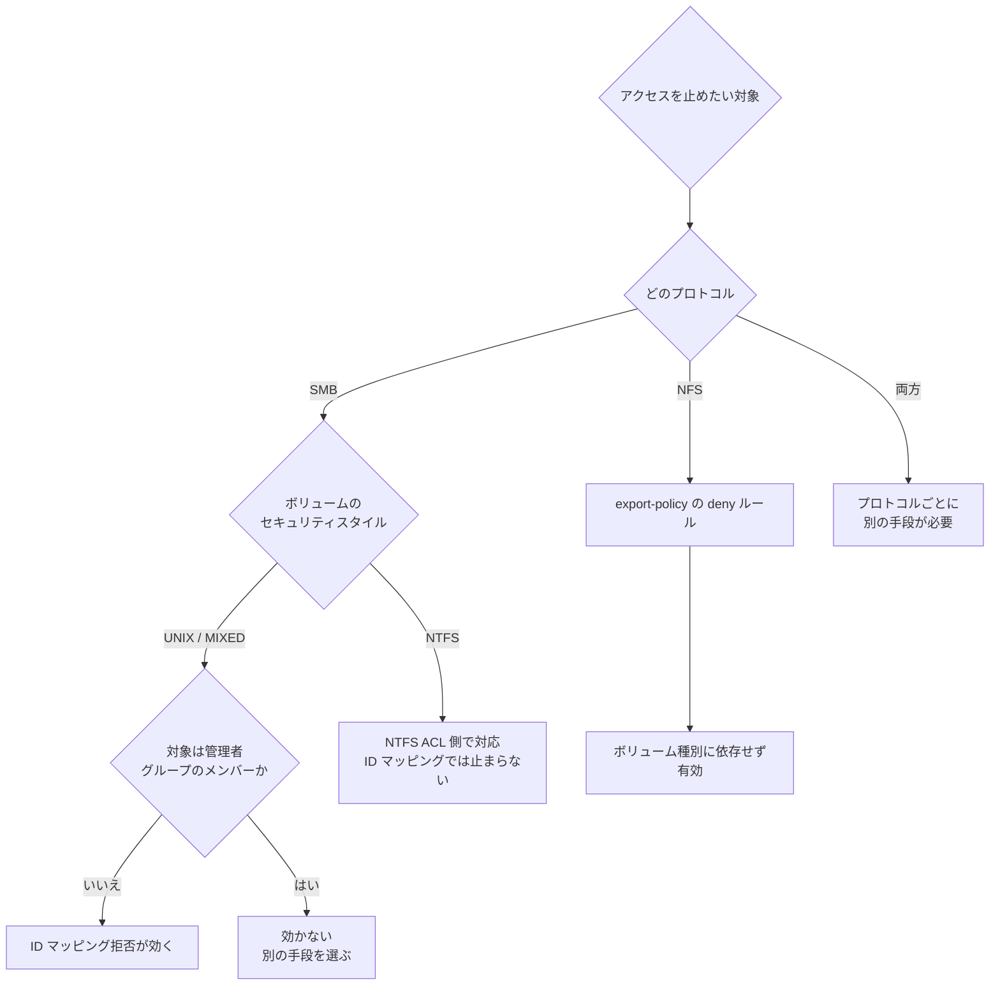

# ボリュームのセキュリティスタイルが権限評価のモデルを決める

[🏠 リポジトリトップ](../../../../../README.md) | [Domain — マルチプロトコル・ID](../README.md)

---

## 結論

**ボリュームのセキュリティスタイルは「どちらの権限モデルで評価するか」を決めます。** ファイルを保存できるプロトコルを制限するものではありません。

この違いが実務で効いてくる場面が 1 つあります。**NTFS セキュリティスタイルのボリュームでは、UNIX 側の ID マッピングを失敗させても SMB アクセスは止まりません。** NTFS スタイルは Windows の ACL をそのまま権限評価に使うため、win→unix マッピングの結果を参照しないからです。

UNIX / MIXED スタイルなら SMB アクセスの権限評価に win→unix マッピングが関わるため、マッピングを拒否する手法が効きます。**同じ操作が、ボリュームのセキュリティスタイル次第で効いたり効かなかったりします。**

> **Evidence**: `documented` — 挙動の根拠はベンダー公式ドキュメントです。数値や所要時間は含みません。
> 自環境での確認手順を「自分の環境で確かめる」節に置いてあります。**適用前に必ず確認してください。**

---

## 何が問題か

Amazon FSx for NetApp ONTAP は NFS と SMB を同じボリュームに対して提供できます。このとき「誰がどのファイルにアクセスできるか」を決めるのは、次の 2 つの組み合わせです。

1. ボリュームのセキュリティスタイル（UNIX / MIXED / NTFS）
2. ID マッピング（win→unix / unix→win）

セキュリティスタイルを「保存できるプロトコルの指定」だと理解していると、権限設計を誤ります。実際に決まるのは**評価に使う権限の種類**です。

とくに危険なのは、アクセス遮断の手段としてマッピング拒否を選んだ場合です。UNIX スタイルのボリュームで動作を確認し、そのまま NTFS スタイルのボリュームに同じ手順を適用すると、**遮断できていないのに遮断できたと判断してしまいます。**

---

## セキュリティスタイルと権限評価の対応

| セキュリティスタイル | 権限評価に使うもの | ID マッピング拒否で SMB を止められるか |
|---|:---|:---:|
| UNIX | マップ後の UID / GID | 止められる |
| MIXED | 最後に権限を設定したプロトコル側のモデル | 止められる |
| NTFS | Windows の NTFS ACL | **止められない** |

MIXED は「両方が使える」ではなく「**最後に権限を設定した側のモデルで評価する**」挙動です。運用中に評価モデルが切り替わりうるため、意図した状態を保ちにくい選択肢です。

### もう 1 つの例外

`FileSystemAdministratorsGroup` に指定したグループ（通常は `Domain Admins`）のメンバーは、この種の遮断の影響を受けません。ストレージ管理者相当の権限で評価されます。

**遮断を確認するときは、必ず管理者グループに属さない一般ユーザーで試してください。** 管理者アカウントで試すと「効かない」という誤った結論になります。

---

## 判断フロー



---

## 自分の環境で確かめる

**このノートは公式ドキュメントに基づく `documented` です。自環境の挙動は次の手順で確認してください。**

### 1. 対象ボリュームのセキュリティスタイルを確認する

ONTAP REST API:

```http
GET /api/storage/volumes?fields=name,nas.security_style
```

ONTAP CLI:

```text
volume show -vserver <svm> -fields volume,security-style
```

ここで `ntfs` が返るボリュームでは、ID マッピングによる SMB 遮断は成立しません。

### 2. 一般ユーザーで実際に試す

管理者グループに属さないドメインユーザーを 1 つ用意し、遮断前後でアクセスできるかを確認します。**`Domain Admins` のメンバーで試した結果は、遮断の検証には使えません。**

### 3. 結果を記録して区分を上げる

自環境で再現できたら、このリポジトリの流儀では区分を `verified` に上げられます。その際に必要なのは次の 3 点です。

| 記録する項目 | 理由 |
|---|---|
| ONTAP バージョン | 挙動がバージョンに依存する可能性がある |
| ボリュームのセキュリティスタイルと構成 | 結論がこの条件に紐づく |
| 使用したアカウントの所属グループ | 管理者グループ由来の誤検証を排除する |

詳細は [知見の分類ポリシー](../../../evidence-policy.md) を参照してください。

---

## 何が止められて、何が止められないか

遮断手段を選ぶときの対応表です。推奨案の制約も併記しています。

| 手段 | 有効な範囲 | 制約 / 考慮事項 |
|---|---|---|
| NFS export-policy の deny ルール | NFS。ボリュームのセキュリティスタイルに依存しない | NFS のみ。SMB には効かない |
| ID マッピング拒否 | SMB。UNIX / MIXED スタイルのみ | NTFS スタイルでは効かない。管理者グループのメンバーには効かない |
| NTFS ACL の変更 | SMB。NTFS スタイルを含む | ACL の管理主体が Windows 側になる。変更履歴の追跡が別系統になる |
| Active Directory 側でアカウントを無効化 | 認証段階で止まるため広く効く | 影響範囲が当該システムに限定されない。他システムへの波及を確認する必要がある |

---

## よくある誤解

| 誤解 | 実際 |
|---|---|
| セキュリティスタイルは保存できるプロトコルを決める | 決めるのは権限評価に使うモデルです。プロトコルの可否ではありません |
| ID マッピングを止めればどのボリュームでも SMB を遮断できる | NTFS スタイルでは効きません。評価に NTFS ACL を使うためです |
| MIXED は UNIX と NTFS の両方の権限で評価される | 最後に権限を設定した側のモデルで評価されます。運用中に切り替わりえます |
| 管理者アカウントで遮断を確認すれば十分 | `FileSystemAdministratorsGroup` のメンバーは影響を受けません。一般ユーザーで確認してください |
| 遮断できたかはクライアント側の表示で判断できる | クライアント側のキャッシュや再接続の挙動に影響されます。サーバー側の設定と併せて確認してください |

---

## 参照した一次情報

| 論点 | 出典 |
|---|---|
| セキュリティスタイルは権限の種類を決める | [NetApp Docs: Security styles and their effects](https://docs.netapp.com/us-en/ontap/smb-admin/security-styles-their-effects-concept.html) |
| NTFS スタイルでは Windows の資格情報で評価される | [NetApp KB: CIFS clients accessing NTFS security style resources](https://kb.netapp.com/on-prem/ontap/da/NAS/NAS-KBs/How_does_name-mapping_work_when_CIFS_clients_access_NTFS_security_style_resources) |
| UNIX スタイルではマップ後の UID / GID で評価される | [NetApp KB: name-mapping in a multiprotocol environment](https://kb.netapp.com/on-prem/ontap/da/NAS/NAS-KBs/Understanding_name-mapping_in_a_multiprotocol_environment) |
| マッピングの明示的な拒否 | [NetApp Docs: Create name mappings](https://docs.netapp.com/us-en/ontap/nfs-admin/create-name-mapping-task.html) |

---

## 関連ドキュメント

- [Domain — マルチプロトコル・ID](../README.md) — このモジュールのハブ
- [Domain — セキュリティ・ガバナンス](../../security-governance/) — 権限設計の全体像
- [Playbook 02 — 設計](../../../playbooks/02-design/) — セキュリティスタイルは設計時に決める項目
- [移行方式の選択](../../../reference/decision-trees/migration-method.md) — ACL 保持要件が方式選択に影響する
- [用語集](../../../reference/glossary/) — SVM / LIF / name-mapping の定義
- [知見の分類ポリシー](../../../evidence-policy.md) — `documented` の扱い

---

[🏠 リポジトリトップ](../../../../../README.md) | [Domain — マルチプロトコル・ID](../README.md)
