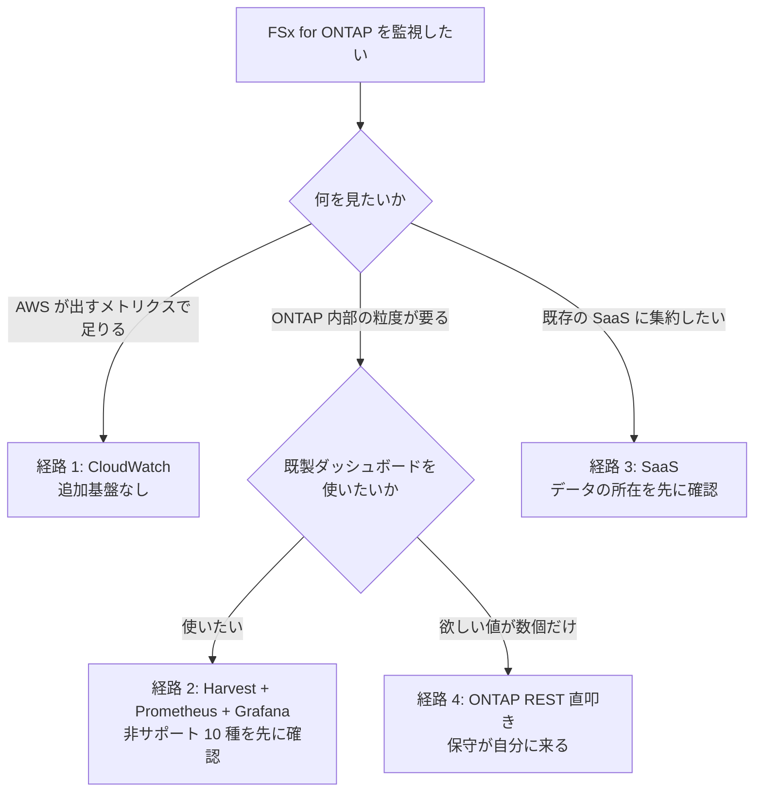

# Domain — 可観測性 (Observability)

<!-- lang-switcher:start -->
🌐 [日本語](README.md) | [English](../../../en/domains/observability/README.md) | [🏠 リポジトリトップ](../../../../README.md)
<!-- lang-switcher:end -->

---

Amazon FSx for NetApp ONTAP を監視するときの**収集経路の選定**を扱います。何を監視し閾値をどこに置くかは [運用](../../playbooks/05-operate/) 側、スループットやレイテンシがどう決まるかは [性能](../performance/) 側です。ここは「どの経路で値を取るか」だけを扱います。

各経路の実装（テンプレート、ベンダー別 integration、収集基盤の構築手順）は [fsxn-observability-integrations](https://github.com/Yoshiki0705/fsxn-observability-integrations) にあります。**このモジュールの役目は「どれを選ぶか」で、「どう作るか」ではありません。**

---

## このモジュールが扱う問い

| # | 問い | ノート |
|---|---|---|
| 1 | どの収集経路を選ぶか | [監視経路の選択 決定木](../../reference/decision-trees/observability-route.md) |
| 2 | 経路ごとに何を引き換えにするか | [監視経路の比較](../../reference/comparison/observability-routes.md) |
| 3 | オンプレと同じ Grafana ダッシュボードが使えるか | [オンプレのダッシュボードはそのまま移らない](notes/on-prem-dashboards-do-not-transfer.md) |
| 4 | Harvest を選んだ後、運用に何が乗るか | [Harvest は remote_write を持たない](notes/harvest-has-no-remote-write.md) |
| 5 | 複数アカウント・複数拠点に広げると何が変わるか | [クロスアカウントは IAM ではなくネットワークの問題](notes/cross-account-is-a-network-problem.md) |
| 6 | 認証・データ所在・サイジングで先に狭まる条件は何か | [経路は認証とアクセス経路で先に狭まる](notes/route-choice-is-bounded-by-access-and-auth.md) |
| 7 | 監視の導入が管理面に持ち込むリスクは何か | [収集対象数がロック時の影響範囲を決める](notes/harvest-has-no-remote-write.md#ロック時の影響範囲を決める収集対象数) |

---

## 経路の選び方

**推奨する 1 つの経路はありません。** 何を見たいかで先に分かれます。

**図と同じ内容を表でも持ちます。** 図が読めない環境でも判断できるようにするためです。

| 何を見たいか | 追加の分岐 | 経路 |
|---|---|---|
| AWS が出すメトリクスで足りる | — | 経路 1（CloudWatch） |
| ONTAP 内部の粒度が要る | 既製ダッシュボードを使いたい | 経路 2（Harvest + Prometheus + Grafana） |
| ONTAP 内部の粒度が要る | 欲しい値が数個だけ | 経路 4（ONTAP REST 直叩き） |
| 既存の SaaS に集約したい | データの所在を先に確認 | 経路 3（SaaS） |

### 4 経路の要約

| 経路 | 得意なこと | トレードオフ |
|---|---|---|
| Amazon CloudWatch メトリクス + ダッシュボード | AWS ネイティブ。追加基盤ゼロ。IAM で完結する | ONTAP 内部の粒度は出ません。レイテンシは平均のみです |
| NetApp Harvest + Prometheus + Grafana | ONTAP 内部の粒度。既製ダッシュボード | 収集基盤の運用が増えます。**使えないダッシュボードがあります**。Amazon Managed Service for Prometheus へは 1 ホップ挟みます |
| SaaS オブザーバビリティ（Datadog / Splunk / Elastic 他） | 既存投資の活用。ログとメトリクスの統合 | 取り込み課金。**データが VPC 外に出ます**。所在の確認が要ります |
| ONTAP REST 直叩き（自作） | 欲しい値だけを取れる。中間層がない | 作り込みと保守が自分に来ます。ダッシュボードも自作です |

**どの条件でどれを選ぶかは [監視経路の選択 決定木](../../reference/decision-trees/observability-route.md)、トレードオフの詳細と「選び方」は [監視経路の比較](../../reference/comparison/observability-routes.md) にあります。**

---

## 構成

| ディレクトリ | 内容 |
|---|---|
| [`notes/`](notes/) | 知見の最小単位。1 ファイル = 1 論点。frontmatter に `evidence` 区分を持ちます |
| [`checklists/`](checklists/) | 現場で使うチェックリスト。[経路選定チェックリスト](checklists/route-selection.md) |

---

## 読み方

各ノートの frontmatter にある `evidence` を必ず確認してください。

| 区分 | 意味 |
|---|---|
| `verified` | 記載環境で著者が再現済み。`verified_on` に検証日 |
| `documented` | ベンダー / AWS 公式ドキュメントに記載あり。`source` に出典 |
| `field-observation` | 現場で一度観測。再現確認は未実施。一般化しないこと |
| `hypothesis` | 未検証の推論 |

**このモジュールのノートはすべて `documented` です。** 一次情報での確認は済んでいますが、**著者による実測は含みません。** 各ノートの「自環境での確認手順」は読者が実行する手順として書いてあります。

判断基準の詳細は [知見の分類ポリシー](../../evidence-policy.md) を参照してください。

---

## よくある誤解

| 誤解 | 実際 |
|---|---|
| オンプレの Grafana ダッシュボードがそのまま使える | **10 種が非サポート、8 種は既定で無効です。** Health と Headroom の不在は運用設計に影響します |
| Harvest を入れれば Amazon Managed Service for Prometheus に直接送れる | **remote_write を持ちません。** スクレイパ + SigV4 の 1 ホップが必要です |
| クロスアカウント監視は IAM の設定で済む | **相手は ONTAP の管理 LIF でネットワーク到達性の問題です。** AWS API ではありません |
| クロスプラットフォームはクロスアカウントの延長でできる | **構成が質的に変わります。** 各拠点に collector を置く分散構成になります |
| Amazon Managed Grafana を自社ポータルに埋め込める | **匿名アクセスをサポートしません。** IdP 起点のログインも未サポートです |
| ZAPI は廃止済みなので REST に移行が必須 | **EOA は無期限に延期されています。** 移行の理由は廃止ではなく機能セットの広さです |
| サイジングは公式に 1 つの指針がある | **出典間で食い違います。** 台数とメトリクス数で自分の要件を決める必要があります |
| 監視の追加は読み取りだけなので安全 | **管理アカウントの認証を伴います。** 収集対象を増やすとロック時の影響範囲が広がります |

---

## 関連

- [ライフサイクル軸で探す](../../navigation.md#ライフサイクル軸--playbooks)
- [運用](../../playbooks/05-operate/) — 何を監視し閾値をどこに置くか
- [性能](../performance/) — スループット・レイテンシの決まり方
- [比較マトリクス](../../reference/comparison/)
- [ナビゲーションガイド](../../navigation.md)
- [用語集](../../reference/glossary/)

---

<!-- lang-switcher:start -->
🌐 [日本語](README.md) | [English](../../../en/domains/observability/README.md) | [🏠 リポジトリトップ](../../../../README.md)
<!-- lang-switcher:end -->
