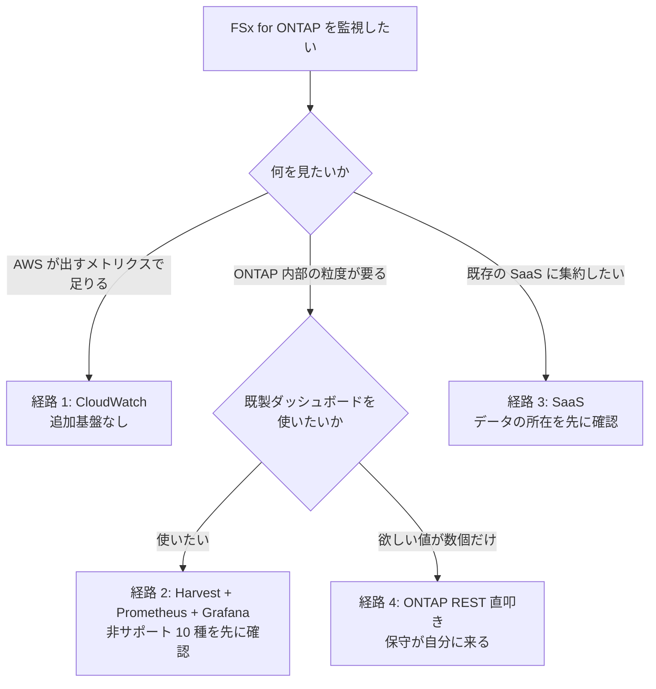

# Domain — 可観測性 (Observability)

---

Amazon FSx for NetApp ONTAP を監視するときの**収集経路の選定**を扱います。何を監視し閾値をどこに置くかは [運用](../../playbooks/05-operate/) 側、スループットやレイテンシがどう決まるかは [性能](../performance/) 側です。ここは「どの経路で値を取るか」だけを扱います。

各経路の実装（テンプレート、ベンダー別 integration、収集基盤の構築手順）は [FSx-for-ONTAP-Observability-integrations](https://github.com/Yoshiki0705/FSx-for-ONTAP-Observability-integrations) にあります。経路 1（CloudWatch）を選んだあとの入口は、[監視設計](https://github.com/Yoshiki0705/FSx-for-ONTAP-Observability-integrations/blob/main/docs/ja/monitoring-design.md)（CloudFormation の監視テンプレート、各テンプレートの範囲の境界、Terraform モジュールの位置付け）と [AWS ネイティブ代替マトリクス](https://github.com/Yoshiki0705/FSx-for-ONTAP-Observability-integrations/blob/main/docs/ja/native-alternative-matrix.md)（System Manager の画面 → CloudWatch メトリクス → テンプレートの対応）です。**このモジュールの役目は「どれを選ぶか」で、「どう作るか」ではありません。**

**Terraform で構成を管理している環境向けに、経路 1 のダッシュボードとアラームを作る Terraform モジュールが同リポジトリで実装・検証済みです**。`terraform/fsxn-monitoring-dashboard/` が、CloudWatch ダッシュボード、容量とネットワークスループット利用率のアラーム、任意で有効にする CPU・ディスク・ボリューム単位のアラーム、任意の SNS メール通知を作ります。取得方法、必要な IAM 権限、デプロイから削除までの手順は [モジュールの README（日本語、最新）](https://github.com/Yoshiki0705/FSx-for-ONTAP-Observability-integrations/blob/main/terraform/fsxn-monitoring-dashboard/README.ja.md) にあります。取得するときは、モジュールをリリースタグ `terraform-fsxn-monitoring-dashboard-v0.1.1` に `?ref=terraform-fsxn-monitoring-dashboard-v0.1.1` で固定します（Release: [terraform-fsxn-monitoring-dashboard-v0.1.1](https://github.com/Yoshiki0705/FSx-for-ONTAP-Observability-integrations/releases/tag/terraform-fsxn-monitoring-dashboard-v0.1.1)）。AWS ネイティブ経路の主な実装は CloudFormation のままで、このモジュールは同じ構成を Terraform のワークフローで管理するための選択肢です。環境で既に使っている IaC ツールに合わせて選んでください。

検証は同リポジトリが記録したサンプル実行で、本番での見積りではありません。2026-10-05〜2026-10-07（UTC）に `ap-northeast-1` の第 1 世代 `SINGLE_AZ_1`・HA ペア 1 つのファイルシステム 1 台で、オフラインの `terraform fmt` / `validate` / `terraform test`、ダッシュボードの全系列のデータ取得、アラームの OK → ALARM → OK の遷移（ファイルシステムの容量アラームは実データを書き込んで確認）、[公開された最小 IAM ポリシー](https://github.com/Yoshiki0705/FSx-for-ONTAP-Observability-integrations/blob/main/terraform/fsxn-monitoring-dashboard/examples/basic/iam-policy.json)（ARN で絞った形）だけを持つロールでの作成・タグの変更・plan・削除を確認しています。IAM の確認は v0.1.0 で行い、v0.1.1 で変わったのはダッシュボードの本文だけです。ポリシーのリンク先は最新版です。第 2 世代と複数 HA ペアのファイルシステム、SNS 通知の配信は未検証です。AWS プロバイダーは `>= 6.67.0` を宣言しており、検証に使った版は 6.67.0 です。マスク済みのダッシュボードとアラーム一覧の画面は [検証記録](https://github.com/Yoshiki0705/FSx-for-ONTAP-Observability-integrations/blob/main/docs/ja/verification-results-cloudwatch-monitoring.md#2026-10-07-のダッシュボードとアラームの画面) にあります。

---

## 最初に読むもの

**手元にある材料から、次に読む 1 ページを決めます。** 下の「扱う問い」は目次で、これは入口です。

| 手元にあるもの | 最初に読むもの | そこで分かること |
|---|---|---|
| **まだ監視を組んでいない** | [監視経路の選択 決定木](../../reference/decision-trees/observability-route.md) | **経路は 1 つではなく、認証とデータ所在で先に狭まります** |
| **オンプレの Grafana を持ち込みたい** | [オンプレのダッシュボードはそのまま移らない](notes/on-prem-dashboards-do-not-transfer.md) | 移らない理由と、移すために必要になるもの |
| **複数アカウント・複数拠点に広げたい** | [クロスアカウントは IAM ではなくネットワークの問題](notes/cross-account-is-a-network-problem.md) | **IAM を直しても届きません。** 詰まる場所が違います |
| **経路 1（CloudWatch）を選び、構成を Terraform で管理している** | [Terraform モジュール fsxn-monitoring-dashboard の README](https://github.com/Yoshiki0705/FSx-for-ONTAP-Observability-integrations/blob/main/terraform/fsxn-monitoring-dashboard/README.ja.md)（最新） | 取得方法、必要な IAM 権限、デプロイから削除までの手順。取得時はリリースタグ `terraform-fsxn-monitoring-dashboard-v0.1.1` に固定します。**検証済みの範囲は第 1 世代・HA ペア 1 つのファイルシステムです** |

---

## このモジュールが扱う問い

| # | 問い | ノート |
|---|---|---|
| 1 | どの収集経路を選ぶか | [監視経路の選択 決定木](../../reference/decision-trees/observability-route.md) |
| 2 | 経路ごとに何を引き換えにするか | [監視経路の比較](../../reference/comparison/observability-routes.md) |
| 3 | オンプレと同じ Grafana ダッシュボードが使えるか | [オンプレのダッシュボードはそのまま移らない](notes/on-prem-dashboards-do-not-transfer.md) |
| 4 | Harvest を選んだ後、運用に何が乗るか | [Harvest は remote_write を持たない](notes/harvest-has-no-remote-write.md) |
| 5 | 複数アカウント・複数拠点に広げると何が変わるか | [クロスアカウントは IAM ではなくネットワークの問題](notes/cross-account-is-a-network-problem.md) |
| 6 | 認証・データ所在・サイジングで先に狭まる条件は何か | [経路は認証とアクセス経路で先に狭まる](notes/route-choice-is-bounded-by-access-and-auth.md) |
| 7 | 監視の導入が管理面に持ち込むリスクは何か | [収集対象数がロック時の影響範囲を決める](notes/harvest-has-no-remote-write.md#ロック時の影響範囲を決める収集対象数) |
| 8 | S3 Access Points 経由のリクエスト数・HTTP エラー率・リクエストレイテンシを見られるか | Amazon S3 は Access Point フィルター付き request metrics を説明していますが、FSx for ONTAP 接続型への適用可否は **`open`** です。集約ストレージ系列と [CloudTrail の S3 データイベント](https://docs.aws.amazon.com/AmazonS3/latest/userguide/access-points-monitoring-logging.html)は別の信号です |
| 9 | push 経路（FPolicy）を選んだとき、運用に何が乗るか | [FPolicy が適合するかは、データをどう読むかではなく、どう書くかで決まる](../data-utilization/notes/fpolicy-fits-by-how-writes-land.md) — **データ活用ドメインにあります。** 別プロジェクトの実測の転記を含むため、このモジュールの外に置いています |

---

## 経路の選び方

**推奨する 1 つの経路はありません。** 何を見たいかで先に分かれます。

```mermaid
graph TD
    A[FSx for ONTAP を監視したい] --> Q{何を見たいか}

    Q -->|AWS が出すメトリクスで足りる| CW["経路 1: CloudWatch<br/>追加基盤なし"]
    Q -->|ONTAP 内部の粒度が要る| G{既製ダッシュボードを<br/>使いたいか}
    Q -->|既存の SaaS に集約したい| S["経路 3: SaaS<br/>データの所在を先に確認"]

    G -->|使いたい| H["経路 2: Harvest + Prometheus + Grafana<br/>非サポート 10 種を先に確認"]
    G -->|欲しい値が数個だけ| R["経路 4: ONTAP REST 直叩き<br/>保守が自分に来る"]
```

**図と同じ内容を表でも持ちます。** 図が読めない環境でも判断できるようにするためです。

| 何を見たいか | 追加の分岐 | 経路 |
|---|---|---|
| AWS が出すメトリクスで足りる | — | 経路 1（CloudWatch） |
| ONTAP 内部の粒度が要る | 既製ダッシュボードを使いたい | 経路 2（Harvest + Prometheus + Grafana） |
| ONTAP 内部の粒度が要る | 欲しい値が数個だけ | 経路 4（ONTAP REST 直叩き） |
| 既存の SaaS に集約したい | データの所在を先に確認 | 経路 3（SaaS） |

### 4 経路の要約

| 経路 | 得意なこと | トレードオフ |
|---|---|---|
| Amazon CloudWatch メトリクス + ダッシュボード | AWS ネイティブ。追加基盤ゼロ。IAM で完結する | ONTAP 内部の粒度は出ません。レイテンシは平均のみです |
| NetApp Harvest + Prometheus + Grafana | ONTAP 内部の粒度。既製ダッシュボード | 収集基盤の運用が増えます。**使えないダッシュボードがあります**。Amazon Managed Service for Prometheus へは 1 ホップ挟みます |
| SaaS オブザーバビリティ（Datadog / Splunk / Elastic 他） | 既存投資の活用。ログとメトリクスの統合 | 取り込み課金。**データが VPC 外に出ます**。所在の確認が要ります |
| ONTAP REST 直叩き（自作） | 欲しい値だけを取れる。中間層がない | 作り込みと保守が自分に来ます。ダッシュボードも自作です |

**どの条件でどれを選ぶかは [監視経路の選択 決定木](../../reference/decision-trees/observability-route.md)、トレードオフの詳細と「選び方」は [監視経路の比較](../../reference/comparison/observability-routes.md) にあります。**

---

## 構成

| ディレクトリ | 内容 |
|---|---|
| [`notes/`](notes/) | 知見の最小単位。1 ファイル = 1 論点。frontmatter に `evidence` 区分を持ちます |
| [`checklists/`](checklists/) | 現場で使うチェックリスト。[経路選定チェックリスト](checklists/route-selection.md) |

---

## 読み方

各ノートの frontmatter にある `evidence` を必ず確認してください。

| 区分 | 意味 |
|---|---|
| `verified` | 記載環境で著者が再現済み。`verified_on` に検証日 |
| `documented` | ベンダー / AWS 公式ドキュメントに記載あり。`source` に出典 |
| `field-observation` | 現場で一度観測。再現確認は未実施。一般化しないこと |
| `hypothesis` | 未検証の推論 |

**このモジュールのノートはすべて `documented` です。** 一次情報での確認は済んでいますが、**著者による実測は含みません。** 各ノートの「自環境での確認手順」は読者が実行する手順として書いてあります。

判断基準の詳細は [知見の分類ポリシー](../../evidence-policy.md) を参照してください。

---

## よくある誤解

| 誤解 | 実際 |
|---|---|
| オンプレの Grafana ダッシュボードがそのまま使える | **10 種が非サポート、8 種は既定で無効です。** Health と Headroom の不在は運用設計に影響します |
| Harvest を入れれば Amazon Managed Service for Prometheus に直接送れる | **remote_write を持ちません。** スクレイパ + SigV4 の 1 ホップが必要です |
| クロスアカウント監視は IAM の設定で済む | **相手は ONTAP の管理 LIF でネットワーク到達性の問題です。** AWS API ではありません |
| クロスプラットフォームはクロスアカウントの延長でできる | **構成が質的に変わります。** ただし変わるのは収集の分散化ではありません — **pull 経路は拠点をまたいでも 1 か所に集められ、拠点ごとに収集元が必要になるのは push 経路（FPolicy）だけです**（[収集元の数を決めるのは接続の向き](notes/cross-account-is-a-network-problem.md#収集元の数を決めるのは接続の向き)）。増えるのはルート・資格情報・切り分けです |
| Amazon Managed Grafana を自社ポータルに埋め込める | **匿名アクセスをサポートしません。** IdP 起点のログインも未サポートです |
| ZAPI は廃止済みなので REST に移行が必須 | **EOA は無期限に延期されています。** 移行の理由は廃止ではなく機能セットの広さです |
| サイジングは公式に 1 つの指針がある | **出典間で食い違います。** 台数とメトリクス数で自分の要件を決める必要があります |
| 監視の追加は読み取りだけなので安全 | **管理アカウントの認証を伴います。** 収集対象を増やすとロック時の影響範囲が広がります |

---

## 関連

- [ライフサイクル軸で探す](../../navigation.md#ライフサイクル軸--playbooks)
- [運用](../../playbooks/05-operate/) — 何を監視し閾値をどこに置くか
- [性能](../performance/) — スループット・レイテンシの決まり方
- [比較マトリクス](../../reference/comparison/)
- [ナビゲーションガイド](../../navigation.md)
- [用語集](../../reference/glossary/)

---

<!-- lang-switcher:start -->
🌐 [日本語](README.md) | [English](../../../en/domains/observability/README.md) | [🏠 リポジトリトップ](../../../../README.md)
<!-- lang-switcher:end -->
