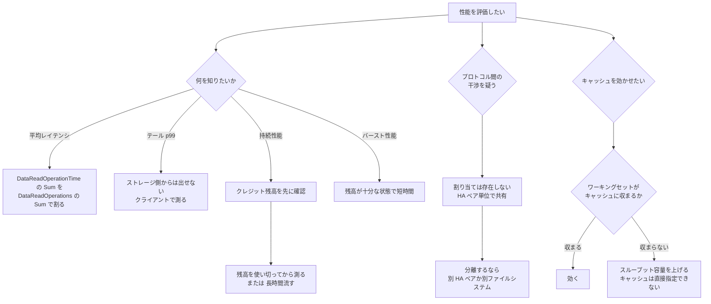

# p99 は CloudWatch のメトリクスからは出せない

[🏠 リポジトリトップ](../../../../../README.md) | [Domain — 性能](../README.md)

---

## 結論

**ボリュームのレイテンシは、CloudWatch のメトリクスからは平均しか得られません。**

`DataReadOperationTime` は読み取り操作に費やされた**時間の合計**で、有効な統計は `Sum` です。`DataReadOperations` も操作**回数の合計**で、有効な統計は `Sum` です。

つまりレイテンシは **合計時間 ÷ 合計回数** で求めることになり、**構造上その期間の平均になります。** テール（p99）は含まれていません。

**p99 が必要なら、クライアント側で測るしかありません。** ストレージ側のメトリクスをいくら細かく見ても出てきません。

そしてもう 1 つ。**ベンチマークはバースト用のクレジット残高に影響されます。** ファイルシステムはベースラインを下回っているときにクレジットを蓄積し、それを使ってベースラインを超える速度を出します。**同じ試験を残高が減った状態で再実行すると、違う数値が出ます。**

> **Evidence**: `documented` — メトリクスの有効統計、性能特性の決まり方、クレジット機構は AWS 公式ドキュメントの記載に基づきます。
> **数値の実測は含みません。** 測る手順は「[自分の環境で確かめる](#自環境での確認手順)」にあります。

---

## 性能を決めている 3 つの要素

クライアントは ENI 経由でファイルサーバーにアクセスします。**各ファイルサーバーには高速なインメモリキャッシュと NVMe キャッシュがあります。** その背後に SSD ディスクがあります。

| 性能特性 | 何が決めるか |
|---|---|
| ネットワーク I/O 性能（クライアント ↔ ファイルサーバー、合計） | **スループット容量のみ** |
| **インメモリ / NVMe キャッシュのサイズ** | **スループット容量のみ** |
| ディスク I/O 性能（ファイルサーバー ↔ ディスク） | **スループット容量と SSD IOPS の組み合わせ** |

**キャッシュサイズを直接指定する設定はありません。** キャッシュサイズはスループット容量で決まります。したがって「キャッシュを増やしたい」は「スループット容量を上げる」と同義です。

上限そのものが世代・構成・リージョンで変わる点は [スループットは 1 つの設定値では決まらない](where-throughput-is-determined-and-shared.md) にあります。

---

## キャッシュが効く条件

**キャッシュに載るのはアクティブなワーキングセットです。** したがって条件は 1 つに集約されます。

**ワーキングセットのサイズが、スループット容量で決まるキャッシュサイズに収まるかどうか。**

| ワークロード | キャッシュの効き |
|---|---|
| 同じデータに繰り返しアクセスし、その総量が小さい | 効きます |
| アクセス範囲が広く、毎回違うデータを読む | 効きません。ワーキングセットが収まりません |
| ワーキングセットがキャッシュより大きい | **スループット容量を上げるか、範囲を絞る設計が必要です** |

別ファイルシステムやリモート拠点への読み取り加速は FlexCache の領域で、条件が違います。[FlexCache が効く条件](../../data-utilization/notes/reaching-data-without-copies.md#flexcache-が効く条件) にあります。

なお **HA ペアを追加すると、新しいノードでは NVMe キャッシュが既定で有効になります。スループット重視のワークロードでは無効化が推奨されています。** 制約は [デプロイタイプは一度しか決められない](../../../playbooks/02-design/notes/deployment-type-is-decided-once.md#ha-ペアを足すときに起きること) にあります。

---

## プロトコル間での帯域の分け合い方

**プロトコルごとの割り当てはありません。**

ネットワーク I/O 性能は「クライアントとファイルサーバー間の**合計**」として定義されます。そして `NetworkThroughputUtilization` は **背景タスク（SnapMirror、階層化、バックアップ）を含む全トラフィック**を対象にします。

| 共有される単位 | 内容 |
|---|---|
| ネットワーク帯域 | **HA ペア 1 組分**。NFS・SMB・iSCSI・S3 Access Point が同じ予算を使います |
| 背景タスク | 同じ予算から使います |
| 明示的な優先度 | **クライアントトラフィックが背景タスクより優先される**、という 1 点のみです |

**つまり「SMB のせいで NFS が遅い」は起こりえます。** そして分離する設定は用意されていません。分離が必要なら、**別の HA ペアへボリュームを分けるか、別のファイルシステムにする**という設計判断になります。共有の単位は [共有される単位は HA ペア](where-throughput-is-determined-and-shared.md#共有される単位は-ha-ペア) にあります。

---

## ベンチマークを壊すバーストとクレジット

**ファイルベースのワークロードはスパイク型です。** 短時間の高い I/O と、その間の待機で構成されます。

これに合わせて、FSx for ONTAP は **24 時間 365 日維持できるベースライン速度に加えて、一定時間だけ高い速度にバーストできます。** ネットワーク I/O とディスク I/O の両方が対象です。

**バーストはネットワーク I/O クレジット機構で管理されます。** 平均利用率に基づいて配分され、**ファイルシステムはスループットと IOPS がベースラインを下回っているときにクレジットを蓄積します。**

### ベンチマークへの影響

| 状況 | 測れる数値 |
|---|---|
| クレジットが十分に貯まった状態で短時間の試験を回す | **バースト性能。** 持続性能ではありません |
| クレジットを使い切った後に同じ試験を回す | ベースライン性能 |
| 記録に残高を含めない | **再現できません。** 同じ手順で違う数値が出ます |

**残高は `FileServerDiskThroughputBalance` と `FileServerDiskIopsBalance` で見られます。** この 2 つは他のメトリクスと違い **5 分間隔**で送信されます。粒度の一覧は [監視の粒度と保持](../../../playbooks/05-operate/notes/monitoring-fails-on-averages.md#監視の粒度と保持) にあります。

---

## 再現できるベンチマークの条件

**「同じ手順」では足りません。同じ状態から始める必要があります。**

| 記録する項目 | 理由 |
|---|---|
| **クレジット残高（試験開始前）** | **バーストを測ったのか持続を測ったのかが決まります** |
| 試験の継続時間 | 短い試験はバーストを測ります |
| リージョン・世代・デプロイタイプ | 上限そのものが変わります |
| スループット容量と SSD IOPS の設定値 | 3 つの性能特性すべてに効きます |
| HA ペア数とボリュームスタイル（FlexVol / FlexGroup） | FlexVol は 1 ペアを超えられません |
| 階層化ポリシーと cooling period | 読み取り元が SSD か容量プールかが変わります |
| 同時に走っていた背景タスク | 同じ帯域を使います |
| クライアント側の測定値（**テール含む**） | ストレージ側からは平均しか出ません |
| 統計値（Average / Maximum） | 平均は飽和を隠します |

**最後の 2 行がこのリポジトリで繰り返し出てくる論点です。** 理由は [監視は平均値で失敗する](../../../playbooks/05-operate/notes/monitoring-fails-on-averages.md) にあります。

---

## 測定フロー

---

## 自環境での確認手順

**最初に確かめるのは、いま見ている数値が平均なのかテールなのかです。**

| # | 手順 | 確認できること |
|---|---|---|
| 1 | `DataReadOperationTime` ÷ `DataReadOperations` で平均レイテンシを出す | **これが平均であること。** テールは含まれません |
| 2 | クライアント側でレイテンシ分布を測り、p99 を出す | **ストレージ側の平均との差。** テールの実測です |
| 3 | 試験前に `FileServerDiskThroughputBalance` と `FileServerDiskIopsBalance` を記録する | バーストを測るのか持続を測るのか |
| 4 | 同じ試験を残高が減った状態で再実行し、数値を比べる | **クレジットの影響量。** 再現性の根拠になります |
| 5 | 試験を段階的に長くし、数値が落ちる点を探す | ベースラインに落ちるまでの時間 |
| 6 | ワーキングセットのサイズを推定し、スループット容量を変えて比べる | キャッシュに収まっているか |
| 7 | 片方のプロトコルに負荷をかけ、他方のレイテンシを観測する | **プロトコル間の干渉の実測。** 分離が必要かの判断 |
| 8 | 背景タスクが走っている時間帯と走っていない時間帯で比べる | 背景タスクの影響量 |

手順 3 と 4 を飛ばしたベンチマークは、**同じ手順を踏んでも再現しません。** ここが最も見落とされます。

手順 2 は「ストレージが遅いのか、経路やクライアントが遅いのか」の切り分けにもなります。

---

## よくある誤解

| 誤解 | 実際 |
|---|---|
| CloudWatch で p99 が見られる | **合計から平均を求める形しか用意されていません。** テールはクライアント側で測ります |
| レイテンシのメトリクスがある | 時間の**合計**と回数の**合計**があり、割って平均を出します |
| ベンチマークは手順が同じなら再現する | **クレジット残高が違えば数値が変わります** |
| 短時間の試験で持続性能が分かる | 短い試験はバーストを測ります |
| キャッシュサイズを設定できる | **スループット容量で決まります。** 直接指定はできません |
| キャッシュはどのワークロードでも効く | ワーキングセットが収まる場合に効きます |
| プロトコルごとに帯域を割り当てられる | **割り当ては存在しません。** HA ペア単位で共有します |
| SMB と NFS は互いに影響しない | 同じ予算を使います。干渉は起こりえます |
| 背景タスクは別の帯域を使う | 同じ帯域です。ただしクライアントトラフィックが優先されます |
| ディスク性能は SSD IOPS だけで決まる | **スループット容量と SSD IOPS の組み合わせ**です |

---

## 参照した一次情報

| 論点 | 出典 |
|---|---|
| `DataReadOperationTime` が時間の合計で有効統計が `Sum` であること、`DataReadOperations` / `DataWriteOperations` / `MetadataOperations` が回数の合計で有効統計が `Sum` であること | [AWS: Volume metrics](https://docs.aws.amazon.com/fsx/latest/ONTAPGuide/volume-metrics.html) |
| 各ファイルサーバーにインメモリキャッシュと NVMe キャッシュがあること、3 つの性能特性、ネットワーク I/O とキャッシュサイズがスループット容量のみで決まりディスク I/O はスループット容量と SSD IOPS の組み合わせで決まること、ファイルベースのワークロードがスパイク型であること、バーストとネットワーク I/O クレジット機構、ベースラインを下回るとクレジットが蓄積されること | [AWS: Amazon FSx for NetApp ONTAP performance](https://docs.aws.amazon.com/fsx/latest/ONTAPGuide/performance.html) |
| `NetworkThroughputUtilization` が HA ペア 1 組分に対する比率で、背景タスクを含む全トラフィックを対象にすること | [AWS: Second-generation file system metrics](https://docs.aws.amazon.com/fsx/latest/ONTAPGuide/so-file-system-metrics.html) |
| `FileServerDiskThroughputBalance` と `FileServerDiskIopsBalance` が 5 分間隔で送信されること | [AWS: Monitoring with Amazon CloudWatch](https://docs.aws.amazon.com/fsx/latest/ONTAPGuide/monitoring-cloudwatch.html) |
| クライアントトラフィックが背景タスクより優先されること | [AWS: Migrating to FSx for ONTAP using NetApp SnapMirror](https://docs.aws.amazon.com/fsx/latest/ONTAPGuide/migrating-fsx-ontap-snapmirror.html) |
| HA ペア追加時に NVMe キャッシュが既定で有効になり、スループット重視では無効化が推奨されること | [AWS: Adding high-availability (HA) pairs](https://docs.aws.amazon.com/fsx/latest/ONTAPGuide/adding-HA-pairs.html) |

---

## 関連ドキュメント

- [Domain — 性能](../README.md) — このモジュールのハブ
- [スループットは 1 つの設定値では決まらない](where-throughput-is-determined-and-shared.md) — 上限の決まり方と HA ペア単位の共有
- [監視は平均値で失敗する](../../../playbooks/05-operate/notes/monitoring-fails-on-averages.md) — 統計値の選択と粒度
- [FlexCache が効く条件](../../data-utilization/notes/reaching-data-without-copies.md#flexcache-が効く条件) — 別ファイルシステム・リモート拠点への読み取り加速
- [デプロイタイプは一度しか決められない](../../../playbooks/02-design/notes/deployment-type-is-decided-once.md) — HA ペアと NVMe キャッシュの既定
- [階層化の既定値は作成方法で違う](../../../playbooks/06-optimize/notes/tiering-defaults-differ-by-creation-method.md) — 読み取り元が変わる条件
- [知見の分類ポリシー](../../../evidence-policy.md)

---

[🏠 リポジトリトップ](../../../../../README.md) | [Domain — 性能](../README.md)
