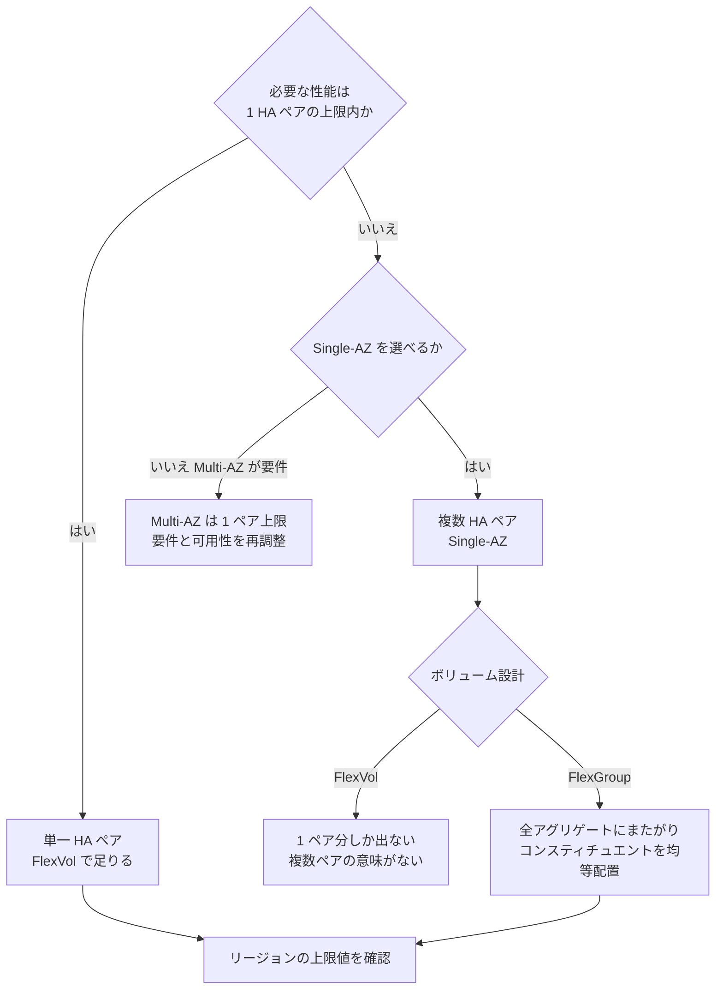

# スループットは 1 つの設定値では決まらない

[🏠 リポジトリトップ](../../../../../README.md) | [Domain — 性能](../README.md)

---

## 結論

「スループット設定を上げれば速くなる」という理解では設計できません。**決まる場所が 3 つ、共有される単位が 1 つ**あります。

| 何が | どこで決まる / 共有される |
|---|---|
| 上限そのもの | 世代（第 1 / 第 2）、Single-AZ か Multi-AZ か、**リージョン** |
| 設定値が効く範囲 | スループット設定はネットワーク・ディスク読み取り IOPS・キャッシュ容量を同時に決めます |
| 上限に到達する条件 | スループット設定だけでは足りません。**対応する SSD 容量と IOPS の構成が必要**です |
| 共有される単位 | **HA ペア単位。** 待機側ノードは容量を増やしません |

そして最も見落とされる点です。**FlexVol は 1 つのアグリゲート（= 1 HA ペア）にしか置けません。** HA ペアを 12 個持つファイルシステムを作っても、データを FlexVol に置けば **1 ペア分の性能しか出ません。** 複数ペアを 1 つの名前空間で使うには FlexGroup が必要です。

> **Evidence**: `documented` — すべて AWS 公式ドキュメントの記載に基づきます。
> **実測値は含みません。** 上限値は「その構成で到達可能な最大」であり、自環境のワークロードで
> 何が出るかは別の話です。測り方は「[自分の環境で確かめる](#自分の環境で確かめる)」にあります。

---

## 上限は世代と構成とリージョンで変わる

| 構成 | HA ペア数 | スループット上限 | SSD IOPS 上限 |
|---|---|---|---|
| 第 2 世代 Single-AZ | 最大 12 | 最大 72 GBps（6 GBps / ペア） | 2,400,000（200,000 / ペア） |
| 第 2 世代 Multi-AZ | 1 | 6 GBps | 200,000 |
| 第 1 世代 | 1 | 4 GBps | 160,000 |

**第 1 世代はリージョンによって上限が変わります。** SSD IOPS 160,000 とスループット 4,096 MBps に到達できるのは US East（Ohio / N. Virginia）、US West（Oregon）、Europe（Ireland）で、**それ以外のリージョンでは 80,000 IOPS / 2,048 MBps** が上限です。

**「ドキュメントに 4 GBps と書いてあった」で設計すると、リージョン次第で半分になります。** 自分のリージョンの値を必ず確認してください。

最小値にも注意が必要です。第 2 世代で HA ペアを 2 つ以上にすると、**最小スループットが 1 ペアあたり 1,536 MBps** になります。ペアを増やすことは下限も上げることです。

---

## スループット設定が実際に決めているもの

スループット設定は帯域だけの設定ではありません。**ネットワーク、ディスク読み取り IOPS、ファイルサーバー上のキャッシュ容量が同時に決まります。**

そして**設定値を上げただけでは上限に到達しません。** 対応する構成が必要です。ドキュメントの例では、第 1 世代で 4 GBps を出すには **最低 5,120 GiB の SSD 容量と 160,000 SSD IOPS** の構成が必要とされています。

| よくある詰まり方 | 実際に足りていないもの |
|---|---|
| スループットを上げたのに変わらない | SSD 容量または IOPS が構成の前提を満たしていない |
| ランダム読み取りが遅い | キャッシュに乗らないワークロード。スループット設定を上げるとキャッシュ容量も増えます |
| 書き込みだけ遅い | 書き込みは HA ペア間でミラーされます。読み取りとは別の経路です |

### 変更には停止を伴わないフェイルオーバーが起きます

スループット設定を変更すると、**ファイルサーバーが入れ替わります。** Single-AZ でも Multi-AZ でも自動フェイルオーバーとフェイルバックが発生し、通常数分で完了します。NFS / SMB / iSCSI クライアントに対しては透過的で、ワークロードの中断や手動対応は不要とされています。

ただし**メンテナンスウィンドウ中は変更が遅延・キューイングされる場合があります。** 「すぐ上げれば間に合う」という前提で運用計画を立てないでください。

---

## 共有される単位は HA ペア

各ファイルシステムは 1 つ以上の HA ペアで構成され、**アクティブ・スタンバイ構成**です。優先されるファイルサーバーがトラフィックを処理し、もう一方はアクティブ側が利用不能になったときに引き継ぎます。

**待機側は性能を足しません。** 「2 ノードあるから 2 倍」ではありません。

そして各 HA ペアは**アグリゲートを 1 つ**持ちます。ここがボリューム設計に直結します。

| ボリューム種別 | 配置 | 使える性能 |
|---|---|---|
| **FlexVol** | 単一のアグリゲート（常に 1 つ） | **1 HA ペア分が上限** |
| **FlexGroup** | 複数のアグリゲートにまたがる | 構成したアグリゲートの合計 |

FlexGroup は各アグリゲート上に「コンスティチュエント」を持ちます。**性能を出すには全アグリゲートにまたがり、アグリゲートあたりのコンスティチュエント数が均等である必要があります**（推奨は 8）。偏るとその分だけ偏った性能になります。

HA ペアを追加した後は、**FlexGroup を新しいアグリゲートへ拡張しないと追加分は使われません。** ペアを増やすだけでは既存ボリュームは速くなりません。

> **設計上の注意**: HA ペアが複数のファイルシステムで FlexVol を作る場合、Amazon FSx コンソールからは作成できず、AWS CLI / API / NetApp の管理ツールが必要です。**コンソールだけで作業していると FlexGroup を選ばされる形になります** — これは多くの場合正しい方向ですが、意図した選択かは確認してください。 <!-- allow:naming - 「Amazon FSx コンソール」は全ファイルシステム種別を含む正式名称 -->

---

## 判断フロー

---

## 自分の環境で確かめる

**上限値は「到達可能な最大」であって、自環境で出る値ではありません。**

| # | 手順 | 確認できること |
|---|---|---|
| 1 | 自リージョンの上限値を確認する | 設計の天井。第 1 世代はリージョンで半減します |
| 2 | 対象ボリュームの種別とアグリゲート配置を確認する | FlexVol なら 1 ペアが上限であること |
| 3 | Amazon CloudWatch でスループット・IOPS・レイテンシを実測する | プロビジョニング値に張り付いていればスロットリングです |
| 4 | ワークロードに近い読み書き比率とファイルサイズで測る | キャッシュに乗るかどうかで結果が大きく変わります |
| 5 | 測定条件（世代 / リージョン / スループット設定 / SSD 容量 / ボリューム種別）を記録する | 次回の比較対象になります |

ボリュームのアグリゲート配置は ONTAP CLI や REST API、Amazon FSx API の `AggregateConfiguration` で確認できます。 <!-- allow:naming - 「Amazon FSx API」は全ファイルシステム種別を含む正式名称 -->

**性能が出ない場合の切り分けは、まずプロビジョニング値との比較から始めてください。** 実測がプロビジョニング値に近いなら、構成ではなく設定が上限です。

---

## よくある誤解

| 誤解 | 実際 |
|---|---|
| スループット設定を上げれば上限まで出る | 対応する SSD 容量と IOPS の構成が必要です。設定だけでは到達しません |
| ドキュメントの上限値は全リージョン共通 | 第 1 世代はリージョンによって IOPS とスループットの上限が半分になります |
| HA ペアは 2 ノードあるので 2 倍の性能が出る | アクティブ・スタンバイ構成です。**待機側は性能を足しません** |
| HA ペアを増やせば既存ボリュームが速くなる | FlexVol は 1 アグリゲート固定です。FlexGroup を新アグリゲートへ拡張しない限り使われません |
| FlexGroup にすれば自動的に全性能が出る | 全アグリゲートにまたがり、コンスティチュエントが均等である必要があります |
| HA ペアを増やせばコストは容量分だけ増える | **最小スループットも上がります**（第 2 世代 2 ペア以上で 1 ペアあたり 1,536 MBps） |
| スループット変更は無停止なので気軽に変えられる | ファイルサーバーが入れ替わり、フェイルオーバーが発生します。メンテナンスウィンドウ中は遅延しえます |

---

## 参照した一次情報

| 論点 | 出典 |
|---|---|
| アクティブ・スタンバイ構成、世代ごとの HA ペア数と上限、各ペアが 1 アグリゲート | [AWS: Managing high-availability (HA) pairs](https://docs.aws.amazon.com/fsx/latest/ONTAPGuide/HA-pairs.html) |
| リージョン別の IOPS / スループット上限、最小スループット、SSD 使用率の推奨 | [AWS: Quotas](https://docs.aws.amazon.com/fsx/latest/ONTAPGuide/limits.html) |
| スループット設定が決める範囲、上限到達に必要な構成、変更時のフェイルオーバー | [AWS: Managing throughput capacity](https://docs.aws.amazon.com/fsx/latest/ONTAPGuide/managing-throughput-capacity.html) |
| FlexVol は常に単一アグリゲート、FlexGroup のコンスティチュエント | [AWS: AggregateConfiguration](https://docs.aws.amazon.com/fsx/latest/APIReference/API_AggregateConfiguration.html) |
| FlexGroup は全アグリゲートにまたがり均等であるべき、HA ペア追加後の拡張 | [AWS: Moving volumes between aggregates](https://docs.aws.amazon.com/fsx/latest/ONTAPGuide/moving-fg-volumes.html) |
| 複数 HA ペアでの FlexVol / FlexGroup 作成手段の違い | [AWS: Creating volumes](https://docs.aws.amazon.com/fsx/latest/ONTAPGuide/creating-volumes.html) |

---

## 関連ドキュメント

- [Domain — 性能](../README.md) — このモジュールのハブ
- [Domain — コスト](../../cost/) — HA ペア追加は最小スループットも上げます
- [Playbook 02 — 設計](../../../playbooks/02-design/) — 世代・AZ 構成・ボリューム種別は設計時に決めます
- [本番投入前レビュー](../../../playbooks/04-build/checklists/pre-production-review.md) — スループットと SSD 使用率の確認項目
- [上限値・クォータ](../../../reference/limits/) — 出典と検証日付きの上限値
- [知見の分類ポリシー](../../../evidence-policy.md)

---

[🏠 リポジトリトップ](../../../../../README.md) | [Domain — 性能](../README.md)
