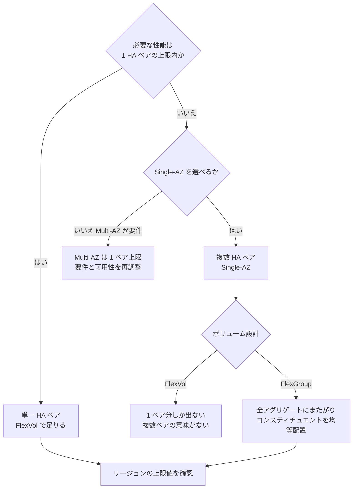

# スループットは 1 つの設定値では決まらない

<!-- lang-switcher:start -->
🌐 [日本語](where-throughput-is-determined-and-shared.md) | [English](../../../../en/domains/performance/notes/where-throughput-is-determined-and-shared.md) | [🏠 リポジトリトップ](../../../../../README.md)
<!-- lang-switcher:end -->

[🏠 リポジトリトップ](../../../../../README.md) | [Domain — 性能](../README.md)

---

## 結論

「スループット設定を上げれば速くなる」という理解では設計できません。**決まる場所が 3 つ、共有される単位が 1 つ**あります。

| 何が | どこで決まる / 共有される |
|---|---|
| 上限そのもの | 世代（第 1 / 第 2）、Single-AZ か Multi-AZ か、**リージョン** |
| 設定値が効く範囲 | スループット設定はネットワーク・ディスク読み取り IOPS・キャッシュ容量を同時に決めます |
| 上限に到達する条件 | スループット設定だけでは足りません。**対応する SSD 容量と IOPS の構成が必要**です |
| 共有される単位 | **HA ペア単位。** 待機側ノードは容量を増やしません |

そして最も見落とされる点です。**FlexVol は 1 つのアグリゲート（= 1 HA ペア）にしか置けません。** HA ペアを 12 個持つファイルシステムを作っても、データを FlexVol に置けば **1 ペア分の性能しか出ません。** 複数ペアを 1 つの名前空間で使うには FlexGroup が必要です。

> **Evidence**: `documented` — すべて AWS 公式ドキュメントの記載に基づきます。
> **実測値は含みません。** 上限値は「その構成で到達可能な最大」であり、自環境のワークロードで
> 何が出るかは別の話です。測り方は「[自分の環境で確かめる](#自環境での確認手順)」にあります。

---

## 世代と構成とリージョンで変わる上限

| 構成 | HA ペア数 | スループット上限 | SSD IOPS 上限 |
|---|---|---|---|
| 第 2 世代 Single-AZ | 最大 12 | 最大 72 GBps（6 GBps / ペア） | 2,400,000（200,000 / ペア） |
| 第 2 世代 Multi-AZ | 1 | 6 GBps | 200,000 |
| 第 1 世代 | 1 | 4 GBps | 160,000 |

**第 1 世代はリージョンによって上限が変わります。** SSD IOPS 160,000 とスループット 4,096 MBps に到達できるのは US East（Ohio / N. Virginia）、US West（Oregon）、Europe（Ireland）で、**それ以外のリージョンでは 80,000 IOPS / 2,048 MBps** が上限です。

**「ドキュメントに 4 GBps と書いてあった」で設計すると、リージョン次第で半分になります。** 自分のリージョンの値を必ず確認してください。

最小値にも注意が必要です。第 2 世代で HA ペアを 2 つ以上にすると、**最小スループットが 1 ペアあたり 1,536 MBps** になります。ペアを増やすことは下限も上げることです。

---

## スループット設定が実際に決めているもの

スループット設定は帯域だけの設定ではありません。**ネットワーク、ディスク読み取り IOPS、ファイルサーバー上のキャッシュ容量が同時に決まります。**

そして**設定値を上げただけでは上限に到達しません。** 対応する構成が必要です。ドキュメントの例では、第 1 世代で 4 GBps を出すには **最低 5,120 GiB の SSD 容量と 160,000 SSD IOPS** の構成が必要とされています。

| よくある詰まり方 | 実際に足りていないもの |
|---|---|
| スループットを上げたのに変わらない | SSD 容量または IOPS が構成の前提を満たしていない |
| ランダム読み取りが遅い | キャッシュに乗らないワークロード。スループット設定を上げるとキャッシュ容量も増えます |
| 書き込みだけ遅い | 書き込みは HA ペア間でミラーされます。読み取りとは別の経路です |

### 第 2 世代の書き込み上限についての 2 つの記述と、その食い違い（引用）

**書き込みの見積りは、公開仕様のどちらの記述を当てるかで変わります。** 性能仕様のページは第 2 世代について
**一般則（読み取りはスループット設定の全量、書き込みはその 3 分の 1）** を示し、別に **6,144 MBps を例外**として
挙げて Single-AZ の書き込みを **1,024 MBps** としています。

**sibling repo の実測では、どちらが一致するかが指定値によって入れ替わりました。** 当方の検証ではなく引用です。

| 指定値 | 実測（持続、中央値） | 一般則 ÷3 | 例外表の 1,024 |
|---|---|---|---|
| 1,536 MBps | 1,333 MB/s | 512 → **2.60 倍外れる** | 1.30 倍 |
| 6,144 MBps | 2,097 MB/s | 2,048 → **2.4% で一致** | 2.05 倍 |

**一般則が「例外」とされている 6,144 で当たり、一般則が適用されるはずの 1,536 で 2.6 倍外れます。**
出どころは
[引用元の実測記録](https://github.com/Yoshiki0705/S3-Burst-on-ONTAP-Files/blob/main/docs/ja/verification/throughput-capacity-burst-and-baseline.md)。

**設計上の帰結は 1 つです。書き込みの見積りを、どちらか片方の記述だけから作らないでください。**
1,536 側では 4 つの独立した測定が 1,270〜1,350 MB/s に入っているので、実行ごとの振れではありません。

> **区分**: `documented`（sibling repo の実測の引用。`ap-northeast-1`、Single-AZ、1 HA ペア、
> ONTAP 9.18.1P3D1、非圧縮データ、効率化無効）。**どちらの記述が正しいかは引用元も判断していません。**
> **この数値を「公表値の 2 倍出た」という形で引用しないでください** — 分母にどちらを置くかで
> 倍率が変わります。**Multi-AZ と 2 ペア以上は未測定です。**

### 変更に伴う無停止フェイルオーバー

スループット設定を変更すると、**ファイルサーバーが入れ替わります。** Single-AZ でも Multi-AZ でも自動フェイルオーバーとフェイルバックが発生し、通常数分で完了します。NFS / SMB / iSCSI クライアントに対しては透過的で、ワークロードの中断や手動対応は不要とされています。

ただし**メンテナンスウィンドウ中は変更が遅延・キューイングされる場合があります。** 「すぐ上げれば間に合う」という前提で運用計画を立てないでください。

---

## 共有される単位は HA ペア

各ファイルシステムは 1 つ以上の HA ペアで構成され、**アクティブ・スタンバイ構成**です。優先されるファイルサーバーがトラフィックを処理し、もう一方はアクティブ側が利用不能になったときに引き継ぎます。

**待機側は性能を足しません。** 「2 ノードあるから 2 倍」ではありません。

そして各 HA ペアは**アグリゲートを 1 つ**持ちます。ここがボリューム設計に直結します。

| ボリューム種別 | 配置 | 使える性能 |
|---|---|---|
| **FlexVol** | 単一のアグリゲート（常に 1 つ） | **1 HA ペア分が上限** |
| **FlexGroup** | 複数のアグリゲートにまたがる | 構成したアグリゲートの合計 |

FlexGroup は各アグリゲート上に「コンスティチュエント」を持ちます。**性能を出すには全アグリゲートにまたがり、アグリゲートあたりのコンスティチュエント数が均等である必要があります**（推奨は 8）。偏るとその分だけ偏った性能になります。

HA ペアを追加した後は、**FlexGroup を新しいアグリゲートへ拡張しないと追加分は使われません。** ペアを増やすだけでは既存ボリュームは速くなりません。

> **設計上の注意**: HA ペアが複数のファイルシステムで FlexVol を作る場合、Amazon FSx コンソールからは作成できず、AWS CLI / API / NetApp の管理ツールが必要です。**コンソールだけで作業していると FlexGroup を選ばされる形になります** — これは多くの場合正しい方向ですが、意図した選択かは確認してください。

---

## 読み手を増やしたときの伸び方

**購入した上限と弾性の上限は、クライアントを増やしたときに逆向きに振る舞います。** 隣のリポジトリが同一設定を 1 台から、次に 2 台から同時に走らせた実測です。

| 対象 | 1 台 | 2 台の合計 | 1 台あたり |
|---|---|---|---|
| FSx for ONTAP の S3 Access Point 読み取り | 585.3 MB/s | **592.5 MB/s** | **半減** |
| Amazon S3 読み取り | 649.3 MB/s | **1,308.9 MB/s（2.02 倍）** | ほぼ不変 |

**FSx for ONTAP 側は購入した容量を分け合うので、読み手を増やしても合計は増えません。** Amazon S3 側は合計が 2 倍になり、1 台あたりは変わりません。**単一ホストで見えていた 649 MB/s は S3 の上限ではなく、そのクライアントの上限でした。**

**容量計画の単位が違います。** FSx for ONTAP はファイルシステム単位で積み、弾性のサービスはクライアント側の帯域で積みます。**どちらが速いかではなく、増やし方が逆です。** 前節の「共有される単位は HA ペア」を、読み手の台数の側から見た形です。

**そして書き込みの設定値を読み取りの見積りに使えません。** 同じ 128 MBps の構成で、8 MiB・並列 16 の書き込みが 129.5 MB/s（設定値どおり）、読み取りが **579.3 MB/s** でした。**購入した値の 4.5 倍です。** 読み取りはキャッシュとネットワークの側の上限に当たるので、設定値は天井になりません（[単一接続で測った値はストレージの性能ではない](a-single-connection-measures-the-client.md#2-段の上限)）。

**測定条件**: ap-northeast-1、`SINGLE_AZ_1` / 128 MBps、オブジェクト 8 MiB、並列度 16。503 応答は全点 0 件。出典は [S3 Files と本構成の比較検証](https://github.com/Yoshiki0705/S3-Burst-on-ONTAP-Files/blob/main/docs/ja/verification/s3files-vs-flexcache.md) で、**このリポジトリでは再測定していません。**

**引用元が測っているのは 1 台と 2 台だけです。** 3 台以上の伸び方、読み取り以外の方向、128 MBps 以外の構成はこの記録に含まれません。**「台数に反比例して半減する」という一般則として読まないでください** — 観測されているのは 2 台での 1 点です。

---

## 判断フロー

---

## 自環境での確認手順

**上限値は「到達可能な最大」であって、自環境で出る値ではありません。**

| # | 手順 | 確認できること |
|---|---|---|
| 1 | 自リージョンの上限値を確認する | 設計の天井。第 1 世代はリージョンで半減します |
| 2 | 対象ボリュームの種別とアグリゲート配置を確認する | FlexVol なら 1 ペアが上限であること |
| 3 | Amazon CloudWatch でスループット・IOPS・レイテンシを実測する | プロビジョニング値に張り付いていればスロットリングです |
| 4 | ワークロードに近い読み書き比率とファイルサイズで測る | キャッシュに乗るかどうかで結果が大きく変わります |
| 5 | 測定条件（世代 / リージョン / スループット設定 / SSD 容量 / ボリューム種別）を記録する | 次回の比較対象になります |

ボリュームのアグリゲート配置は ONTAP CLI や REST API、Amazon FSx API の `AggregateConfiguration` で確認できます。

**性能が出ない場合の切り分けは、まずプロビジョニング値との比較から始めてください。** 実測がプロビジョニング値に近いなら、構成ではなく設定が上限です。

---

## よくある誤解

| 誤解 | 実際 |
|---|---|
| スループット設定を上げれば上限まで出る | 対応する SSD 容量と IOPS の構成が必要です。設定だけでは到達しません |
| ドキュメントの上限値は全リージョン共通 | 第 1 世代はリージョンによって IOPS とスループットの上限が半分になります |
| HA ペアは 2 ノードあるので 2 倍の性能が出る | アクティブ・スタンバイ構成です。**待機側は性能を足しません** |
| HA ペアを増やせば既存ボリュームが速くなる | FlexVol は 1 アグリゲート固定です。FlexGroup を新アグリゲートへ拡張しない限り使われません |
| FlexGroup にすれば自動的に全性能が出る | 全アグリゲートにまたがり、コンスティチュエントが均等である必要があります |
| HA ペアを増やせばコストは容量分だけ増える | **最小スループットも上がります**（第 2 世代 2 ペア以上で 1 ペアあたり 1,536 MBps） |
| スループット変更は無停止なので気軽に変えられる | ファイルサーバーが入れ替わり、フェイルオーバーが発生します。メンテナンスウィンドウ中は遅延しえます |
| 読み手を増やせば合計スループットも増える | **購入した容量を分け合います。** 2 台の実測で合計はほぼ変わらず、1 台あたりが半減しました。弾性のサービスとは逆向きです |
| 設定した MBps が読み取りの天井 | **128 MBps の構成で読み取り 579.3 MB/s（4.5 倍）を実測しています。** 設定値が天井になるのは書き込み側です |
| 第 2 世代の書き込みは設定値の 3 分の 1 で見積もれる | **公開仕様に一般則と例外表の 2 つの記述があり、実測とどちらが一致するかが指定値で入れ替わります**（引用）。片方だけから見積もらないでください |

---

## 参照した一次情報

| 論点 | 出典 |
|---|---|
| アクティブ・スタンバイ構成、世代ごとの HA ペア数と上限、各ペアが 1 アグリゲート | [AWS: Managing high-availability (HA) pairs](https://docs.aws.amazon.com/fsx/latest/ONTAPGuide/HA-pairs.html) |
| リージョン別の IOPS / スループット上限、最小スループット、SSD 使用率の推奨 | [AWS: Quotas](https://docs.aws.amazon.com/fsx/latest/ONTAPGuide/limits.html) |
| スループット設定が決める範囲、上限到達に必要な構成、変更時のフェイルオーバー | [AWS: Managing throughput capacity](https://docs.aws.amazon.com/fsx/latest/ONTAPGuide/managing-throughput-capacity.html) |
| FlexVol は常に単一アグリゲート、FlexGroup のコンスティチュエント | [AWS: AggregateConfiguration](https://docs.aws.amazon.com/fsx/latest/APIReference/API_AggregateConfiguration.html) |
| FlexGroup は全アグリゲートにまたがり均等であるべき、HA ペア追加後の拡張 | [AWS: Moving volumes between aggregates](https://docs.aws.amazon.com/fsx/latest/ONTAPGuide/moving-fg-volumes.html) |
| 複数 HA ペアでの FlexVol / FlexGroup 作成手段の違い | [AWS: Creating volumes](https://docs.aws.amazon.com/fsx/latest/ONTAPGuide/creating-volumes.html) |

---

## 関連ドキュメント

- [Domain — 性能](../README.md) — このモジュールのハブ
- [Domain — コスト](../../cost/) — HA ペア追加は最小スループットも上げます
- [Playbook 02 — 設計](../../../playbooks/02-design/) — 世代・AZ 構成・ボリューム種別は設計時に決めます
- [本番投入前レビュー](../../../playbooks/04-build/checklists/pre-production-review.md) — スループットと SSD 使用率の確認項目
- [上限値・クォータ](../../../reference/limits/) — 出典と検証日付きの上限値
- [知見の分類ポリシー](../../../evidence-policy.md)

---

[🏠 リポジトリトップ](../../../../../README.md) | [Domain — 性能](../README.md)

<!-- lang-switcher:start -->
🌐 [日本語](where-throughput-is-determined-and-shared.md) | [English](../../../../en/domains/performance/notes/where-throughput-is-determined-and-shared.md) | [🏠 リポジトリトップ](../../../../../README.md)
<!-- lang-switcher:end -->
