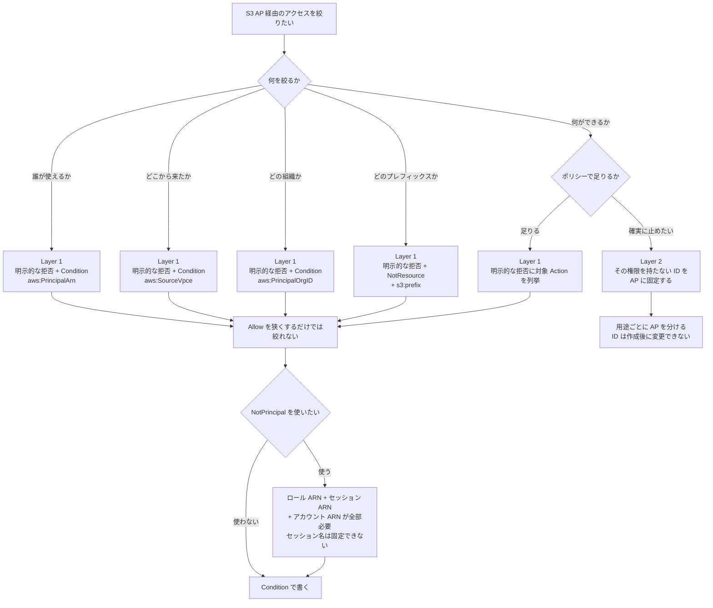

# S3 Access Point の権限設計 — 評価順序と、絞り込みを担う 2 つの層
<!-- lang-switcher:start -->
🌐 [日本語](access-point-authorization-layers.md) | [English](../../../../en/domains/security-governance/notes/access-point-authorization-layers.md) | [🏠 リポジトリトップ](../../../../../README.md)
<!-- lang-switcher:end -->

[🏠 リポジトリトップ](../../../../../README.md) | [Domain — セキュリティ・ガバナンス](../README.md)

---

## 結論

**Amazon FSx for NetApp ONTAP の S3 Access Point に「バケットポリシー」はありません。** 裏に S3 バケットが無いため、`put-bucket-policy` の対象が存在しません。設定するのは **アクセスポイントポリシー**（IAM リソースポリシー）です。

このアクセスポイントは **2 つの層を順に通ります。** 層ごとに評価するものが違い、**絞り込みを担う位置も層ごとに違います。**

| 層 | 何を評価するか | この層で絞り込みを担うもの |
|---|---|---|
| **Layer 1 — AWS 側の IAM 認可** | 呼び出し元のプリンシパルと、`s3:` のアクション | **明示的な拒否**（`Deny`） |
| **Layer 2 — ファイルシステム側の権限** | AP に固定した ID（UNIX ユーザーまたは Windows ユーザー）が、そのボリュームのファイルに対して持つ権限 | **mode bits / ACL** |

**両方を通らなければデータには届きません。** そして **層をまたいだ引き算は起きません。** Layer 1 で許可された操作が Layer 2 で拒否されることも、その逆もあります。

Layer 1 の中では、設計を誤らせやすい点が 1 つあります。**同一アカウント内では、アクセスポイントポリシーに書いた `Allow` を狭くしても、それが絞り込みにはなりません。**

**これは FSx for ONTAP 固有の挙動ではありません。** AWS のポリシー評価では、同一アカウントのリクエストは identity-based ポリシーと resource-based ポリシーを **結合**して判定します。どちらかが許可すれば通ります。アクセスポイントポリシーは resource-based ポリシーなので、**呼び出し元の権限だけでも通る**ということです。

| 評価される順序 | このノートに効く点 |
|---|---|
| 0. **ネットワーク origin のチェック** | VPC origin の AP では、束縛先 VPC の VPC エンドポイント経由でなければ**ポリシー評価の前に**拒否されます |
| 1. 既定は**暗黙的な拒否** | 何も書かなければ通りません |
| 2. **明示的な拒否が 1 つでもあれば拒否で確定** | **Layer 1 で絞る手段はこれです** |
| 3. Organizations の RCP / SCP | アカウントの外側から止められます |
| 4. identity-based と resource-based（**同一アカウントは結合 / クロスアカウントは両方**） | **`Allow` を狭く書くことは、絞ることではありません** |
| 4'. **VPC エンドポイントポリシー** | VPC エンドポイントを経由する場合、**そのポリシーも許可していなければ通りません**。既定では全許可なので、絞った場合だけ効きます |

> **VPC エンドポイントポリシーは見落としやすい層です。** 既定が「全 S3 アクション / 全リソースを許可」
> なので、絞っていない環境では存在に気づきません。**エンドポイントポリシーを絞ったあとに AP を
> 追加すると、AP の ARN が許可対象に入っておらず `AccessDenied` になります。** この層は AWS の
> ドキュメント記載で、本ノートでは実測していません。

評価順序の全体像と、症状から落ちた段を逆引きする表は
[S3 Access Point 経由のリクエストはどう判定されるか](../../../reference/decision-trees/access-point-authorization.md)
にあります。**このノートは、その各ステップを実環境で確認した結果とポリシーの書き方を扱います。**

Layer 1 で絞りたいなら**明示的な拒否を書く**ことになります。**その書き方に落とし穴があります。** `NotPrincipal` で例外を作る形は、**除外したはずの主体まで拒否しました。** 推奨は `Condition` の `StringNotEquals` に `aws:PrincipalArn` を使う形です。

> **Evidence**: `verified`（検証日 2026-08-17 および 2026-08-18、`ap-northeast-1`、ONTAP `9.18.1P3D1`）。
> Layer 1 は UNIX セキュリティスタイルのボリューム、Internet origin と VPC origin の 3 つの AP、
> IAM ユーザー / `AssumeRole` したロール / EC2 インスタンスロール / **別組織のアカウントの
> プリンシパル**の 4 主体で実測。Layer 2 と監査は、検証用 SVM に UNIX / NTFS の 2 ボリュームと
> ローカル UNIX ユーザー / ローカル Windows ユーザーを用意して実測しました。
> **1 点だけ実測できていません。** `aws:SecureTransport` の拒否分岐は構造的に到達不能でした
> （[理由](#deny-分岐に到達しない-awssecuretransport)）。ポリシー本文の JSON は検証で実際に適用した
> ものを、アカウント ID とネットワーク ID だけプレースホルダに置き換えて掲載しています。

---

## 設定する対象

| 論点 | 内容 |
|---|---|
| 設定するもの | アクセスポイントポリシー（IAM リソースポリシー）。**バケットポリシーではありません** |
| 作成時の設定経路 | Amazon FSx コンソール、または `CreateAndAttachS3AccessPoint` の `S3AccessPoint.Policy` <!-- allow:naming - AWS のサービス名 --> |
| 既存 AP の変更経路 | **S3 側**（`aws s3control put-access-point-policy` / `delete-access-point-policy`）。Amazon FSx 側に変更 API はありません <!-- allow:naming - AWS のサービス名 --> |
| 必要な権限 | `s3:PutAccessPointPolicy` |
| Block Public Access | **常に有効で、変更できません** |
| ポリシーの上限 | 20 KB（後述の[実測](#正規化後で判定されるポリシーサイズの上限)を併せて読んでください） |

**変更経路が Amazon FSx と S3 に分かれている点が運用に効きます。** <!-- allow:naming - AWS のサービス名 --> AP 自体は Amazon FSx の API で作り、ポリシーだけは S3 の API で回します。IaC を書くときも、テンプレートで作った AP のポリシーを後から S3 側で書き換えると、テンプレートと実環境が乖離します。

---

## Layer 1 — 結合で評価されることの帰結

**「AP ポリシーに書いた範囲しか通らない」という前提で設計すると、実際には広く通ります。** 次の 5 行はすべて、評価ステップ 4 の「同一アカウントは結合」から予測できる結果です。**予測どおりになることを確認した記録として読んでください。**

| ポリシー | 呼び出し元 | 操作 | 結果 | どのステップで説明されるか |
|---|---|---|---|---|
| なし | IAM ユーザー | `GetObject` | 成功 | 4（identity-based だけで許可が成立） |
| なし | IAM ユーザー | `ListObjectsV2` | 成功 | 同上 |
| ロールのみ `Allow`（`GetObject`, `ListBucket`） | IAM ユーザー（**未記載**） | `GetObject` | **成功** | 4（AP ポリシーに無くても identity-based にある） |
| 同上 | ロール | `GetObject` | 成功 | 4 |
| 同上 | ロール | `PutObject`（**`Action` 未記載**） | **成功** | 4（`Action` も結合で決まる） |

呼び出し元の identity-based ポリシーが許可していれば通ります。**AP ポリシーは「追加で許可する場所」であって、「ここまでに絞る場所」ではありません。**

**絞る位置はステップ 2 です。** 明示的な拒否は最初に評価され、当たった時点で以降を見ません。だから「`Allow` を狭くする」ではなく「明示的な拒否を書く」が絞る操作になります。

> **セキュリティに関する補足**: 「AP を作って読み取りだけ `Allow` したから、この AP 経由では書けない」は
> 成立しません。管理者権限を持つ主体は、そのまま書けます。**書けなくしたいなら明示的な拒否を書くか、
> Layer 2 側で書き込みを持たない ID を AP に固定してください。** 後者の仕組みは
> [S3 Access Point は全リクエストを 1 つの ID で認可する](../../data-utilization/notes/reaching-data-without-copies.md)
> にあります。

---

## Layer 1 で絞る — 明示的な拒否の 2 つの書き方（`NotPrincipal` は避ける）

**`Deny` + `NotPrincipal` は、例外に指定した主体まで拒否しました。** 何を列挙すれば例外が成立するかを測った結果が次の表です。

| `NotPrincipal` に列挙したもの | IAM ユーザー | `AssumeRole` したロール |
|---|---|---|
| IAM ユーザーの ARN のみ | **拒否** | 拒否 |
| IAM ユーザーの ARN + **アカウント ARN** | 成功 | 拒否 |
| ロール ARN + アカウント ARN | 拒否 | **拒否** |
| assumed-role セッション ARN + アカウント ARN | 拒否 | **拒否** |
| ロール ARN + セッション ARN（アカウント ARN なし） | 拒否 | **拒否** |
| ロール ARN + セッション ARN + **アカウント ARN** | 拒否 | 成功 |

読み取れることが 2 つあります。

1. **アカウント ARN（`arn:aws:iam::<account>:root`）の併記が必要です。** 主体の ARN だけを書いても例外になりません。最初の行が、それを示すコントロールです。
2. **ロールの場合はロール ARN と assumed-role セッション ARN の両方が必要です。** そしてセッション名は `AssumeRole` の呼び出し時に決まり、**`NotPrincipal` はワイルドカードを受け付けません。** つまり「このロールの、任意のセッション」を表現できません。

だから **ロールを対象にする設計では `NotPrincipal` は使えません。** 推奨は次の形です。

| 形 | セッション名への依存 | 判定 |
|---|---|---|
| `Deny` + `NotPrincipal` | セッション名を固定しないと成立しません | 使わない |
| `Deny` + `Condition` `StringNotEquals` `aws:PrincipalArn` | **依存しません** | **こちらを使う** |

`aws:PrincipalArn` は assumed-role セッションに対して **ロールの ARN** に解決されます。3 つの異なるセッション名（`s3ap-verify` / `other-session` / `ci-run-12345`）で確認し、いずれも同じ判定になりました。

> **セキュリティに関する補足**: `Deny` の `Action` に `s3:*` を書き、`Resource` を AP の ARN にすると、
> `s3:PutAccessPointPolicy` と `s3:DeleteAccessPointPolicy` も同じ ARN を対象とするため、**ポリシーの
> 管理操作まで拒否してロックアウトする恐れがあります。** 本ノートの例はいずれもデータ操作
> （`GetObject` / `PutObject` / `DeleteObject` / `ListBucket`）に限定しています。**この
> ロックアウトは実測していません。** 復旧に AP の作り直しが必要になる可能性があるため、意図的に
> 試していません。

---

## 設定例 — 6 パターン

**アカウント ID は `123456789012`、VPC / エンドポイント ID と組織 ID はプレースホルダです。** リージョンは検証環境と同じ `ap-northeast-1` のままにしています。

### ① 特定のロールだけへの読み取り許可

```json
{
  "Version": "2012-10-17",
  "Statement": [
    {
      "Sid": "AllowPipelineRoleReadOnly",
      "Effect": "Allow",
      "Principal": {"AWS": "arn:aws:iam::123456789012:role/AnalyticsPipelineRole"},
      "Action": ["s3:GetObject", "s3:ListBucket"],
      "Resource": [
        "arn:aws:s3:ap-northeast-1:123456789012:accesspoint/my-fsxn-ap",
        "arn:aws:s3:ap-northeast-1:123456789012:accesspoint/my-fsxn-ap/object/*"
      ]
    },
    {
      "Sid": "DenyAnyPrincipalOutsideTheAllowList",
      "Effect": "Deny",
      "Principal": "*",
      "Action": ["s3:GetObject", "s3:PutObject", "s3:DeleteObject", "s3:ListBucket"],
      "Resource": [
        "arn:aws:s3:ap-northeast-1:123456789012:accesspoint/my-fsxn-ap",
        "arn:aws:s3:ap-northeast-1:123456789012:accesspoint/my-fsxn-ap/object/*"
      ],
      "Condition": {
        "StringNotEquals": {
          "aws:PrincipalArn": "arn:aws:iam::123456789012:role/AnalyticsPipelineRole"
        }
      }
    }
  ]
}
```

**`Deny` の側が本体です。** 上半分だけにすると、前節の表のとおり他の主体がそのまま通ります。

実測: 指定ロールは成功、指定していない IAM ユーザー（管理者権限）は `AccessDenied`。

### ② 書き込みの許可

①の `Allow` の `Action` に `s3:PutObject` を足し、`Deny` 側はそのままにします。**`Deny` の `Action` から `s3:PutObject` を外さないでください。** 外すと、許可した主体以外も書けます。

| 用途 | `Allow` の `Action` |
|---|---|
| 読み取り専用のパイプライン | `s3:GetObject`, `s3:ListBucket` |
| 出力先として使う | `s3:GetObject`, `s3:ListBucket`, `s3:PutObject` |
| 世代を消す運用がある | 上記 + `s3:DeleteObject` |

**書き込みを止める硬い方法は、AP に紐づくファイルシステム ID を読み取り専用にすることです。** ポリシー 1 行の変更で書けるようになる状態を避けたい場合はそちらを使います。

### ③ 特定の VPC エンドポイント経由への限定

```json
{
  "Version": "2012-10-17",
  "Statement": [
    {
      "Sid": "AllowInstanceRoleRead",
      "Effect": "Allow",
      "Principal": {"AWS": "arn:aws:iam::123456789012:role/AppInstanceRole"},
      "Action": ["s3:GetObject", "s3:ListBucket"],
      "Resource": [
        "arn:aws:s3:ap-northeast-1:123456789012:accesspoint/my-fsxn-ap",
        "arn:aws:s3:ap-northeast-1:123456789012:accesspoint/my-fsxn-ap/object/*"
      ]
    },
    {
      "Sid": "DenyUnlessThroughTheExpectedVpcEndpoint",
      "Effect": "Deny",
      "Principal": "*",
      "Action": ["s3:GetObject", "s3:ListBucket"],
      "Resource": [
        "arn:aws:s3:ap-northeast-1:123456789012:accesspoint/my-fsxn-ap",
        "arn:aws:s3:ap-northeast-1:123456789012:accesspoint/my-fsxn-ap/object/*"
      ],
      "Condition": {
        "StringNotEquals": {"aws:SourceVpce": "vpce-0123456789abcdef0"}
      }
    }
  ]
}
```

**実測した AP は `NetworkOrigin` が `Internet`（`VpcConfiguration` は null）です。** 到達経路は VPC 内の EC2 から **S3 ゲートウェイエンドポイント**経由でした。同一クライアントで条件値だけを変えて両側を取っています。

| 条件の値 | VPC 内の EC2 から（ゲートウェイエンドポイント経由） | VPC 外から |
|---|---|---|
| 実在するゲートウェイエンドポイントの ID | `ListBucket` / `GetObject` ともに成功 | 拒否 |
| 存在しないエンドポイントの ID | **拒否** | — |

**下の行がコントロールです。** これが無いと、上の行の成功が「値が一致したから」なのか「Internet origin では条件が評価されないから」なのかを区別できません。**同じ EC2 から、条件値だけを存在しない ID に変えると拒否されました。** つまり `aws:SourceVpce` は**実際にゲートウェイエンドポイントの ID で埋まっています。**

呼び出し元サブネットのルートテーブルには **IGW のデフォルトルートと S3 プレフィックスリストのルートの両方**があり、S3 宛てにはプレフィックスリスト側がより具体的な一致になります。

> **`Internet` origin は「ゲートウェイエンドポイントからは到達しない」わけではありません。** 上記は
> Internet origin の AP に対する実測です（2026-08-17 に測定し、2026-08-18 にコントロールを足して再現）。
> **到達可否を決めるのは origin の種別ではなく、呼び出し元サブネットのルーティングです。**
> AWS も、Internet origin で `aws:SourceVpc` を使うには VPC エンドポイントが必要（キーが埋まらないため）と
> 明記しています（[出典](#参照した一次情報)）。
>
> **ゲートウェイエンドポイントは、VPC の外から入ってくるトラフィックを経路制御しません。** VPN /
> Direct Connect / Transit Gateway / ピア接続で入る呼び出し元には**インターフェイスエンドポイントが
> 必要**です。オンプレミスからのアクセスだけが `AccessDenied` になる場合、原因はここである可能性が
> 高いです。これは AWS のドキュメント記載です。

**`NetworkOrigin` による制限とは別の仕組みです。** `NetworkOrigin` は作成後に変更できませんが、この条件はポリシーなので後から変えられます。**VPC origin は、`aws:SourceVpc` が束縛先 VPC と一致しないリクエストを拒否する明示的な拒否と同等に振る舞います**（AWS のドキュメント記載）。同じ結果をポリシーで書くこともできますが、その場合は書き手が拒否文を維持する責任を持ちます。

### ④ 組織内への限定

```json
{
  "Version": "2012-10-17",
  "Statement": [
    {
      "Sid": "AllowReadFromInsideTheOrganization",
      "Effect": "Allow",
      "Principal": "*",
      "Action": ["s3:GetObject", "s3:ListBucket"],
      "Resource": [
        "arn:aws:s3:ap-northeast-1:123456789012:accesspoint/my-fsxn-ap",
        "arn:aws:s3:ap-northeast-1:123456789012:accesspoint/my-fsxn-ap/object/*"
      ],
      "Condition": {"StringEquals": {"aws:PrincipalOrgID": "o-exampleorgid"}}
    },
    {
      "Sid": "DenyAnyPrincipalOutsideTheOrganization",
      "Effect": "Deny",
      "Principal": "*",
      "Action": ["s3:GetObject", "s3:PutObject", "s3:DeleteObject", "s3:ListBucket"],
      "Resource": [
        "arn:aws:s3:ap-northeast-1:123456789012:accesspoint/my-fsxn-ap",
        "arn:aws:s3:ap-northeast-1:123456789012:accesspoint/my-fsxn-ap/object/*"
      ],
      "Condition": {"StringNotEquals": {"aws:PrincipalOrgID": "o-exampleorgid"}}
    }
  ]
}
```

**`Principal: "*"` と条件キーの組み合わせです。** 主体を列挙しないので、アカウントが増えても書き換えが要りません。

実測: 別組織のアカウントのプリンシパルは拒否されました。**同じ明示的クロスアカウント許可を与えて `Deny` 文だけを外した AP では、同じプリンシパルが成功します。** つまり拒否はこの条件文によるものです。詳細は [クロスアカウントのデータアクセスは成立する](#クロスアカウントデータアクセスの成立) を参照してください。

### ⑤ 平文通信の拒否

```json
{
  "Sid": "DenyUnencryptedTransport",
  "Effect": "Deny",
  "Principal": "*",
  "Action": "s3:*",
  "Resource": [
    "arn:aws:s3:ap-northeast-1:123456789012:accesspoint/my-fsxn-ap",
    "arn:aws:s3:ap-northeast-1:123456789012:accesspoint/my-fsxn-ap/object/*"
  ],
  "Condition": {"Bool": {"aws:SecureTransport": "false"}}
}
```

**この 1 文だけは、効いていることを実測できませんでした。** 理由は次節にあります。多層防御として書く分には無害ですが、**「これがあるから平文は止まっている」という説明の根拠にはできません。**

### ⑥ プレフィックスへの限定

```json
{
  "Version": "2012-10-17",
  "Statement": [
    {
      "Sid": "AllowRoleReadWriteWithinOnePrefix",
      "Effect": "Allow",
      "Principal": {"AWS": "arn:aws:iam::123456789012:role/AnalyticsPipelineRole"},
      "Action": ["s3:GetObject", "s3:PutObject"],
      "Resource": "arn:aws:s3:ap-northeast-1:123456789012:accesspoint/my-fsxn-ap/object/incoming/*"
    },
    {
      "Sid": "AllowRoleListOnlyThatPrefix",
      "Effect": "Allow",
      "Principal": {"AWS": "arn:aws:iam::123456789012:role/AnalyticsPipelineRole"},
      "Action": "s3:ListBucket",
      "Resource": "arn:aws:s3:ap-northeast-1:123456789012:accesspoint/my-fsxn-ap",
      "Condition": {"StringLike": {"s3:prefix": "incoming/*"}}
    },
    {
      "Sid": "DenyAnyObjectOutsideThatPrefix",
      "Effect": "Deny",
      "Principal": "*",
      "Action": ["s3:GetObject", "s3:PutObject", "s3:DeleteObject"],
      "NotResource": "arn:aws:s3:ap-northeast-1:123456789012:accesspoint/my-fsxn-ap/object/incoming/*"
    },
    {
      "Sid": "DenyListWithoutThatPrefix",
      "Effect": "Deny",
      "Principal": "*",
      "Action": "s3:ListBucket",
      "Resource": "arn:aws:s3:ap-northeast-1:123456789012:accesspoint/my-fsxn-ap",
      "Condition": {"StringNotLike": {"s3:prefix": "incoming/*"}}
    }
  ]
}
```

**オブジェクトの制限は `NotResource`、一覧の制限は `s3:prefix` で、別々に書く必要があります。** `s3:prefix` は `ListBucket` にしか効きません。

実測（`incoming/` を検証用のプレフィックスに読み替えています）:

| 呼び出し元 | 操作 | 対象 | 結果 |
|---|---|---|---|
| ロール | `GetObject` | プレフィックス内 | 成功 |
| ロール | `GetObject` | プレフィックス外 | 拒否 |
| ロール | `PutObject` | プレフィックス内 | 成功 |
| ロール | `PutObject` | プレフィックス外 | 拒否 |
| ロール | `ListBucket` | プレフィックス指定あり | 成功 |
| ロール | `ListBucket` | プレフィックス指定なし | 拒否 |
| **IAM ユーザー（管理者権限）** | `GetObject` | プレフィックス外 | **拒否** |

最後の行が要点です。**明示的な拒否を `Principal: "*"` で書くと、管理者権限を持つ主体にも効きます。** ①〜④は「誰を通すか」の制御ですが、⑥は「何に触れるか」を絞ります。

---

## 条件キーの実測結果

| 条件キー | 何を絞れるか | 実測 |
|---|---|---|
| `aws:PrincipalArn` | 呼び出し元の ARN。セッション名に依存しません | **Allow / Deny 両側を確認** |
| `aws:SourceVpce` | 経由した VPC エンドポイント | **Allow / Deny 両側を確認** |
| `aws:PrincipalOrgID` | 組織のメンバーシップ | **Allow / Deny 両側を確認**（別組織のアカウントのプリンシパルで実測） |
| `s3:prefix` | `ListBucket` の対象範囲 | **Allow / Deny 両側を確認** |
| `aws:SecureTransport` | 通信の暗号化 | **Deny 分岐に到達しませんでした**（後述） |

### 「リクエストに載っているとき」に限られる条件キーの比較

**条件キーが載らない経路では、`StringEquals` 側の許可は成立せず、`StringNotEquals` 側の拒否は成立します。** どちらに書くかで結果が反転するため、可用性を先に確認してください。**次の表は AWS のドキュメント記載で、本ノートの実測ではありません**（`aws:SourceVpce` が VPC エンドポイント経由で載ることだけは実測済み）。

| 条件キー | リクエストに載る条件 |
|---|---|
| `aws:SourceVpc` | **VPC エンドポイント経由のときだけ** |
| `aws:SourceVpce` | **VPC エンドポイント経由のときだけ**（経由したエンドポイントの ID） |
| `aws:VpcSourceIp` | **VPC エンドポイント経由のときだけ**。**キー名は大文字小文字を区別します** |
| `aws:SourceIp` | **VPC エンドポイントを経由しないときだけ**。経由する場合は載りません |

> **`aws:SourceIp` と `aws:VpcSourceIp` は相互排他です。** VPC エンドポイント経由のリクエストを
> 送信元 IP で絞ろうとして `aws:SourceIp` を書くと、**キーが載らないため意図した比較が行われません。**
> エンドポイント経由なら `aws:VpcSourceIp`、インターネット経由なら `aws:SourceIp` です。これは
> アクセスポイントポリシー、VPC エンドポイントポリシー、identity-based ポリシーのすべてに効きます。

### Deny 分岐に到達しない `aws:SecureTransport`

| 試した経路 | 結果 |
|---|---|
| HTTPS（コントロール） | 成功 |
| 署名なしの HTTP リクエスト | **HTTP 307 で HTTPS へリダイレクト** |
| 署名付きの HTTP リクエスト（SDK で TLS を無効化） | **`TemporaryRedirect`（307）** |
| CLI の `--endpoint-url` を `http://` に変更 | `NoSuchBucket`。AP の ARN によるアドレッシングが壊れるため、この経路では何も検証できません |

**認可の評価に到達する前にリダイレクトされます。** AWS のドキュメントも、アクセスポイントは HTTPS のみを受け付け、HTTP リクエストには HTTPS へ上げるためのリダイレクトを返すと明記しています。つまり **`aws:SecureTransport` が `false` になる経路が、この AP には存在しません。**

### `aws:PrincipalOrgID` 組織の内外

| 条件に書いた組織 ID | 呼び出し元 | 結果 |
|---|---|---|
| 自組織の ID | 自組織のメンバー | 成功 |
| 別の組織 ID | 自組織のメンバー（= 条件上は「外部」） | 拒否 |
| **条件なし**（明示的なクロスアカウント許可のみ） | **別組織のアカウントのプリンシパル** | **成功** |
| 自組織の ID | **別組織のアカウントのプリンシパル** | **拒否** |

**下 2 行が対になっています。** 同一ボリューム上の 2 つの AP に、**同じ明示的クロスアカウント許可**（`Principal` に相手アカウントの ARN）を与え、片方にだけ `aws:PrincipalOrgID` の `Deny` を足しました。同一クライアント・同一時刻で、条件文の有無だけが違います。

3 行目をコントロールとして置いたことに意味があります。**これが無いと、4 行目の拒否が組織条件によるものか、そもそもクロスアカウントのアクセスが成立しないためかを区別できません。**

---

## クロスアカウントデータアクセスの成立

**これも評価ステップ 4 から予測できます。** クロスアカウントは結合ではなく**両方**が必要な分岐です。今回はリソース側（AP ポリシー）が許可し、相手側の identity-based ポリシーも管理者権限で許可していたため、両方が揃って通りました。

**「同一アカウント所有が必須」は AP を作る側の制約で、AP を使う側の制約ではありません。**

| 論点 | 実際 |
|---|---|
| 別アカウントのボリュームに AP を作る | できません（ファイルシステムと AP は同一アカウント所有） |
| **別アカウント（別組織）のプリンシパルが AP 経由でデータを読む** | **できます。** AP ポリシーで許可すれば通ります（上表 3 行目で実測） |

**ここを混同すると、設計の選択肢を 1 つ落とします。** データを別アカウントに配るために「コピーを作る」「アカウントをまたげないから別の仕組みを使う」という判断に流れがちですが、**AP ポリシーで相手アカウントを許可すればコピーは不要です。** 前提条件の側は [FSx for ONTAP S3 AP は「S3 として使える」わけではない](../../data-utilization/notes/s3-access-point-constraints.md) にあります。

**そして裏返すと、意図しない共有も AP ポリシー 1 つで起きます。** 相手アカウントを `Principal` に書けば、こちらの組織の外へデータが出ます。組織の外に出したくないなら、`aws:PrincipalOrgID` の `Deny` を置くのが実測で確認できた止め方です。

---

## AP 側のパラメータ — Policy 以外は作成時に確定

Amazon FSx がこのアタッチメントに対して公開している操作は **3 つだけ**です。`CreateAndAttachS3AccessPoint`、`DescribeS3AccessPointAttachments`、`DetachAndDeleteS3AccessPoint`。**更新の操作がありません。** <!-- allow:naming - AWS のサービス名 -->

| パラメータ | 必須 | 制約 | 作成後に変更 |
|---|---|---|---|
| `Name` | はい | 3〜50 文字、小文字英数と `-`、先頭末尾は英数 | **できません**（作り直し） |
| `Type` | はい | `ONTAP` / `OPENZFS` | **できません** |
| `OntapConfiguration.VolumeId` | はい | `fsvol-` 形式 | **できません**（別ボリュームに向けられません） |
| `FileSystemIdentity.Type` | はい | `UNIX` / `WINDOWS` | **できません** |
| `UnixUser.Name` / `WindowsUser.Name` | どちらか | 1〜256 文字 | **できません** |
| `S3AccessPoint.VpcConfiguration.VpcId` | いいえ | `vpc-` 形式。**省略すると Internet origin** | **できません** |
| `S3AccessPoint.Policy` | いいえ | フィールド上は 1〜200,000 文字 | **できます**（S3 側の API で） |
| `ClientRequestToken` | いいえ | 1〜63 文字 | — |

**作り直しの範囲は AP 1 つ分です。** ボリュームとデータには影響しません。`DetachAndDeleteS3AccessPoint` で外して、同じ名前で作り直せます。ただし **エイリアスは変わります**（`<name>-<ランダム>-ext-s3alias` 形式）。エイリアスを設定に埋め込んでいる利用側があると、そこも直すことになります。

**`FileSystemIdentity` が変更できないことは、権限設計に効きます。** 「あとで読み取り専用の ID に差し替える」ができないため、**用途ごとに AP を分ける**のが実際の運用になります。この ID が Layer 2 の権限を決める仕組みは [S3 Access Point は全リクエストを 1 つの ID で認可する](../../data-utilization/notes/reaching-data-without-copies.md) にあります。

### CloudFormation

```yaml
Resources:
  FsxnAnalyticsAccessPoint:
    Type: AWS::FSx::S3AccessPointAttachment
    Properties:
      Name: my-fsxn-ap
      Type: ONTAP
      OntapConfiguration:
        VolumeId: fsvol-0123456789abcdef0
        FileSystemIdentity:
          Type: UNIX
          UnixUser:
            Name: analytics-reader
      S3AccessPoint:
        VpcConfiguration:
          VpcId: vpc-0123456789abcdef0
        Policy:
          Version: "2012-10-17"
          Statement:
            - Sid: AllowPipelineRoleReadOnly
              Effect: Allow
              Principal:
                AWS: !Sub arn:${AWS::Partition}:iam::${AWS::AccountId}:role/AnalyticsPipelineRole
              Action:
                - s3:GetObject
                - s3:ListBucket
              Resource:
                - !Sub arn:${AWS::Partition}:s3:${AWS::Region}:${AWS::AccountId}:accesspoint/my-fsxn-ap
                - !Sub arn:${AWS::Partition}:s3:${AWS::Region}:${AWS::AccountId}:accesspoint/my-fsxn-ap/object/*
            - Sid: DenyAnyPrincipalOutsideTheAllowList
              Effect: Deny
              Principal: "*"
              Action:
                - s3:GetObject
                - s3:PutObject
                - s3:DeleteObject
                - s3:ListBucket
              Resource:
                - !Sub arn:${AWS::Partition}:s3:${AWS::Region}:${AWS::AccountId}:accesspoint/my-fsxn-ap
                - !Sub arn:${AWS::Partition}:s3:${AWS::Region}:${AWS::AccountId}:accesspoint/my-fsxn-ap/object/*
              Condition:
                StringNotEquals:
                  aws:PrincipalArn: !Sub arn:${AWS::Partition}:iam::${AWS::AccountId}:role/AnalyticsPipelineRole
```

**`Policy` をテンプレートに書けるので、AP とポリシーを 1 つのスタックで管理できます。** ただし変更経路が 2 つある点は前述のとおりです。S3 側の API で書き換えるとドリフトします。

### AWS CLI

```bash
# 作成（ポリシーも同時に付ける）
aws fsx create-and-attach-s3-access-point \
  --name my-fsxn-ap \
  --type ONTAP \
  --ontap-configuration '{
    "VolumeId": "fsvol-0123456789abcdef0",
    "FileSystemIdentity": {"Type": "UNIX", "UnixUser": {"Name": "analytics-reader"}}
  }' \
  --s3-access-point '{
    "VpcConfiguration": {"VpcId": "vpc-0123456789abcdef0"},
    "Policy": "<JSON を文字列として渡す>"
  }'

# 既存 AP のポリシーだけを差し替える（S3 側の API）
aws s3control put-access-point-policy \
  --account-id 123456789012 \
  --name my-fsxn-ap \
  --policy file://access-point-policy.json

# 現在のポリシーを確認する
aws s3control get-access-point-policy \
  --account-id 123456789012 \
  --name my-fsxn-ap \
  --query Policy --output text | python3 -m json.tool

# ポリシーを外す（AP は残る）
aws s3control delete-access-point-policy \
  --account-id 123456789012 \
  --name my-fsxn-ap
```

**`put-access-point-policy` は全置換です。** マージされません。既存のポリシーがある AP を触るときは、先に `get-access-point-policy` で退避してください。

### 正規化後で判定されるポリシーサイズの上限

| 適用したポリシー（整形なし JSON） | 結果 |
|---|---|
| 24,620 バイト | 成功 |
| 24,861 バイト | `MalformedPolicy: Normalized policy document exceeds the maximum allowed size` |
| 33,778 バイト | 同上 |

**ドキュメント上の上限は 20 KB です。** 判定は **正規化後**の文書に対して行われるため、**手元の JSON のバイト数を予算として使えません。** 境界はポリシーの書き方で動きます。Amazon FSx の API がフィールドとして受け付ける 200,000 文字とも一致しません。<!-- allow:naming - AWS のサービス名 -->**上限に近づく設計は避け、AP を分けてください。**

この値は [上限値・クォータ](../../../reference/limits/README.md#fsx-for-ontap-s3-ap--アクセスポイントポリシーのサイズ--access-point-policy-size) にも記録しています。

---

## Layer 2 の前提 — ファイルシステム側に実在している必要のある固定 ID

**AP を作るときに指定する `FileSystemIdentity` は、ONTAP の SVM が名前解決できるユーザーである必要があります。** AWS 側に作るものではありません。

| ID の種類 | 何が必要か | 実測 |
|---|---|---|
| `UNIX` | SVM が名前解決できる UNIX ユーザー | **LDAP も NIS も不要です。** SVM のローカル（`files`）に作ったユーザーで AP が `AVAILABLE` になり、読み書きが通りました |
| `WINDOWS` | SVM が名前解決できる Windows ユーザー | **AD 参加は必須ではありません。** workgroup モードの CIFS サーバーに作ったローカル Windows ユーザーで読み書きが通りました |

**ここは AWS のドキュメントより広い結果です。** AWS の [Troubleshooting access points](https://docs.aws.amazon.com/fsx/latest/ONTAPGuide/troubleshooting-access-points-for-fsxn.html) は Windows ID について「joined Active Directory domain」の場合だけを記述しています。**workgroup モードのローカル Windows ユーザーでも成立しました。**

検証時の SVM の名前解決設定は次の状態でした。**外部のディレクトリサービスを一切参照していません。**

| 設定 | 値 |
|---|---|
| `nsswitch.passwd` / `nsswitch.group` | `["files"]` のみ |
| `ldap.enabled` | `false` |
| `nis.enabled` | `false` |

> **設計に関する補足**: 「LDAP や AD を用意しないと S3 AP は使えない」ことはありません。**一方で、
> ローカルユーザーは SVM ごとに独立します。** 複数 SVM や複数ファイルシステムで同じ ID を使い回す運用、
> および ID の棚卸しが要件になる場合は、ディレクトリサービスに寄せる判断が別に必要です。
> **その比較は本ノートでは扱いません。**

---

## Layer 2 — 絞り込みを担うファイルシステム側の権限

**AP ポリシーを一切変えずに、Layer 2 だけで許可と拒否が切り替わります。** 同一の呼び出し元、同一の AP、ポリシー無しの状態で、ボリュームルートの所有者と mode bits だけを変えて対で測りました。

| ボリュームルートの `uid` / `gid` / mode bits | AP に固定した UNIX ユーザー | `PutObject` |
|---|---|---|
| `0` / `0` / `755` | `authzreader`（uid 7101） | **`AccessDenied`** |
| `7101` / `7100` / `755` | 同じ `authzreader` | **成功**（ETag 返却、`GetObject` で 12 バイト読み出し） |

**AP ポリシーは両方の行で「無し」です。** つまりこの `AccessDenied` は Layer 1 ではなく Layer 2 から返っています。

**この対測定が、2 つの層が独立していることの根拠です。** Layer 1 だけを見ていると、`AccessDenied` の原因をポリシーの中に探し続けることになります。

> **運用に関する補足**: `FileSystemIdentity` は**作成後に変更できません**（[前述](#ap-側のパラメータ--policy-以外は作成時に確定)）。
> **Layer 2 で絞る設計は、AP を作る前に決めておく必要があります。** 用途ごとに AP を分けるのが実際の
> 運用になります。

### 非 root の ID 固定による、ポリシー無しでの書き込み停止

**AP ポリシーを付けずに、ID だけで読み取り専用になります。** root 所有・`755` のボリューム（others は `r-x`）に、非 root の UNIX ユーザー `nobody`（uid 65535）を固定した AP をポリシー無しで作り、同一の呼び出し元で測りました。

| AP に固定した ID | AP ポリシー | `GetObject` | `PutObject` |
|---|---|---|---|
| `nobody`（uid 65535） | **無し** | **成功**（598 バイト） | **`AccessDenied`** |
| `root`（uid 0、コントロール） | **無し** | 成功 | **成功** |

**同一ボリューム・同一呼び出し元・どちらもポリシー無しで、違いは ID だけです。** つまり読み取り専用は Layer 2 だけで成立します。

### `AccessDenied` のメッセージによる層の切り分け

**3 通りの拒否が、本文で区別できます。** 同一環境で 3 つとも実測しました。

| メッセージ | 落ちた層 | 意味 |
|---|---|---|
| `Access Denied`（**それだけ**） | **Layer 2** | ファイル権限が足りません。ポリシーを探しても原因はありません |
| `... with an explicit deny in a resource-based policy` | Layer 1 | AP ポリシーの明示的な拒否に当たっています |
| `... because no identity-based policy allows the s3:GetObject action` | Layer 1 | どのポリシーも許可していません（暗黙的な拒否のまま） |

**1 行目が最も紛らわしいです。** 修飾のない `Access Denied` を見たら、**ポリシーではなくファイル権限を見てください。**

> **設計に関する補足**: 「読み取り専用の AP」には **Layer 1 で読み取り専用**（ポリシーに書き込みの
> 明示的な拒否）と **Layer 2 で読み取り専用**（ID がファイル権限を持たない）の 2 通りがあり、
> **AP の名前からは区別できません。** 実際、この検証環境の「読み取り専用」AP は非 root の ID を
> 持っていましたが、書き込みを止めていたのはポリシー側の明示的な拒否でした。**ID を非 root に
> するだけでは読み取り専用になりません** — その ID がボリュームに対して書き込み権限を持てば書けます。
> **2 つを別に決めて、別に確認してください。**

---

## 監査ログに記録される主体

**S3 AP 経由のアクセスは ONTAP のファイルアクセス監査に記録されます。** 記録される主体は **AP に固定した ID** であり、呼び出し元の IAM プリンシパルではありません。**Layer 1 と Layer 2 で主体が分離していることが、そのまま監査の限界になります。**

`WINDOWS` タイプの AP（workgroup モードのローカル Windows ユーザー）で `PutObject` と `GetObject` を実行したときの記録です。**2 回の独立した測定で同じ値を得ました。**

| フィールド | 記録された値 | 読み方 |
|---|---|---|
| `Source` | `HTTP` | S3 経由のアクセスは `CIFS` / `NFS` ではなく `HTTP` として現れます |
| `EventID` | `4656`（Create Object） / `4663`（Read Object） | `PutObject` / `GetObject` に対応します |
| `SubjectUserSid` | `S-1-5-21-…-1000` | **AP に固定したローカル Windows ユーザーの SID** |
| `SubjectUserName` | **`Not Present`** | **名前解決されません。SID だけが残ります** |
| `SubjectDomainName` | **`Not Present`** | 同上 |
| `SubjectUserIsLocal` | `false` | **実際はローカルユーザーです。この値は実態と一致しません** |
| `SubjectUnix Uid` / `Gid` | `65535` / `65535` | Windows ID 経路では UNIX 側の ID は解決されません |
| `SubjectIP` | AWS のサービス側アドレス | **呼び出し元のアドレスではありません。**1 クライアントの連続した 2 リクエストで**別の値**になりました |
| `ObjectName` | `(<ボリューム名>);/<パス>` | ボリューム名とパスが取れます |

**運用に効く点が 2 つあります。**

1. **「誰が」を監査ログだけで特定できません。** 残るのは AP に固定した ID の SID です。**呼び出し元の IAM プリンシパルを知るには AWS CloudTrail 側と突き合わせる必要があります。** AP を用途ごとに分けておくと、この突き合わせの手間が減ります。
2. **送信元アドレスによる追跡はできません。** `SubjectIP` は AWS のサービス側アドレスで、同一セッション内でも変わります。**呼び出し元 IP で絞り込む監査要件は、この経路では満たせません。**

> **ガバナンスに関する補足**: 「S3 AP を用途別ではなく共用で 1 つ作る」設計は、AP ポリシーで
> 呼び出し元を分けられても、**ファイルアクセス監査では全員が同じ主体として記録されます。**
> ファイル単位の操作を主体別に追跡する要件がある場合は、**AP の分割が監査の粒度を決めます。**

### この経路を見ない FPolicy

**監査は操作を記録するが、FPolicy には通知されない。** 別の機構なので答えが違い、一方が他方の
代わりにはならない。

2026-08-26、ONTAP 9.18.1P3D1 で測定した。当該リリースが受け付けるプロトコルごとに event を作り、
全 file operation を有効にし、対象ボリュームに scope を限定した構成である。

| 経路 | FPolicy 通知 | `mandatory` ポリシーによる遮断 | ONTAP 監査 | ARP の検知 |
|---|---|---|---|---|
| NFS / SMB | 発火する | **される** — `Permission denied` | 記録される | する |
| アクセスポイント経由 | **なし** | **されない** — `PutObject` / `GetObject` / `ListObjectsV2` / `DeleteObject` すべて成功 | 記録される | する |

FPolicy の event が受け付けるプロトコルは `cifs` / `nfsv3` / `nfsv4` だけで、`s3` は HTTP 400 で
拒否される。S3 経路を FPolicy の対象にする設定は存在しない。

**設計上の意味。** FPolicy を前提にしたリアルタイム制御——ランサムウェア検知、DLP、操作を拒否する
ための `mandatory` ポリシー——は、アクセスポイント経由で届く書き込みには効かない。ランサムウェアに
限れば ARP がこの経路を見ている（実測: アクセスポイント経由で書いた高エントロピーオブジェクト
150 件が ARP の suspect として記録された）。遮断については、境界をアクセスポイントポリシーと
IAM の側で表現する必要がある。

ログを解析する場合の細部をもう 1 つ。`ListObjectsV2` は `Source=HTTP` ではなく `Source=S3` で、
オブジェクトではなくボリュームルートに対して記録される。`HeadObject` は 6 回発行して監査レコードが
1 件も出なかった。

### UNIX セキュリティスタイルのボリュームでの監査記録の不在

**SVM で監査を有効化するだけでは足りません。** UNIX の mode bits は監査の情報を持たないため、**記録の対象を指定する ACE が無い状態では 1 件も出ません。**

同一 SVM・同一の監査設定（`file_operations` 有効、形式 `xml`）で、ボリュームだけを変えて測りました。

| ボリューム | 実効セキュリティスタイル | 監査 ACE | S3 AP 経由の Put / Get | 監査レコード |
|---|---|---|---|---|
| `authz_unix_data` | `unix`（mode bits `755` のみ） | **なし** | 成功 | **0 件**（ログはヘッダのみ 77 バイト） |
| `authz_ntfs_data`（コントロール） | `ntfs` | `audit_success` あり | 成功 | **2 件**（`4656` / `4663`） |

**下の行がコントロールです。** これが無いと、0 件だった理由が「ボリュームの性質」なのか「監査の設定ミスやログの遅延」なのか区別できません。**同一セッションで NTFS 側は記録されたので、差はボリューム側にあります。**

**回避策には副作用がありました。** UNIX ボリュームに監査 ACE を付ける経路として SLAG（storage-level access guard）は使えますが、**付けた直後に S3 AP の UNIX ID 経路が `AccessDenied` になりました。**

| 操作 | Put / Get | 監査レコード |
|---|---|---|
| SLAG なし | 成功 | 0 件 |
| 監査のみの SLAG を追加 | **`AccessDenied`** | 0 件 |
| さらに `Everyone` / `full_control` の許可 SLAG を追加 | **`AccessDenied`**（変わらず） | 0 件 |
| SLAG を削除 | **成功に復帰** | 0 件 |

**両方向で確認しました。** 許可 SLAG を足しても解消しないため、「DACL が空だから拒否された」という説明は成立しません。**原因は未確認です。** SLAG が NTFS のセマンティクスで評価され、UNIX ID には評価対象の Windows 資格情報が無い、という説明が有力ですが、**検証していません。**

> **設計に関する補足**: **ファイル単位の監査が要件なら、ボリュームのセキュリティスタイルを
> 設計段階で決めてください。** UNIX スタイルのまま後から監査を足す経路は、本検証では
> データ経路を壊しました。監査の構成そのもの（イベント種別、ログ形式、転送）は
> [fsxn-observability-integrations](https://github.com/Yoshiki0705/fsxn-observability-integrations)
> で扱っています。**本ノートは「S3 AP 経由のアクセスで主体がどう記録されるか」だけを扱います。**

---

## 判断フロー



図の内容は前節までの表と同じです。**絞る対象ごとに条件キーを選び、いずれの場合も `Allow` を狭くするだけで終わらせない**という 2 点に集約されます。「何ができるか」を確実に止めたい場合は、Layer 1 のポリシーではなく Layer 2 の ID で担保します。

**これは「何を書くか」を選ぶための図です。** 書いたポリシーが「どう判定されるか」の順序は
[S3 Access Point 経由のリクエストはどう判定されるか](../../../reference/decision-trees/access-point-authorization.md)
にあります。**症状から原因の段を逆引きしたい場合はそちらを先に見てください。**

---

## 自環境での確認手順

| # | 手順 | 確認できること |
|---|---|---|
| 1 | 対象 AP の現ポリシーを `get-access-point-policy` で退避する | 全置換で失う内容。**ポリシーが無い場合は `NoSuchAccessPointPolicy` が返るので、戻すときは `delete-access-point-policy` です** |
| 2 | ポリシーを付けずに `GetObject` する | AP ポリシーが必須でないこと |
| 3 | ロールだけを `Allow` して、別の主体で `GetObject` する | `Allow` を狭くしても絞り込みにならないこと |
| 4 | `Deny` + `Condition aws:PrincipalArn` を足して再実行する | 絞れるようになること |
| 5 | 通るはずの主体で必ず 1 回試す | **`Deny` が意図より広く効いていないこと** |
| 6 | 退避したポリシーを戻し、`get-access-point-policy` で差分を確認する | 元に戻ったこと |

**5 を省略しないでください。** `NotPrincipal` の挙動は、拒否されるべき主体が拒否されるところまでを見ると正しく見えます。**除外したはずの主体を試して初めて、例外が成立していないことが分かります。**

**ポリシーの反映には数秒かかります。** 適用の約 6 秒後には前のポリシーの判定が返り、10〜12 秒後には安定しました。**適用直後の 1 回だけを見ると、実際とは違う結論になります。** この検証でも一度それを踏み、再実行で気づきました。

---

## よくある誤解

| 誤解 | 実際 |
|---|---|
| FSx for ONTAP S3 AP にバケットポリシーを設定する | バケットが無いので設定できません。アクセスポイントポリシーです |
| 同一アカウント所有が必須なので、別アカウントからは読めない | **読めます。** 同一アカウント所有は AP を作る側の制約です。AP ポリシーで許可すれば別組織のアカウントからも通ります（実測） |
| AP ポリシーを付けないと誰もアクセスできない | identity-based ポリシーが許可していればアクセスできます |
| AP ポリシーの `Allow` に書いた範囲しか通らない | 同一アカウントでは結合で評価されます。絞るには明示的な拒否が必要です |
| `Allow` の `Action` に書いていない操作はできない | できます。`Action` を狭く書いても絞り込みになりません |
| `NotPrincipal` で例外を作れる | アカウント ARN の併記が必要で、ロールはセッション ARN も必要です。**セッション名を固定できない用途では使えません** |
| `aws:SecureTransport` で平文を止めている | その分岐に到達しません。HTTP は認可前にリダイレクトされます |
| ポリシーは 20 KB まで書けるので、手元の JSON が 20 KB 以内なら通る | 判定は正規化後です。**実測では 24,861 バイトで拒否されました** |
| あとで AP のファイルシステム ID を差し替えればよい | 変更 API がありません。AP の作り直しになります |
| AP を作り直せば元に戻る | 名前は再利用できますが、**エイリアスは変わります** |
| ポリシーを変えれば `NetworkOrigin` の制限も変えられる | 別の仕組みです。`NetworkOrigin` は作成後に変更できません |
| `Internet` origin の AP は S3 ゲートウェイエンドポイントからは到達しない | **到達します**（実測）。決めるのは origin の種別ではなく**呼び出し元サブネットのルーティング**です |
| ゲートウェイエンドポイントがあれば、オンプレミスからのアクセスも私設経路を通る | 通りません。**VPN / Direct Connect / Transit Gateway / ピア接続で VPC に入るトラフィックは経路制御されません。** インターフェイスエンドポイントが必要です |
| VPC エンドポイント経由のリクエストを `aws:SourceIp` で絞れる | 絞れません。**エンドポイント経由では `aws:SourceIp` が載りません。** `aws:VpcSourceIp` を使います（両者は相互排他） |
| AP ポリシーと identity-based を直せば経路は通る | VPC エンドポイントを経由する場合、**エンドポイントポリシーも許可している必要があります。** 既定は全許可なので、絞った環境だけで効きます |
| サービスロールが自動で作った権限はそのまま使える | S3 AP のエイリアスを**バケット形式の ARN** で参照している場合があり、`AccessDenied` になります。**アクセスポイント ARN 形式**に直します |
| 「読み取り専用の AP」なら書き込みは止まっている | **どの層で止めているかは名前から分かりません。** ポリシーの明示的な拒否か、ID のファイル権限か、別に確認します |
| ID を非 root にすれば読み取り専用になる | なりません。**その ID がボリュームに書き込み権限を持てば書けます。** 止まっていることを実際に確認してください |
| `AccessDenied` はポリシーを見れば分かる | 修飾のない `Access Denied` は **Layer 2**（ファイル権限）です。ポリシーを探しても原因はありません |
| AP ポリシーに `s3:` のアクションが 1 つも無ければ、ファイルには触れられない | 触れられます。**Layer 1 と Layer 2 は独立です。** identity-based ポリシーが許可し、AP の ID がファイル権限を持てば通ります |
| UNIX ID を使うには LDAP、Windows ID を使うには AD 参加が必要 | どちらも必須ではありません。**SVM のローカルユーザー、および workgroup モードのローカル Windows ユーザーで実測しました** |
| 監査ログを見れば呼び出し元の IAM プリンシパルが分かる | 分かりません。残るのは **AP に固定した ID の SID** だけで、名前も解決されません。**呼び出し元の特定には CloudTrail 側との突き合わせが必要です** |
| 監査ログの `SubjectIP` で呼び出し元を追える | 追えません。AWS のサービス側アドレスで、**同一セッションの連続リクエストでも変わりました** |
| SVM で監査を有効化すれば全ボリュームで記録される | UNIX スタイルで mode bits だけのボリュームは **0 件でした。** 監査 ACE が必要です |

---

## この記述の限界

- **クロスアカウントの実測は 1 組のアカウント間で 1 回です。** 相手は AWS Organizations の別組織に属するアカウントで、呼び出し元は IAM Identity Center 経由の管理者ロールでした。**組織関係やプリンシパルの型が違う組み合わせは試していません。**
- **Layer 1 の挙動は ONTAP のバージョンに依存しません。** アクセスポイントポリシーの評価は S3 と IAM 側の話です。**一方 Layer 2 と監査の挙動は ONTAP 側に属します。** 記録したバージョン（`9.18.1P3D1`）以外での再現性は確認していません。
- **`Deny` に `s3:*` を書いた場合のロックアウトは実測していません。** 復旧に AP の作り直しが必要になる可能性があるため、意図的に試していません。
- **Layer 1 のポリシー挙動を実測したボリュームは UNIX セキュリティスタイルのみです。** Layer 2 と監査は UNIX / NTFS の両方で測りましたが、**ポリシー評価の側を NTFS ボリュームで再測していません。** 変わることは想定していませんが、確認していません。
- **SLAG を付けると UNIX ID 経路が拒否された原因は未確認です。** 現象は両方向（追加で拒否、削除で復帰）で確認していますが、**理由は検証していません。**
- **Windows ID の経路は workgroup モードのローカルユーザーで実測しました。** AD 参加済み SVM での監査記録の見え方（`SubjectUserName` が解決されるか）は、**この検証には含みません。**
- 監査の測定は **`file_operations` イベント、XML 形式**の 1 構成です。他のイベント種別やログ形式では記録されるフィールドが異なります。
- **VPC エンドポイントポリシーの層と、条件キーの可用性の表は AWS のドキュメント記載で、本ノートでは実測していません。** 実測したのは `aws:SourceVpce` が S3 ゲートウェイエンドポイント経由で埋まることだけです。
- **インターフェイスエンドポイント経由は測っていません。** ゲートウェイエンドポイント経由のみです。オンプレミスからの経路も測っていません。
- 実測は **1 リージョン（`ap-northeast-1`）、1 ファイルシステム**での結果です。

---

## 参照した一次情報

| 論点 | 出典 |
|---|---|
| 二層認可モデル、Block Public Access が変更不可、`s3:PutAccessPointPolicy` が必要、作成時と変更時の設定経路 | [AWS: Managing access point access](https://docs.aws.amazon.com/fsx/latest/ONTAPGuide/s3-ap-manage-access-fsxn.html) |
| **認可される層の一覧（origin チェック → VPC エンドポイントポリシー → AP ポリシー → identity-based → SCP）、同一アカウントはどちらか一方の許可で足りること、`Allow` だけでは絞れないこと、条件キーの可用性と相互排他、ゲートウェイエンドポイントは VPC 外から入るトラフィックを経路制御しないこと、VPC origin が `aws:SourceVpc` の明示的な拒否と同等に振る舞うこと** | [AWS: Configuring network access for Amazon S3 access points](https://docs.aws.amazon.com/fsx/latest/ONTAPGuide/configuring-network-access-for-s3-access-points.html) |
| アクセスポイント ARN の形式（`arn:aws:s3:<region>:<account-id>:accesspoint/<name>`、オブジェクトは `/object/<key>`）、エイリアスの形式と変更不可 | [AWS: Referencing access points with ARNs, aliases, or virtual-hosted-style URIs](https://docs.aws.amazon.com/fsx/latest/ONTAPGuide/referencing-access-points-for-fsxn.html) |
| **自動作成されるサービスロールがバケット形式の ARN（`arn:aws:s3:::<alias>`）を使うために `AccessDenied` になること、アクセスポイント ARN 形式に直す必要があること** | [AWS: Troubleshooting S3 access point issues](https://docs.aws.amazon.com/fsx/latest/ONTAPGuide/troubleshooting-access-points-for-fsxn.html) |
| AP ポリシーは 20 KB、VPC 設定は作成後に変更不可、HTTPS のみ対応で HTTP はリダイレクト、10,000 AP / アカウント / リージョン | [AWS: Access points restrictions and limitations](https://docs.aws.amazon.com/AmazonS3/latest/userguide/access-points-restrictions-limitations-naming-rules.html) |
| AP 作成時に指定するプロパティ、ボリュームに junction path が必要 | [AWS: Creating access points](https://docs.aws.amazon.com/fsx/latest/ONTAPGuide/create-access-points.html) |
| `CreateAndAttachS3AccessPoint` のパラメータと制約 | [AWS: CreateAndAttachS3AccessPointOntapConfiguration](https://docs.aws.amazon.com/fsx/latest/APIReference/API_CreateAndAttachS3AccessPointOntapConfiguration.html) |
| CloudFormation のプロパティ | [AWS: AWS::FSx::S3AccessPointAttachment](https://docs.aws.amazon.com/AWSCloudFormation/latest/TemplateReference/aws-resource-fsx-s3accesspointattachment.html) |
| ARN 形式、二層認可の整理、トラブルシュートの手がかり | [FSx-for-ONTAP-S3AccessPoints-Serverless-Patterns の認可モデル](https://github.com/Yoshiki0705/FSx-for-ONTAP-S3AccessPoints-Serverless-Patterns/blob/main/docs/s3ap-authorization-model.md) |
| Windows ID は「AD 参加済みドメイン」の場合を記述（**本ノートの実測はこれより広い**） | [AWS: Troubleshooting access points](https://docs.aws.amazon.com/fsx/latest/ONTAPGuide/troubleshooting-access-points-for-fsxn.html) |
| ファイルアクセス監査の構成（イベント種別、ログ形式、転送） | [fsxn-observability-integrations](https://github.com/Yoshiki0705/fsxn-observability-integrations) |

---

## 関連ドキュメント

- [S3 Access Point 経由のリクエストはどう判定されるか](../../../reference/decision-trees/access-point-authorization.md) — **評価順序と、症状から落ちた段への逆引き。仕組みから読むならこちらが先**
- [Domain — セキュリティ・ガバナンス](../README.md) — このモジュールのハブ
- [S3 Access Point は全リクエストを 1 つの ID で認可する](../../data-utilization/notes/reaching-data-without-copies.md) — Layer 2 の仕組みを掘り下げたノート
- [FSx for ONTAP S3 AP は「S3 として使える」わけではない](../../data-utilization/notes/s3-access-point-constraints.md) — AP を作る前の前提条件
- [エンドユーザーがデータに届く経路は 4 つある](../../../playbooks/02-design/notes/how-end-users-reach-the-data.md#ブラウザ経路--3-層になる認可) — 認可の層の全体像
- [本番投入前レビュー](../../../playbooks/04-build/checklists/pre-production-review.md) — `NetworkOrigin` を含む不可逆な項目
- [上限値・クォータ](../../../reference/limits/) — ポリシーサイズとオブジェクトサイズの実測値
- [知見の分類ポリシー](../../../evidence-policy.md)

---

[🏠 リポジトリトップ](../../../../../README.md) | [Domain — セキュリティ・ガバナンス](../README.md)

<!-- lang-switcher:start -->
🌐 [日本語](access-point-authorization-layers.md) | [English](../../../../en/domains/security-governance/notes/access-point-authorization-layers.md) | [🏠 リポジトリトップ](../../../../../README.md)
<!-- lang-switcher:end -->
