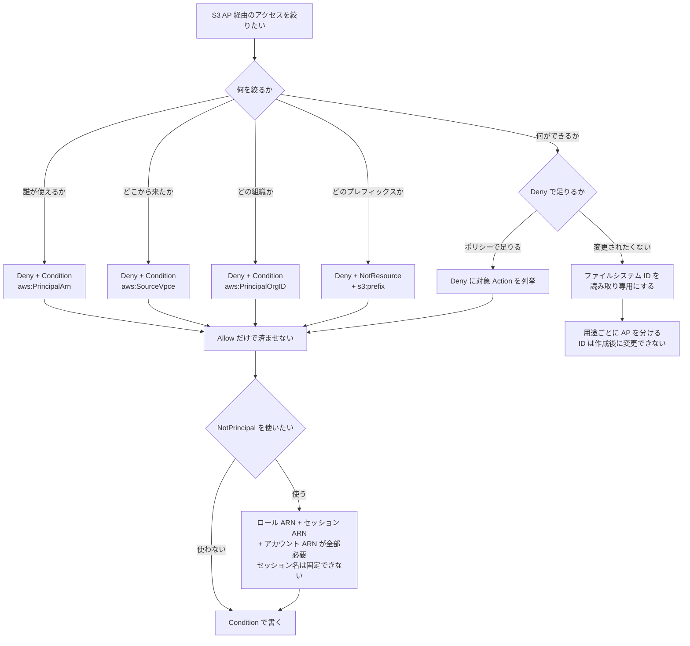

# アクセスポイントポリシーの Allow は上限にならない
<!-- lang-switcher:start -->
🌐 [日本語](access-point-policy-allow-is-not-a-cap.md) | [English](../../../../en/domains/security-governance/notes/access-point-policy-allow-is-not-a-cap.md) | [🏠 リポジトリトップ](../../../../../README.md)
<!-- lang-switcher:end -->

[🏠 リポジトリトップ](../../../../../README.md) | [Domain — セキュリティ・ガバナンス](../README.md)

---

## 結論

**Amazon FSx for NetApp ONTAP の S3 Access Point に「バケットポリシー」はありません。** 裏に S3 バケットが無いため、`put-bucket-policy` の対象が存在しません。設定するのは **アクセスポイントポリシー**（IAM リソースポリシー）です。

そのうえで、設計を誤らせる帰結が 1 つあります。**同一アカウント内では、アクセスポイントポリシーに書いた `Allow` は権限の上限になりません。**

**これは FSx for ONTAP 固有の挙動ではありません。** AWS のポリシー評価では、同一アカウントのリクエストは identity-based ポリシーと resource-based ポリシーの **和** で判定されます。どちらかが `Allow` すれば通ります。アクセスポイントポリシーは resource-based ポリシーなので、**呼び出し元の権限だけでも通る**ということです。

| 評価される順序 | このノートに効く点 |
|---|---|
| 1. 既定は暗黙の拒否 | 何も書かなければ通りません |
| 2. **明示的な `Deny` が 1 つでもあれば Deny 確定** | **絞る手段はこれだけです** |
| 3. Organizations の RCP / SCP | アカウントの外側から止められます |
| 4. identity-based と resource-based（**同一アカウントは和 / クロスアカウントは両方**） | **`Allow` を狭く書くことは、絞ることではありません** |

評価順序の全体像と、症状から落ちた段を逆引きする表は
[S3 Access Point 経由のリクエストはどう判定されるか](../../../reference/decision-trees/access-point-authorization.md)
にあります。**このノートは、その各ステップを実環境で確認した結果とポリシーの書き方を扱います。**

つまり **絞りたいなら明示的な `Deny` を書く**ことになります。**その `Deny` の書き方に落とし穴があります。** `NotPrincipal` で例外を作る形は、**除外したはずの主体まで拒否しました。** 推奨は `Condition` の `StringNotEquals` に `aws:PrincipalArn` を使う形です。

> **Evidence**: `verified`（検証日 2026-08-17、`ap-northeast-1`、ONTAP `9.18.1P3D1`、UNIX セキュリティ
> スタイルのボリューム、Internet origin と VPC origin の 3 つの AP、IAM ユーザー / `AssumeRole` した
> ロール / EC2 インスタンスロール / **別組織のアカウントのプリンシパル**の 4 主体）。
> **1 点だけ実測できていません。** `aws:SecureTransport` の `Deny` 分岐は構造的に到達不能でした
> （[理由](#awssecuretransport-は-deny-分岐に到達しない)）。ポリシー本文の JSON は検証で実際に適用した
> ものを、アカウント ID とネットワーク ID だけプレースホルダに置き換えて掲載しています。

---

## そもそも何を設定するのか

| 論点 | 内容 |
|---|---|
| 設定するもの | アクセスポイントポリシー（IAM リソースポリシー）。**バケットポリシーではありません** |
| 作成時の設定経路 | Amazon FSx コンソール、または `CreateAndAttachS3AccessPoint` の `S3AccessPoint.Policy` <!-- allow:naming - AWS のサービス名 --> |
| 既存 AP の変更経路 | **S3 側**（`aws s3control put-access-point-policy` / `delete-access-point-policy`）。Amazon FSx 側に変更 API はありません <!-- allow:naming - AWS のサービス名 --> |
| 必要な権限 | `s3:PutAccessPointPolicy` |
| Block Public Access | **常に有効で、変更できません** |
| ポリシーの上限 | 20 KB（後述の[実測](#ポリシーサイズの上限は正規化後で判定される)を併せて読んでください） |

**変更経路が Amazon FSx と S3 に分かれている点が運用に効きます。** <!-- allow:naming - AWS のサービス名 --> AP 自体は Amazon FSx の API で作り、ポリシーだけは S3 の API で回します。IaC を書くときも、テンプレートで作った AP のポリシーを後から S3 側で書き換えると、テンプレートと実環境が乖離します。

---

## Allow は上限にならない — 和で評価されることの帰結

**「AP ポリシーに書いた範囲しか通らない」という前提で設計すると、実際には広く通ります。** 次の 5 行はすべて、評価ステップ 4 の「同一アカウントは和」から予測できる結果です。**予測どおりになることを確認した記録として読んでください。**

| ポリシー | 呼び出し元 | 操作 | 結果 | どのステップで説明されるか |
|---|---|---|---|---|
| なし | IAM ユーザー | `GetObject` | 成功 | 4（identity-based だけで `Allow` が成立） |
| なし | IAM ユーザー | `ListObjectsV2` | 成功 | 同上 |
| ロールのみ `Allow`（`GetObject`, `ListBucket`） | IAM ユーザー（**未記載**） | `GetObject` | **成功** | 4（AP ポリシーに無くても identity-based にある） |
| 同上 | ロール | `GetObject` | 成功 | 4 |
| 同上 | ロール | `PutObject`（**`Action` 未記載**） | **成功** | 4（`Action` も和で決まる） |

呼び出し元の identity-based ポリシーが許可していれば通ります。**AP ポリシーは「追加で許可する場所」であって、「ここまでに絞る場所」ではありません。**

**絞る位置はステップ 2 です。** 明示的な `Deny` は最初に評価され、当たった時点で以降を見ません。だから「`Allow` を狭くする」ではなく「`Deny` を書く」が絞る操作になります。

> **セキュリティに関する補足**: 「AP を作って読み取りだけ `Allow` したから、この AP 経由では書けない」は
> 成立しません。管理者権限を持つ主体は、そのまま書けます。**書けなくしたいなら `Deny` を書くか、
> AP に紐づくファイルシステム ID を読み取り専用にしてください。** 後者は
> [S3 Access Point は全リクエストを 1 つの ID で認可する](../../data-utilization/notes/reaching-data-without-copies.md)
> にあります。

---

## Deny の 2 つの書き方 — `NotPrincipal` は避ける

**`Deny` + `NotPrincipal` は、例外に指定した主体まで拒否しました。** 何を列挙すれば例外が成立するかを測った結果が次の表です。

| `NotPrincipal` に列挙したもの | IAM ユーザー | `AssumeRole` したロール |
|---|---|---|
| IAM ユーザーの ARN のみ | **拒否** | 拒否 |
| IAM ユーザーの ARN + **アカウント ARN** | 成功 | 拒否 |
| ロール ARN + アカウント ARN | 拒否 | **拒否** |
| assumed-role セッション ARN + アカウント ARN | 拒否 | **拒否** |
| ロール ARN + セッション ARN（アカウント ARN なし） | 拒否 | **拒否** |
| ロール ARN + セッション ARN + **アカウント ARN** | 拒否 | 成功 |

読み取れることが 2 つあります。

1. **アカウント ARN（`arn:aws:iam::<account>:root`）の併記が必要です。** 主体の ARN だけを書いても例外になりません。最初の行が、それを示すコントロールです。
2. **ロールの場合はロール ARN と assumed-role セッション ARN の両方が必要です。** そしてセッション名は `AssumeRole` の呼び出し時に決まり、**`NotPrincipal` はワイルドカードを受け付けません。** つまり「このロールの、任意のセッション」を表現できません。

だから **ロールを対象にする設計では `NotPrincipal` は使えません。** 推奨は次の形です。

| 形 | セッション名への依存 | 判定 |
|---|---|---|
| `Deny` + `NotPrincipal` | セッション名を固定しないと成立しません | 使わない |
| `Deny` + `Condition` `StringNotEquals` `aws:PrincipalArn` | **依存しません** | **こちらを使う** |

`aws:PrincipalArn` は assumed-role セッションに対して **ロールの ARN** に解決されます。3 つの異なるセッション名（`s3ap-verify` / `other-session` / `ci-run-12345`）で確認し、いずれも同じ判定になりました。

> **セキュリティに関する補足**: `Deny` の `Action` に `s3:*` を書き、`Resource` を AP の ARN にすると、
> `s3:PutAccessPointPolicy` と `s3:DeleteAccessPointPolicy` も同じ ARN を対象とするため、**ポリシーの
> 管理操作まで拒否してロックアウトする恐れがあります。** 本ノートの例はいずれもデータ操作
> （`GetObject` / `PutObject` / `DeleteObject` / `ListBucket`）に限定しています。**この
> ロックアウトは実測していません。** 復旧に AP の作り直しが必要になる可能性があるため、意図的に
> 試していません。

---

## 設定例 — 6 パターン

**アカウント ID は `123456789012`、VPC / エンドポイント ID と組織 ID はプレースホルダです。** リージョンは検証環境と同じ `ap-northeast-1` のままにしています。

### ① 特定のロールだけに読み取りを許可する

```json
{
  "Version": "2012-10-17",
  "Statement": [
    {
      "Sid": "AllowPipelineRoleReadOnly",
      "Effect": "Allow",
      "Principal": {"AWS": "arn:aws:iam::123456789012:role/AnalyticsPipelineRole"},
      "Action": ["s3:GetObject", "s3:ListBucket"],
      "Resource": [
        "arn:aws:s3:ap-northeast-1:123456789012:accesspoint/my-fsxn-ap",
        "arn:aws:s3:ap-northeast-1:123456789012:accesspoint/my-fsxn-ap/object/*"
      ]
    },
    {
      "Sid": "DenyAnyPrincipalOutsideTheAllowList",
      "Effect": "Deny",
      "Principal": "*",
      "Action": ["s3:GetObject", "s3:PutObject", "s3:DeleteObject", "s3:ListBucket"],
      "Resource": [
        "arn:aws:s3:ap-northeast-1:123456789012:accesspoint/my-fsxn-ap",
        "arn:aws:s3:ap-northeast-1:123456789012:accesspoint/my-fsxn-ap/object/*"
      ],
      "Condition": {
        "StringNotEquals": {
          "aws:PrincipalArn": "arn:aws:iam::123456789012:role/AnalyticsPipelineRole"
        }
      }
    }
  ]
}
```

**`Deny` の側が本体です。** 上半分だけにすると、前節の表のとおり他の主体がそのまま通ります。

実測: 指定ロールは成功、指定していない IAM ユーザー（管理者権限）は `AccessDenied`。

### ② 書き込みを許可する

①の `Allow` の `Action` に `s3:PutObject` を足し、`Deny` 側はそのままにします。**`Deny` の `Action` から `s3:PutObject` を外さないでください。** 外すと、許可した主体以外も書けます。

| 用途 | `Allow` の `Action` |
|---|---|
| 読み取り専用のパイプライン | `s3:GetObject`, `s3:ListBucket` |
| 出力先として使う | `s3:GetObject`, `s3:ListBucket`, `s3:PutObject` |
| 世代を消す運用がある | 上記 + `s3:DeleteObject` |

**書き込みを止める硬い方法は、AP に紐づくファイルシステム ID を読み取り専用にすることです。** ポリシー 1 行の変更で書けるようになる状態を避けたい場合はそちらを使います。

### ③ 特定の VPC エンドポイント経由に限定する

```json
{
  "Version": "2012-10-17",
  "Statement": [
    {
      "Sid": "AllowInstanceRoleRead",
      "Effect": "Allow",
      "Principal": {"AWS": "arn:aws:iam::123456789012:role/AppInstanceRole"},
      "Action": ["s3:GetObject", "s3:ListBucket"],
      "Resource": [
        "arn:aws:s3:ap-northeast-1:123456789012:accesspoint/my-fsxn-ap",
        "arn:aws:s3:ap-northeast-1:123456789012:accesspoint/my-fsxn-ap/object/*"
      ]
    },
    {
      "Sid": "DenyUnlessThroughTheExpectedVpcEndpoint",
      "Effect": "Deny",
      "Principal": "*",
      "Action": ["s3:GetObject", "s3:ListBucket"],
      "Resource": [
        "arn:aws:s3:ap-northeast-1:123456789012:accesspoint/my-fsxn-ap",
        "arn:aws:s3:ap-northeast-1:123456789012:accesspoint/my-fsxn-ap/object/*"
      ],
      "Condition": {
        "StringNotEquals": {"aws:SourceVpce": "vpce-0123456789abcdef0"}
      }
    }
  ]
}
```

実測は同一クライアント（VPC 内の EC2）で条件値だけを変えて両側を取りました。

| 条件の値 | VPC 内の EC2 から | VPC 外から |
|---|---|---|
| 実在するゲートウェイエンドポイントの ID | `ListBucket` / `GetObject` ともに成功 | 拒否 |
| 存在しないエンドポイントの ID | **拒否** | — |

拒否時のエラー本文に `with an explicit deny in a resource-based policy` が入るため、**IAM 側の許可漏れと切り分けられます。** 切り分けの手がかりとして覚えておくと早いです。

**`NetworkOrigin` による制限とは別の仕組みです。** `NetworkOrigin` は作成後に変更できませんが、この条件はポリシーなので後から変えられます。

### ④ 組織内に限定する

```json
{
  "Version": "2012-10-17",
  "Statement": [
    {
      "Sid": "AllowReadFromInsideTheOrganization",
      "Effect": "Allow",
      "Principal": "*",
      "Action": ["s3:GetObject", "s3:ListBucket"],
      "Resource": [
        "arn:aws:s3:ap-northeast-1:123456789012:accesspoint/my-fsxn-ap",
        "arn:aws:s3:ap-northeast-1:123456789012:accesspoint/my-fsxn-ap/object/*"
      ],
      "Condition": {"StringEquals": {"aws:PrincipalOrgID": "o-exampleorgid"}}
    },
    {
      "Sid": "DenyAnyPrincipalOutsideTheOrganization",
      "Effect": "Deny",
      "Principal": "*",
      "Action": ["s3:GetObject", "s3:PutObject", "s3:DeleteObject", "s3:ListBucket"],
      "Resource": [
        "arn:aws:s3:ap-northeast-1:123456789012:accesspoint/my-fsxn-ap",
        "arn:aws:s3:ap-northeast-1:123456789012:accesspoint/my-fsxn-ap/object/*"
      ],
      "Condition": {"StringNotEquals": {"aws:PrincipalOrgID": "o-exampleorgid"}}
    }
  ]
}
```

**`Principal: "*"` と条件キーの組み合わせです。** 主体を列挙しないので、アカウントが増えても書き換えが要りません。

実測: 別組織のアカウントのプリンシパルは拒否されました。**同じ明示的クロスアカウント許可を与えて `Deny` 文だけを外した AP では、同じプリンシパルが成功します。** つまり拒否はこの条件文によるものです。詳細は [クロスアカウントのデータアクセスは成立する](#クロスアカウントのデータアクセスは成立する) を参照してください。

### ⑤ 平文通信を拒否する

```json
{
  "Sid": "DenyUnencryptedTransport",
  "Effect": "Deny",
  "Principal": "*",
  "Action": "s3:*",
  "Resource": [
    "arn:aws:s3:ap-northeast-1:123456789012:accesspoint/my-fsxn-ap",
    "arn:aws:s3:ap-northeast-1:123456789012:accesspoint/my-fsxn-ap/object/*"
  ],
  "Condition": {"Bool": {"aws:SecureTransport": "false"}}
}
```

**この 1 文だけは、効いていることを実測できませんでした。** 理由は次節にあります。多層防御として書く分には無害ですが、**「これがあるから平文は止まっている」という説明の根拠にはできません。**

### ⑥ プレフィックスに限定する

```json
{
  "Version": "2012-10-17",
  "Statement": [
    {
      "Sid": "AllowRoleReadWriteWithinOnePrefix",
      "Effect": "Allow",
      "Principal": {"AWS": "arn:aws:iam::123456789012:role/AnalyticsPipelineRole"},
      "Action": ["s3:GetObject", "s3:PutObject"],
      "Resource": "arn:aws:s3:ap-northeast-1:123456789012:accesspoint/my-fsxn-ap/object/incoming/*"
    },
    {
      "Sid": "AllowRoleListOnlyThatPrefix",
      "Effect": "Allow",
      "Principal": {"AWS": "arn:aws:iam::123456789012:role/AnalyticsPipelineRole"},
      "Action": "s3:ListBucket",
      "Resource": "arn:aws:s3:ap-northeast-1:123456789012:accesspoint/my-fsxn-ap",
      "Condition": {"StringLike": {"s3:prefix": "incoming/*"}}
    },
    {
      "Sid": "DenyAnyObjectOutsideThatPrefix",
      "Effect": "Deny",
      "Principal": "*",
      "Action": ["s3:GetObject", "s3:PutObject", "s3:DeleteObject"],
      "NotResource": "arn:aws:s3:ap-northeast-1:123456789012:accesspoint/my-fsxn-ap/object/incoming/*"
    },
    {
      "Sid": "DenyListWithoutThatPrefix",
      "Effect": "Deny",
      "Principal": "*",
      "Action": "s3:ListBucket",
      "Resource": "arn:aws:s3:ap-northeast-1:123456789012:accesspoint/my-fsxn-ap",
      "Condition": {"StringNotLike": {"s3:prefix": "incoming/*"}}
    }
  ]
}
```

**オブジェクトの制限は `NotResource`、一覧の制限は `s3:prefix` で、別々に書く必要があります。** `s3:prefix` は `ListBucket` にしか効きません。

実測（`incoming/` を検証用のプレフィックスに読み替えています）:

| 呼び出し元 | 操作 | 対象 | 結果 |
|---|---|---|---|
| ロール | `GetObject` | プレフィックス内 | 成功 |
| ロール | `GetObject` | プレフィックス外 | 拒否 |
| ロール | `PutObject` | プレフィックス内 | 成功 |
| ロール | `PutObject` | プレフィックス外 | 拒否 |
| ロール | `ListBucket` | プレフィックス指定あり | 成功 |
| ロール | `ListBucket` | プレフィックス指定なし | 拒否 |
| **IAM ユーザー（管理者権限）** | `GetObject` | プレフィックス外 | **拒否** |

最後の行が要点です。**`Deny` を `Principal: "*"` で書くと、管理者権限を持つ主体も含めて上限になります。** ①〜④は「誰を通すか」の制御ですが、⑥は「何に触れるか」の上限として働きます。

---

## 条件キーの実測結果

| 条件キー | 何を絞れるか | 実測 |
|---|---|---|
| `aws:PrincipalArn` | 呼び出し元の ARN。セッション名に依存しません | **Allow / Deny 両側を確認** |
| `aws:SourceVpce` | 経由した VPC エンドポイント | **Allow / Deny 両側を確認** |
| `aws:PrincipalOrgID` | 組織のメンバーシップ | **Allow / Deny 両側を確認**（別組織のアカウントのプリンシパルで実測） |
| `s3:prefix` | `ListBucket` の対象範囲 | **Allow / Deny 両側を確認** |
| `aws:SecureTransport` | 通信の暗号化 | **Deny 分岐に到達しませんでした**（後述） |

### `aws:SecureTransport` は Deny 分岐に到達しない

| 試した経路 | 結果 |
|---|---|
| HTTPS（コントロール） | 成功 |
| 署名なしの HTTP リクエスト | **HTTP 307 で HTTPS へリダイレクト** |
| 署名付きの HTTP リクエスト（SDK で TLS を無効化） | **`TemporaryRedirect`（307）** |
| CLI の `--endpoint-url` を `http://` に変更 | `NoSuchBucket`。AP の ARN によるアドレッシングが壊れるため、この経路では何も検証できません |

**認可の評価に到達する前にリダイレクトされます。** AWS のドキュメントも、アクセスポイントは HTTPS のみを受け付け、HTTP リクエストには HTTPS へ上げるためのリダイレクトを返すと明記しています。つまり **`aws:SecureTransport` が `false` になる経路が、この AP には存在しません。**

### `aws:PrincipalOrgID` 組織の内外

| 条件に書いた組織 ID | 呼び出し元 | 結果 |
|---|---|---|
| 自組織の ID | 自組織のメンバー | 成功 |
| 別の組織 ID | 自組織のメンバー（= 条件上は「外部」） | 拒否 |
| **条件なし**（明示的なクロスアカウント許可のみ） | **別組織のアカウントのプリンシパル** | **成功** |
| 自組織の ID | **別組織のアカウントのプリンシパル** | **拒否** |

**下 2 行が対になっています。** 同一ボリューム上の 2 つの AP に、**同じ明示的クロスアカウント許可**（`Principal` に相手アカウントの ARN）を与え、片方にだけ `aws:PrincipalOrgID` の `Deny` を足しました。同一クライアント・同一時刻で、条件文の有無だけが違います。

3 行目をコントロールとして置いたことに意味があります。**これが無いと、4 行目の拒否が組織条件によるものか、そもそもクロスアカウントのアクセスが成立しないためかを区別できません。**

---

## クロスアカウントのデータアクセスは成立する

**これも評価ステップ 4 から予測できます。** クロスアカウントは和ではなく**両方**が必要な分岐です。今回はリソース側（AP ポリシー）が許可し、相手側の identity-based ポリシーも管理者権限で許可していたため、両方が揃って通りました。

**「同一アカウント所有が必須」は AP を作る側の制約で、AP を使う側の制約ではありません。**

| 論点 | 実際 |
|---|---|
| 別アカウントのボリュームに AP を作る | できません（ファイルシステムと AP は同一アカウント所有） |
| **別アカウント（別組織）のプリンシパルが AP 経由でデータを読む** | **できます。** AP ポリシーで許可すれば通ります（上表 3 行目で実測） |

**ここを混同すると、設計の選択肢を 1 つ落とします。** データを別アカウントに配るために「コピーを作る」「アカウントをまたげないから別の仕組みを使う」という判断に流れがちですが、**AP ポリシーで相手アカウントを許可すればコピーは不要です。** 前提条件の側は [FSx for ONTAP S3 AP は「S3 として使える」わけではない](../../data-utilization/notes/s3-access-point-constraints.md) にあります。

**そして裏返すと、意図しない共有も AP ポリシー 1 つで起きます。** 相手アカウントを `Principal` に書けば、こちらの組織の外へデータが出ます。組織の外に出したくないなら、`aws:PrincipalOrgID` の `Deny` を置くのが実測で確認できた止め方です。

---

## AP 側のパラメータ — Policy 以外は作成時に確定する

Amazon FSx がこのアタッチメントに対して公開している操作は **3 つだけ**です。`CreateAndAttachS3AccessPoint`、`DescribeS3AccessPointAttachments`、`DetachAndDeleteS3AccessPoint`。**更新の操作がありません。** <!-- allow:naming - AWS のサービス名 -->

| パラメータ | 必須 | 制約 | 作成後に変更 |
|---|---|---|---|
| `Name` | はい | 3〜50 文字、小文字英数と `-`、先頭末尾は英数 | **できません**（作り直し） |
| `Type` | はい | `ONTAP` / `OPENZFS` | **できません** |
| `OntapConfiguration.VolumeId` | はい | `fsvol-` 形式 | **できません**（別ボリュームに向けられません） |
| `FileSystemIdentity.Type` | はい | `UNIX` / `WINDOWS` | **できません** |
| `UnixUser.Name` / `WindowsUser.Name` | どちらか | 1〜256 文字 | **できません** |
| `S3AccessPoint.VpcConfiguration.VpcId` | いいえ | `vpc-` 形式。**省略すると Internet origin** | **できません** |
| `S3AccessPoint.Policy` | いいえ | フィールド上は 1〜200,000 文字 | **できます**（S3 側の API で） |
| `ClientRequestToken` | いいえ | 1〜63 文字 | — |

**作り直しの範囲は AP 1 つ分です。** ボリュームとデータには影響しません。`DetachAndDeleteS3AccessPoint` で外して、同じ名前で作り直せます。ただし **エイリアスは変わります**（`<name>-<ランダム>-ext-s3alias` 形式）。エイリアスを設定に埋め込んでいる利用側があると、そこも直すことになります。

**`FileSystemIdentity` が変更できないことは、権限設計に効きます。** 「あとで読み取り専用の ID に差し替える」ができないため、**用途ごとに AP を分ける**のが実際の運用になります。ID が権限の上限になる仕組みは [S3 Access Point は全リクエストを 1 つの ID で認可する](../../data-utilization/notes/reaching-data-without-copies.md) にあります。

### CloudFormation

```yaml
Resources:
  FsxnAnalyticsAccessPoint:
    Type: AWS::FSx::S3AccessPointAttachment
    Properties:
      Name: my-fsxn-ap
      Type: ONTAP
      OntapConfiguration:
        VolumeId: fsvol-0123456789abcdef0
        FileSystemIdentity:
          Type: UNIX
          UnixUser:
            Name: analytics-reader
      S3AccessPoint:
        VpcConfiguration:
          VpcId: vpc-0123456789abcdef0
        Policy:
          Version: "2012-10-17"
          Statement:
            - Sid: AllowPipelineRoleReadOnly
              Effect: Allow
              Principal:
                AWS: !Sub arn:${AWS::Partition}:iam::${AWS::AccountId}:role/AnalyticsPipelineRole
              Action:
                - s3:GetObject
                - s3:ListBucket
              Resource:
                - !Sub arn:${AWS::Partition}:s3:${AWS::Region}:${AWS::AccountId}:accesspoint/my-fsxn-ap
                - !Sub arn:${AWS::Partition}:s3:${AWS::Region}:${AWS::AccountId}:accesspoint/my-fsxn-ap/object/*
            - Sid: DenyAnyPrincipalOutsideTheAllowList
              Effect: Deny
              Principal: "*"
              Action:
                - s3:GetObject
                - s3:PutObject
                - s3:DeleteObject
                - s3:ListBucket
              Resource:
                - !Sub arn:${AWS::Partition}:s3:${AWS::Region}:${AWS::AccountId}:accesspoint/my-fsxn-ap
                - !Sub arn:${AWS::Partition}:s3:${AWS::Region}:${AWS::AccountId}:accesspoint/my-fsxn-ap/object/*
              Condition:
                StringNotEquals:
                  aws:PrincipalArn: !Sub arn:${AWS::Partition}:iam::${AWS::AccountId}:role/AnalyticsPipelineRole
```

**`Policy` をテンプレートに書けるので、AP とポリシーを 1 つのスタックで管理できます。** ただし変更経路が 2 つある点は前述のとおりです。S3 側の API で書き換えるとドリフトします。

### AWS CLI

```bash
# 作成（ポリシーも同時に付ける）
aws fsx create-and-attach-s3-access-point \
  --name my-fsxn-ap \
  --type ONTAP \
  --ontap-configuration '{
    "VolumeId": "fsvol-0123456789abcdef0",
    "FileSystemIdentity": {"Type": "UNIX", "UnixUser": {"Name": "analytics-reader"}}
  }' \
  --s3-access-point '{
    "VpcConfiguration": {"VpcId": "vpc-0123456789abcdef0"},
    "Policy": "<JSON を文字列として渡す>"
  }'

# 既存 AP のポリシーだけを差し替える（S3 側の API）
aws s3control put-access-point-policy \
  --account-id 123456789012 \
  --name my-fsxn-ap \
  --policy file://access-point-policy.json

# 現在のポリシーを確認する
aws s3control get-access-point-policy \
  --account-id 123456789012 \
  --name my-fsxn-ap \
  --query Policy --output text | python3 -m json.tool

# ポリシーを外す（AP は残る）
aws s3control delete-access-point-policy \
  --account-id 123456789012 \
  --name my-fsxn-ap
```

**`put-access-point-policy` は全置換です。** マージされません。既存のポリシーがある AP を触るときは、先に `get-access-point-policy` で退避してください。

### ポリシーサイズの上限は正規化後で判定される

| 適用したポリシー（整形なし JSON） | 結果 |
|---|---|
| 24,620 バイト | 成功 |
| 24,861 バイト | `MalformedPolicy: Normalized policy document exceeds the maximum allowed size` |
| 33,778 バイト | 同上 |

**ドキュメント上の上限は 20 KB です。** 判定は **正規化後**の文書に対して行われるため、**手元の JSON のバイト数を予算として使えません。** 境界はポリシーの書き方で動きます。Amazon FSx の API がフィールドとして受け付ける 200,000 文字とも一致しません。<!-- allow:naming - AWS のサービス名 -->**上限に近づく設計は避け、AP を分けてください。**

この値は [上限値・クォータ](../../../reference/limits/README.md#fsx-for-ontap-s3-ap--アクセスポイントポリシーのサイズ--access-point-policy-size) にも記録しています。

---

## 判断フロー



図の内容は前節までの表と同じです。**絞る対象ごとに条件キーを選び、いずれの場合も `Allow` だけで終わらせない**という 2 点に集約されます。「何ができるか」を確実に止めたい場合だけ、ポリシーではなくファイルシステム ID 側で担保します。

**これは「何を書くか」を選ぶための図です。** 書いたポリシーが「どう判定されるか」の順序は
[S3 Access Point 経由のリクエストはどう判定されるか](../../../reference/decision-trees/access-point-authorization.md)
にあります。**症状から原因の段を逆引きしたい場合はそちらを先に見てください。**

---

## 自分の環境で確かめる

| # | 手順 | 確認できること |
|---|---|---|
| 1 | 対象 AP の現ポリシーを `get-access-point-policy` で退避する | 全置換で失う内容。**ポリシーが無い場合は `NoSuchAccessPointPolicy` が返るので、戻すときは `delete-access-point-policy` です** |
| 2 | ポリシーを付けずに `GetObject` する | AP ポリシーが必須でないこと |
| 3 | ロールだけを `Allow` して、別の主体で `GetObject` する | `Allow` が上限にならないこと |
| 4 | `Deny` + `Condition aws:PrincipalArn` を足して再実行する | 絞れるようになること |
| 5 | 通るはずの主体で必ず 1 回試す | **`Deny` が意図より広く効いていないこと** |
| 6 | 退避したポリシーを戻し、`get-access-point-policy` で差分を確認する | 元に戻ったこと |

**5 を省略しないでください。** `NotPrincipal` の挙動は、拒否されるべき主体が拒否されるところまでを見ると正しく見えます。**除外したはずの主体を試して初めて、例外が成立していないことが分かります。**

**ポリシーの反映には数秒かかります。** 適用の約 6 秒後には前のポリシーの判定が返り、10〜12 秒後には安定しました。**適用直後の 1 回だけを見ると、実際とは違う結論になります。** この検証でも一度それを踏み、再実行で気づきました。

---

## よくある誤解

| 誤解 | 実際 |
|---|---|
| FSx for ONTAP S3 AP にバケットポリシーを設定する | バケットが無いので設定できません。アクセスポイントポリシーです |
| 同一アカウント所有が必須なので、別アカウントからは読めない | **読めます。** 同一アカウント所有は AP を作る側の制約です。AP ポリシーで許可すれば別組織のアカウントからも通ります（実測） |
| AP ポリシーを付けないと誰もアクセスできない | identity-based ポリシーが許可していればアクセスできます |
| AP ポリシーの `Allow` に書いた範囲しか通らない | 同一アカウントでは和で評価されます。絞るには `Deny` が必要です |
| `Allow` の `Action` に書いていない操作はできない | できます。`Action` も上限になりません |
| `NotPrincipal` で例外を作れる | アカウント ARN の併記が必要で、ロールはセッション ARN も必要です。**セッション名を固定できない用途では使えません** |
| `aws:SecureTransport` で平文を止めている | その分岐に到達しません。HTTP は認可前にリダイレクトされます |
| ポリシーは 20 KB まで書けるので、手元の JSON が 20 KB 以内なら通る | 判定は正規化後です。**実測では 24,861 バイトで拒否されました** |
| あとで AP のファイルシステム ID を差し替えればよい | 変更 API がありません。AP の作り直しになります |
| AP を作り直せば元に戻る | 名前は再利用できますが、**エイリアスは変わります** |
| ポリシーを変えれば `NetworkOrigin` の制限も変えられる | 別の仕組みです。`NetworkOrigin` は作成後に変更できません |

---

## この記述の限界

- **クロスアカウントの実測は 1 組のアカウント間で 1 回です。** 相手は AWS Organizations の別組織に属するアカウントで、呼び出し元は IAM Identity Center 経由の管理者ロールでした。**組織関係やプリンシパルの型が違う組み合わせは試していません。**
- **本ノートの対象は AWS 側の認可です。** ONTAP バージョンは記録していますが（`9.18.1P3D1`）、ここに書いた挙動はアクセスポイントポリシーの評価、つまり S3 と IAM 側の話であり、ONTAP のバージョンに依存する項目は含みません。ファイルシステム側の認可と組み合わせて判断する場合は、そちらのバージョン依存性を別に確認してください。
- **`Deny` に `s3:*` を書いた場合のロックアウトは実測していません。** 復旧に AP の作り直しが必要になる可能性があるため、意図的に試していません。
- 検証したボリュームは **UNIX セキュリティスタイル**のみです。NTFS スタイルのボリュームと `WINDOWS` タイプの ID では、ファイルシステム側の認可の挙動が変わります。ポリシー側の挙動が変わることは想定していませんが、確認していません。
- 実測は **1 リージョン（`ap-northeast-1`）、1 ファイルシステム**での結果です。

---

## 参照した一次情報

| 論点 | 出典 |
|---|---|
| 二層認可モデル、Block Public Access が変更不可、`s3:PutAccessPointPolicy` が必要、作成時と変更時の設定経路 | [AWS: Managing access point access](https://docs.aws.amazon.com/fsx/latest/ONTAPGuide/s3-ap-manage-access-fsxn.html) |
| AP ポリシーは 20 KB、VPC 設定は作成後に変更不可、HTTPS のみ対応で HTTP はリダイレクト、10,000 AP / アカウント / リージョン | [AWS: Access points restrictions and limitations](https://docs.aws.amazon.com/AmazonS3/latest/userguide/access-points-restrictions-limitations-naming-rules.html) |
| AP 作成時に指定するプロパティ、ボリュームに junction path が必要 | [AWS: Creating access points](https://docs.aws.amazon.com/fsx/latest/ONTAPGuide/create-access-points.html) |
| `CreateAndAttachS3AccessPoint` のパラメータと制約 | [AWS: CreateAndAttachS3AccessPointOntapConfiguration](https://docs.aws.amazon.com/fsx/latest/APIReference/API_CreateAndAttachS3AccessPointOntapConfiguration.html) |
| CloudFormation のプロパティ | [AWS: AWS::FSx::S3AccessPointAttachment](https://docs.aws.amazon.com/AWSCloudFormation/latest/TemplateReference/aws-resource-fsx-s3accesspointattachment.html) |
| ARN 形式、二層認可の整理、トラブルシュートの手がかり | [FSx-for-ONTAP-S3AccessPoints-Serverless-Patterns の認可モデル](https://github.com/Yoshiki0705/FSx-for-ONTAP-S3AccessPoints-Serverless-Patterns/blob/main/docs/s3ap-authorization-model.md) |

---

## 関連ドキュメント

- [S3 Access Point 経由のリクエストはどう判定されるか](../../../reference/decision-trees/access-point-authorization.md) — **評価順序と、症状から落ちた段への逆引き。仕組みから読むならこちらが先**
- [Domain — セキュリティ・ガバナンス](../README.md) — このモジュールのハブ
- [S3 Access Point は全リクエストを 1 つの ID で認可する](../../data-utilization/notes/reaching-data-without-copies.md) — ファイルシステム側の認可。**本ノートは AWS 側だけを扱います**
- [FSx for ONTAP S3 AP は「S3 として使える」わけではない](../../data-utilization/notes/s3-access-point-constraints.md) — AP を作る前の前提条件
- [エンドユーザーがデータに届く経路は 4 つある](../../../playbooks/02-design/notes/how-end-users-reach-the-data.md#ブラウザ経路--認可が-3-層になる) — 認可の層の全体像
- [本番投入前レビュー](../../../playbooks/04-build/checklists/pre-production-review.md) — `NetworkOrigin` を含む不可逆な項目
- [上限値・クォータ](../../../reference/limits/) — ポリシーサイズとオブジェクトサイズの実測値
- [知見の分類ポリシー](../../../evidence-policy.md)

---

[🏠 リポジトリトップ](../../../../../README.md) | [Domain — セキュリティ・ガバナンス](../README.md)

<!-- lang-switcher:start -->
🌐 [日本語](access-point-policy-allow-is-not-a-cap.md) | [English](../../../../en/domains/security-governance/notes/access-point-policy-allow-is-not-a-cap.md) | [🏠 リポジトリトップ](../../../../../README.md)
<!-- lang-switcher:end -->
