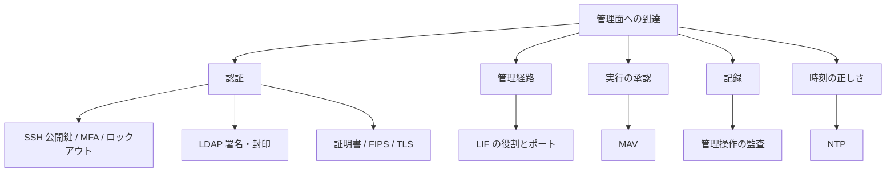

# 管理面はどの制御で守られるか？

管理面の保護は 1 つの設定で語れません。承認・認証・証明書・ディレクトリ・監査・管理経路・時刻が別々の制御で、FSx for ONTAP で設定できる範囲も項目ごとに異なります。

<!-- lang-switcher:start -->
🌐 [日本語](admin-plane-protection-depends-on-several-controls.md) | [English](../../../../en/domains/security-governance/notes/admin-plane-protection-depends-on-several-controls.md) | [🏠 リポジトリトップ](../../../../../README.md)
<!-- lang-switcher:end -->

## このノートで学べること

- 管理面を守る制御が複数あり、それぞれ別の攻撃面を塞ぐこと
- 各制御が ONTAP 一般では `documented` でも、FSx for ONTAP で設定できるかは項目ごとに分かれること

## このノートが答えないこと

- 保存時・転送時のデータ暗号化（[保存時は自動、転送時は方式ごとに条件が異なる](what-the-platform-gives-and-what-stays-yours.md) で扱っています）
- 各制御の規制・法令への適合性の判断

## 前提レベル

intermediate

## 本文

[🏠 リポジトリトップ](../../../../../README.md) | [Domain — セキュリティ・ガバナンス](../README.md)

---

### 結論

**「管理面を固めた」は 1 つの設定では成立しません。** 管理操作の実行者を誰が・どの経路で・何が記録するかは、独立した制御の集まりで決まります。NetApp の TR-4569（Security hardening guide for ONTAP、docs.netapp.com で公開、2025-04-17 時点）が ONTAP 一般の設定指針として整理している制御を、FSx for ONTAP で設定できるかどうかで分けると、次のように項目ごとに境界が異なります。

| 制御 | 塞ぐ攻撃面 | ONTAP 一般（TR-4569） | FSx for ONTAP での設定可否 |
|---|---|---|---|
| マルチ管理者承認（MAV） | 単独の管理者による破壊的操作 | `documented` | **未確認**（下記「MAV」を参照） |
| SSH 公開鍵・MFA・ログインバナー・アカウントロックアウト | 認証情報の窃取・総当たり | `documented` | 一部 `documented`、一部 **未確認** |
| 証明書（CA 署名・OCSP）と FIPS / TLS | 通信の盗聴・なりすまし | `documented` | **未確認** |
| LDAP の署名と封印（signing / sealing） | ディレクトリ通信の改竄・盗聴 | `documented` | **未確認** |
| 管理操作の監査 | 「誰が何をしたか」の欠落 | `documented` | 一部 `documented` |
| LIF の役割と開くポート | 管理経路の過剰な露出 | `documented` | 一部 `documented` |
| NTP（時刻同期） | 証明書検証・ログ相関の破綻 | `documented` | **未確認** |

> **Evidence**: `documented`。各制御の存在・推奨設定は TR-4569（Security hardening guide for ONTAP、docs.netapp.com、2025-04-17 時点）の記載に基づきます。**TR の値は ONTAP 一般です。** FSx for ONTAP で同じく設定できるかは、AWS の公式記載か実測がない限り **未確認** として分けています。`fsxadmin` ロールが実行できるコマンドは ONTAP 全体の部分集合なので、ONTAP CLI 前提の制御が FSx for ONTAP の委任管理者権限で設定できるとは限りません。

**データ経路の暗号化はこのノートの範囲外です。** NFS over TLS と SMB 署名は [保存時は自動、転送時は方式ごとに条件が異なる](what-the-platform-gives-and-what-stays-yours.md) で扱っているため、ここでは重ねません。

---

### 管理面を守る制御の分解

管理面（admin plane）とは、ストレージを設定・運用する側の経路です。データ経路（クライアントがファイルを読み書きする経路）とは別に守る必要があり、TR-4569 はこの面に複数の制御を割り当てています。それぞれが塞ぐ攻撃面は重なりません。

上図は下表の要約です（mermaid が描画されない環境のため、同じ内容を表にも置きます）。

| 面 | 制御 | この制御がないと起きること |
|---|---|---|
| 認証 | SSH 公開鍵 / MFA / ロックアウト | 認証情報だけで管理者になれる |
| 認証 | LDAP 署名・封印 | ディレクトリ応答の改竄で認可が狂う |
| 認証 | 証明書 / FIPS / TLS | 管理通信の盗聴・なりすまし |
| 管理経路 | LIF の役割とポート | 不要なサービスが外部から到達可能 |
| 実行の承認 | MAV | 単独の管理者が破壊的操作を完了できる |
| 記録 | 管理操作の監査 | 「誰が何をしたか」に答えられない |
| 時刻 | NTP | 証明書検証とログ相関が成立しない |

---

### MAV（マルチ管理者承認）

**MAV は、破壊的な操作を単独の管理者では完了できなくする制御です。** TR-4569 によれば ONTAP 9.11.1 以降で利用でき、ボリュームや Snapshot の削除などの指定した操作を、指名した管理者の承認後にのみ実行できます（`documented`、TR-4569 の Multi-admin verification、2025-04-11 時点）。有効化後は、操作ごとに「要求 → 承認 → 完了」の 3 段階を踏みます。

**FSx for ONTAP の委任管理者（`fsxadmin`）で MAV を有効化・運用できるかは未確認です。** MAV は ONTAP CLI / REST で設定する制御で、AWS の公式記載で設定可否を確認できていません。姉妹リポジトリに FSx for ONTAP 向けの MAV 設定手順（`documented`）がありますが、`fsxadmin` で有効化できたという実測記録はないため、設定可否は **未確認** として扱います。

- [FSx for ONTAP での MAV 設定](https://github.com/Yoshiki0705/FSx-for-ONTAP-Cyber-Resilience-Patterns/blob/main/docs/ontap-native/mav-configuration.md) — `documented` の姉妹資料。**`verified` ではありません**
- [`fsxadmin` ロールの制約](https://github.com/Yoshiki0705/FSx-for-ONTAP-Cyber-Resilience-Patterns/blob/main/docs/ontap-native/fsxadmin-limitations.md) — 委任管理者が実行できるコマンドは ONTAP 全体の部分集合

> **撤去に関する補足**: **MAV の承認対象に `volume delete` や `snapshot delete` を含めると、検証環境を片付けるときに承認者がそろわないと削除できなくなります。** MAV は破壊的操作を止める制御なので、撤去（teardown）という破壊的操作も止めます。承認グループの管理者が離席・退職している、承認に必要な人数に満たないといった状況では、検証用のボリュームやファイルシステムを消せず、課金が続きます。MAV を推奨する設計では、**撤去の経路（誰が承認でき、承認者がそろわないときにどうするか）を同じ節に書いてください。** TR-4569 は、MAV が重い自動化を伴うワークロードには向かず、自動化と併用する場合は特定の命名規則のボリュームに限って規則を適用することを推奨しています（`documented`、2025-04-11 時点）。削除を止める設定の不可逆性の整理は [不可逆な操作の承認は作業の承認とは別に取る](irreversible-operations-need-separate-approval.md) にあります。

---

### SSH 公開鍵・MFA・ログインバナー・アカウントロックアウト

TR-4569 は管理アクセスに SSH を最も安全な方式として推奨しています（`documented`、System administration methods、2026 時点の docs.netapp.com）。この面の制御は次の 4 つです。

| 制御 | ONTAP 一般（TR-4569） | FSx for ONTAP での設定可否 |
|---|---|---|
| SSH 公開鍵認証 | パスワードより推奨。公開鍵を管理者アカウントに登録 | **未確認**（委任管理者の鍵登録可否を AWS 記載で確認できていない） |
| MFA（多要素認証） | 公開鍵 + パスワード、または証明書 + パスワードなどの組み合わせ | **未確認** |
| ログインバナー | 接続時に法的・運用上の通知を表示 | **未確認** |
| アカウントロックアウト | 連続失敗でアカウントを一時無効化 | **未確認** |

**FSx for ONTAP では管理アカウントが `fsxadmin` に委任されており、これらの制御を委任管理者権限で設定できるかは項目ごとに未確認です。** `fsxadmin` が実行できるコマンドは ONTAP 全体の部分集合なので、ONTAP CLI 前提の設定手順がそのまま使えるとは限りません。

> **セキュリティに関する補足**: `fsxadmin` のパスワードそのものに落とし穴があります。姉妹リポジトリの検証で、テンプレートが生成した `fsxadmin` パスワードが実効パスワードにならない事例が記録されています（パスワード生成時の除外文字の指定が不十分で、生成された記号を含むパスワードがシークレットの値と一致しなかった）。実測の詳細は [検証ステータス](https://github.com/Yoshiki0705/S3-Burst-on-ONTAP-Files/blob/main/docs/ja/verification-status.md) にあります（ここでは言い換えず、リンクで引きます）。

---

### 証明書（CA 署名・OCSP）と FIPS / TLS

TR-4569 は、管理通信と外部連携に CA 署名証明書を使い、失効確認に OCSP を併用し、暗号化の強度要件に応じて FIPS モードと TLS バージョンを設定することを扱っています（`documented`、TR-4569）。

| 制御 | ONTAP 一般（TR-4569） | FSx for ONTAP での設定可否 |
|---|---|---|
| CA 署名証明書 | 自己署名ではなく CA 署名を推奨 | **未確認** |
| OCSP による失効確認 | 証明書失効をオンラインで確認 | **未確認** |
| FIPS モード | 承認済みアルゴリズムに限定 | **未確認** |
| TLS バージョン | 弱いバージョンを無効化 | **未確認** |

**これらは ONTAP CLI での設定が前提で、FSx for ONTAP の委任管理者権限で変更できるかは AWS の公式記載で確認できていません。** いずれも **未確認** として扱い、設計の前提には据えません。

---

### LDAP の署名と封印（signing / sealing）

TR-4569 は、Active Directory / LDAP との通信で署名（signing、改竄検知）と封印（sealing、暗号化）を有効にすることを扱っています（`documented`、TR-4569 の LDAP Signing and Sealing）。署名のない LDAP 通信は、応答の改竄で認可判断を狂わされる余地が残ります。

**FSx for ONTAP の SVM で LDAP 署名・封印を設定できるかは未確認です。** AD 参加や LDAP 設定の経路は FSx for ONTAP でも使えますが、署名・封印の個別設定が委任管理者権限で可能かを AWS 記載で確認できていないため、**未確認** とします。

---

### 管理操作の監査

TR-4569 は、管理操作（設定変更・ログインなど）を監査ログに記録することを扱っています（`documented`、TR-4569）。これはデータ経路の監査（誰がどのファイルを読んだか）とは別の面で、「誰がどの管理操作をしたか」に答えるためのものです。

| 面 | 何を記録するか | FSx for ONTAP での扱い |
|---|---|---|
| 管理操作の監査 | 設定変更・管理ログイン | 一部 `documented`（ONTAP の監査機構を使う） |
| データ経路の監査 | ファイルの読み書き | 既存ノートで扱い済み。穴がある（下記リンク） |

データ経路の監査には文書化された穴（記録されない読み取り）があり、[監査は 2 つの面に分かれ、片方に穴があります](what-the-platform-gives-and-what-stays-yours.md#監査の-2-つの面と片方の穴の存在) で扱っています。本ノートは管理操作の面に限ります。SMB ログオンの監査イベントの範囲は [4624 は記録される。ただし数えられるのはセッション](smb-logon-audit-event-coverage.md) にあります。

---

### LIF の役割と開くポート

TR-4569 は、LIF（論理インターフェイス）に役割を割り当て、管理用・データ用・クラスタ間用を分離し、各サービスが開くポートを必要最小限にすることを扱っています（`documented`、TR-4569）。管理用 LIF にデータプロトコルを載せないことで、管理経路の露出を減らします。

**FSx for ONTAP では LIF の構成がマネージドで、管理経路の一部は AWS が管理します。** どのサービスポリシーを委任管理者が変更できるかは項目ごとに分かれ、一部は `documented`、一部は **未確認** です。管理面の到達性（管理 LIF にどこから到達できるか）は、FSx for ONTAP ではネットワーク（セキュリティグループ・サブネット）側の設計と組み合わせて決まります。

---

### NTP（時刻同期）

TR-4569 は、信頼できる NTP サーバとの時刻同期を扱っています（`documented`、TR-4569）。時刻がずれると、証明書の有効期限検証が狂い、監査ログの時刻相関が成立しなくなります。管理面の制御の多くが時刻の正しさに依存するため、NTP は単独の制御ではなく前提条件です。

**FSx for ONTAP で NTP サーバを委任管理者が指定できるかは未確認です。** 時刻同期の経路が AWS 側で管理されるのか、ONTAP 側で設定するのかを公式記載で確認できていないため、**未確認** とします。

---

### 選び方 — 着手する制御の順序

**すべてを一度に設定する必要はありません。** 制御は塞ぐ攻撃面が異なるため、環境のリスクに応じて順序を決められます。各制御のトレードオフは対称に挙げます。

| 着手の優先 | 制御 | 効果 | トレードオフ（この制御自身の制約も含む） |
|---|---|---|---|
| まず | 管理操作の監査 | 「誰が何をしたか」を後から追える | 監査宛先の容量管理が要る（[監査宛先の枯渇はアクセスを止める](audit-log-space-and-client-access.md)） |
| まず | NTP | 証明書検証とログ相関の前提 | 設定可否が未確認。前提が崩れると他の制御が機能しない |
| 次に | SSH 公開鍵 / MFA / ロックアウト | 認証情報の窃取に強くなる | 鍵・MFA の運用コスト。委任管理者での設定可否が項目ごとに未確認 |
| 次に | 証明書 / FIPS / TLS、LDAP 署名・封印 | 通信の盗聴・改竄に強くなる | 証明書の更新運用。設定可否が未確認 |
| 破壊的操作が多い環境で | MAV | 単独管理者の破壊的操作を止める | **撤去も止める。** 自動化と相性が悪い（上記「MAV」） |

**順序はリスクで決めます。** 監査と時刻は他の制御の前提になるため先に、承認（MAV）は撤去への影響があるため環境のリスクを見てから、という並びにしています。推奨する制御（MAV）の制約も同じ表に挙げてあります。

---

### 段階的な導入

| 段階 | やること | 確認できること |
|---|---|---|
| 1. 設計 | FSx for ONTAP で設定可能な制御を項目ごとに確定する（本ノートの `documented` / 未確認 の区分を自環境で引き直す） | どの制御を委任管理者権限で設定できるか |
| 2. 構築 | 監査と NTP を先に設定し、認証（SSH 鍵・MFA）を続ける | 前提となる制御が成立しているか |
| 3. 運用 | MAV を導入する場合は撤去の承認経路を先に決める | 検証環境を消せなくなる状態を作らないか |

---

### よくある誤解

| 誤解 | 実際 |
|---|---|
| 管理面は 1 つの設定で固められる | **複数の独立した制御の組み合わせです。** それぞれ別の攻撃面を塞ぎます |
| TR-4569 に書いてあれば FSx for ONTAP でも同じく設定できる | **TR の値は ONTAP 一般です。** FSx for ONTAP で設定できるかは項目ごとに分かれ、多くは未確認です |
| 委任管理者（`fsxadmin`）なら ONTAP の全設定ができる | **実行できるコマンドは部分集合です。** ONTAP CLI 前提の制御が設定できるとは限りません |
| MAV を入れておけば安全 | **撤去も止めます。** 承認対象に削除を含めると、承認者がそろわないと検証環境を消せません |
| NTP は後回しでよい | **他の制御の前提です。** 時刻がずれると証明書検証とログ相関が破綻します |
| 姉妹リポジトリの MAV 手順は検証済み | **`documented` であって `verified` ではありません。** `fsxadmin` で有効化できた実測記録はありません |

## 自環境での確認手順

**この手順は読み取りのみで、どの制御も有効化しません。** MAV・監査・証明書などの有効化は、[不可逆な操作の承認は作業の承認とは別に取る](irreversible-operations-need-separate-approval.md) の承認ゲートに従ってから行ってください。

| # | 手順 | 確認できること |
|---|---|---|
| 1 | `security login role show -role fsxadmin -access !none` で委任管理者が実行できるコマンドを一覧する | 本ノートの各制御を `fsxadmin` で設定できるか |
| 2 | 対象の制御（例: NTP、SSH 鍵）の設定コマンドが手順 1 の一覧にあるかを照合する | `documented` / 未確認 の区分を自環境で引き直せる |
| 3 | MAV を検討する場合、承認対象に `volume delete` / `snapshot delete` を含めるかを先に決める | 撤去を止める設定を作らないか |

適用手順の全体像は [知見の分類ポリシー](../../../evidence-policy.md#本番に取り入れる前の確認) を参照してください。

---

### 参照した一次情報

| 論点 | 出典 |
|---|---|
| 管理面を守る制御の整理（ONTAP 一般） | [TR-4569: Security hardening guide for ONTAP](https://docs.netapp.com/us-en/ontap-technical-reports/ontap-security-hardening/security-hardening-overview.html) |
| MAV が ONTAP 9.11.1 以降で利用でき、削除などを承認後にのみ実行できること、重い自動化に向かないこと | [TR-4569: Multi-admin verification](https://docs.netapp.com/us-en/ontap-technical-reports/ontap-security-hardening/multi-admin-verify.html) |
| SSH が管理アクセスの推奨方式であること | [TR-4569: System administration methods](https://docs.netapp.com/us-en/ontap-technical-reports/ontap-security-hardening/sysadmin-methods.html) |

---

### 関連ドキュメント

- [Domain — セキュリティ・ガバナンス](../README.md) — このモジュールのハブ
- [保存時は自動、転送時は方式ごとに条件が異なる](what-the-platform-gives-and-what-stays-yours.md) — データ経路の暗号化（NFS over TLS・SMB 署名を含む）。本ノートはデータ経路を扱いません
- [不可逆な操作の承認は作業の承認とは別に取る](irreversible-operations-need-separate-approval.md) — MAV・SnapLock など削除を止める設定の承認ゲート
- [4624 は記録される。ただし数えられるのはセッション](smb-logon-audit-event-coverage.md) — SMB ログオンの監査イベントの範囲
- [監査宛先の枯渇はアクセスを止める](audit-log-space-and-client-access.md) — 監査を有効化したときの可用性への影響
- [知見の分類ポリシー](../../../evidence-policy.md)

## Read next

[Domain — セキュリティ・ガバナンス](../README.md)
