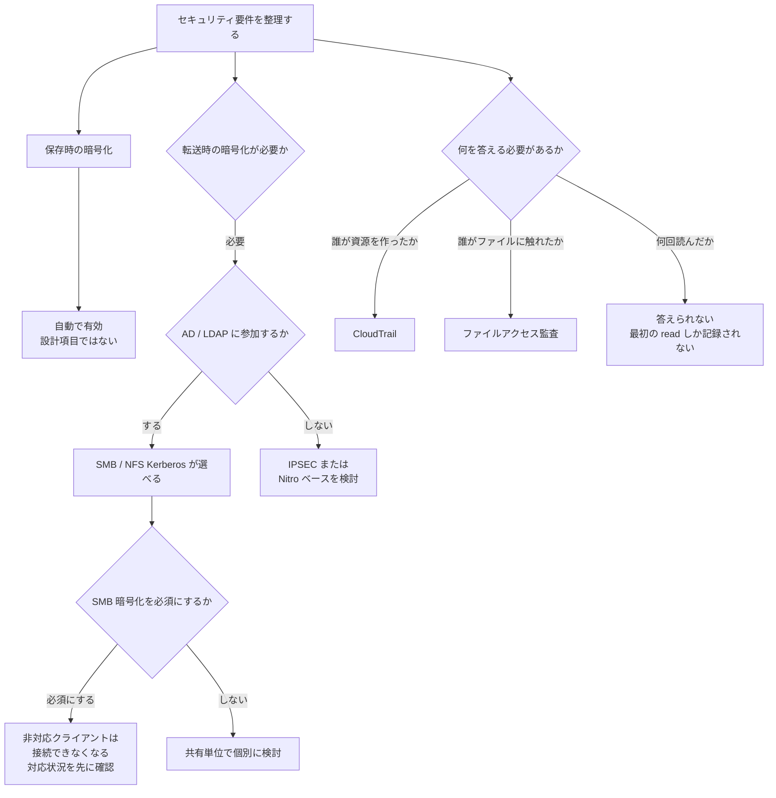

# 保存時の暗号化は自動、転送時は既定で無効

[🏠 リポジトリトップ](../../../../../README.md) | [Domain — セキュリティ / ガバナンス](../README.md)

---

## 結論

**保存時の暗号化は無効化できません。** ファイルシステム作成時に自動で有効になり、データとメタデータの両方が AES-256 で暗号化されます。バックアップも同様です。ここは自分で設計する項目ではありません。

**転送時の暗号化は逆です。既定で有効になっていません。** 有効化は自分の作業であり、しかも前提条件があります。

- **NFS と SMB の Kerberos ベースの転送時暗号化は、SVM が Active Directory または LDAP ドメインに参加している場合に利用できます。**
- **SMB 暗号化は SVM 作成時点では無効です。** 共有単位または SVM 単位で有効化します。

そして監査には文書化された穴があります。**SMB のアクセス監査は、1 つのオブジェクトについて最初の読み取りと最初の書き込みしか記録しません。**

> **Evidence**: `documented` — 暗号化の既定値・前提条件・監査イベントの仕様は AWS 公式ドキュメントの記載に基づきます。
> **このノートは規制・法令への適合を判断するものではありません。** 何が問われるかを整理するところまでが範囲で、
> 適合の判断は読者側の監査・法務プロセスに属します。確認手順は「[自分の環境で確かめる](#自環境での確認手順)」にあります。

---

## プラットフォームが提供するものと、自分に残るもの

| 項目 | 誰の作業か | 状態 |
|---|---|---|
| 保存時の暗号化（データ・メタデータ） | プラットフォーム | **自動で有効。無効化できません** |
| バックアップの暗号化 | プラットフォーム | 作成時に自動で暗号化、復元時に自動で復号 |
| 鍵の管理 | 共同 | AWS KMS の鍵を使用。どの鍵を使うかは選択できます |
| **転送時の暗号化** | **自分** | **既定で無効。有効化が必要** |
| SMB 暗号化の強制 | 自分 | SVM 単位または共有単位で設定 |
| Active Directory / LDAP との連携 | 自分 | Kerberos 転送時暗号化の前提 |
| ファイルアクセス監査 | 自分 | 有効化と保存先の設定が必要 |
| 管理 API の記録 | プラットフォーム | CloudTrail が全 API 呼び出しを記録 |
| 権限設計（最小権限） | 自分 | 管理者アカウントの使い分け |
| ウイルススキャン | 自分 | オンデマンドスキャンに対応 |

**「暗号化されているか」への答えは分けて説明する必要があります。** 保存時は自動、転送時は設定次第です。

---

## 転送時の暗号化の前提条件

利用できる方式は次の 3 つです。

| 方式 | 前提 |
|---|---|
| SMB Kerberos | **SVM が Active Directory または LDAP ドメインに参加している** |
| IPSEC | — |
| Nitro ベースの暗号化 | — |

**AD / LDAP に参加していない SVM では、NFS と SMB の Kerberos 転送時暗号化は選べません。** 「AD 連携は認証のためだけ」と考えていると、転送時暗号化の要件が出てきた段階で構成の見直しになります。

AD 参加そのものが権限評価に与える影響は [セキュリティスタイルが権限評価のモデルを決める](../../multiprotocol-identity/notes/security-style-and-permission-evaluation.md) にあります。

### SMB 暗号化の強制による、クライアント接続の不可

SMB 暗号化は SVM 作成時点で無効です。有効化は 2 段階で選べます。

- 個別の共有に対して必須にする
- SVM に対して必須にする（その SVM の全共有に適用）

**必須にすると、暗号化に対応していない SMB クライアントはその SVM や共有に接続できなくなります。**

これは「セキュリティを上げる変更」が「接続断を起こす変更」でもあるということです。**対応状況を把握してから有効化してください。** 設定は ONTAP CLI の `vserver cifs security modify` で行い、`vserver cifs security show` で現在値を確認できます。

---

## 監査の 2 つの面と、片方の穴の存在

「誰が何をしたか」は 1 つのログでは追えません。**面が 2 つあります。**

| 面 | 記録されるもの | 仕組み |
|---|---|---|
| 管理面 | ファイルシステムやボリュームの作成・削除・タグ付けなど、**API 呼び出し** | CloudTrail |
| データ面 | エンドユーザーによるファイル・ディレクトリへのアクセス | ファイルアクセス監査 |

CloudTrail は FSx for ONTAP の**全 API 呼び出しを記録します。** ルートか IAM ユーザーか、ロールの一時的な認証情報か、他の AWS サービスからの呼び出しかまで識別できます。

### 記録されない読み取りの存在

SMB のアクセス監査のうち**ファイルアクセスのカテゴリ**で記録できるイベントには、オブジェクトの open、削除意図付きの open、削除、read / write / 属性取得 / 属性設定、ハードリンク作成、リネーム、アンリンクがあります。

**これで全部ではありません。** ログオン成功 / 失敗 / ログオフは別のカテゴリ（`cifs-logon-logoff`）にあり、有効化すれば記録されます。**AWS のドキュメントの SMB イベント表にはこのカテゴリの行が無いため、表だけを読むと「SMB のログオンは監査できない」と読めてしまいます。** 実測した記録条件は [SMB ログオン監査 — 4624 は記録される](smb-logon-audit-event-coverage.md) にあります。

**このうち read / write のイベント（4663）は、1 つのオブジェクトについて最初の SMB 読み取りと最初の SMB 書き込みだけが記録されます。** 成功・失敗を問いません。1 クライアントが 1 ファイルを開いて連続で読み書きしたときにログが膨張するのを防ぐための仕様です。

**したがって「このユーザーはこのファイルを何回読んだか」は監査ログから答えられません。** 開いたこと、最初に読んだことは分かりますが、回数は残りません。

これは監査対応の最中に気づくと厳しい性質です。**何を答えられる必要があるのかを先に確認してください。**

---

## 権限設計 — 管理者の分離

管理エンドポイントと管理者アカウントは階層が分かれています。

| アカウント | 範囲 |
|---|---|
| `fsxadmin` | ファイルシステム（クラスタ）全体 |
| `vsadmin` | 個別の SVM |

**SVM 単位の運用担当者に `fsxadmin` を渡す必要はありません。** SVM の管理エンドポイントに `vsadmin` で接続すれば、その SVM の設定（SMB 暗号化の強制など）を変更できます。

`vsadmin` のパスワードを設定していない場合は `fsxadmin` を使うことになるため、**最小権限で運用するなら SVM 作成時に `vsadmin` のパスワードを設定してください。** 後から `fsxadmin` を配り始めると、範囲を絞り直すのが難しくなります。

---

## 分離された境界をまたぐときに使える仕組みと、その限界

**このセクションは OT セキュリティの指針ではありません。** ネットワークや管理主体が分離された環境をまたぐときに、**FSx for ONTAP 側で使える仕組みと、それぞれの限界**を整理します。境界の設計そのものは読者側の判断です。

| 仕組み | できること | 限界 |
|---|---|---|
| SnapMirror | **複製先は読み取り専用**なので、片方向の受け渡し先として使えます | **break すると書き込み可能になります。** 読み取り専用は関係が続いている間の性質です。また **NAT に対応していません** |
| S3 Access Point の `NetworkOrigin` | `VPC` を指定すると到達経路を VPC 内に限定できます | **作成後に変更できません。** `Internet` オリジンは S3 Gateway VPC エンドポイント経由では到達しません |
| S3 Access Point の `FileSystemIdentity` | 公開する範囲をその ID の権限で絞れます | **全リクエストが 1 つの ID で認可されます。** 境界の向こう側で誰が読んだかは、この層では区別されません |
| デプロイタイプ・AZ・サブネット | 作成時に配置を決められます | **作成後に変更できません。** ネットワーク配置は後から動かせません |
| SVM の AD 参加 | 境界の向こうの AD を使えます | **必要なポートが開いている必要があり、サービスアカウントは生涯有効である必要があります** |

**片方向性を「設定」だと考えないでください。** SnapMirror の読み取り専用は関係の状態に由来する性質で、`break` という 1 コマンドで解除されます。片方向を保証したいなら、**誰が break を実行できるかを権限で縛る**話になります。管理者の分け方は上の [権限設計](#権限設計--管理者の分離) にあります。

**NAT 非対応は経路設計に直接効きます。** 分離された環境では NAT が入りがちなので、SnapMirror を前提にするなら経路を先に確認してください。詳細は [切り戻せる時点はクライアントが書き始めた瞬間に閉じる](../../../playbooks/03-migrate/notes/where-the-rollback-window-closes.md#転送性能に影響する条件) にあります。

**`NetworkOrigin` は作成後に変更できないので、境界設計の前に決める項目です。** 一覧は [本番投入前レビュー](../../../playbooks/04-build/checklists/pre-production-review.md#不可逆な項目の一覧) にあります。

---

## 規制ワークロードで問われる論点

**以下は「何を聞かれるか」の整理です。適合の判断ではありません。**

| 問われること | 事実として答えられること |
|---|---|
| 保存データは暗号化されているか | 自動で有効、AES-256、データとメタデータの両方。無効化できません |
| 鍵は誰が管理するか | AWS KMS。使用する鍵は選択できます |
| 暗号モジュールの位置づけ | AWS の鍵管理インフラは FIPS 140-2 承認済みの暗号アルゴリズムを使用し、NIST 800-57 の推奨と整合するとされています |
| 転送中は暗号化されているか | **設定次第です。** 既定では無効なので、有効化した証跡が必要になります |
| 記録を改変・削除できないようにできるか | SnapLock の WORM に Compliance と Enterprise の保持モードがあります |
| エンドユーザーのアクセス記録は残るか | 残ります。ただし**読み取り回数は残りません**（上記の 4663 の仕様） |
| 管理操作の記録は残るか | CloudTrail が全 API 呼び出しを記録します |
| 誰が管理できるか | `fsxadmin` と `vsadmin` で範囲を分けられます |

SnapLock は**有効化が不可逆**です。「機能を有効にすること」と「実際にロックがかかること」は別で、ロックを発生させるのは保持期間の設定です。詳細は [本番投入前レビュー](../../../playbooks/04-build/checklists/pre-production-review.md#不可逆な項目の一覧) にあります。

---

## 判断フロー

---

## 自環境での確認手順

**転送時の暗号化と監査の範囲は、有効化しただけでは確認になりません。** 実際に確かめる手順です。

| # | 手順 | 確認できること |
|---|---|---|
| 1 | SVM の `is-smb-encryption-required` の現在値を確認する | 暗号化が強制されているか。既定は無効です |
| 2 | 暗号化に対応していないクライアントで接続を試す | **必須化したときに切れる範囲。** 本番で有効化する前に把握します |
| 3 | SVM が AD / LDAP に参加しているかを確認する | Kerberos 転送時暗号化が選択肢に入るか |
| 4 | ファイルアクセス監査を有効にし、同じファイルを 2 回読む | **2 回目が記録されないことを確認する。** 監査で答えられる範囲の実測 |
| 5 | ファイルの削除・リネームを行い、対応するイベントを確認する | どの操作が追跡できるか |
| 6 | CloudTrail でボリューム作成イベントを検索する | 管理面の記録が取れているか |
| 7 | `vsadmin` のパスワードが設定済みかを確認する | `fsxadmin` を配らずに運用できるか |

手順 4 が最も重要です。**「監査ログを有効にした」ことと「監査で問われることに答えられる」ことは別です。**

手順 2 は検証環境で行ってください。本番で必須化すると接続断が起きます。

---

## よくある誤解

| 誤解 | 実際 |
|---|---|
| 暗号化はまとめて「有効」と言える | 保存時は自動、**転送時は既定で無効**です。分けて説明する必要があります |
| 保存時の暗号化は選択できる | 無効化できません。自動で有効です |
| メタデータは暗号化されない | データとメタデータの両方が暗号化されます |
| 転送時暗号化はマウントオプションだけで有効になる | NFS / SMB の Kerberos は **AD または LDAP への参加**が前提です |
| SMB 暗号化は既定で有効 | SVM 作成時点では無効です |
| SMB 暗号化を必須にしても影響はない | **非対応クライアントは接続できなくなります** |
| 監査ログがあれば読み取り回数が分かる | **1 オブジェクトにつき最初の読み取りだけ**が記録されます |
| CloudTrail でファイルアクセスも追える | CloudTrail は API 呼び出しです。ファイルアクセスは別の仕組みです |
| 運用担当者には `fsxadmin` が必要 | SVM 単位の作業は `vsadmin` で足ります |
| SnapLock を有効にすれば即座にロックされる | 有効化とロックは別です。ロックは保持期間の設定で発生します |

---

## 参照した一次情報

| 論点 | 出典 |
|---|---|
| 転送時暗号化の 3 方式（SMB Kerberos / IPSEC / Nitro ベース）、ファイルアクセス監査、オンデマンドウイルススキャン、SnapLock の Compliance / Enterprise モード、責任共有モデル | [AWS: What is Amazon FSx for NetApp ONTAP?](https://docs.aws.amazon.com/fsx/latest/ONTAPGuide/what-is-fsx-ontap.html) |
| 保存時暗号化が作成時に自動で有効になること、Kerberos ベースの転送時暗号化が AD または LDAP 参加を前提とすること | [AWS: Data protection in Amazon FSx for NetApp ONTAP](https://docs.aws.amazon.com/fsx/latest/ONTAPGuide/data-protection.html) |
| AES-256、データとメタデータの両方、バックアップの自動暗号化と復元時の復号、KMS 鍵管理インフラが FIPS 140-2 承認アルゴリズムを使用し NIST 800-57 と整合すること | [AWS: Encryption of data at rest](https://docs.aws.amazon.com/fsx/latest/ONTAPGuide/encryption-at-rest.html) |
| SMB 暗号化が SVM 作成時に無効であること、共有単位 / SVM 単位で必須化できること、必須化すると非対応クライアントが接続できないこと、`vsadmin` と `fsxadmin` の使い分け | [AWS: Enabling SMB encryption of data in transit](https://docs.aws.amazon.com/fsx/latest/ONTAPGuide/enable-smb-encryption.html) |
| 監査可能な SMB イベントの一覧、4663 で最初の読み取りと最初の書き込みのみが記録されること | [AWS: Auditing file access](https://docs.aws.amazon.com/fsx/latest/ONTAPGuide/file-access-auditing.html) |
| 全 API 呼び出しが CloudTrail に記録されること、呼び出し元の識別情報 | [AWS: Monitoring FSx for ONTAP API Calls with AWS CloudTrail](https://docs.aws.amazon.com/fsx/latest/ONTAPGuide/logging-using-cloudtrail-win.html) |

---

## 関連ドキュメント

- [Domain — セキュリティ / ガバナンス](../README.md) — このモジュールのハブ
- [セキュリティスタイルが権限評価のモデルを決める](../../multiprotocol-identity/notes/security-style-and-permission-evaluation.md) — AD 連携と権限評価
- [本番投入前レビュー](../../../playbooks/04-build/checklists/pre-production-review.md#不可逆な項目の一覧) — SnapLock ほか不可逆項目
- [Snapshot があることと復旧できることは別](../../data-protection/notes/snapshots-are-not-a-recovery-plan.md) — 復旧の守備範囲
- [デプロイタイプは一度しか決められない](../../../playbooks/02-design/notes/deployment-type-is-decided-once.md) — ファイルシステム単位の不可逆項目
- [知見の分類ポリシー](../../../evidence-policy.md)

---

[🏠 リポジトリトップ](../../../../../README.md) | [Domain — セキュリティ / ガバナンス](../README.md)
