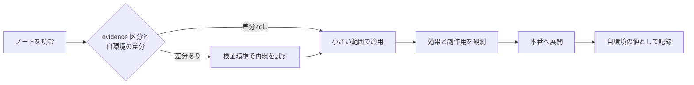
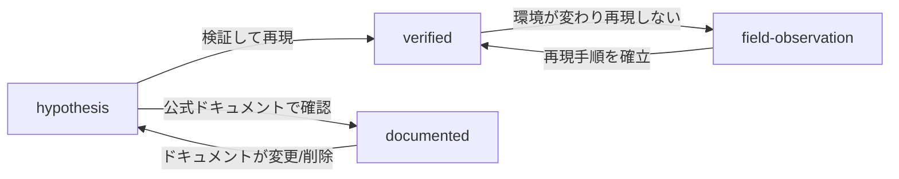

# 知見の分類ポリシー

<!-- lang-switcher:start -->
🌐 [日本語](evidence-policy.md) | [English](../en/evidence-policy.md) | [🏠 リポジトリトップ](../../README.md)
<!-- lang-switcher:end -->

---

## 結論

このリポジトリのすべての知見は、`evidence` という 4 段階の区分を持ちます。読者はこの区分を見て、**その記述をどこまで信頼して自分の環境に適用できるか**を判断してください。区分は frontmatter に機械可読な形で入っており、`make lint` が区分ごとの必須メタデータを検査します。

区分を上げる（信頼度が高いほうへ動かす）には、対応する証跡を追加する必要があります。下げるのは常に自由です。

---

## 4 つの区分

| 区分 | 意味 | 必須メタデータ | 読者側の扱い |
|---|---|---|---|
| `verified` | 記載された環境で著者が実際に再現した | `verified_on`（検証日）+ 本文に検証環境 | その環境条件下では信頼できる。条件が違えば再検証が必要 |
| `documented` | ベンダーまたは AWS の公式ドキュメントに記載がある | `source`（URL または文書名） | 一次情報として扱える。ただし版・リージョン差に注意 |
| `field-observation` | 現場で一度観測したが、再現確認をしていない | 本文に「再現未確認」を明記 | 仮説の手がかり。一般化してはいけない |
| `hypothesis` | 論理的に導いた推論で、未検証 | 本文に「未検証」を明記 | 検証の出発点。判断の根拠にはできない |

---

## なぜこの区分が必要か

技術支援の現場で得られる情報は、性質が大きく異なります。

- 公式ドキュメントに書かれていること
- 検証環境で再現した実測値
- 一度だけ観測されたが原因が特定できていない挙動
- 「たぶんこうだろう」という推論

これらを同じ文体で並べると、読者は区別できません。とくに **一度だけ観測した挙動**を一般的な仕様のように書いてしまうと、読者が誤った前提で設計してしまいます。区分を明示することで、記述の強さと証跡の強さを一致させます。

---

## 数値を書くときの必須条件

`verified` の数値には、必ず測定条件を併記します。条件のない数値は再現できず、再現できない数値は判断に使えません。

| 併記する項目 | 例 |
|---|---|
| ONTAP バージョン | `9.17.1P7D1` |
| リージョン | `ap-northeast-1` |
| 構成 | スループット設定、ボリューム種別、クライアント種別 |
| 測定方法 | ツール、並列度、ファイルサイズ、実行回数 |
| 測定日 | `2026-08-06` |

そして次の区別を必ず明示します。

| 区別すべきもの | 混同したときに起きること |
|---|---|
| サンプル実行 vs 本番見積もり | 単発の測定値が容量計画の根拠として使われる |
| この検証環境 vs 一般的なサービス上限 | 環境固有の値がサービスの仕様として引用される |
| 設計上の考慮事項 vs 法務・コンプライアンス判断 | ガイダンスが法的根拠として扱われる |
| AI の補助的な示唆 vs 最終判断 | 自動判定の結果が人の確認なしに確定する |

---

## 本番に取り入れる前の確認

区分は「どこまで信頼できるか」を示すだけで、**あなたの環境で成り立つことを保証しません。** 本番に入れる前に、区分ごとに次を確認してください。

| 区分 | 本番前に必ず行うこと |
|---|---|
| `verified` | 記載された検証環境と自環境の差分を洗い出す。バージョン・リージョン・構成のいずれかが違えば再測定する |
| `documented` | 出典を実際に開き、現行版でも同じ記述かを確認する。ドキュメントは改訂される |
| `field-observation` | 自環境で再現するかを確認する。再現しない場合、その記述は前提として使えない |
| `hypothesis` | 検証してから使う。未検証の推論を設計の根拠にしない |

### 適用の手順



| # | 手順 | 目的 |
|---|---|---|
| 1 | `evidence` 区分と、記載された環境条件を確認する | どこまでが検証済みかを把握する |
| 2 | 自環境との差分（バージョン / リージョン / 構成 / 負荷）を書き出す | 再検証が必要な範囲を確定する |
| 3 | 本番と同じ構成の検証環境で再現する | 本番で初めて挙動を知る状況を避ける |
| 4 | 影響範囲を限定して適用し、観測する | 想定外の副作用を小さい単位で捕まえる |
| 5 | 自環境での結果を記録する | 次回の判断材料にする。差異があれば [Issue](https://github.com/Yoshiki0705/FSx-for-ONTAP-Adoption-Playbook/issues) で共有を歓迎します |

**不可逆な操作は手順 3 を省略できません。** SnapLock の有効化のように後戻りできない設定は、検証環境での確認を経ずに本番へ入れないでください。

---

## 区分の昇格・降格



| 遷移 | 必要な作業 |
|---|---|
| → `verified` | 検証環境を明記し `verified_on` を追加。再現手順を本文に記載 |
| → `documented` | `source` に URL を追加。逐語引用は 30 語以内、原則は要約 |
| `verified` → `field-observation` | 再現しなくなった経緯を本文に追記。値は消さず履歴として残す |
| → `hypothesis` | 根拠が失われた理由を明記 |

**降格は品質低下ではありません。** 証跡が失われたことを正直に示すほうが、古い `verified` を放置するより読者にとって安全です。

---

## よくある誤解

| 誤解 | 実際 |
|---|---|
| `documented` が最も信頼できる | ドキュメントと実装が乖離する場合があります。`verified` は自分の環境での事実です |
| `verified` なら本番でも同じ結果になる | 検証環境での実測です。本番の構成・負荷が違えば結果は変わります |
| `field-observation` は載せるべきでない | 載せる価値があります。ただし一般化せず、再現未確認であることを明示します |
| 区分を上げないと価値がない | `hypothesis` として検証の出発点を共有することにも価値があります |

---

## frontmatter の書き方

```yaml
---
title: SnapMirror の初期同期でスループットが出ない場合の切り分け
lifecycle: [migrate]
domains: [performance]
evidence: verified
verified_on: 2026-08-06
ontap_version: 9.17.1P7D1
region: ap-northeast-1
lang: ja
---
```

`make lint` が検査する内容:

- `evidence: verified` のとき `verified_on` があり、未来日付でないこと
- `evidence: documented` のとき `source` があること
- `evidence: field-observation` のとき本文に「再現未確認」相当の記述があること
- `evidence: hypothesis` のとき本文に「未検証」相当の記述があること
- `lifecycle` / `domains` の値が定義済みの語彙に含まれること

---

## 関連ドキュメント

- [ナビゲーションガイド](navigation.md)
- [CONTRIBUTING.md](../../CONTRIBUTING.md)
- [AGENTS.md](../../AGENTS.md) — AI エージェント向けの規約
- [リポジトリトップ](../../README.md)

---

<!-- lang-switcher:start -->
🌐 [日本語](evidence-policy.md) | [English](../en/evidence-policy.md) | [🏠 リポジトリトップ](../../README.md)
<!-- lang-switcher:end -->
