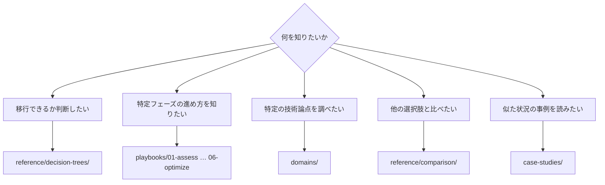

# ナビゲーションガイド

<!-- lang-switcher:start -->
🌐 [日本語](navigation.md) | [English](../en/navigation.md) | [🏠 リポジトリトップ](../../README.md)
<!-- lang-switcher:end -->

---

## 結論

入口は 3 つです。**初見なら [自分の環境から引く](#自分の環境から引く) から始めてください。** 構成の特徴を選べば読む順序が決まります。

プロジェクトの進行に沿って引くなら `playbooks/`、論点から引くなら `domains/`。どちらから入っても同じノートに到達します。選択肢が複数あって決めきれない場合は `reference/decision-trees/` から始めてください。

---

## どこから読むか

---

## 自分の環境から引く

上の分岐は「何を知りたいか」から入ります。**「自分の構成だとどこを読むべきか」**で引きたい場合はこちらを使ってください。左端が自環境の特徴、右が読む順序です。

| 自環境の特徴 | 最初に読む | 次に読む |
|---|---|---|
| 移行元が ONTAP（オンプレミス / 他クラウド） | [移行方式 決定ツリー](reference/decision-trees/migration-method.md) | [評価](playbooks/01-assess/) → [設計](playbooks/02-design/) |
| 移行元が Windows ファイルサーバー（SMB / NTFS ACL 保持が要件） | [移行方式 決定ツリー](reference/decision-trees/migration-method.md) | [マルチプロトコル・ID](domains/multiprotocol-identity/) |
| 移行元が ONTAP 以外の NAS | [移行方式 決定ツリー](reference/decision-trees/migration-method.md) | [評価](playbooks/01-assess/) |
| NFS と SMB を同じデータに対して使う | [セキュリティスタイルが権限評価のモデルを決める](domains/multiprotocol-identity/notes/security-style-and-permission-evaluation.md) | [セキュリティ・ガバナンス](domains/security-governance/) |
| Active Directory 連携が前提 | [マルチプロトコル・ID](domains/multiprotocol-identity/) | [設計](playbooks/02-design/) |
| 新規構築（移行元なし） | [設計](playbooks/02-design/) | [構築](playbooks/04-build/) → [運用](playbooks/05-operate/) |
| すでに稼働中で、性能を詰めたい | [性能](domains/performance/) | [最適化](playbooks/06-optimize/) |
| すでに稼働中で、コストを見直したい | [コスト](domains/cost/) | [最適化](playbooks/06-optimize/) |
| 上限値に当たらないか確認したい | [上限値・クォータ](reference/limits/) | [設計](playbooks/02-design/) |

**どの行でも、読んだ内容をそのまま本番に適用しないでください。** 各ノートの `evidence` 区分を確認し、[本番に取り入れる前の確認](evidence-policy.md#本番に取り入れる前の確認) の手順を通してください。

---

## ライフサイクル軸 — `playbooks/`

プロジェクトの進行に沿った入口です。前のフェーズの出力が次のフェーズの入力になります。

| # | モジュール | 主な出力 | 次に読む |
|---|---|---|---|
| 01 | [評価](playbooks/01-assess/) | 現行インベントリ、制約リスト | 02 設計 |
| 02 | [設計](playbooks/02-design/) | 構成決定、不可逆項目の確定 | 03 移行 |
| 03 | [移行](playbooks/03-migrate/) | 移行計画、切替手順、ロールバック手順 | 04 構築 |
| 04 | [構築](playbooks/04-build/) | IaC、自動化、構築後検証 | 05 運用 |
| 05 | [運用](playbooks/05-operate/) | 監視設計、Runbook | 06 最適化 |
| 06 | [最適化](playbooks/06-optimize/) | 性能・コストの改善結果 | — |

---

## テーマ軸 — `domains/`

論点から引く入口です。ライフサイクル横断で参照されます。

| モジュール | 典型的な質問 |
|---|---|
| [データ保護](domains/data-protection/) | Snapshot をどう設計するか / 本当に復旧できるか |
| [データ活用](domains/data-utilization/) | コピーを増やさず分析・AI に使えるか |
| [セキュリティ・ガバナンス](domains/security-governance/) | 暗号化・監査・権限をどう設計するか |
| [性能](domains/performance/) | スループットはどこで決まり、どこで共有されるか |
| [コスト](domains/cost/) | 見積もりと実測がなぜずれるか |
| [マルチプロトコル・ID](domains/multiprotocol-identity/) | NFS と SMB で権限がなぜ食い違うか |

---

## 横断リファレンス — `reference/`

| ディレクトリ | 使う場面 |
|---|---|
| [決定ツリー](reference/decision-trees/) | 選択肢が複数あり、どれを選ぶか決めたい |
| [比較マトリクス](reference/comparison/) | 他の選択肢とのトレードオフを整理したい |
| [上限値・クォータ](reference/limits/) | 設計が上限に当たらないか確認したい |
| [用語集](reference/glossary/) | ONTAP / AWS の用語の定義を確認したい |

---

## 事例 — `case-studies/`

[Case Studies](case-studies/) には、技術支援の現場で得た知見を**一般化された教訓**として載せています。企業名・組織名・実際の識別子・組織が特定できる構成は一切含みません。

事例は次の形式で書かれています。

| セクション | 内容 |
|---|---|
| 状況 | 業種と規模帯のみ（例: 製造業 / 数百 TB 規模） |
| 課題 | 何が問題だったか |
| 検討した選択肢 | 採用しなかった案とその理由 |
| 判断 | 何を選び、なぜそう判断したか |
| 結果 | 何が起きたか（想定どおりでなかった点も含む） |
| 一般化できる教訓 | 他の環境に持ち出せる部分 |

---

## 知見の信頼度をどう読むか

各ノートの frontmatter に `evidence` 区分があります。**これを確認せずに引用しないでください。**

| 区分 | 一言で |
|---|---|
| `verified` | 記載環境で著者が再現済み |
| `documented` | 公式ドキュメントに記載あり |
| `field-observation` | 一度観測、再現未確認。一般化不可 |
| `hypothesis` | 未検証の推論 |

詳細は [知見の分類ポリシー](evidence-policy.md) を参照してください。

---

## よくある誤解

| 誤解 | 実際 |
|---|---|
| `playbooks/` と `domains/` は別々の情報を持つ | 同じノートを 2 つの軸から参照しています。重複ではなく多重の動線です |
| 数値はそのまま自分の環境に使える | 数値は測定環境とセットです。条件が違えば再検証が必要です |
| 事例は具体的な構成が載っている | 意図的に抽象化しています。組織が特定できる情報は載せません |
| 上限値は常に最新 | `reference/limits/` は検証日付きです。日付が古い項目は再確認してください |

---

## 関連ドキュメント

- [知見の分類ポリシー](evidence-policy.md)
- [CONTRIBUTING.md](../../CONTRIBUTING.md) — 執筆規約
- [AGENTS.md](../../AGENTS.md) — AI エージェント向けの規約
- [llms.txt](../../llms.txt) — LLM 向けリポジトリマップ

---

<!-- lang-switcher:start -->
🌐 [日本語](navigation.md) | [English](../en/navigation.md) | [🏠 リポジトリトップ](../../README.md)
<!-- lang-switcher:end -->
