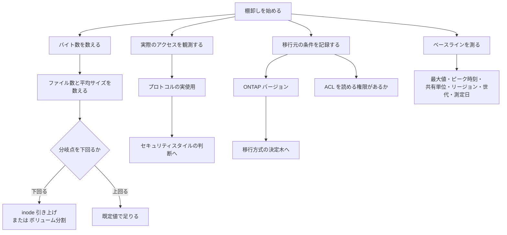

# 容量が余っていても書けなくなる

[🏠 リポジトリトップ](../../../../../README.md) | [Playbook 01 — 現状把握](../README.md)

---

## 結論

**バイト数だけを棚卸しすると、容量が余っているのに書き込めない状態になります。**

ボリュームはファイル・ディレクトリ・Snapshot コピーを inode（ファイルポインタ）で数えます。**inode を使い切ると、空き容量があってもそのボリュームには新しいファイルを作れません。**

そして**症状が紛らわしい**ことを実測で確認しました。エラーは `No space left on device` で容量不足を指しますが、容量は空いています。**止まるのは作成だけで、既存ファイルへの書き込みは続きます。** 詳細は [使い切ったときに何が起きるか](#使い切ったときの挙動) にあります。

既定値は **32 KiB あたり 1 個**です。そして**その増え方はドキュメントの記載と実測が食い違います。** ドキュメントは 648 GiB 以上で 21,251,126 個に頭打ちになると記載していますが、検証環境ではサイズに比例して増えていました。差分は [どのくらいの平均ファイルサイズで詰まるのか](#詰まり始める平均ファイルサイズ) にあります。

**どちらの前提でも結論は同じです。数値を仮定せず、自環境の `FilesCapacity` を読んでください。** 小さいファイルが多い環境では、容量より先に inode が尽きることがあります。

> **Evidence**: `documented` — inode の既定値・上限・挙動は AWS 公式ドキュメントの記載に基づきます。
> 後述の平均ファイルサイズは**公開されている既定値からの算術**であり、実測値ではありません。
> 自環境の値を測る手順は「[自分の環境で確かめる](#自環境での確認手順)」にあります。

---

## 詰まり始める平均ファイルサイズ

**ドキュメントの記載と実測が食い違う箇所です。両方を示します。**

AWS ドキュメントは「**648 GiB 以上のボリュームは既定でいずれも 21,251,126 個**」と記載しています。この記載どおりなら、大きいボリュームほど 1 ファイルあたりの余裕がなくなり、平均ファイルサイズが小さい環境では容量より先に inode が尽きます。

**しかし実測では上限に達していませんでした。** 検証環境ではボリュームサイズに比例して増えています。

| ボリューム | サイズ | 実測 `FilesCapacity` | バイト / inode |
|---|---|---|---|
| 100 GiB の FlexVol（2 本） | 107,374,182,400 B | **3,112,959** | 34,493 |
| 1 TiB の FlexVol | 1,099,511,627,776 B | **31,876,709** | 34,493 |
| 2 TiB の FlexVol | 2,199,023,255,552 B | **63,753,417** | 34,493 |
| 約 1.85 TiB の FlexGroup（3 構成要素） | 2,034,678,398,976 B | **58,988,760** | 34,493 |

**2 TiB と 1 TiB の inode 数の比はちょうど 2.0 で、どちらも 648 GiB を超えています。** つまりこの環境では上限で頭打ちになっていません。

値は `サイズ × 0.95 ÷ 32 KiB` とほぼ一致します（誤差 1〜24 個）。**約 5% の予約を除いた容量に対して 32 KiB あたり 1 個**、という既定比率がサイズによらず適用されている形です。

> **この節の区分**: `verified`（検証日 2026-08-06）。**このノート全体の `documented` 区分の外にあります。**
> 検証環境は `ap-northeast-1`、`SINGLE_AZ_1`（第 1 世代）、HA ペア 1 組、スループット 128 MBps、
> SSD 1,024 GiB、SSD IOPS 3,072（`AUTOMATIC`）。**この検証の時点では ONTAP バージョンを取得していません**
> （`DescribeFileSystems` は `FileSystemTypeVersion` を返しません。**ONTAP REST API 経由なら取得できます**。
> 別の検証で `9.17.1P7D1` を確認しました）。測定は CloudWatch の
> `FilesCapacity`（`Maximum`）を読む読み取り専用の観測のみで、inode を使い切る試験は行っていません。
> 値の記録は [上限値・クォータ](../../../reference/limits/) にあります。

**設計上の結論は変わりません。** どちらの前提でも **inode は有限で、使い切ると空き容量があっても書けません。** 変わるのは「どのくらいで詰まるか」だけです。

**したがって数値を仮定せず、自環境の `FilesCapacity` を読んでください。** 手順は [自分の環境で確かめる](#自環境での確認手順) にあります。上限に達する挙動を前提に設計すると過剰にボリュームを分割することになり、比例する挙動を前提にすると小さいファイルが多い環境で足りなくなります。**どちらに転んでも、測れば分かります。**

inode は手動で増やせますが、上限があります。

| 項目 | 値 |
|---|---|
| 既定の比率 | 32 KiB あたり 1 個（ドキュメントでは 648 GiB まで、実測では上限に達さず） |
| 引き上げ可能な比率 | **4 KiB あたり 1 個** |
| 1 ボリュームの上限 | **20 億個** |

**20 億個は絶対上限です。** 50 TiB のボリュームで 20 億個まで引き上げても、平均ファイルサイズ約 27 KiB が分岐点になります。それを下回るならボリュームの分割が必要です。

引き上げは ONTAP CLI の `volume modify` で行います。常に最大値を使う設定（`-files-set-maximum true`）は advanced モードが必要です。**作成時の既定では有効になっていません。**

---

## 使い切ったときの挙動

**実測しました。** 20 MiB（FlexVol の最小サイズ）のボリュームを NFSv3 でマウントし、ファイルを作り続けました。

| 観測 | 値 |
|---|---|
| 総 inode 数 | 566 |
| **作成直後に使用済み** | **96**（空のボリュームでも 0 ではありません） |
| 作成できたファイル数 | 470 |
| 使い切った時点の `df -i` | `IUsed 566 / IFree 0 / IUse% 100%` |
| **同時点の `df -h`** | **19M 中 448K 使用（3%）** |
| 新規ファイルの作成 | **失敗**: `No space left on device` |
| 既存ファイルへのデータ書き込み | **成功** |

**3 つとも運用に効きます。**

1. **エラーが間違ったリソースを指します。** `No space left on device`（`ENOSPC`）は容量不足の文面です。**容量を見て「空いている」と判断すると原因に到達できません。**
2. **症状が部分的です。** 作成は止まりますが書き込みは続くため、アプリケーションによっては一部の操作だけが失敗します。「一部だけ動く」障害は原因の切り分けが難しくなります。
3. **空のボリュームでも inode は消費されています。** 96 個が最初から使われていました。小さいボリュームでは無視できない割合です。

> **この節の区分**: `verified`（検証日 2026-08-06）。検証環境は `ap-northeast-1`、`SINGLE_AZ_1`
> （第 1 世代）、HA ペア 1 組、スループット 128 MBps、SSD 1,024 GiB、NFSv3 でマウント。
> **この検証の時点では ONTAP バージョンを取得していません**（ONTAP REST API 経由なら取得できます）。
> 記録は [上限値・クォータ](../../../reference/limits/) にあります。

**なお 20 MiB での比率は大きいボリュームと一致しません。** 37,052 B/inode であり、100 GiB〜2 TiB で観測した 34,493 B/inode とは異なります。**上の比率表は最小サイズまで外挿できません。**

---

## inode を消費する Snapshot

inode が数えるのは**ファイル・ディレクトリ・Snapshot コピー**です。Snapshot の保持数を増やすと inode も消費します。

保持設計を容量だけで決めていると、この分が見落とされます。保持数の上限と容量の関係は [Snapshot があることと復旧できることは別](../../../domains/data-protection/notes/snapshots-are-not-a-recovery-plan.md#上限と保持期間) にあります。

**ディレクトリあたりのファイル数にも上限があります。** 1 つのディレクトリに大量のファイルを置く構成では、inode とは別にこの上限に当たります。移行ツールがここで失敗することがあります。

---

## 「後で戻せない判断」から逆算する棚卸し項目

**棚卸しは項目を増やすことではありません。** 後の工程で値によって判断が変わるものだけが、測る価値のある項目です。

逆に言えば、**測らなかった項目が不可逆な設定として現れます。**

| 棚卸し項目 | これが決める判断 | 参照 |
|---|---|---|
| ファイル数と平均ファイルサイズ | inode の既定値で足りるか、ボリュームを分割するか | 本ノート上記 |
| 1 ディレクトリあたりのファイル数 | 移行ツールが完走するか | 本ノート上記 |
| 実際に使われているプロトコル | **ボリュームのセキュリティスタイル。** 権限評価の仕組みが変わります | [セキュリティスタイルと権限評価](../../../domains/multiprotocol-identity/notes/security-style-and-permission-evaluation.md) |
| 移行アカウントが ACL を読めるか | ACL が欠けたまま「成功」で終わらないか | [ACL 保持は権限の問題](../../03-migrate/notes/preserving-acls-during-migration.md#必要な特権) |
| 移行元の ONTAP バージョン | SnapMirror が使えるか、先にアップグレードが必要か | [移行方式の決定木](../../../reference/decision-trees/migration-method.md#バージョン互換性の確認移行元が-ontap-の場合) |
| リージョンと世代 | **スループットと IOPS の上限そのもの。** 第 1 世代は 4 つのリージョン以外で半分になります | [スループットは 1 つの値で決まらない](../../../domains/performance/notes/where-throughput-is-determined-and-shared.md#世代と構成とリージョンで変わる上限) |
| メタデータの量 | SSD 容量。階層化ポリシーに関係なく SSD に残ります | [監視は平均値で失敗する](../../05-operate/notes/monitoring-fails-on-averages.md#階層化ポリシー-all-でも使われる-ssd) |
| 単一名前空間で必要なスループット | FlexVol で足りるか FlexGroup が必要か | [共有される単位は HA ペア](../../../domains/performance/notes/where-throughput-is-determined-and-shared.md#共有される単位は-ha-ペア) |
| Active Directory の依存 | SVM の参加要件。ドメイン名・DNS・OU・管理者グループ | [本番投入前レビュー](../../04-build/checklists/pre-production-review.md) |
| 性能のベースライン | 移行後の「遅くなった」を検証可能にする | 本ノート下記 |

---

## 「設定されている」と「使われている」の違い

**プロトコルの棚卸しを設定情報から作ると外れます。** 有効になっているが誰も使っていない共有、逆に設定台帳に載っていない経路の両方が出ます。

セキュリティスタイルの選択は実際のアクセス経路で決まります。**両方のプロトコルから同じデータに触るかどうか**が判断の分かれ目であり、これは設定ではなく実際のアクセスを見ないと分かりません。

---

## 比較可能な形での性能ベースラインの取得

移行後に「遅くなった」と言われたとき、**比較対象がなければ検証できません。** ベースラインは次の形で残します。

| 記録する項目 | 理由 |
|---|---|
| 平均ではなく最大値 | 平均は飽和を隠します。理由は [監視は平均値で失敗する](../../05-operate/notes/monitoring-fails-on-averages.md) にあります |
| ピーク時間帯の値と、その時刻 | 平均値だけでは再現条件が分かりません |
| 共有単位・ボリューム単位の内訳 | 全体値では原因のボリュームが特定できません |
| 測定時のリージョンと世代 | 上限そのものが変わるため、条件を書かない数値は比較に使えません |
| 測定日 | 構成変更との対応を取るため |

**「条件を書かない数値は比較に使えない」がこのリポジトリ全体の方針です。** 詳細は [知見の分類ポリシー](../../../evidence-policy.md) にあります。

---

## 棚卸しの流れ

---

## 自環境での確認手順

**最初に測るべきは平均ファイルサイズです。** 分岐点との比較だけで、ボリューム設計が変わるかどうかが決まります。

| # | 手順 | 確認できること |
|---|---|---|
| 1 | 移行元の総バイト数と総ファイル数を数え、割る | 平均ファイルサイズ。**上の表と比べるだけで判断できます** |
| 2 | 最もファイル数が多いディレクトリを 1 つ特定する | ディレクトリあたりの上限に近いか |
| 3 | 移行先で `FilesCapacity` と `FilesUsed` を見る | 実際の inode 消費。コンソールの「Available files (inodes)」でも見られます |
| 4 | 一定期間アクセスを観測し、プロトコル別に集計する | **設定ではなく実使用。** セキュリティスタイルの判断材料 |
| 5 | 移行アカウントで ACL が読めるかを試す | 「エラーなし」で ACL が欠ける事故を防げます |
| 6 | ピーク時間帯のスループットと IOPS を最大値で記録する | 移行後の比較基準 |
| 7 | リージョンと世代を記録する | 上限そのものが変わります |

手順 1 と 2 は移行元で完結し、FSx for ONTAP を作る前に実行できます。**この 2 つだけでも、後戻りの大きい設計判断を先に潰せます。**

---

## よくある誤解

| 誤解 | 実際 |
|---|---|
| 容量を見積もれば棚卸しは足りる | inode を使い切ると、**空き容量があっても新しいファイルを作れません** |
| `No space left on device` は容量不足を意味する | **inode 枯渇でも同じエラーです。** 容量は空いていることがあります |
| inode が尽きると何も書けなくなる | **既存ファイルへの書き込みは続きます。** 止まるのは作成だけです |
| 空のボリュームの inode 使用数は 0 | 実測では 96 個が最初から使われていました |
| ボリュームを大きくすれば inode も増える | **ドキュメントは 648 GiB で頭打ちと記載し、実測は比例して増えました。** 仮定せず自環境で読んでください |
| inode は後からいくらでも増やせる | 4 KiB あたり 1 個が上限、1 ボリューム **20 億個**が絶対上限です |
| inode はファイルの数 | ファイル・ディレクトリ・**Snapshot コピー**を数えます |
| 常に最大 inode を使う設定が既定 | 既定ではありません。ONTAP CLI で明示的に設定します（advanced モード） |
| プロトコルの棚卸しは設定情報で足りる | 有効だが未使用の共有と、台帳にない経路の両方が出ます |
| 階層化ポリシーを `All` にすれば SSD の見積もりは不要 | メタデータは常に SSD に残ります |
| ベースラインは平均値で十分 | 平均は飽和を隠します。最大値とピーク時刻が必要です |
| 数値だけ記録すれば比較できる | リージョン・世代・測定日がないと比較に使えません |

---

## 参照した一次情報

| 論点 | 出典 |
|---|---|
| inode の定義、32 KiB あたり 1 個の既定値、**648 GiB 以上で 21,251,126 個に固定という記載**（実測と食い違う箇所）、4 KiB あたり 1 個までの引き上げ、20 億個の上限、Snapshot コピーも数えること | [AWS: Volume storage capacity](https://docs.aws.amazon.com/fsx/latest/ONTAPGuide/volume-storage-capacity.html) |
| 実測した `FilesCapacity`（100 GiB / 1 TiB / 2 TiB / FlexGroup）と検証環境 | 実測。[上限値・クォータ](../../../reference/limits/) に記録 |
| inode を使い切ると書き込めないこと、既定値の確認と手動引き上げが必要な条件 | [AWS: Your volume has insufficient storage capacity](https://docs.aws.amazon.com/fsx/latest/ONTAPGuide/low-volume-capacity.html) |
| `volume modify` による引き上げ手順、`-files-set-maximum` が advanced モードであること | [AWS: Updating the maximum number of files on a volume](https://docs.aws.amazon.com/fsx/latest/ONTAPGuide/increase-volume-max-files.html) |
| `FilesCapacity` / `FilesUsed` メトリクスとコンソールでの確認方法 | [AWS: Monitoring a volume's file capacity](https://docs.aws.amazon.com/fsx/latest/ONTAPGuide/view-volume-file-capacity.html) |
| ディレクトリあたりのファイル数上限に移行ツールが当たること | [AWS: Troubleshooting issues with DataSync tasks](https://docs.aws.amazon.com/datasync/latest/userguide/troubleshooting-tasks.html) |
| メタデータが階層化ポリシーに関係なく SSD に残ること | [AWS: Migrating to FSx for ONTAP using NetApp SnapMirror](https://docs.aws.amazon.com/fsx/latest/ONTAPGuide/migrating-fsx-ontap-snapmirror.html) |

---

## 関連ドキュメント

- [Playbook 01 — 現状把握](../README.md) — このモジュールのハブ
- [移行方式の決定木](../../../reference/decision-trees/migration-method.md) — 棚卸しの結果から方式を選ぶ
- [セキュリティスタイルと権限評価](../../../domains/multiprotocol-identity/notes/security-style-and-permission-evaluation.md) — プロトコルの実使用から決まる判断
- [ACL 保持は権限の問題であってツールの問題ではない](../../03-migrate/notes/preserving-acls-during-migration.md) — 移行前に確認する権限
- [スループットは 1 つの値で決まらない](../../../domains/performance/notes/where-throughput-is-determined-and-shared.md) — リージョンと世代が上限を変える
- [監視は平均値で失敗する](../../05-operate/notes/monitoring-fails-on-averages.md) — ベースラインを最大値で取る理由
- [上限値・クォータ](../../../reference/limits/) — 出典と検証日付きの上限値
- [知見の分類ポリシー](../../../evidence-policy.md)

---

[🏠 リポジトリトップ](../../../../../README.md) | [Playbook 01 — 現状把握](../README.md)
