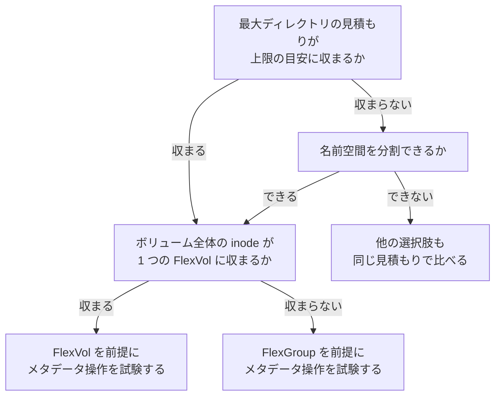

# 高ファイル数のワークロードに Amazon FSx for NetApp ONTAP は合うか？

総ファイル数だけでは決まりません。ボリューム全体の inode、最大ディレクトリの大きさ、メタデータ操作の集中を別々に見積もり、それぞれが収まるかで判断します。

<!-- lang-switcher:start -->
🌐 [日本語](file-count-fit-depends-on-namespace-shape.md) | [English](../../../../en/playbooks/01-assess/notes/file-count-fit-depends-on-namespace-shape.md) | [🏠 リポジトリトップ](../../../../../README.md)
<!-- lang-switcher:end -->

## このノートで学べること

- 高ファイル数かどうかが総数ではなく名前空間の形で決まること
- 判断の前に揃える 4 つの見積もりと、それぞれの参照先
- FSx for ONTAP が合う条件と、他の選択肢を検討する条件、FSx for ONTAP 自身の制約

## このノートが答えないこと

- 他のサービスの上限値と性能値（名前と公式資料へのリンクだけを載せます）
- FSx for ONTAP でのメタデータ操作の実測値（このリポジトリでは測定していません）
- S3 API で収集したデータを origin に置き FlexCache で配布する構成での挙動（下の「未測定の範囲と追跡先」を参照）

## 前提レベル

intermediate

## 本文

[🏠 リポジトリトップ](../../../../../README.md) | [Playbook 01 — 現状把握](../README.md)

> **Evidence**: `documented` — 判断の観点は NetApp の Technical Report（以下 TR、ONTAP 一般の文書）、FSx for ONTAP の値は AWS 文書の記載に基づきます。TR の値と挙動が FSx for ONTAP で同じかは未確認です。
> TR は NetApp「High-file-count NAS workloads : ONTAP Technical Reports」（docs.netapp.com、PDF 生成日 2026-09-30、版番号・改訂履歴の記載なし）です。節ごとの出典は各表と「参照した一次情報」にあります。

---

### 結論

**総ファイル数だけでは、高ファイル数のワークロードに FSx for ONTAP が合うかは決まりません。** TR は、すべてのワークロードが高ファイル数になる特定のファイル数の閾値はないと書いています。同じ数百万ファイルでも、多数のディレクトリに分かれている場合と 1 つのディレクトリに集まっている場合とで振る舞いが違います。

> "There is no specific file-count threshold at which every workload becomes a high-file-count workload."
> — TR、ページ「NetApp ONTAP High File Count Workloads for NAS volumes」の節「What is meant by a high-file-count workload?」

判断には 4 つの見積もりを別々に揃えます。ボリューム全体の inode は [容量が余っていても書けなくなる](counting-bytes-is-not-counting-files.md)、最大ディレクトリは [ディレクトリ 1 つに置けるファイル数はどこで決まるのか](../../../domains/performance/notes/directory-size-is-capped-separately-from-file-count.md) が扱います。

---

### 高ファイル数かどうかを決める要素

| 要素（TR の列挙） | 効く先 |
|---|---|
| ボリュームのファイル・ディレクトリの数 | inode の上限と、inode ファイルが使う容量 |
| 1 つのディレクトリに集まる名前の数 | maxdir-size と、列挙のコスト |
| 作成・オープン・列挙・改名・削除の頻度 | ノードの CPU とメモリ、クライアントのレイテンシ |
| ファイル名とパスの長さ、文字種、プロトコルが作る代替名 | 1 ディレクトリに入る名前の数 |
| アクセスがディレクトリ・FlexGroup の構成要素・ノードに分散しているか | 並列性と、1 ノードへの集中 |
| アプリケーションが名前空間全体を走査・一覧する頻度 | 列挙のコスト |
| Snapshot コピーの数と保持期間 | inode と容量、メタデータの保持 |

出典: TR、ページ「[NetApp ONTAP High File Count Workloads for NAS volumes](https://docs.netapp.com/us-en/ontap-technical-reports/high-file-count-workloads/high-file-count-workloads-01-overview.html)」の節「What is meant by a high-file-count workload?」。右の列はこのノートでの整理です。

---

### 判断の前に揃える 4 つの見積もり

| 見積もり（TR） | 測る場所 | 参照 |
|---|---|---|
| ライフサイクル全体でのファイルシステムのオブジェクト総数 | 移行元のファイル数・ディレクトリ数と増加率 | [容量が余っていても書けなくなる](counting-bytes-is-not-counting-files.md) |
| 最大のディレクトリのピーク時のエントリ数 | 移行元で最も大きいディレクトリ | [ディレクトリ 1 つに置けるファイル数はどこで決まるのか](../../../domains/performance/notes/directory-size-is-capped-separately-from-file-count.md) |
| 作成・検索・列挙・削除のピーク時のレート | アプリケーションの処理と、走査するジョブ（バックアップ・スキャナ） | 下の「未測定の範囲と追跡先」 |
| ユーザーデータ・inode・ディレクトリ・index・Snapshot コピー・増加分の容量 | 移行元の容量と保持設計 | [容量が余っていても書けなくなる](counting-bytes-is-not-counting-files.md#3-つの出典による-inode-の値の並置) |

出典: TR、ページ「[Planning approach](https://docs.netapp.com/us-en/ontap-technical-reports/high-file-count-workloads/high-file-count-workloads-13-planning.html)」の冒頭。

TR の推奨事項のページは、ボリュームの inode の見積もりと最大ディレクトリの見積もりを別々に持ち、片方から他方を導かないよう書いています。多数のディレクトリに分かれた名前空間は大きいディレクトリなしに inode を使い切り、1 つの平坦なディレクトリは inode が数百万残っていても maxdir-size に達します。ACL が多い名前空間では、ファイル数とディレクトリ数の見積もりの最大 2 倍から始めるよう書いています（節「Size maxfiles and maxdir-size independently」）。

---

### FSx for ONTAP が合う条件

| 条件 | 根拠 | 確認方法 |
|---|---|---|
| 名前空間を wide または deep に分割でき、最大ディレクトリの見積もりが既定 320 MB の目安に収まる | TR はディレクトリの分割を推奨しています（推奨事項のページの節「Prefer a sharded directory structure」）。FSx for ONTAP の既定 320 MB は AWS Prescriptive Guidance の記載です | 移行元の最大ディレクトリを [名前の数の表](../../../domains/performance/notes/directory-size-is-capped-separately-from-file-count.md#1-ディレクトリに入る名前の数の目安) と比べる |
| SMB と NFS で同じデータを扱い、ACL や named stream も保持する。ただしそれらも inode を使うので見積もりに含める | TR は ACL と named stream も inode として数えると書いています（ページ「High file counts and inode capacity in ONTAP」の節「How an inode count increments」）。プロトコルの条件は [ファイルストレージの選択肢の比較](../../../reference/comparison/file-storage-options.md#fsx-for-ontap-が適合する条件と適合しない条件) | inode の見積もりに ACL・named stream・ディレクトリを足す |
| ボリューム全体のファイル数が 1 つの FlexVol を超える見込みで、FlexGroup に分散できる | TR は総容量・ファイル数・並列性が要るときの FlexGroup を挙げています（推奨事項のページの節「Select the appropriate volume architecture」）。FSx for ONTAP は FlexGroup を提供します（[AWS: Managing FSx for ONTAP volumes](https://docs.aws.amazon.com/fsx/latest/ONTAPGuide/managing-volumes.html)） | [スループットは 1 つの設定値では決まらない](../../../domains/performance/notes/where-throughput-is-determined-and-shared.md) で配置と共有の単位を確認する |
| Snapshot と SnapMirror で多数の小さいファイルを保護したい。そのうえで変更の多さを見積もる | TR は SnapMirror がファイルデータに加えて変更されたメタデータも複製するため、作成・削除・改名が多いと転送が重くなりうると書いています（ページ「NetApp ONTAP High File Count Workloads for NAS volumes」の節「High-file-count challenges」） | 1 日あたりの作成・削除・改名の数を移行元で数える |

### 他の選択肢を検討する条件

| 条件 | 根拠 | 確認方法 |
|---|---|---|
| アプリケーションが 1 つの平坦なディレクトリをやめられず、名前の見積もりが上限の目安を超える（日本語名なら目安は約半分） | TR は maxdir-size の引き上げを認めますが、全件の列挙のコストは残ると書いています（ページ「Impact of maxdir-size」の節「Performance impact」） | 最大ディレクトリの名前の数と形を数え、分割できない理由をアプリケーション側で確認する |
| メタデータ操作が 1 つのディレクトリに集中し、ノードを増やしても並列化しない | TR は 1 つの論理ディレクトリへの操作を FlexGroup が自動では並列化しないと書いています（推奨事項のページの節「Select the appropriate volume architecture」） | ピーク時に 1 つのディレクトリへ向かう操作の割合を移行元で測る |
| inode の上限・使用数・最大ディレクトリを継続して監視する運用を持てない | FSx for ONTAP では既定の inode 数は最大値ではなく、上限は手動で引き上げます（[AWS: Updating the maximum number of files on a volume](https://docs.aws.amazon.com/fsx/latest/ONTAPGuide/increase-volume-max-files.html)） | inode と最大ディレクトリの監視、上限の引き上げの担当と手順があるかを確認する |
| 必要なのが NFSv4 系だけで、Windows・ACL・`nconnect` が要らない | [ファイルストレージの選択肢の比較](../../../reference/comparison/file-storage-options.md#fsx-for-ontap-が適合する条件と適合しない条件) の条件 | 移行元のプロトコルと ACL の実際の使用を観測する |

他の選択肢の上限は、このノートでは数値を書きません。Amazon EFS は [Amazon EFS quotas](https://docs.aws.amazon.com/efs/latest/ug/limits.html)、Amazon FSx for OpenZFS は [What is Amazon FSx for OpenZFS?](https://docs.aws.amazon.com/fsx/latest/OpenZFSGuide/what-is-fsx.html)、選び方の全体は [Choosing an AWS storage service](https://docs.aws.amazon.com/decision-guides/latest/decision-guides/choosing-aws-storage-service.html) と、このリポジトリの [ファイルストレージの選択の決定木](../../../reference/decision-trees/file-storage-selection.md) にあります。どの選択肢でも、上の 4 つの見積もりを同じ形で当てはめ、その選択肢での値はそれぞれの公式資料で確認します。

---

### FSx for ONTAP 自身の制約

| 制約 | 出典と区分 |
|---|---|
| 既定の inode 数は最大値ではなく、増やすには手動の引き上げが要る | AWS 文書（`documented`） |
| 1 ボリュームの inode は 20 億個まで。TR の FlexVol の絶対上限 2,040,109,451 個との差は未確認 | AWS 文書（`documented`）、差は未確認 |
| maxdir-size はボリューム単位の設定で、全ディレクトリに共通 | AWS Prescriptive Guidance（`documented`） |
| maxdir-size を上げたあと下げられる条件は、AWS Prescriptive Guidance と TR で書き方が違う | [ディレクトリ 1 つに置けるファイル数はどこで決まるのか](../../../domains/performance/notes/directory-size-is-capped-separately-from-file-count.md#上限の引き上げと-2-つの記載の差) |
| inode ファイルとディレクトリファイルはボリューム容量を使い、削除しても縮まない | TR（ONTAP 一般、`documented`）。FSx for ONTAP では未確認 |
| TR が挙げるリリース別の機能（9.13.1 の既定 inode 数の変更、9.14.1 の 320 MB 既定、9.17.1 の index の配置）が自分のファイルシステムで使えるか | ONTAP バージョン次第で、FSx for ONTAP では未確認 |

---

### 選び方

次の図は、下の表と同じ内容を図にしたものです。同じ内容を表でも書きます。



| 問い | 答え | 次に確かめること |
|---|---|---|
| 最大ディレクトリの見積もりが上限の目安に収まるか | 収まる | ボリューム全体の inode が 1 つの FlexVol に収まるか |
| 同上 | 収まらない | 名前空間を分割できるか |
| 名前空間を分割できるか | できる | ボリューム全体の inode が 1 つの FlexVol に収まるか |
| 同上 | できない | 他の選択肢も同じ 4 つの見積もりで比べる |
| ボリューム全体の inode が 1 つの FlexVol に収まるか | 収まる | FlexVol を前提に、メタデータ操作を試験する |
| 同上 | 収まらない | FlexGroup を前提に、メタデータ操作を試験する |

どの終端も「決まり」ではなく、次に確かめることです。FlexVol と FlexGroup のどちらでも、1 つのディレクトリへの集中は残ります。

---

### 未測定の範囲と追跡先

このリポジトリには、FSx for ONTAP でのメタデータ操作と列挙の実測がありません。TR は、逐次の帯域の試験ではこの挙動を予測できないので、作成・検索・stat・改名・削除・列挙をキャッシュの冷えた状態と温まった状態で試験するよう書いています（推奨事項のページの節「Test metadata operations, not only throughput」）。

> "Sequential bandwidth tests do not predict high-file-count behavior."
> — TR、推奨事項のページ、同節

S3 API で収集したデータを origin に置き FlexCache で配布する構成でのメタデータ操作と列挙の挙動は、未計測の項目として [S3-Burst-on-ONTAP-Files の Issue #235](https://github.com/Yoshiki0705/S3-Burst-on-ONTAP-Files/issues/235) で追跡されています。

---

### よくある誤解

| 誤解 | 実際 |
|---|---|
| ファイル数が一定の数を超えたら高ファイル数のワークロード | TR は特定の閾値はないと書いています。名前空間の形と操作の頻度で決まります |
| 容量が足りればファイル数も足りる | inode は容量とは別に尽きます（[容量が余っていても書けなくなる](counting-bytes-is-not-counting-files.md)） |
| スループットの試験で判断できる | 逐次の帯域の試験では予測できません。メタデータ操作を試験します（TR） |
| FlexGroup にすれば 1 つのディレクトリへの操作も並列化される | 1 つの論理ディレクトリへの操作は自動では並列化されません（TR） |

---

### 参照した一次情報

TR はいずれも NetApp「High-file-count NAS workloads : ONTAP Technical Reports」（docs.netapp.com、PDF 生成日 2026-09-30、版番号・改訂履歴の記載なし）です。推奨事項のページは [high-file-count-workloads-14](https://docs.netapp.com/us-en/ontap-technical-reports/high-file-count-workloads/high-file-count-workloads-14-best-practices.html) です。

| 論点 | 出典 |
|---|---|
| 特定のファイル数の閾値がないこと、高ファイル数を決める要素 | TR、ページ「[NetApp ONTAP High File Count Workloads for NAS volumes](https://docs.netapp.com/us-en/ontap-technical-reports/high-file-count-workloads/high-file-count-workloads-01-overview.html)」の節「What is meant by a high-file-count workload?」 |
| SnapMirror がメタデータも複製するため、作成・削除・改名が多いと重くなりうること | 同ページの節「High-file-count challenges」 |
| 4 つの見積もり | TR、ページ「[Planning approach](https://docs.netapp.com/us-en/ontap-technical-reports/high-file-count-workloads/high-file-count-workloads-13-planning.html)」の冒頭 |
| 2 つの見積もりを別々に持つこと、ACL が多い場合の最大 2 倍 | TR の推奨事項のページの節「Size maxfiles and maxdir-size independently」 |
| ディレクトリの分割 | 同ページの節「Prefer a sharded directory structure」 |
| FlexVol と FlexGroup の選び方、FlexGroup が 1 ディレクトリを並列化しないこと | 同ページの節「Select the appropriate volume architecture」 |
| メタデータ操作を試験すること | 同ページの節「Test metadata operations, not only throughput」 |
| ACL と named stream も inode として数えること | TR、ページ「[High file counts and inode capacity in ONTAP](https://docs.netapp.com/us-en/ontap-technical-reports/high-file-count-workloads/high-file-count-workloads-08-maxfiles-high-file-counts.html)」の節「How an inode count increments」 |
| 列挙のコストが残ること | TR、ページ「[Impact of maxdir-size](https://docs.netapp.com/us-en/ontap-technical-reports/high-file-count-workloads/high-file-count-workloads-05-maxdirsize-impact.html)」の節「Performance impact」 |
| 既定の inode 数と手動の引き上げ、20 億個の上限 | [AWS: Volume storage capacity](https://docs.aws.amazon.com/fsx/latest/ONTAPGuide/volume-storage-capacity.html)、[AWS: Updating the maximum number of files on a volume](https://docs.aws.amazon.com/fsx/latest/ONTAPGuide/increase-volume-max-files.html) |
| FSx for ONTAP の maxdir-size の既定 320 MB とボリューム単位の設定 | [AWS Prescriptive Guidance: Deploying Amazon FSx for NetApp ONTAP in an enterprise environment](https://docs.aws.amazon.com/pdfs/prescriptive-guidance/latest/fsx-ontap-enterprise-deployment/fsx-ontap-enterprise-deployment.pdf)（PDF、初版 2023-08-29）の maximum directory size の節（p.15） |
| FSx for ONTAP で FlexVol と FlexGroup を使えること | [AWS: Managing FSx for ONTAP volumes](https://docs.aws.amazon.com/fsx/latest/ONTAPGuide/managing-volumes.html) |
| inode の容量と使用数のメトリクス | [AWS: Monitoring a volume's file capacity](https://docs.aws.amazon.com/fsx/latest/ONTAPGuide/view-volume-file-capacity.html) |
| 他の選択肢（数値は載せません） | [Amazon EFS quotas](https://docs.aws.amazon.com/efs/latest/ug/limits.html)、[What is Amazon FSx for OpenZFS?](https://docs.aws.amazon.com/fsx/latest/OpenZFSGuide/what-is-fsx.html)、[Choosing an AWS storage service](https://docs.aws.amazon.com/decision-guides/latest/decision-guides/choosing-aws-storage-service.html) |

---

### 関連ドキュメント

- [Playbook 01 — 現状把握](../README.md) — このモジュールのハブ
- [容量が余っていても書けなくなる](counting-bytes-is-not-counting-files.md) — ボリューム全体の inode の見積もり
- [ディレクトリ 1 つに置けるファイル数はどこで決まるのか](../../../domains/performance/notes/directory-size-is-capped-separately-from-file-count.md) — 最大ディレクトリの見積もり
- [ファイルストレージの選択肢の比較](../../../reference/comparison/file-storage-options.md) — プロトコルと正本の位置による比較
- [ファイルストレージの選択の決定木](../../../reference/decision-trees/file-storage-selection.md)
- [知見の分類ポリシー](../../../evidence-policy.md)

[🏠 リポジトリトップ](../../../../../README.md) | [Playbook 01 — 現状把握](../README.md)

## 自環境での確認手順

すべて読み取り専用です。4 つの見積もりを順に揃えます。

| # | 見積もり | 手順 |
|---|---|---|
| 1 | オブジェクト総数 | 移行元でファイルとディレクトリの総数を数える |
| 2 | 最大ディレクトリ | 移行元でディレクトリファイルが最も大きいディレクトリを探す |
| 3 | 操作のレート | ピーク時間帯の作成・検索・列挙・削除の数を、アプリケーションのログか移行元のメトリクスから取る |
| 4 | 容量 | 移行先でボリュームごとの inode の上限と使用数を読む |

```bash
# Migration source (NFS mount): total objects, and the 10 largest leaf directories
find /mnt/source -xdev | wc -l
find /mnt/source -name .snapshot -prune -o -type d -ls -links 2 -prune | sort -rn -k 7 | head
```

```bash
# Target (ONTAP REST API, read-only): inode ceiling and use per volume
curl -sk -u fsxadmin \
  "https://<management-endpoint>/api/storage/volumes?fields=files.maximum,files.used"
```

CloudWatch の `FilesCapacity` / `FilesUsed` でも同じ値を読めます（[AWS: Monitoring a volume's file capacity](https://docs.aws.amazon.com/fsx/latest/ONTAPGuide/view-volume-file-capacity.html)）。

### 期待結果

1 つ目の `find` はオブジェクト総数を返し、[容量が余っていても書けなくなる](counting-bytes-is-not-counting-files.md) の inode の見積もりに使います。2 つ目は 7 列目にディレクトリファイルのバイト数を返し、[名前の数の表](../../../domains/performance/notes/directory-size-is-capped-separately-from-file-count.md#1-ディレクトリに入る名前の数の目安) と比べます。`curl` は各ボリュームの `files.maximum` と `files.used` を返します。4 つのうち 1 つでも上の「他の選択肢を検討する条件」に当たるなら、他の選択肢も同じ見積もりで比べます。

## Read next

[ディレクトリ 1 つに置けるファイル数はどこで決まるのか？](../../../domains/performance/notes/directory-size-is-capped-separately-from-file-count.md)
