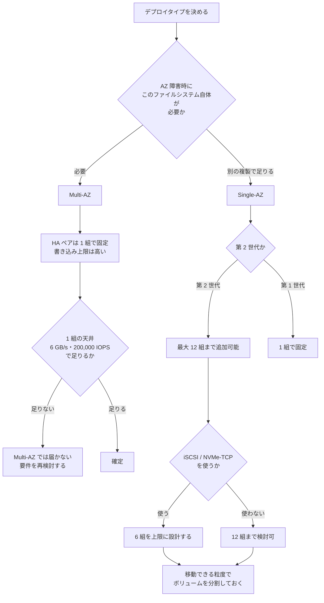

# デプロイタイプは一度しか決められない

[🏠 リポジトリトップ](../../../../../README.md) | [Playbook 02 — 設計](../README.md)

---

## 結論

**ファイルシステムのデプロイタイプは作成後に変更できません。** 変更したい場合は、新しいファイルシステムを作ってデータを移す以外の方法がありません。

そして重要なのは、**この 1 つの選択が可用性とスケールアウト上限を同時に決めてしまう**ことです。

**HA ペアを 2 組以上に増やせるのは、第 2 世代の Single-AZ だけです。** Multi-AZ は第 1 世代・第 2 世代とも 1 組で固定されます。

つまり「まず Multi-AZ で作って、後で性能が足りなくなったら HA ペアを足す」という進め方は**成立しません。** その時点で作り直しになります。

> **Evidence**: `documented` — 変更可否・上限・プロトコル制約は AWS 公式ドキュメントの記載に基づきます。
> **価格の比率は含めません。** 世代別の料金差は改定されるため、現行の料金ページを参照してください。
> 自環境での確認手順は「[自分の環境で確かめる](#自分の環境で確かめる)」にあります。

---

## 4 つのデプロイタイプと、選べる HA ペア数

| デプロイタイプ | 世代 | HA ペア数 | 後から増やせるか |
|---|---|---|---|
| `SINGLE_AZ_1` | 第 1 世代 | 1 組 | **不可** |
| `SINGLE_AZ_2` | 第 2 世代 | **最大 12 組** | **可（最大 12 まで）** |
| `MULTI_AZ_1` | 第 1 世代 | 1 組 | **不可** |
| `MULTI_AZ_2` | 第 2 世代 | 1 組 | **不可** |

**`SINGLE_AZ_1` から `SINGLE_AZ_2` への変更も作り直しです。** 同じ Single-AZ でも世代が違えば別のデプロイタイプであり、変更操作は存在しません。

移行手段は、バックアップからの復元、SnapMirror、AWS DataSync、サードパーティのコピーツールです。方式の選び方は [移行方式の決定木](../../../reference/decision-trees/migration-method.md) にあります。

---

## Multi-AZ と Single-AZ の判断

| 論点 | Single-AZ | Multi-AZ |
|---|---|---|
| データの複製範囲 | 1 つの AZ 内（別の障害ドメイン） | **2 つの AZ にまたがる** |
| 書き込みの複製 | 同期 | 同期 |
| HA ペア数 | 第 2 世代なら最大 12 組 | **1 組で固定** |
| 書き込みスループット上限 | Multi-AZ より低い | **Single-AZ より高い** |
| フェイルオーバー | サービスが自動管理 | サービスが自動管理 |
| コスト | Multi-AZ より低い | Single-AZ より高い |

**トレードオフは対称です。** Multi-AZ は AZ 障害への継続性と高い書き込み上限を得る代わりに、HA ペア 1 組の天井を受け入れます。Single-AZ（第 2 世代）はスケールアウトの余地とコストを得る代わりに、AZ をまたぐ可用性を自分で設計します。

**どちらを選んでも、書き込みはクライアントに応答を返す前に両方のファイルサーバーへ書かれます。** 同期であることは共通です。

判断の分かれ目は「AZ 障害時に**このファイルシステム自体**が使い続けられる必要があるか」です。別リージョンや別 AZ の複製で足りるなら Single-AZ が選択肢に入ります。復旧の仕組みごとの守備範囲は [Snapshot があることと復旧できることは別](../../../domains/data-protection/notes/snapshots-are-not-a-recovery-plan.md#何から守れるのか) にあります。

---

## HA ペアを足すときに起きること

第 2 世代 Single-AZ で HA ペアを追加する操作は**無停止で、数分で完了します。** ただし副作用があります。

| 起きること | 意味 |
|---|---|
| 新しい HA ペアは既存と**同じスループット容量と SSD 容量**を持つ | 性能だけ足すことはできません。**容量とコストも同じ比率で増えます** |
| **追加しただけでは速くなりません** | 既存ボリュームを新しいペアへ移動し、クライアントを再マウントする必要があります |
| **追加した HA ペアは削除できません** | 一時的な増強が目的なら、代わりにスループット容量の引き上げを検討します |
| 追加中はスループット容量・SSD 容量・プロビジョンド IOPS を変更できない | 変更作業を同時に走らせられません |

ドキュメントの例では、2 組で 12 GBps・2 TiB のファイルシステムに 1 組足すと 18 GBps・3 TiB になります。**6 GBps と 1 TiB がセットで増える**ということです。

「追加しただけでは速くならない」は設計に跳ね返ります。**移動できる粒度でボリュームを切っておかないと、後から HA ペアを足しても活かせません。** FlexVol が 1 つのアグリゲートに載る仕組みは [共有される単位は HA ペア](../../../domains/performance/notes/where-throughput-is-determined-and-shared.md#共有される単位は-ha-ペア) にあります。

---

## HA ペアを増やすと使えなくなるプロトコルがあります

| プロトコル | 条件 |
|---|---|
| iSCSI | **HA ペアが 6 組以下**のファイルシステムで利用可能 |
| NVMe/TCP | **第 2 世代かつ HA ペアが 6 組以下**で利用可能 |

**7 組目を足した時点でブロックプロトコルが使えなくなります。** そして HA ペアは削除できないので、この操作は元に戻せません。

ブロックプロトコルを使う予定があるなら、**6 組を上限として設計してください。**

なお HA ペアを追加すると、新しいノードでは NVMe キャッシュが既定で有効になります。スループット重視のワークロードでは無効化が推奨されています。

---

## 単一 HA ペアの天井

1 組の HA ペアで到達できる範囲は **6 GB/s のスループットと 200,000 IOPS** 程度とされています。一般的なファイル共有やコンテンツ管理はこの範囲に収まります。

これを超える必要がある場合（大規模な EDA、地震波解析、クラスタ DB、HPC など）が、スケールアウト構成を選ぶ理由になります。

**逆に言えば、超えない見込みなら HA ペアを増やす設計は不要です。** 上限そのものが世代・構成・リージョンで変わる点は [スループットは 1 つの設定値では決まらない](../../../domains/performance/notes/where-throughput-is-determined-and-shared.md#上限は世代と構成とリージョンで変わる) にあります。

---

## チェックリストに載っていない不可逆項目

[本番投入前レビュー](../../04-build/checklists/pre-production-review.md#不可逆な項目の一覧) はボリューム単位・SVM 単位の不可逆項目を扱っています。**ファイルシステム単位の不可逆項目はこのノートの範囲です。**

| 項目 | 変更できるか | 変更したい場合 |
|---|---|---|
| デプロイタイプ（Single-AZ / Multi-AZ） | **不可** | 新しいファイルシステムを作ってデータを移す |
| 世代（第 1 / 第 2） | **不可** | 同上。デプロイタイプの一部です |
| 配置する AZ | **不可** | 同上 |
| 追加した HA ペアの削除 | **不可** | 削除できません。スループット容量の調整で対応する |
| HA ペア数の上限 | デプロイタイプで決まる | Multi-AZ なら 1 組が上限です |

---

## 設計フロー

---

## 自分の環境で確かめる

**このノートの項目は、作ってから確かめると手遅れになります。** 確認は設計レビューの段階で行ってください。

| # | 手順 | 確認できること |
|---|---|---|
| 1 | 想定ピークが 6 GB/s・200,000 IOPS に収まるかを試算する | Multi-AZ を選べるか。超えるなら第 2 世代 Single-AZ 前提です |
| 2 | iSCSI / NVMe/TCP を使う予定があるかを確認する | HA ペアの上限を 6 組にする必要があるか |
| 3 | AZ 障害時に「このファイルシステム自体」が必要かを関係者と合意する | Multi-AZ / Single-AZ の判断根拠 |
| 4 | ボリュームの分割粒度が、後から別ペアへ移動できる単位になっているか確認する | HA ペア追加を活かせるか |
| 5 | 検証環境で HA ペアを 1 組追加し、所要時間と容量の増え方を記録する | **無停止と数分という記載を自環境で確認する。** 削除できないので検証環境で行ってください |
| 6 | 選んだデプロイタイプ・世代・AZ を設計文書に明記する | 不可逆項目の合意記録 |

手順 5 は**検証環境で行ってください。** 追加した HA ペアは削除できません。

---

## よくある誤解

| 誤解 | 実際 |
|---|---|
| 後からデプロイタイプを変えられる | **変更操作はありません。** 新しいファイルシステムを作ってデータを移します |
| Single-AZ 1 から Single-AZ 2 は設定変更で移れる | 別のデプロイタイプです。作り直しになります |
| Multi-AZ でも後から HA ペアを足せる | **足せません。** 第 1 世代・第 2 世代とも 1 組で固定です |
| HA ペアを足せば自動的に速くなる | 既存ボリュームを新しいペアへ移動し、再マウントする必要があります |
| HA ペアは必要なときだけ足して後で戻せる | **削除できません。** 一時的な増強はスループット容量の調整で行います |
| HA ペアを足すのは性能だけの判断 | 同じ比率で SSD 容量も増えます。コストの判断でもあります |
| HA ペアはいくら増やしても機能は同じ | **7 組以上で iSCSI と NVMe/TCP が使えなくなります** |
| Multi-AZ のほうが常に性能で有利 | 書き込み上限は高いですが、HA ペア 1 組の天井があります |
| Single-AZ は可用性が低い | 1 つの AZ 内の別の障害ドメインに配置され、同期複製とフェイルオーバーは同じです。違いは AZ 障害への継続性です |

---

## 参照した一次情報

| 論点 | 出典 |
|---|---|
| デプロイタイプは作成後に変更できないこと、Single-AZ 1 から Single-AZ 2 も作り直しであること、移行手段 | [AWS: Creating file systems](https://docs.aws.amazon.com/fsx/latest/ONTAPGuide/creating-file-systems.html) |
| 第 1 世代と第 2 世代 Multi-AZ が 1 組、第 2 世代 Single-AZ が最大 12 組であること。追加は無停止で数分、削除は不可。新ペアが同じスループットと SSD 容量を持つこと。移動と再マウントが必要なこと。追加中は容量変更ができないこと。iSCSI と NVMe/TCP の 6 組以下という条件。NVMe キャッシュの既定 | [AWS: Adding high-availability (HA) pairs](https://docs.aws.amazon.com/fsx/latest/ONTAPGuide/adding-HA-pairs.html) |
| 4 つのデプロイタイプと世代の対応 | [AWS SDK reference: deploymentType](https://docs.aws.amazon.com/sdk-for-kotlin/api/latest/fsx/aws.sdk.kotlin.services.fsx.model/-create-file-system-ontap-configuration/deployment-type.html) |
| Multi-AZ の待機系が別 AZ にあり同期複製されること、Multi-AZ 1 が第 1 世代・Multi-AZ 2 が第 2 世代であること | [AWS: Availability, durability, and deployment options](https://docs.aws.amazon.com/fsx/latest/ONTAPGuide/high-availability-AZ.html) |
| Multi-AZ の書き込みスループット上限が Single-AZ より高いこと、書き込みが両方のファイルサーバーに書かれてから応答すること | [AWS Storage Blog: Best practice configuration for SQL Server workloads](https://aws.amazon.com/blogs/storage/best-practice-configuration-of-amazon-fsx-for-netapp-ontap-for-microsoft-sql-server-workloads/) |
| 単一 HA ペアの 6 GB/s・200,000 IOPS、スケールアウトを選ぶ用途 | [AWS Storage Blog: How to size an FSx for ONTAP file system](https://aws.amazon.com/blogs/storage/how-to-size-an-amazon-fsx-for-netapp-ontap-file-system/) |

---

## 関連ドキュメント

- [Playbook 02 — 設計](../README.md) — このモジュールのハブ
- [スループットは 1 つの設定値では決まらない](../../../domains/performance/notes/where-throughput-is-determined-and-shared.md) — HA ペア単位の共有と FlexVol の制約
- [容量が余っていても書けなくなる](../../01-assess/notes/counting-bytes-is-not-counting-files.md) — 設計の入力になる棚卸し項目
- [本番投入前レビュー](../../04-build/checklists/pre-production-review.md#不可逆な項目の一覧) — ボリューム / SVM 単位の不可逆項目
- [移行方式の決定木](../../../reference/decision-trees/migration-method.md) — デプロイタイプを変えるときの移行手段
- [Snapshot があることと復旧できることは別](../../../domains/data-protection/notes/snapshots-are-not-a-recovery-plan.md) — AZ・リージョン障害の守備範囲
- [上限値・クォータ](../../../reference/limits/) — 出典と検証日付きの上限値
- [知見の分類ポリシー](../../../evidence-policy.md)

---

[🏠 リポジトリトップ](../../../../../README.md) | [Playbook 02 — 設計](../README.md)
