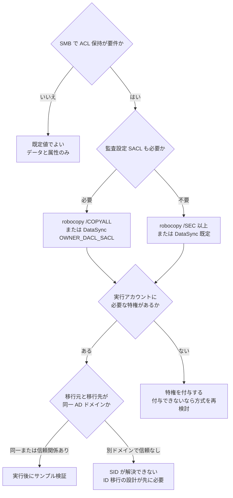

# ACL 保持は権限の問題であってツールの問題ではない

[🏠 リポジトリトップ](../../../../../README.md) | [Playbook 03 — 移行](../README.md)

---

## 結論

SMB 移行で ACL が失われる原因は、**ツールの能力不足ではなく次の 2 つ**です。

1. **既定値が ACL を含んでいない。** robocopy の既定は `/COPY:DAT`（データ・属性・タイムスタンプ）で、**ACL は含まれません**。AWS DataSync の既定は DACL までで、**SACL（監査設定）は含まれません**
2. **実行アカウントに必要な特権がない。** 読めない ACL は黙ってスキップされます。エラーで止まらないため、完了したように見えます

**「ACL 対応のツールを選ぶ」では不足です。** 既定値を上書きし、実行アカウントに特権を付与し、移行後にサンプル検証する — この 3 点が揃って初めて保持されます。

> **Evidence**: `documented` — 各ツールの仕様は Microsoft / AWS の公式ドキュメントに基づきます。
> **自環境での検証結果は含みません。** 実際に保持されたかは移行後にサンプル比較で確認してください。
> 手順は「[自分の環境で確かめる](#自分の環境で確かめる)」にあります。

---

## 何が落ちるのか

| コピー対象 | robocopy の既定 `/COPY:DAT` | robocopy `/COPYALL` | DataSync 既定 | DataSync `OWNER_DACL_SACL` |
|---|:---:|:---:|:---:|:---:|
| データ・属性・タイムスタンプ | ○ | ○ | ○ | ○ |
| 所有者 | ✕ | ○ | ○ | ○ |
| NTFS DACL（アクセス許可） | **✕** | ○ | ○ | ○ |
| NTFS SACL（監査設定） | **✕** | ○ | **✕** | ○ |

`/COPYALL` は `/COPY:DATSOU` の別名で、各文字は D=Data、A=Attributes、T=Timestamps、S=Security（NTFS ACL）、O=Owner、U=aUditing を指します。**`/SEC` は `/COPY:DATS` 相当で、所有者と監査設定は含みません。**

**監査要件がある環境では SACL の扱いを明示的に決めてください。** DACL だけ移して「権限は移行できた」と判断すると、監査ログの設定が失われたことに気づくのは監査の時です。

---

## 必要な特権

### robocopy

`/B`（バックアップモード）は**ファイルとフォルダの権限設定を上書きして読み取ります**。コピー実行アカウントに ACL 上のアクセス権がないファイルを扱えるのはこのモードだけです。

バックアップモードは Windows の特権に依存します。通常は **Backup Operators** または **Domain Admins** のメンバーである必要があります。

### AWS DataSync

SMB ロケーションに使う ID に、コピーしたいメタデータに応じた**ユーザー権利**が必要です。

| 必要なユーザー権利 | これがないと落ちるもの | 通常付与されているグループ |
|---|---|---|
| **ファイルとディレクトリの復元**（`SE_RESTORE_NAME`） | 所有者、アクセス許可、DACL | Domain Admins、Backup Operators |
| **監査とセキュリティ ログの管理**（`SE_SECURITY_NAME`） | SACL | Domain Admins |

さらに、**SMB 間で Windows ACL をコピーする場合、DataSync に渡す ID は移行元と移行先が同一の Active Directory ドメインに属している必要があります**（もしくはドメイン間に信頼関係が必要です）。

**SMB 1.0 を使うと SACL はコピーされません。** プロトコルバージョンも確認対象です。

---

## 判断フロー



---

## 自分の環境で確かめる

**「エラーが出なかった」は保持できた証拠になりません。** 読めない ACL はスキップされ、正常終了します。

### 1. 移行前に、読めない ACL があるかを把握する

移行元で、コピー実行アカウントがアクセスできないファイルの有無を確認します。存在するなら、バックアップモードと対応する特権が必須になります。

### 2. 移行後に、移行元と移行先の ACL を比較する

代表的なディレクトリとファイルを選び、両側で ACL を出力して差分を取ります。

```powershell
# 移行元と移行先の双方で実行し、出力を比較する
Get-Acl -Path <path> | Format-List
```

比較する観点は 3 つです。

| 観点 | 確認すること |
|---|---|
| DACL のエントリ | 許可・拒否の各エントリが同一か。継承フラグも含めて比較する |
| 所有者 | 実行アカウントに置き換わっていないか |
| SACL | 監査要件がある場合、監査エントリが残っているか |

### 3. 深い階層と特殊なケースを選ぶ

サンプルは**浅い階層のファイルを選ばないでください。** 継承の破れ、明示的な拒否エントリ、長いパス、実行アカウントが所有していないファイルを選びます。問題はそこに出ます。

---

## よくある誤解

| 誤解 | 実際 |
|---|---|
| ACL 対応のツールを使えば ACL は保たれる | 既定値では落ちます。robocopy の既定は `/COPY:DAT` で ACL を含みません |
| `/SEC` を付ければ全部保持される | `/SEC` は `/COPY:DATS` 相当で、**所有者と監査設定は含みません** |
| DataSync なら設定不要で ACL が移る | DACL は移りますが SACL は既定では移りません。加えて実行 ID に特権が必要です |
| 管理者で実行すれば特権の問題はない | 必要なのは「管理者であること」ではなく特定のユーザー権利です。**SACL には別の権利が必要**です |
| エラーが出なければ保持できている | 読めない ACL は黙ってスキップされ、正常終了します。**サンプル比較が唯一の確認手段です** |
| 別ドメインからでも ACL はそのまま移る | SID が解決できません。同一ドメインか信頼関係が前提で、無い場合は ID 移行の設計が先に必要です |

---

## 参照した一次情報

| 論点 | 出典 |
|---|---|
| `/B` はバックアップモードで ACL による読み取り制限を上書きする | [Microsoft Learn: robocopy](https://learn.microsoft.com/en-us/windows-server/administration/windows-commands/robocopy) |
| `/COPY` のフラグ（D/A/T/S/O/U）と既定値 | 同上 |
| DataSync が SMB で複製するメタデータの一覧、SMB 1.0 での SACL 非対応 | [AWS: Understanding how DataSync handles file and object metadata](https://docs.aws.amazon.com/datasync/latest/userguide/metadata-copied.html) |
| DataSync に必要なユーザー権利、同一 AD ドメイン要件 | [AWS: Configuring AWS DataSync transfers with an SMB file server](https://docs.aws.amazon.com/datasync/latest/userguide/create-smb-location.html) |

---

## 関連ドキュメント

- [Playbook 03 — 移行](../README.md) — このモジュールのハブ
- [移行方式の選択](../../../reference/decision-trees/migration-method.md) — ACL 保持要件が方式選択を左右します
- [容量が余っていても書けなくなる](../../01-assess/notes/counting-bytes-is-not-counting-files.md#棚卸し項目は後で戻せない判断から逆算する) — ACL が読めるかの確認は棚卸しの項目です
- [セキュリティスタイルが権限評価のモデルを決める](../../../domains/multiprotocol-identity/notes/security-style-and-permission-evaluation.md) — 移行先での権限評価の前提
- [本番投入前レビュー](../../04-build/checklists/pre-production-review.md) — 移行後の ACL サンプル検証を項目に含めています
- [知見の分類ポリシー](../../../evidence-policy.md)

---

[🏠 リポジトリトップ](../../../../../README.md) | [Playbook 03 — 移行](../README.md)
