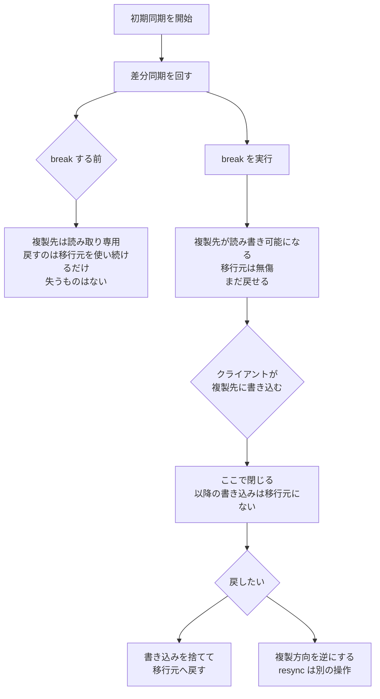

# 切り戻せる時点はクライアントが書き始めた瞬間に閉じる

<!-- lang-switcher:start -->
🌐 [日本語](where-the-rollback-window-closes.md) | [English](../../../../en/playbooks/03-migrate/notes/where-the-rollback-window-closes.md) | [🏠 リポジトリトップ](../../../../../README.md)
<!-- lang-switcher:end -->

[🏠 リポジトリトップ](../../../../../README.md) | [Playbook 03 — 移行](../README.md)

---

## 結論

**SnapMirror の複製先は、関係を break するまで読み取り専用です。** つまり break の前は、切り戻しは「移行元を使い続ける」だけで済みます。何も失われません。

break すると複製先が読み書き可能になり、**移行元には影響しません。** この時点でも移行元のデータは無傷なので、まだ戻せます。

**閉じるのは、クライアントが複製先に書き始めた瞬間です。** そこから先の書き込みは移行元に存在しません。戻るには、その書き込みを捨てるか、**複製方向を逆にする**（別の操作）ことになります。「切り替えた設定を戻す」では戻れません。

もう 1 つ。**差分同期は移行元にある共通 Snapshot に依存します。** SnapMirror が作成した Snapshot を移行元で削除すると、**差分転送ができなくなり初期同期からやり直しになります。** これが移行スケジュールで最も大きなリスクです。

> **Evidence**: `documented` — コマンド列・状態・制約は AWS 公式ドキュメント、AWS Storage Blog、AWS re:Post の記載に基づきます。
> **転送時間の実測値は含みません。** 所要時間は回線とデータ量に依存します。
> 計測手順は「[自分の環境で確かめる](#自分の環境で確かめる)」にあります。

---

## 初期同期と差分同期

| 段階 | コマンド | 内容 |
|---|---|---|
| 初期同期 | `snapmirror initialize` | 移行元の Snapshot を複製先へ転送します |
| 差分同期（単発） | `snapmirror update` | 前回以降の変更分を 1 回だけ転送します |
| 差分同期（定期） | `snapmirror modify -schedule hourly` | スケジュールで継続的に追随させます |

**稼働中のデータを移行する場合は、切り替えまで差分同期を回し続けます。** 初期同期を切り替え直前に始める計画にすると、転送時間がそのままダウンタイムになります。

### 差分同期が壊れる条件

| 条件 | 起きること |
|---|---|
| **移行元で SnapMirror 作成の Snapshot を削除した** | 最新の共通 Snapshot（NCS）が失われ、**差分転送ができません。** 初期同期からやり直しです |
| 複製先をオフラインにした / restrict した | SnapMirror が更新できません |
| ストレージ効率化ジョブと SnapMirror を同時に走らせた | 併走させないことが推奨されています |
| **以前の SnapMirror 関係で使った複製先ボリュームを再利用した** | 再利用は推奨されません。**新しいボリュームを作成してください** |
| 経路に NAT がある | **SnapMirror は NAT に対応していません** |

**1 行目と 4 行目は「やり直しになる」類の失敗です。** 移行計画では、この 2 つを運用手順で禁止しておくのが安いです。

---

## 切り替えの順序

**ダウンタイムを決めるのは、この順序のどこでクライアントを止めるかです。**

| # | 操作 | 確認すること |
|---|---|---|
| 1 | `snapmirror update` で最後の差分を転送 | — |
| 2 | 状態を確認 | `Mirror State` が `Snapmirrored`、`Relationship Status` が `Idle` |
| 3 | **`Last Transfer End Timestamp` を確認** | **複製先のデータの新しさを表します。** ここが古いなら切り替えてはいけません |
| 4 | クライアントを停止 | ここからダウンタイムが始まります |
| 5 | `snapmirror quiesce` で以降の転送を止める | `Relationship Status` が `Quiesced` になること |
| 6 | `snapmirror break` で複製先を読み書き可能にする | — |
| 7 | 共有をマウントし直す（SMB / NFS / iSCSI） | — |
| 8 | クライアントを再開 | ここでダウンタイムが終わります |

**ダウンタイムは手順 4 から 8 の間だけです。** 転送そのものは手順 1 までに終わっています。したがって短縮すべきは転送時間ではなく、**手順 5〜7 の作業時間**です。

手順 3 を飛ばさないでください。**`Idle` は「いま転送していない」という意味であって、「最新である」という意味ではありません。**

---

## どこまで戻せるか

**「切り替え設定を戻す」という戻し方は存在しません。** 戻すという判断は、複製先に書かれたデータをどうするかの判断です。

### resync で戻す場合の注意

`snapmirror resync` は関係を再確立しますが、**ユーザーが作成した Snapshot は複製されません。** 複製先の export された Snapshot は削除され、クライアントには複製先のアクティブなファイルシステムが見えます。

Snapshot ポリシーの複製で問題を避けるため、**`preserve` パラメータの使用が推奨されています。** ただしこれは XDP 関係でのみサポートされます。

**切り戻しは「元に戻る」操作ではなく、新しい状態を作る操作です。** 手順を書く前に、何が保持され何が失われるかを確認してください。

---

## 転送性能に影響する条件

| 条件 | 影響 |
|---|---|
| データプロトコルのネットワーク利用率が 50% を超えている | **クラスタ間通信用に専用のフェイルオーバーグループを使うことが推奨されます** |
| 移行元と複製先の往復遅延（RTT） | 書き込みレイテンシの原因になりえます |
| 複製先ボリュームのサイズ | 移行元と同じか少し大きく保つため、`volume autosize` で autogrow を有効にすることが推奨されます |
| 背景タスクとの競合 | クライアントトラフィックが優先されるため、ピーク時は転送が遅れます |

最後の行は運用に効きます。**転送が想定より遅い場合、回線ではなく優先度の問題である可能性があります。** 仕組みは [監視は平均値で失敗する](../../05-operate/notes/monitoring-fails-on-averages.md) にあります。

---

## 自分の環境で確かめる

**測るべきは転送時間ではなく、手順 5〜7 の作業時間です。** そこがダウンタイムです。

| # | 手順 | 確認できること |
|---|---|---|
| 1 | 検証環境で初期同期を実行し、所要時間を記録する | データ量と回線から見た初期同期の実時間 |
| 2 | 差分同期を 1 回実行し、所要時間を記録する | 切り替え直前の最終同期にかかる時間 |
| 3 | `quiesce` → `break` → マウントまでを通しで計測する | **実際のダウンタイム。** 見積もりではなく実測です |
| 4 | `Last Transfer End Timestamp` の確認を手順書に入れる | 古いデータで切り替える事故を防げます |
| 5 | break 後に移行元が無傷であることを確認する | 切り戻しの前提。実際に読めることを見ます |
| 6 | 移行後の ACL を移行元と比較する | 権限が保たれているか。手順は [ACL 保持は権限の問題](preserving-acls-during-migration.md#自分の環境で確かめる) にあります |
| 7 | 切り戻し手順を検証環境で 1 回通す | **書かれた手順が動くかどうか。** 本番で初めて試さないためです |

手順 7 を飛ばす移行計画が多いです。**切り戻し手順は、使わないことを願う手順であっても、動くことを確認しておく対象です。**

---

## よくある誤解

| 誤解 | 実際 |
|---|---|
| 切り替え後もいつでも戻せる | **クライアントが複製先に書いた時点で閉じます。** それ以降は書き込みの扱いを決める判断です |
| break すると移行元に影響する | 影響しません。移行元は無傷です |
| break する前でも複製先に書ける | **読み取り専用です。** break するまで書けません |
| `Relationship Status` が `Idle` なら最新 | `Idle` は転送していないという意味です。新しさは `Last Transfer End Timestamp` で見ます |
| ダウンタイムは転送時間で決まる | 転送は切り替え前に終わっています。ダウンタイムは `quiesce` からマウントまでです |
| 移行元の Snapshot は消してよい | **SnapMirror が作った Snapshot を消すと差分転送ができません。** 初期同期からやり直しです |
| 失敗した複製先ボリュームは再利用できる | 再利用は推奨されません。新しいボリュームを作成します |
| NAT 経由でも SnapMirror は動く | **対応していません** |
| `resync` すれば元の状態に戻る | ユーザー作成の Snapshot は複製されません。新しい状態を作る操作です |

---

## 参照した一次情報

| 論点 | 出典 |
|---|---|
| `snapmirror initialize` による初期同期、`snapmirror update` による単発の差分同期、`snapmirror modify -schedule` による定期同期 | [AWS: Migrating to FSx for ONTAP using NetApp SnapMirror](https://docs.aws.amazon.com/fsx/latest/ONTAPGuide/migrating-fsx-ontap-snapmirror.html) |
| 複製先が break するまで読み取り専用であること、切り替え手順（状態確認 → `Last Transfer End Timestamp` の確認 → `quiesce` → `break` → マウント）、`Last Transfer End Timestamp` がデータの新しさを表すこと | [AWS Storage Blog: Migrating on-premises file shares to FSx for ONTAP](https://aws.amazon.com/blogs/storage/migrating-on-premises-file-shares-to-amazon-fsx-for-netapp-ontap/) |
| 複製先が online かつ読み取り専用で作られること、break が複製先を書き込み可能にし移行元に影響しないこと、スケジュールに従って差分更新されること | [AWS Storage Blog: Cross-region disaster recovery with FSx for ONTAP](https://aws.amazon.com/blogs/storage/cross-region-disaster-recovery-with-amazon-fsx-for-netapp-ontap/) |
| `resync` がユーザー作成 Snapshot を複製しないこと、複製先の export された Snapshot が削除されること、`preserve` が XDP のみで使えること | [AWS re:Post: Why does the snapshot policy stop working after snapmirror resync?](https://repost.aws/knowledge-center/fsx-ontap-snapmirror-resync) |
| 共通 Snapshot（NCS）に差分転送が依存すること、複製先ボリュームを再利用しないこと、複製先をオフラインにしないこと、効率化ジョブと併走させないこと、NAT 非対応、利用率 50% 超で専用フェイルオーバーグループ、RTT の影響、`volume autosize` の推奨 | [AWS re:Post: How can I optimize SnapMirror performance?](https://repost.aws/knowledge-center/fsx-ontap-optimize-snapmirror) |
| 転送状態が不正になった場合に関係とボリュームを作り直す手順 | [AWS re:Post: How do I troubleshoot SnapMirror issues?](https://repost.aws/knowledge-center/fsx-ontap-troubleshoot-snapmirror) |

---

## 関連ドキュメント

- [Playbook 03 — 移行](../README.md) — このモジュールのハブ
- [移行方式の決定木](../../../reference/decision-trees/migration-method.md) — 方式の選択とバージョン互換性
- [ACL 保持は権限の問題であってツールの問題ではない](preserving-acls-during-migration.md) — 移行後の ACL 比較手順
- [容量が余っていても書けなくなる](../../01-assess/notes/counting-bytes-is-not-counting-files.md) — 移行前に数えるもの
- [Snapshot があることと復旧できることは別](../../../domains/data-protection/notes/snapshots-are-not-a-recovery-plan.md) — 複製先はバックアップ対象外です
- [監視は平均値で失敗する](../../05-operate/notes/monitoring-fails-on-averages.md) — 転送が遅い理由の切り分け
- [知見の分類ポリシー](../../../evidence-policy.md)

---

[🏠 リポジトリトップ](../../../../../README.md) | [Playbook 03 — 移行](../README.md)

<!-- lang-switcher:start -->
🌐 [日本語](where-the-rollback-window-closes.md) | [English](../../../../en/playbooks/03-migrate/notes/where-the-rollback-window-closes.md) | [🏠 リポジトリトップ](../../../../../README.md)
<!-- lang-switcher:end -->
