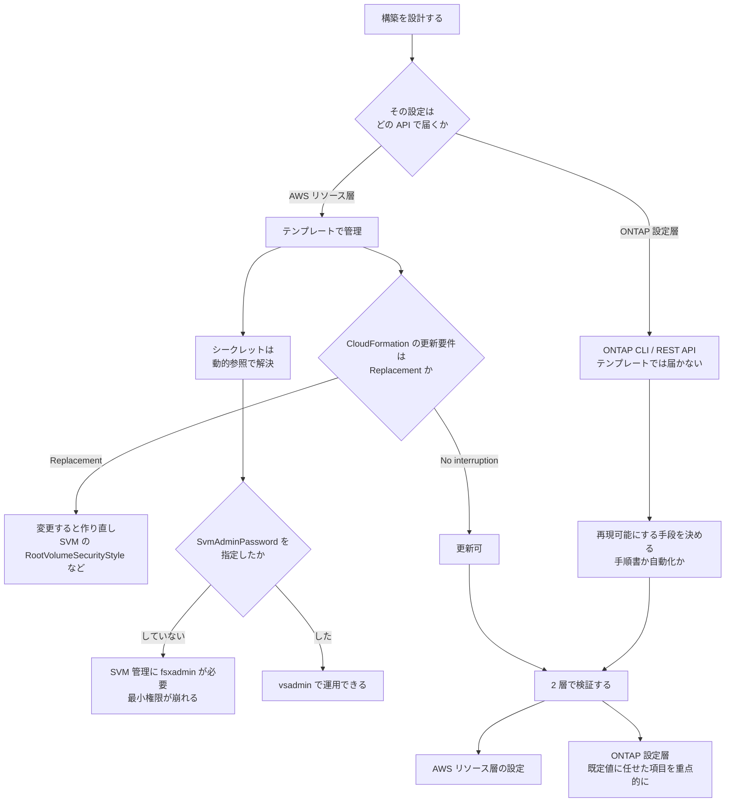

# IaC が届く境界はどこで決まるか？

好みではなく API の表面で決まります。テンプレートが成功しても ONTAP 層の設定は残ります。

<!-- lang-switcher:start -->
🌐 [日本語](what-iac-cannot-reach.md) | [English](../../../../en/playbooks/04-build/notes/what-iac-cannot-reach.md) | [🏠 リポジトリトップ](../../../../../README.md)
<!-- lang-switcher:end -->

## このノートで学べること

- 「何を IaC で管理するか」が方針ではなく API の到達性で決まること、テンプレート成功が構成完成ではないこと
- テンプレートの外にある ONTAP 層設定（SMB 暗号化強制・inode 上限・FlexGroup 変換など）と、その 2 層検証の必要性

## このノートが答えないこと

- 特定の IaC ツール構成やカスタムリソース実装の推奨（ネイティブ到達性の有無のみ）
- ONTAP CLI / REST API を呼ぶ自動化の具体的な冪等性・復旧の実装

## 前提レベル

advanced

## 本文

<a id="iac-の境界は好みではなく-api-の表面で決まる"></a>

[🏠 リポジトリトップ](../../../../../README.md) | [Playbook 04 — 構築](../README.md)

> **Evidence**: AWS 文書と CloudFormation リファレンスへリンクした行は `documented` です。
> SnapLock 監査ログボリュームの指定解除と、削除失敗時の実際の応答経路は、下節に環境を示した
> `verified` の観測です。
> **特定のツール構成の推奨はしません。** 自環境での確認手順は
> 「[自分の環境で確かめる](#自環境での確認手順)」にあります。

---

### 結論

**「何を IaC で管理するか」は方針で決める前に、API で届くかどうかで決まっています。**

Amazon FSx for NetApp ONTAP のファイルシステム、SVM、ボリューム、バックアップ、タグを CloudFormation から扱えるのは、Amazon FSx API の公開面のうち CloudFormation リソースとプロパティにも公開された範囲です。CloudFormation は Amazon FSx API より広い設定面を持たないため、プロパティ単位で CloudFormation リファレンスを確認します。

| 設定 | Amazon FSx API? | ONTAP 層のみ? | 出典 / 運用上の帰結 |
|---|---|---|---|
| ファイルシステム、SVM、ボリュームの公開プロパティ | Yes | No | [Amazon FSx API](https://docs.aws.amazon.com/fsx/latest/APIReference/Welcome.html) と [CloudFormation リソース](https://docs.aws.amazon.com/AWSCloudFormation/latest/TemplateReference/AWS_FSx.html)。テンプレートは API の公開面を宣言的に呼び出します |
| SVM の AD 構成とルートボリュームのセキュリティスタイル | Yes | No | [`CreateStorageVirtualMachine`](https://docs.aws.amazon.com/fsx/latest/APIReference/API_CreateStorageVirtualMachine.html)。CloudFormation でも指定できますが、`RootVolumeSecurityStyle` の変更は Replacement です |
| ボリュームの階層化ポリシーと cooling period | Yes | No | [`CreateVolume`](https://docs.aws.amazon.com/fsx/latest/APIReference/API_CreateVolume.html) / [`UpdateVolume`](https://docs.aws.amazon.com/fsx/latest/APIReference/API_UpdateVolume.html)。反映後の値を読み直します |
| SVM / 共有の SMB 暗号化強制 | No | Yes | [SMB 暗号化手順](https://docs.aws.amazon.com/fsx/latest/ONTAPGuide/enable-smb-encryption.html) は ONTAP CLI を指定。非対応クライアントは接続できません |
| ボリュームの inode 上限 | No | Yes | [inode 上限の更新手順](https://docs.aws.amazon.com/fsx/latest/ONTAPGuide/increase-volume-max-files.html) は ONTAP CLI を指定。容量監視とは別に inode を監視します |
| FlexVol から FlexGroup への変換 | No | Yes | [ボリューム管理](https://docs.aws.amazon.com/fsx/latest/ONTAPGuide/managing-volumes.html) は ONTAP CLI を指定。変換前のバックアップ削除とデータ配置の確認が必要です |
| ONTAP ボリュームのオンデマンド Snapshot 作成 | No | Yes | Amazon FSx の [`CreateSnapshot`](https://docs.aws.amazon.com/fsx/latest/APIReference/API_CreateSnapshot.html) は OpenZFS 用です。ONTAP の Snapshot ポリシーまたは ONTAP CLI / REST API を使います |
| SnapLock 監査ログボリュームの指定解除 | No | Yes | [実測記録](#実測で見つかった境界)では ONTAP REST で解除。**解除しても保持中のボリューム、SVM、ファイルシステムは削除できません** |
| ボリューム削除失敗理由の取得 | Yes | No | `DescribeVolumes` の `LifecycleTransitionReason` から取得します。削除応答だけでは判定しません（[実測記録](../../../reference/limits/#ボリューム削除の失敗理由は-aws-api-内にあります--the-reason-for-a-failed-volume-deletion-is-in-the-aws-api)） |

各 `No` は行内の一次資料に基づくネイティブ到達性です。ただし SnapLock 監査ログボリュームの指定解除は `verified` であり、Amazon FSx API の入力形から推論したものではありません。CloudFormation のカスタムリソース、Lambda、Systems Manager などから ONTAP CLI / REST API を呼べば自動化できますが、**それは Amazon FSx API または CloudFormation リソースのネイティブ到達性が増えたことを意味しません。** ONTAP の資格情報、管理エンドポイントへのネットワーク到達性、冪等性、失敗時の復旧を呼び出し側が引き受けます。

したがって **テンプレートが成功しても構成は完成していません。** 「IaC で全部管理する」という方針は、この境界を越えられません。設計すべきは境界の位置ではなく、**境界の向こう側をどう再現可能にするか**です。

---

### 実測で見つかった境界

**いずれも「テンプレートや AWS CLI から届かない」ことを実際に試して確認しました。**

| 発見 | 内容 |
|---|---|
| **`CreateSnapshot` は FSx for OpenZFS 専用** | ONTAP ボリュームに対して実行すると `Unable to create a snapshot because the volume was not found` になります。**ボリュームは存在し `CREATED` です。** ONTAP の Snapshot は Snapshot ポリシーまたは ONTAP CLI / REST の領域です |
| **SnapLock 監査ログボリュームは AWS API で削除できない** | 通常の削除も `BypassSnaplockEnterpriseRetention=true` も効きません。SVM 側の指定は API に露出しておらず、**ONTAP REST でなら解除できます。ただし解除しても削除できるようにはなりません**（最低 6 か月の保持期間中は、ボリューム・SVM・ファイルシステムのいずれも削除不可）。詳細は [SnapLock は有効化とロックが別](../../../domains/data-protection/notes/snaplock-and-layered-ransomware-readiness.md#監査ログボリュームによるファイルシステム全体の-6-か月固定) |
| **ボリューム削除の失敗は応答では分かりません**（理由の取得先は AWS API 内にあります） | `delete-volume` は `DELETING` に入ったのち `CREATED` に戻り、**応答にはエラーが含まれません。** `AdministrativeActions` も `null` です。ただし**理由は `DescribeVolumes` の `LifecycleTransitionReason` に入ります**。ONTAP 側は必須ではありません |
| **`UpdateVolume` は非同期で痕跡を残さない** | 反映は 30 秒では未確認、120〜180 秒で確認。**`AdministrativeActions` には記録されません**（`null`）。連続実行は `There is an update already in progress.` で拒否されます |

**`UpdateVolume` の非同期性が検証の設計に効きます。** API が成功を返しても反映されたことにはならず、記録も残らないため、**`DescribeVolumes` を読み直す以外に確認手段がありません。** この検証では短い待ち時間で状態を読み、一度「無視された」と誤診しました。

> **区分**: `verified`（検証日 2026-08-06、`ap-northeast-1`、`SINGLE_AZ_1`）。
> 記録は [上限値・クォータ](../../../reference/limits/) にあります。

**構築後の検証を自動化するなら、この非同期性を前提に組んでください。** 「API が 200 を返したか」ではなく「読み直して意図した値になっているか」を判定条件にします。

---

### テンプレートで扱えるものと、その更新挙動

更新挙動は設計に直結します。**`Replacement` と書かれているプロパティを変更すると、リソースが作り直されます。**

| プロパティ | 更新時の挙動 | 意味 |
|---|---|---|
| SVM の `RootVolumeSecurityStyle` | **Replacement** | **変更すると SVM が作り直されます。** ボリューム単位のセキュリティスタイル変更とは別物です |
| `FsxAdminPassword` | 中断なし | ローテーションはテンプレート経由で安全に行えます |
| `SvmAdminPassword` | — | 未指定でも SVM は作れますが、後述の副作用があります |

SVM のルートボリュームのセキュリティスタイルは `UNIX` / `NTFS` / `MIXED` から選びます。**この選択を後から変えるとリソースが置き換わる**ため、[セキュリティスタイルが権限評価のモデルを決める](../../../domains/multiprotocol-identity/notes/security-style-and-permission-evaluation.md) を先に読んで決めてください。

---

### シークレットの扱い

`FsxAdminPassword` と `SvmAdminPassword` はテンプレートのプロパティです。**つまりテンプレートに平文で書けてしまいます。**

| 方針 | 内容 |
|---|---|
| 平文で書かない | CloudFormation の**動的参照**で AWS Secrets Manager から解決します |
| リポジトリに入れない | テンプレートもパラメータファイルも公開リポジトリに入る可能性があります |
| ローテーションを想定する | `FsxAdminPassword` の更新は中断を伴いません |

`FsxAdminPassword` には制約があります。**8〜50 文字で、改行や特定の制御文字を含められません。** 自動生成のパスワードポリシーがこの範囲を外れていると、作成時に失敗します。

#### `SvmAdminPassword` の省略による最小権限の崩れ

**`SvmAdminPassword` を指定しないと、その SVM の管理は `fsxadmin` で行うことになります。**

`fsxadmin` はファイルシステム全体の管理者です。つまり SVM 1 つの運用担当者に、ファイルシステム全体の権限を渡すことになります。

**指定すれば、その SVM を `vsadmin` で ONTAP CLI / REST API から管理できます。** 最小権限で運用するなら、SVM 作成時に指定してください。権限の分け方は [管理者を分ける](../../../domains/security-governance/notes/what-the-platform-gives-and-what-stays-yours.md#権限設計--管理者の分離) にあります。

---

### Active Directory 連携の自動化

SVM の AD 参加はテンプレートで指定できますが、**参加そのものは AD 側の状態に依存します。** 自動化で扱うべき対象は次のとおりです。

| 対象 | 注意 |
|---|---|
| ドメイン名と DNS のアドレス | 参加の前提です |
| 計算機オブジェクトを置く OU | 権限委譲が済んでいる場所を指定します |
| 管理者グループ | 参加に必要な権限を持つグループを指定します |
| NetBIOS 名 | **失敗した名前を再利用しないでください。** AD 側に計算機アカウントが残ります |
| サービスアカウントのパスワード | シークレットとして扱います |

**AD 参加は「テンプレートが成功したか」では判定できません。** 参加状態は SVM のライフサイクル状態で確認します。前提条件は [Domain — マルチプロトコル・ID](../../../domains/multiprotocol-identity/) にあります。

---

### 構築後検証の自動化

**IaC の成功は構成の完成を意味しません。** 上で見たとおり、ONTAP レベルの設定はテンプレートの外にあります。したがって検証は 2 層必要です。

| 層 | 検証すること | 経路 |
|---|---|---|
| AWS リソース層 | ファイルシステム・SVM・ボリューム、階層化ポリシーが意図した設定か | Amazon FSx API |
| ONTAP 設定層 | SMB 暗号化の強制、inode 上限、export policy | ONTAP CLI / REST API |

**特に確認すべきは、既定値に任せると環境差が出る項目です。**

| 項目 | なぜ確認するのか |
|---|---|
| 階層化ポリシーと cooling period | **作成経路によって既定が違います。** [階層化の既定値は作成方法で違う](../../06-optimize/notes/tiering-defaults-differ-by-creation-method.md) |
| inode 上限 | AWS 文書は 648 GiB で頭打ちとしますが、2026-08-06 の観測では比例して増えました。[容量が余っていても書けなくなる](../../01-assess/notes/counting-bytes-is-not-counting-files.md) |
| SMB 暗号化の強制 | SVM 作成時点では無効です |
| ボリュームスタイル | HA ペア数によって既定が FlexVol / FlexGroup と変わります |

本番投入前に通す項目は [本番投入前レビュー](../checklists/pre-production-review.md) にまとめてあります。**復元と監視は「設定した」ではなく「試した」で確認してください。**

---

### 開発・検証環境の複製

| 方法 | 特徴 |
|---|---|
| FlexClone | 元データを参照するため高速です。ディスクスループットを消費しません |
| バックアップから新しいボリュームへ復元 | Amazon FSx の API で実行できます。同一リージョン内が対象です |
| SnapMirror | 別ファイルシステム・別リージョンへ複製できます |

#### FlexClone の運用上の相互作用

**SSD 容量の縮小操作を開始した後に FlexClone を作成すると、縮小操作が一時停止します。** ONTAP がボリューム移動時にクローン関係を分割するため、新しいディスク上でストレージが二重になるのを避けるためです。

**再開させるには、縮小操作の開始後に作られた FlexClone を削除する必要があります。** 削除すると自動的に再開します。

「検証環境をクローンで用意する」運用と「コスト削減で SSD を縮小する」運用が同時に走ると、後者が止まります。

**クローンを利用者に作らせる場合は、この相互作用に加えて QoS の非継承とボリューム数の上限も効きます。** まとめは [学習データセットの版をスケジュール Snapshot に載せると消える](../../../domains/data-utilization/notes/dataset-versions-and-experiment-branches.md#実験ブランチ--flexclone-の効果と-3-つの制約) にあります。

#### FlexVol と FlexGroup の変換

| 項目 | 内容 |
|---|---|
| FlexVol の既定 | HA ペアが 1 組のファイルシステム |
| FlexGroup の既定 | **第 2 世代で HA ペアが 2 組以上**のファイルシステム |
| 変換 | **ONTAP CLI のみ。** 単一構成要素の FlexGroup が作られます |
| 推奨される方法 | **AWS DataSync でデータを移すこと。** 構成要素間に均等に分散させるためです |
| 変換前の注意 | **FlexVol のバックアップを削除してください。** ONTAP は変換時に自動リバランスしません |

**変換は「できる」が「推奨されない」操作です。** HA ペアを増やす計画があるなら、最初から FlexGroup で設計するほうが安いです。関係は [デプロイタイプは一度しか決められない](../../02-design/notes/deployment-type-is-decided-once.md) にあります。

---

### 構築フロー



---

### よくある誤解

| 誤解 | 実際 |
|---|---|
| IaC で全部管理できる | **ONTAP レベルの設定はテンプレートで届きません。** SMB 暗号化の強制、inode 上限、FlexGroup 変換などです |
| テンプレートが成功すれば構成は完成 | ONTAP 設定層が残っています。検証は 2 層必要です |
| セキュリティスタイルはいつでも変えられる | SVM の `RootVolumeSecurityStyle` は **Replacement** です。変更すると SVM が作り直されます |
| `SvmAdminPassword` は任意なので省略してよい | 省略すると SVM 管理に `fsxadmin` が必要になり、**最小権限が崩れます** |
| パスワードは自動生成に任せればよい | `FsxAdminPassword` は 8〜50 文字で改行を含められません。ポリシーが外れると作成に失敗します |
| AD 参加はテンプレートの成功で判定できる | AD 側の状態に依存します。SVM のライフサイクル状態で確認します |
| FlexClone は独立したコピー | 元データを参照します。**SSD 縮小操作を止める**相互作用があります |
| FlexVol はいつでも FlexGroup にできる | ONTAP CLI のみで、**推奨は DataSync でのデータ移動**です。変換前にバックアップの削除が必要です |
| 環境の複製はバックアップ復元だけ | FlexClone と SnapMirror も選択肢です。復元は同一リージョン内が対象です |

---

### 参照した一次情報

| 論点 | 出典 |
|---|---|
| コンソール・AWS CLI・ONTAP CLI / API で行える管理操作の範囲（ファイルシステム・SVM・ボリューム・バックアップ・タグの作成と更新、管理アカウントとパスワード、SMB と iSCSI、ネットワーク到達性） | [AWS: Administering FSx for ONTAP resources](https://docs.aws.amazon.com/fsx/latest/ONTAPGuide/administering-file-systems.html) |
| `SvmAdminPassword` 未指定時に `fsxadmin` で SVM を管理することになること、指定すると ONTAP CLI / REST API で管理できること、`RootVolumeSecurityStyle` の値と更新時の Replacement 挙動 | [AWS CloudFormation: AWS::FSx::StorageVirtualMachine](https://docs.aws.amazon.com/AWSCloudFormation/latest/TemplateReference/aws-resource-fsx-storagevirtualmachine.html) |
| `FsxAdminPassword` が ONTAP CLI と REST API 用の管理パスワードであること、8〜50 文字の制約、更新が中断を伴わないこと | [AWS CloudFormation: AWS::FSx::FileSystem OntapConfiguration](https://docs.aws.amazon.com/AWSCloudFormation/latest/TemplateReference/aws-properties-fsx-filesystem-ontapconfiguration.html) |
| テンプレート内でシークレットを平文にせず解決する動的参照 | [AWS CloudFormation: Dynamic references](https://docs.aws.amazon.com/AWSCloudFormation/latest/UserGuide/dynamic-references.html) |
| FlexVol と FlexGroup の既定条件とサイズ範囲、変換が ONTAP CLI のみであること、DataSync でのデータ移動が推奨されること、変換前にバックアップを削除する必要があること、自動リバランスされないこと | [AWS: Managing FSx for ONTAP volumes](https://docs.aws.amazon.com/fsx/latest/ONTAPGuide/managing-volumes.html) |
| SSD 縮小操作開始後の FlexClone 作成で縮小が一時停止すること、クローン削除で自動再開すること | [AWS: Troubleshooting SSD decrease operation issues](https://docs.aws.amazon.com/fsx/latest/ONTAPGuide/ssd-decrease-troubleshooting.html) |
| ONTAP CLI で SVM を管理する方法 | [AWS: Managing FSx for ONTAP storage virtual machines](https://docs.aws.amazon.com/fsx/latest/ONTAPGuide/managing-svms.html) |

---

### 関連ドキュメント

- [Playbook 04 — 構築](../README.md) — このモジュールのハブ
- [本番投入前レビュー](../checklists/pre-production-review.md) — 構築後に通す項目
- [階層化の既定値は作成方法で違う](../../06-optimize/notes/tiering-defaults-differ-by-creation-method.md) — 作成経路で既定が変わる代表例
- [容量が余っていても書けなくなる](../../01-assess/notes/counting-bytes-is-not-counting-files.md) — inode 上限は ONTAP CLI で設定します
- [デプロイタイプは一度しか決められない](../../02-design/notes/deployment-type-is-decided-once.md) — FlexGroup を選ぶ判断の前提
- [保存時の暗号化は自動、転送時は方式ごとに条件が異なる](../../../domains/security-governance/notes/what-the-platform-gives-and-what-stays-yours.md) — SMB 暗号化と管理者の分離
- [セキュリティスタイルが権限評価のモデルを決める](../../../domains/multiprotocol-identity/notes/security-style-and-permission-evaluation.md) — Replacement を伴う選択の前提
- [知見の分類ポリシー](../../../evidence-policy.md)

[🏠 リポジトリトップ](../../../../../README.md) | [Playbook 04 — 構築](../README.md)

## 自環境での確認手順

**最初に確かめるのは、テンプレートの外にある設定がいくつあるかです。**

| # | 手順 | 確認できること |
|---|---|---|
| 1 | テンプレートで作った環境の ONTAP 設定を CLI で一覧する | **テンプレートに書いていない設定が何であるか。** 境界の実測です |
| 2 | 階層化ポリシーと cooling period を確認する | 作成経路による既定の差が出ていないか |
| 3 | SMB 暗号化の強制状態を確認する | 既定の無効のままになっていないか |
| 4 | inode 上限を確認する | 既定のままで足りるか |
| 5 | `SvmAdminPassword` を指定したかを確認する | `fsxadmin` を配らずに運用できるか |
| 6 | 検証環境で FlexClone を作り、所要時間を記録する | 環境複製の実時間 |
| 7 | SSD 縮小操作中に FlexClone を作り、縮小が止まることを確認する | **相互作用の実測。** 検証環境で行ってください |
| 8 | 同じテンプレートを 2 回適用し、差分が出ないことを確認する | 冪等性 |

手順 1 が最も価値があります。**「テンプレートに書いていない設定の一覧」がそのまま、手順書または自動化の対象です。**

テンプレートで作ったボリュームの階層化ポリシーは、次の読み取り専用コマンドで確認できます。既定値に任せた項目が意図どおりかを読み直します。

```bash
aws fsx describe-volumes --filters Name=file-system-id,Values=<fs-id> \
  --query 'Volumes[].OntapConfiguration.[Name,TieringPolicy.Name,TieringPolicy.CoolingPeriod]'
```

### 期待結果

各ボリュームの名前・階層化ポリシー名・cooling period が返ります。作成経路によって既定が変わる項目なので、テンプレートの意図とレスポンスの値が一致しているかを確認します。SMB 暗号化強制や inode 上限は Amazon FSx API に現れないため、ONTAP CLI / REST API で別途確認します。

## Read next

[監視はなぜ平均値で失敗するか？](../../05-operate/notes/monitoring-fails-on-averages.md)
