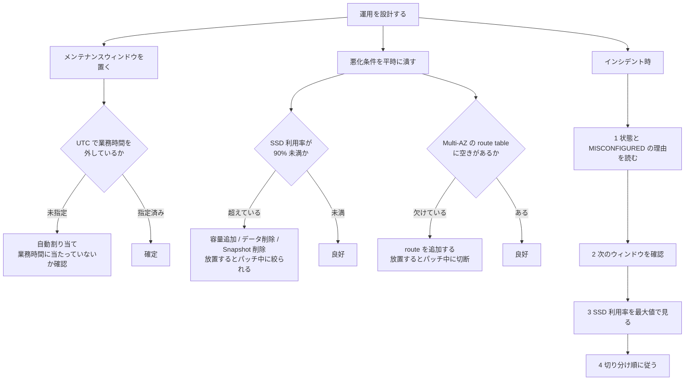

# メンテナンスは 14 日を超えて延期できない

[🏠 リポジトリトップ](../../../../../README.md) | [Playbook 05 — 運用](../README.md)

---

## 結論

**ONTAP のパッチ適用はサービス側が実施します。** 自分でバージョンを選ぶ操作ではありません。決められるのは**いつ実施されるか**だけです。

そして延期には上限があります。**メンテナンスウィンドウは 14 日に 1 回は発生する必要があります。** パッチが公開されてから 14 日以内にウィンドウが来ない場合、**FSx for ONTAP はメンテナンスを実施します。** 無期限に避けることはできません。

さらに重要なのは、**2 つの状態がパッチ適用を悪化させる**という点です。どちらも事前に解消できます。

| 状態 | パッチ適用時に起きること |
|---|---|
| **SSD 階層が 90% を超えている** | **スループットが一時的に絞られます。** 背景処理を妥当な時間で完了させるためです |
| **ファイルサーバーへの route が欠けている**（Multi-AZ で route table に空きがない） | **接続中のクライアントがパッチ適用の間、切断されます** |

> **Evidence**: `documented` — 頻度・所要時間・停止時間・悪化条件は AWS 公式ドキュメントの記載に基づきます。
> **自環境での実測値は含みません。** ウィンドウ中の影響を測る手順は
> 「[自分の環境で確かめる](#自分の環境で確かめる)」にあります。

---

## パッチ適用中に何が起きるか

| 項目 | 内容 |
|---|---|
| 頻度 | **数週間に 1 回程度**。頻繁ではありません |
| 単位 | ファイルサーバーを**1 台ずつ**順に適用します |
| 1 台あたりの所要時間 | **最大 1 時間程度** |
| I/O 停止 | HA ペア内のファイルサーバーにパッチを当てる前に**自動でフェイルオーバー**します。**60 秒未満**の I/O 一時停止が発生しえます |
| 復帰時 | その後**フェイルバック**します。**ここでも 60 秒未満**の一時停止が発生しえます |
| 性能への影響 | 多くのワークロードでは影響ありません。性能に敏感な場合、まれに 60 秒未満の影響が出ます |

**停止は 1 回ではなく 2 回です。** フェイルオーバーとフェイルバックの両方で発生しえます。「切り替わるときだけ」という前提で設計すると、復帰側を見落とします。

メンテナンス開始前に、**FSx for ONTAP は日和見ロック（opportunistic lock）をすべて閉じ、保留中の書き込みを完了させます。** データ整合性を確保するためです。

### オフラインのボリュームは online にされます

**パッチ適用を成功させるため、FSx for ONTAP はオフラインのボリュームを適用期間中 online にします。**

そして **online に戻されたボリュームはクライアントからアクセスできません。**

意図的にオフラインにしているボリュームがある場合、**その状態はメンテナンス期間中は保証されません。**

---

## ウィンドウをどう置くか

| 項目 | 内容 |
|---|---|
| 指定形式 | `d:HH:MM`（UTC）。`d` は 1 = 月曜、7 = 日曜 |
| 例 | `1:05:00` は月曜 5 時（UTC） |
| 作成時に未指定の場合 | **自動的に割り当てられます** |
| 変更 | 必要に応じて何度でも変更できます |
| 制約 | **14 日に 1 回はウィンドウが発生する必要があります** |

**UTC であることに注意してください。** 現地時間で夜間を狙って設定したつもりが、業務時間に当たることがあります。

作成時に指定しなかった場合は自動割り当てなので、**業務時間に当たっていないかを確認してください。** 変更はファイルシステムの更新操作で行えます。

---

## メンテナンスを悪化させる 2 つの状態

### SSD 階層が 90% を超えている

**次のメンテナンスウィンドウまでに SSD 階層の空きを作らないと、パッチ適用の間スループットが絞られます。**

これは [監視は平均値で失敗する](monitoring-fails-on-averages.md#ssd-利用率の帯域と各点で変わること) に書いた 90% の帯域に、もう 1 つ結果が加わるということです。**90% を超えると、容量プールからの読み取りがキャッシュされなくなるだけでなく、メンテナンス時の性能も落ちます。**

解消方法は 3 つです。

- SSD 容量を増やす
- 不要なデータを削除する
- **不要なボリューム Snapshot を削除する**

3 番目を忘れないでください。データを削除しても Snapshot が保持していると空きは増えません。理由は [Snapshot は容量として現れます](../../../domains/cost/notes/provisioned-versus-consumed.md#snapshot-は容量として現れます) にあります。

### ファイルサーバーへの route が欠けている（Multi-AZ）

Multi-AZ では、NFS / SMB のデータアクセス用エンドポイントと管理エンドポイントが **VPC route table の浮動 IP アドレス**を使います。

**route が欠けていて、かつ既存の route table に新しいエントリを追加する空きがない場合、次のメンテナンスウィンドウまでに route を追加しないと、接続中のクライアントがパッチ適用の間切断されます。**

FSx for ONTAP は Multi-AZ の route table を**タグベースの認証**で管理します。タグは `Key: AmazonFSx`、`Value: ManagedByAmazonFSx` です。

**CloudFormation で Multi-AZ ファイルシステムを作成・更新する場合、このタグを手動で追加することが推奨されています。** IaC で作った Multi-AZ 環境では確認対象です。境界の考え方は [IaC の境界は API の表面で決まる](../../04-build/notes/what-iac-cannot-reach.md) にあります。

---

## インシデント時の初動

**最初にやるのは設定変更ではなく、状態と理由を読むことです。** FSx for ONTAP は `MISCONFIGURED` などの状態と、その理由を提示します。**理由が対処方法を名指しします。**

| # | 初動 | 理由 |
|---|---|---|
| 1 | ファイルシステムの状態と、`MISCONFIGURED` の理由を確認する | **理由ごとに対処が決まっています。** 推測で触る前に読みます |
| 2 | 次のメンテナンスウィンドウがいつかを確認する | 悪化条件が未解消なら、そこが期限です |
| 3 | SSD 利用率を**最大値**で確認する | 90% / 98% を超えていないか。平均では見えません |
| 4 | Multi-AZ なら route table の空きを確認する | 切断の予兆になります |
| 5 | 性能問題なら切り分け順に従う | [性能劣化の切り分け順](monitoring-fails-on-averages.md#性能劣化の切り分け順) |
| 6 | 復旧が必要なら、守備範囲を確認する | [Snapshot があることと復旧できることは別](../../../domains/data-protection/notes/snapshots-are-not-a-recovery-plan.md#何から守れるのか) |

**手順 1 と 2 を先に置く理由は、期限があるからです。** 悪化条件を抱えたままウィンドウを迎えると、影響が拡大します。逆に言えば、**ウィンドウまでに解消すれば通常のパッチ適用に戻ります。**

手順 3 で平均値を使わない理由は [監視は平均値で失敗する](monitoring-fails-on-averages.md) にあります。

---

## 更新できるファイルシステムのプロパティ

メンテナンスに関係するものを含め、稼働中に変更できる項目です。

| プロパティ | 内容 |
|---|---|
| 自動日次バックアップ | 有効・無効、バックアップウィンドウ、保持期間 |
| 週次メンテナンスウィンドウ | 曜日と時刻 |
| `fsxadmin` のパスワード | ONTAP CLI / REST API 用 |
| VPC route table | Multi-AZ で関連付け・解除ができます |

**デプロイタイプと世代はここに含まれません。** 変更できない項目は [デプロイタイプは一度しか決められない](../../02-design/notes/deployment-type-is-decided-once.md#チェックリストに載っていない不可逆項目) にあります。

---

## 運用フロー

---

## 自分の環境で確かめる

**測る対象はウィンドウ中の実際の影響です。** 60 秒未満という記載が自環境のワークロードにとって許容できるかは、測らないと分かりません。

| # | 手順 | 確認できること |
|---|---|---|
| 1 | メンテナンスウィンドウの設定値を UTC で確認する | 業務時間に当たっていないか。未指定なら自動割り当てです |
| 2 | 直近のメンテナンス実施時刻を記録する | 実際の頻度 |
| 3 | ウィンドウ中のアプリケーション側の挙動を観測する | **60 秒未満の停止が 2 回起きたときに何が起きるか。** 再試行で吸収できるか |
| 4 | SSD 利用率を最大値で確認し、90% との距離を記録する | ウィンドウまでに解消が必要か |
| 5 | Multi-AZ なら route table のエントリ数と上限を確認する | 空きがあるか |
| 6 | オフラインにしているボリュームを一覧する | メンテナンス中に online にされる対象 |
| 7 | `MISCONFIGURED` の理由を読む手順を初動手順書に書く | 推測で触らないための最初の一歩 |

手順 3 が最も重要です。**「60 秒未満」が許容できるかどうかは、アプリケーションのタイムアウト設定で決まります。** ストレージ側の値だけでは判断できません。

---

## よくある誤解

| 誤解 | 実際 |
|---|---|
| ONTAP のバージョンを自分で選んで更新する | サービス側が実施します。決められるのは実施時刻です |
| メンテナンスは延期し続けられる | **14 日以内にウィンドウがなければ実施されます** |
| 停止は切り替わるときの 1 回だけ | **フェイルオーバーとフェイルバックで 2 回**発生しえます |
| パッチ適用は一斉に行われる | ファイルサーバーを 1 台ずつ、1 台あたり最大 1 時間程度です |
| ウィンドウを指定しなければメンテナンスされない | 未指定なら**自動的に割り当てられます** |
| ウィンドウはローカル時間 | **UTC** です |
| オフラインにしたボリュームはその状態が保たれる | パッチ適用中は online にされ、**クライアントからはアクセスできません** |
| SSD 利用率はメンテナンスと無関係 | **90% を超えるとパッチ適用中にスループットが絞られます** |
| route の不足は性能問題 | **パッチ適用中にクライアントが切断されます** |
| インシデントではまず設定を変える | 状態と `MISCONFIGURED` の理由を先に読みます。理由が対処を名指しします |

---

## 参照した一次情報

| 論点 | 出典 |
|---|---|
| パッチ頻度が数週間に 1 回程度であること、1 台ずつ最大 1 時間程度、フェイルオーバーとフェイルバックでそれぞれ 60 秒未満の I/O 一時停止、性能への影響、ウィンドウの指定と自動割り当て、14 日に 1 回の制約と超過時に実施されること、オフラインボリュームが online にされクライアントからアクセスできないこと、日和見ロックを閉じて保留書き込みを完了させること | [AWS: Optimizing performance with Amazon FSx maintenance windows](https://docs.aws.amazon.com/fsx/latest/ONTAPGuide/maintenance-windows.html) |
| SSD 階層が 90% を超えたままウィンドウを迎えるとパッチ適用の間スループットが絞られること、解消手段（容量追加・データ削除・Snapshot 削除） | [AWS: Your file system is in a MISCONFIGURED state](https://docs.aws.amazon.com/fsx/latest/ONTAPGuide/file-system-in-misconfigured-state.html) |
| route が欠けていて route table に空きがない場合、次のウィンドウまでに追加しないとパッチ適用中にクライアントが切断されること | [AWS: You can't access your file system](https://docs.aws.amazon.com/fsx/latest/ONTAPGuide/unable-to-access.html) |
| 更新できるプロパティ（自動日次バックアップ、週次メンテナンスウィンドウ、`fsxadmin` パスワード、VPC route table）、Multi-AZ が浮動 IP を使うこと、タグベース認証と `Key: AmazonFSx` / `Value: ManagedByAmazonFSx`、CloudFormation では手動でのタグ追加が推奨されること | [AWS: Updating file systems](https://docs.aws.amazon.com/fsx/latest/ONTAPGuide/updating-file-system.html) |
| ウィンドウの `d:HH:MM` 形式と曜日番号 | [AWS CloudFormation: AWS::FSx::FileSystem OntapConfiguration](https://docs.aws.amazon.com/AWSCloudFormation/latest/TemplateReference/aws-properties-fsx-filesystem-ontapconfiguration.html) |

---

## 関連ドキュメント

- [Playbook 05 — 運用](../README.md) — このモジュールのハブ
- [監視は平均値で失敗する](monitoring-fails-on-averages.md) — SSD 利用率の帯域と切り分け順
- [課金は「確保した量」と「使った量」に分かれる](../../../domains/cost/notes/provisioned-versus-consumed.md) — Snapshot が容量を保持する仕組み
- [デプロイタイプは一度しか決められない](../../02-design/notes/deployment-type-is-decided-once.md) — 変更できない項目
- [IaC の境界は API の表面で決まる](../../04-build/notes/what-iac-cannot-reach.md) — Multi-AZ の route table タグ
- [Snapshot があることと復旧できることは別](../../../domains/data-protection/notes/snapshots-are-not-a-recovery-plan.md) — 復旧の守備範囲
- [知見の分類ポリシー](../../../evidence-policy.md)

---

[🏠 リポジトリトップ](../../../../../README.md) | [Playbook 05 — 運用](../README.md)
