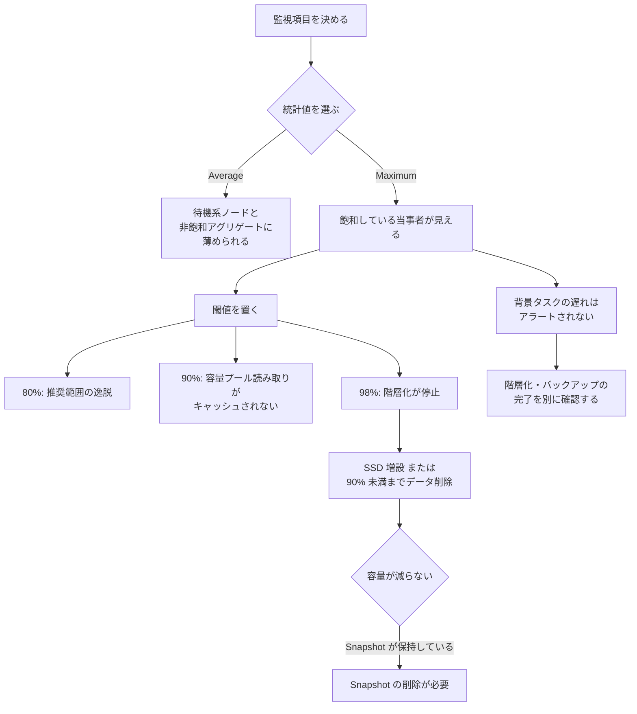

# 監視は平均値で失敗する

[🏠 リポジトリトップ](../../../../../README.md) | [Playbook 05 — 運用](../README.md)

---

## 結論

**閾値を決める前に、どの統計値（Average / Maximum）で見るかを決めてください。** 平均値で監視すると、飽和しているのに正常に見えます。

理由は 2 つあり、どちらも構造的なものです。

1. **待機系ノードが平均を引き下げます。** 奇数番のファイルサーバーが優先系、偶数番が待機系です。待機系はパートナーが利用不可のときだけトラフィックを処理するため、通常は利用率が低く出ます。**両者を平均すると、設計上ほぼ半分の値になります。**
2. **1 つのアグリゲートの飽和が平均に埋もれます。** 利用率系メトリクス（名前が `Utilization` で終わるもの）は、期間ごとにアグリゲート単位・ファイルサーバー単位で 1 データポイントを出します。一方で FlexVol は**ちょうど 1 つのアグリゲート**に載るため、飽和しているアグリゲートこそが問題のボリュームを抱えている当事者です。

さらに厄介なのが 3 つ目で、これは統計値の選択では防げません。**FSx for ONTAP はクライアントトラフィックを背景タスクより優先します。** 対象は階層化（tiering）、ストレージ効率化、バックアップです。負荷が高い時間帯には、これらが**アラートを出さずに遅れます。**

> **Evidence**: `documented` — 閾値と挙動は AWS 公式ドキュメントの記載に基づきます。
> **どの閾値でどう遅くなるかの実測値は含みません。** 自環境での確認手順は
> 「[自分の環境で確かめる](#自分の環境で確かめる)」にあります。

---

## SSD 利用率の帯域と、各点で変わること

80% は「推奨」ですが、**その先には挙動が変わる点が 2 つあります。** 閾値を 80% だけに置くと、超えた後に何が起きるかを説明できません。

| SSD 利用率 | 起きること |
|---|---|
| 〜80% | 推奨範囲。**一時的なスパイクは許容されます。** 継続的な平均を 80% 未満に保つと、拡張の余地と階層化の正常動作が確保されます |
| 90% 以上 | **容量プール階層から読んだデータが SSD にキャッシュされなくなります。** 読み取りのたびに容量プールへ行きます |
| 98% 以上 | **階層化が完全に停止します。** 性能劣化が現れます |

**98% から戻す手順は 2 つだけです。** SSD 容量を増やすか、SSD 利用率が 90% 未満になるまでデータを削除します。90% を下回った時点で階層化が再開します。

---

## 容量が減らないとき、消したデータは Snapshot が握っています

データを削除しても SSD 利用率が変わらない場合、**削除したデータを含む Snapshot が残っています。** 空き容量を作るには Snapshot の削除が必要です。

これは容量監視と保持ポリシーが同じ問題であることを意味します。**Snapshot の保持設計は容量設計の一部です。** 保持期間と上限の関係は [Snapshot があることと復旧できることは別](../../../domains/data-protection/notes/snapshots-are-not-a-recovery-plan.md#上限と保持期間) にあります。

---

## 階層化ポリシーを `All` にしても SSD は使われます

**すべての書き込みは、階層化ポリシーに関係なく最初に SSD に書かれます。** その後で容量プールへ移動します。

**ファイルのメタデータは階層化ポリシーに関係なく常に SSD に置かれます。** したがって `All` 階層化のボリュームでも SSD の消費はゼロになりません。**目安は SSD : 容量プール = 1 : 10 です。**

「`All` にしたので SSD は要らない」という前提でサイジングすると、メタデータ分で足りなくなります。

---

## 性能劣化の切り分け順

**ネットワークとディスクのどちらが先に飽和しているかを見ます。** 順番に意味があります。上から下へ、影響範囲の広い順です。

| # | 見るもの | 判断 |
|---|---|---|
| 1 | SSD 利用率 | 90% / 98% を超えていないか。超えていれば原因はここです |
| 2 | ネットワークスループット利用率 | 100% に達していないか。**HA ペア 1 組分の容量に対する比率**です |
| 3 | ディスク IOPS 利用率 | 100% に達していないか。アグリゲート単位で見ます |
| 4 | 背景タスクの遅れ | 階層化・バックアップが追いついているか |

手順 2 で注意が要ります。`NetworkThroughputUtilization` は**背景タスク（SnapMirror、階層化、バックアップ）のトラフィックも含めた全トラフィック**を対象にします。「クライアントの負荷は低いのに利用率が高い」場合、背景タスクが動いています。

---

## FSx for ONTAP が出す警告と、自分で作るアラーム

FSx for ONTAP は、メトリクスが**複数の連続データポイントで**あらかじめ定められた閾値に近づくか超えたときに警告を表示します。**単発のスパイクでは出ません。**

警告は **Monitoring & performance** ダッシュボードに出ます。`ALARM` 状態の CloudWatch アラームも同じ **Summary** セクションに並びます。

自分で SSD 容量のアラームを作る場合、ドキュメントが示す構成はこうです。

- **名前空間**: `AWS/FSx` の Detailed File System Metrics <!-- allow:naming - CloudWatch の名前空間そのもの -->
- **メトリクス**: **`MAX(StorageCapacityUtilization)`**
- **期間**: 5 分
- **条件**: 静的しきい値、80 以上

**`MAX` が使われている点が重要です。** 冒頭の理由がそのままここに現れています。フィルタを空にすると、いずれかのファイルシステムが閾値を超えた時点で発火します。

---

## 監視の粒度と保持

| 項目 | 値 |
|---|---|
| 既定の送信間隔 | 1 分 |
| 例外 | `FileServerDiskThroughputBalance` と `FileServerDiskIopsBalance` は 5 分 |
| 保持期間 | 15 か月 |
| メトリクスのカテゴリ | ファイルシステム / ファイルサーバー / アグリゲート別 / 階層別 / ボリューム / ボリューム詳細 |

**カテゴリはディメンションで決まります。** 「ボリュームごとの容量を階層別に見たい」なら詳細ボリュームメトリクスであり、ファイルシステムメトリクスでは出せません。

---

## 監視設計フロー

---

## 自分の環境で確かめる

**平均と最大の差が、自環境でどれだけ開くかを測ってください。** 差が小さい構成では平均でも気づけますが、それは確認して初めて言えることです。

| # | 手順 | 確認できること |
|---|---|---|
| 1 | 同じ期間の `DiskIopsUtilization` を Average と Maximum で並べる | **どれだけ薄まっているか。** 監視を作り直す根拠になります |
| 2 | ファイルサーバー別に利用率を出し、奇数番と偶数番を比べる | 待機系が平均を引き下げている量 |
| 3 | 負荷試験中に階層化の進行を観測する | クライアント優先で背景タスクがどれだけ遅れるか |
| 4 | データを削除して SSD 利用率の変化を見る | Snapshot が容量を握っていないか |
| 5 | `All` 階層化のボリュームで SSD 消費を測る | メタデータ分が 1 : 10 の目安と合うか |
| 6 | 世代（第 1 / 第 2）とリージョンを記録する | 上限値そのものが変わります |

手順 1 を最初に置いているのは、**これが最も安く、最も効くからです。** 既存のメトリクスを統計値だけ変えて描き直すだけで済みます。

手順 6 の前提は [スループットは 1 つの値で決まらない](../../../domains/performance/notes/where-throughput-is-determined-and-shared.md) にあります。

---

## よくある誤解

| 誤解 | 実際 |
|---|---|
| 利用率が平均 40% なので余裕がある | **待機系ノードが平均を引き下げます。** 優先系が飽和していても平均は低く出ます |
| アグリゲートの平均が低いので問題ない | FlexVol は 1 つのアグリゲートに載ります。**飽和した 1 つが問題のボリュームを抱えています** |
| 80% を閾値にしておけば十分 | 90% でキャッシュが止まり、98% で階層化が停止します。**超えた後の挙動が段階的に変わります** |
| 一時的に 80% を超えたら即対応が必要 | 一時的なスパイクは許容されます。**継続的な平均**が判断対象です |
| 階層化ポリシーを `All` にすれば SSD は消費されない | 全書き込みは最初に SSD へ行き、メタデータは常に SSD に残ります。目安は 1 : 10 です |
| データを削除すれば SSD の空きが増える | 削除したデータを含む Snapshot が残っていると減りません |
| バックアップが失敗していないので間に合っている | 背景タスクは**クライアントトラフィックより後回しにされます。** 遅れはアラートされません |
| ネットワーク利用率が高いのはクライアント負荷のせい | SnapMirror・階層化・バックアップのトラフィックも同じメトリクスに含まれます |
| 98% を超えても SSD を増やせばすぐ戻る | 階層化の再開は**90% を下回ってから**です |

---

## 参照した一次情報

| 論点 | 出典 |
|---|---|
| 奇数番が優先系・偶数番が待機系で利用率が低く出ること、`NetworkThroughputUtilization` が HA ペア 1 組分に対する比率で背景タスクを含むこと | [AWS: Second-generation file system metrics](https://docs.aws.amazon.com/fsx/latest/ONTAPGuide/so-file-system-metrics.html) |
| 利用率系メトリクスがアグリゲート単位・ファイルサーバー単位で出ること、それ以外は合計 1 点であること | [AWS: File system metrics](https://docs.aws.amazon.com/fsx/latest/ONTAPGuide/file-system-metrics.html) |
| 名前空間、1 分間隔と 2 つの例外、15 か月保持、メトリクスのカテゴリ | [AWS: Monitoring with Amazon CloudWatch](https://docs.aws.amazon.com/fsx/latest/ONTAPGuide/monitoring-cloudwatch.html) |
| 80% 推奨、スパイクの許容、`MAX(StorageCapacityUtilization)` を使うアラーム構成 | [AWS: Creating a storage capacity utilization alarm](https://docs.aws.amazon.com/fsx/latest/ONTAPGuide/alarm-low-primary-storage.html) |
| 90% でキャッシュされない、98% で階層化停止、SSD が容量プールへの書き込みと乱読をステージングすること | [AWS re:Post: How do I troubleshoot slow performance?](https://repost.aws/knowledge-center/fsx-ontap-fix-slow-performance) |
| 全書き込みが SSD 経由であること、90% 未満まで削除すると階層化が再開すること、Snapshot が削除データを保持すること | [AWS re:Post: Why didn't the capacity change after changing the tiering policy to ALL?](https://repost.aws/knowledge-center/fsx-ontap-volume-tiering-troubleshoot) |
| クライアントトラフィックが背景タスク（階層化・ストレージ効率化・バックアップ）より優先されること、メタデータが常に SSD にあること、1 : 10 の目安 | [AWS: Migrating to FSx for ONTAP using NetApp SnapMirror](https://docs.aws.amazon.com/fsx/latest/ONTAPGuide/migrating-fsx-ontap-snapmirror.html) |
| 複数の連続データポイントで警告が出ること、ダッシュボード上の表示位置 | [AWS: Performance warnings and recommendations](https://docs.aws.amazon.com/fsx/latest/ONTAPGuide/performance-insights-FSxN.html) <!-- allow:naming - AWS ドキュメントの URL -->|

---

## 関連ドキュメント

- [Playbook 05 — 運用](../README.md) — このモジュールのハブ
- [スループットは 1 つの値で決まらない](../../../domains/performance/notes/where-throughput-is-determined-and-shared.md) — 上限そのものの決まり方。FlexVol と アグリゲートの関係はここにあります
- [Snapshot があることと復旧できることは別](../../../domains/data-protection/notes/snapshots-are-not-a-recovery-plan.md) — 保持設計は容量設計と同じ問題です
- [本番投入前レビュー](../../04-build/checklists/pre-production-review.md) — 監視が入っていることを確認する項目を含みます
- [上限値・クォータ](../../../reference/limits/) — 出典と検証日付きの上限値
- [知見の分類ポリシー](../../../evidence-policy.md)

---

[🏠 リポジトリトップ](../../../../../README.md) | [Playbook 05 — 運用](../README.md)
