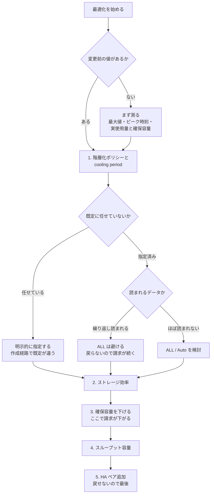

# 階層化の既定値は作成方法で違う

[🏠 リポジトリトップ](../../../../../README.md) | [Playbook 06 — 最適化](../README.md)

---

## 結論

**階層化ポリシーの既定値は、ボリュームをどう作ったかで変わります。**

| 作成方法 | 既定のポリシー | 既定の cooling period |
|---|---|---|
| Amazon FSx コンソール <!-- allow:naming - AWS のコンソール名 --> | **`Auto`** | **31 日** |
| AWS CLI / Amazon FSx API / ONTAP CLI <!-- allow:naming - AWS の API 名 --> | **`Snapshot Only`** | **2 日** |

**同じ「既定のまま」で作ったボリュームが、作成経路によって別の挙動になります。** コンソールで作った検証環境と、CloudFormation で作った本番環境で階層化の挙動が違う、という状態が既定で起こります。

> **CLI 側は実測で確認しました。** AWS CLI で `TieringPolicy` を指定せずにボリュームを作成すると
> **`SNAPSHOT_ONLY` / cooling `2`** になります。作成経路を制御した**因果の確認**です。
> 区分は `verified`（検証日 2026-08-06、`ap-northeast-1`、`SINGLE_AZ_1`）。
> **コンソール側は検証していません** — ドキュメント記載と、環境内に `AUTO` / 31 のボリュームが
> 存在することの 2 点にとどまります。記録は [上限値・クォータ](../../../reference/limits/) にあります。

もう 1 つ。**読み取ったデータが SSD に戻るかどうかもポリシーで違います。** `Auto` はランダム読み取りで戻り、`ALL` は戻りません。

> **Evidence**: `documented` — ポリシー・既定値・読み取り時の挙動は AWS 公式ドキュメントと API リファレンスの記載に基づきます。
> **削減率や所要時間の実測値は含みません。** 自環境での測定手順は
> 「[自分の環境で確かめる](#自分の環境で確かめる)」にあります。

---

## 4 つのポリシーと、読み取り時の挙動

| ポリシー | 容量プールへ移すもの | cooling period | 読み取ったときの挙動 |
|---|---|---|---|
| `Snapshot Only` | Snapshot のデータのみ | 既定 2 日（2〜183） | 読むと hot になり **SSD に書き戻されます** |
| `Auto` | コールドなユーザーデータと Snapshot | 既定 31 日（2〜183） | **ランダム読み取りなら SSD に書き戻され、シーケンシャル読み取りならコールドのまま**残ります |
| `ALL` | すべてのユーザーデータと Snapshot | — | 読んでも**コールドのまま。SSD に書き戻されません** |
| `NONE` | 何も移しません | — | 主ストレージに留まります |

`Auto` の挙動は狙いがはっきりしています。**通常のファイルアクセス（ランダム読み取り）で使われたデータは SSD に戻り、ウイルススキャンのような全件走査（シーケンシャル読み取り）では戻りません。** スキャンのたびに全データが SSD に戻ることを避ける設計です。

`ALL` は逆です。**何度読んでも戻らないため、繰り返し読まれるデータでは容量プールのリクエスト課金が発生し続けます。** リクエスト課金の位置づけは [階層化は「常に安くなる」わけではありません](../../../domains/cost/notes/provisioned-versus-consumed.md#階層化は常に安くなるわけではありません) にあります。

**どのポリシーでもファイルのメタデータは常に SSD に残ります。** ポリシーは変更可能で、変更に停止は伴いません。

---

## なぜ既定値の差が問題になるのか

`Snapshot Only`（既定 2 日）と `Auto`（既定 31 日）では、**移す対象そのものが違います。** 前者は Snapshot だけ、後者はユーザーデータも含みます。

つまりコンソールで作ったボリュームは、**ユーザーデータが 31 日でコールド判定されて容量プールへ移り始めます。** CLI や API で作ったボリュームでは、ユーザーデータは移りません。

これが効いてくる場面が 2 つあります。

| 場面 | 起きること |
|---|---|
| 検証はコンソール、本番は IaC | 検証で観測した容量とコストの推移が本番で再現しません |
| 移行ツールや自動化がボリュームを作る | 自動化経路は `Snapshot Only` になるため、想定していた階層化が起きません |

**対策は 1 つです。ポリシーと cooling period を明示的に指定してください。** 既定に任せると、作成経路が変わったときに挙動が変わります。再現可能な構築を扱う [Playbook 04 — 構築](../../04-build/) の観点でも、ここは明示すべき項目です。

---

## 変更の順序は「戻せるか」で決める

最適化は「効果が大きい順」ではなく、**戻せる順に試すのが安全です。** 戻せない変更を先に打つと、効果がなかったときに元に戻せません。

| 順 | 変更 | 戻せるか | 効くもの |
|---|---|---|---|
| 1 | 階層化ポリシーと cooling period | **戻せる**（無停止で変更可） | 容量プールへ移る量 |
| 2 | ストレージ効率（重複排除・圧縮） | 戻せる | SSD の実使用量 |
| 3 | SSD 確保容量の削減 | 戻せる | SSD の請求 |
| 4 | スループット容量の変更 | 戻せる（フェイルオーバーを伴う） | スループット上限と請求 |
| 5 | HA ペアの追加 | **戻せません** | HA ペアあたりの上限 |

**5 は最後です。** 追加した HA ペアは削除できず、SSD 容量も同じ比率で増えます。制約は [デプロイタイプは一度しか決められない](../../02-design/notes/deployment-type-is-decided-once.md#ha-ペアを足すときに起きること) にあります。

4 の前提として、**スループット設定を上げただけでは上限に届きません。** SSD 容量と IOPS の構成が伴う必要があります。詳細は [スループットは 1 つの設定値では決まらない](../../../domains/performance/notes/where-throughput-is-determined-and-shared.md#スループット設定が実際に決めているもの) にあります。

---

## 変える前に測っていないなら、それは最適化ではありません

**変更前の値がなければ、効果を主張できません。** そして測り方には前提があります。

| 測るもの | 注意 |
|---|---|
| SSD 利用率 | **平均ではなく最大で見ます。** 理由は [監視は平均値で失敗する](../../05-operate/notes/monitoring-fails-on-averages.md) にあります |
| 容量プールのリクエスト数 | 階層化の是非を決める主要な入力 |
| SSD の実使用量と確保容量 | **分けて記録します。** 効率化は実使用量を下げますが、確保容量を下げないと請求は変わりません |
| ピーク時刻 | 再現条件。平均値だけでは比較できません |
| リージョン・世代・デプロイタイプ | 上限も単価も変わります |

ボトルネックの切り分け順そのものは [性能劣化の切り分け順](../../05-operate/notes/monitoring-fails-on-averages.md#性能劣化の切り分け順) にあります。**このノートの範囲は、特定できた後に何をどの順で変えるかです。**

---

## ストレージ効率の効果をどう測るか

重複排除と圧縮の効果は、**「空き容量が増えた」では測れません。** 請求は確保容量に対して発生するためです。

| # | 記録するもの | 意味 |
|---|---|---|
| 1 | 有効化前の実使用量と確保容量 | 基準値 |
| 2 | 有効化後の実使用量 | 効率化そのものの効果 |
| 3 | 有効化後の確保容量 | **変えていなければ請求は同じ** |
| 4 | 確保容量を下げた後の請求 | ここで初めてコスト効果が出ます |

**手順 3 で止まっている報告が最も多いパターンです。** 効率化の効果と請求の変化は別に記録してください。理由は [重複排除と圧縮は SSD の請求を下げません](../../../domains/cost/notes/provisioned-versus-consumed.md#重複排除と圧縮は-ssd-の請求を下げません) にあります。

---

## コストと可用性のトレードオフ

削れる額と引き換えに何を受け入れるかは、[トレードオフの提示のしかた](../../../domains/cost/notes/provisioned-versus-consumed.md#トレードオフの提示のしかた) に対称の表があります。**このノートでは重複させません。**

最適化の文脈で追加すべき観点は 1 つです。**背景タスク（階層化・ストレージ効率化・バックアップ）はクライアントトラフィックより後回しにされます。** スループット容量を絞ると、ピーク時にこれらが遅れる度合いが増えます。効率化を有効にしたのに実使用量が下がらない場合、**効果がないのではなく処理が追いついていない**可能性があります。

---

## 最適化フロー

---

## 自分の環境で確かめる

**最初に確認するのは、いま何のポリシーで動いているかです。** 既定に任せていた場合、思っているものと違う可能性があります。

| # | 手順 | 確認できること |
|---|---|---|
| 1 | 全ボリュームの階層化ポリシーと cooling period を一覧する | **作成経路による差が実在するか。** コンソール作成と IaC 作成が混在していないか |
| 2 | ポリシーが未指定のボリュームを洗い出す | 既定に依存している範囲 |
| 3 | 容量プールにあるデータをランダム読み取りし、SSD 利用率の変化を見る | `Auto` で書き戻しが起きるか |
| 4 | 同じデータをシーケンシャル読み取りし、変化を比べる | 全件走査で戻らないことの確認 |
| 5 | cooling period を短くして容量の推移を記録する | 移動が始まるまでの実際の時間 |
| 6 | 効率化の前後で実使用量と確保容量を分けて記録する | 請求に効いていないことの確認 |
| 7 | 変更前後で最大値・ピーク時刻を揃えて比較する | 効果の主張ができるか |

手順 1 と 2 は読み取りのみで、すぐに実行できます。**ここで差が出たら、それが最初に直すべき項目です。**

手順 3 と 4 は検証環境を推奨します。本番で行うと SSD 利用率が上がります。

---

## よくある誤解

| 誤解 | 実際 |
|---|---|
| 既定の階層化ポリシーは 1 つ | **作成方法で違います。** コンソールは `Auto`（31 日）、CLI / API / ONTAP CLI は `Snapshot Only`（2 日） |
| コンソールで検証した結果が IaC の本番でも再現する | 既定に任せている場合、階層化の対象そのものが違います |
| `Snapshot Only` でもユーザーデータは移る | 移りません。Snapshot のデータのみです |
| cooling period は固定 | 2〜183 日で設定できます |
| 階層化ポリシーの変更には停止が伴う | 無停止で変更できます |
| 一度容量プールに移ったデータは戻らない | ポリシー次第です。`Auto` はランダム読み取りで戻り、`ALL` は戻りません |
| ウイルススキャンを走らせると全データが SSD に戻る | `Auto` ではシーケンシャル読み取りはコールドのまま扱われます |
| `ALL` にすれば読み取りも安くなる | 戻らないので、読むたびにリクエスト課金が発生し続けます |
| 効率化を有効にすれば請求が下がる | 確保容量を下げるまで変わりません |
| 効果が出ないのは効率化が効いていないから | 背景タスクは後回しにされます。追いついていない可能性があります |
| 効果の大きい変更から試すべき | **戻せる順に試してください。** HA ペア追加は戻せません |

---

## 参照した一次情報

| 論点 | 出典 |
|---|---|
| 4 つのポリシーの動作、cooling period の既定値（`Auto` 31 日 / `Snapshot Only` 2 日）、コンソールの既定が `Auto`・CLI / API / ONTAP CLI の既定が `Snapshot Only` であること、ランダム読み取りで hot になり書き戻される一方でシーケンシャル読み取りはコールドのまま残ること、`ALL` では読んでも書き戻されないこと、メタデータが常に SSD に残ること、ポリシーは随時変更できること | [AWS: Volume storage capacity](https://docs.aws.amazon.com/fsx/latest/ONTAPGuide/volume-storage-capacity.html) |
| cooling period の範囲が 2〜183 日であること、既定ポリシーが `SNAPSHOT_ONLY` であること、各ポリシーの定義 | [AWS API Reference: TieringPolicy](https://docs.aws.amazon.com/fsx/latest/APIReference/API_TieringPolicy.html) |
| CloudFormation でのポリシー指定と、変更が中断を伴わないこと | [AWS CloudFormation: AWS::FSx::Volume TieringPolicy](https://docs.aws.amazon.com/AWSCloudFormation/latest/TemplateReference/aws-properties-fsx-volume-tieringpolicy.html) |
| 重複排除・圧縮がデータを縮めるが確保済みストレージに対して課金されること | [AWS Prescriptive Guidance: Choose the right SMB file storage](https://docs.aws.amazon.com/prescriptive-guidance/latest/optimize-costs-microsoft-workloads/storage-fsx-smb.html) |
| クライアントトラフィックが背景タスクより優先されること | [AWS: Migrating to FSx for ONTAP using NetApp SnapMirror](https://docs.aws.amazon.com/fsx/latest/ONTAPGuide/migrating-fsx-ontap-snapmirror.html) |
| 追加した HA ペアを削除できないこと | [AWS: Adding high-availability (HA) pairs](https://docs.aws.amazon.com/fsx/latest/ONTAPGuide/adding-HA-pairs.html) |

---

## 関連ドキュメント

- [Playbook 06 — 最適化](../README.md) — このモジュールのハブ
- [監視は平均値で失敗する](../../05-operate/notes/monitoring-fails-on-averages.md) — 測り方とボトルネックの切り分け順
- [課金は「確保した量」と「使った量」に分かれる](../../../domains/cost/notes/provisioned-versus-consumed.md) — リクエスト課金とトレードオフの提示
- [デプロイタイプは一度しか決められない](../../02-design/notes/deployment-type-is-decided-once.md) — HA ペア追加の不可逆性
- [スループットは 1 つの設定値では決まらない](../../../domains/performance/notes/where-throughput-is-determined-and-shared.md) — スループット設定を上げる前の前提
- [Playbook 04 — 構築](../../04-build/) — 再現可能な構築。ポリシーの明示はここでも扱う項目です
- [上限値・クォータ](../../../reference/limits/) — 出典と検証日付きの上限値
- [知見の分類ポリシー](../../../evidence-policy.md)

---

[🏠 リポジトリトップ](../../../../../README.md) | [Playbook 06 — 最適化](../README.md)
