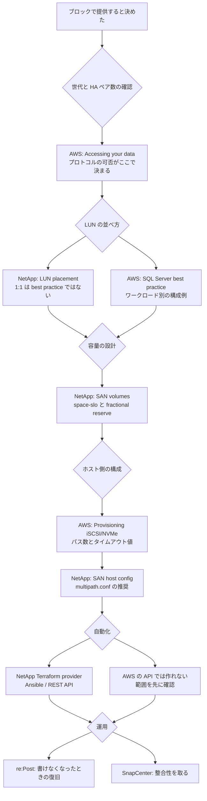

# ブロックストレージ横断リソースマップ

[🏠 リポジトリトップ](../../../README.md) | [Reference](README.md) | [Domain — ブロックストレージ](../domains/block-storage/README.md)

---

## 結論

**ブロックストレージの一次情報は 5 か所に分かれており、どこに何が書かれていないかを知らないと設計を誤ります。**

| 資料の種類 | 書かれていること | 書かれていないこと |
|---|---|---|
| AWS ユーザーガイド | 手順、ポート、ホスト側コマンド、AWS が保証する範囲 | LUN・igroup の上限値、NVMe/TCP を Windows で使う手順 |
| AWS ブログ | ワークロード別の構成例と実測 | 測定条件の一部（後述の食い違いを参照） |
| NetApp ドキュメント | ONTAP 側の仕様、パス数の指針、容量の数え方、整合性の定義 | FSx for ONTAP 固有の制約 |
| AWS re:Post | 詰まったときの復旧手順 | 設計の根拠 |
| 公開 IaC | 実際に作れるオブジェクトの範囲 | どこまでが AWS の API でどこからが ONTAP かの説明 |

**この 5 つを横断して読む順序が、このページの本体です。** 業種別の索引は [業種別リソースマップ](industry-resource-map.md) にあります。

> **区分**: `documented` — 各リソースの所在と、そこに何が書かれているかを記載しています。**すべての URL は 2026-09-05 に到達を確認しました。** 到達できなかったページは載せていません（末尾の「到達できなかったページ」を参照）。
> **性能値は含めません。** 公開ベンチマークの数値は測定条件と切り離せないため、[公開ベンチマークの読み方](../domains/block-storage/notes/when-shared-block-changes-the-design.md#公開ベンチマークの読み方) で条件込みで扱います。

---

## 読む順序

---

## 手順を実行するときの一次情報

| 種類 | リソース | 論点 |
|------|----------|------|
| 手順 | [AWS: Accessing your FSx for ONTAP data](https://docs.aws.amazon.com/fsx/latest/ONTAPGuide/accessing-data-from-on-premises.html) | **プロトコルの可否がここで決まる。** iSCSI は HA ペア 6 組以下、NVMe/TCP は第 2 世代かつ 6 組以下 |
| 手順 | [AWS: Supported clients](https://docs.aws.amazon.com/fsx/latest/ONTAPGuide/supported-fsx-clients.html) | SVM のエンドポイントは 5 種（`Nfs` / `Smb` / `Iscsi` / `Nvme` / `Management`）。iSCSI と NVMe/TCP は同じ LIF を使う |
| 手順 | [AWS: Creating an iSCSI LUN](https://docs.aws.amazon.com/fsx/latest/ONTAPGuide/create-iscsi-lun.html) | LUN 最大 128 TB、ボリュームは LUN より 5% 以上大きく、`-space-allocation enabled` 推奨、`ostype` は Windows でも `windows_2008` |
| 手順 | [AWS: Provisioning iSCSI for Linux](https://docs.aws.amazon.com/fsx/latest/ONTAPGuide/mount-iscsi-luns-linux.html) | `replacement_timeout` を 120 から **5** へ、`mpathconf --enable`、WWID は `3600a0980` + シリアル hex |
| 手順 | [AWS: Provisioning iSCSI for Windows](https://docs.aws.amazon.com/fsx/latest/ONTAPGuide/mount-iscsi-windows.html) | `Install-WindowsFeature Multipath-IO`、`New-MSDSMSupportedHW -VendorId MSFT2005`、負荷分散は round robin、検証スクリプト `CheckiSCSI.ps1` |
| 手順 | [AWS: Provisioning NVMe/TCP for Linux](https://docs.aws.amazon.com/fsx/latest/ONTAPGuide/provision-nvme-linux.html) | namespace → subsystem → map → host NQN の順。データポート **4420**、discovery **8009**、`nvme connect-all -l 1800` |
| 上限 | [AWS: Quotas](https://docs.aws.amazon.com/fsx/latest/ONTAPGuide/limits.html) | 第 2 世代 1 HA ペアの下限スループットは **384 MBps**。**LUN・igroup・namespace の上限は 1 つも載っていません** |
| 上限 | [AWS: Availability and deployment options](https://docs.aws.amazon.com/fsx/latest/ONTAPGuide/high-availability-AZ.html) | 世代ごとのスループット選択肢。第 2 世代 1 HA ペアは 384 / 768 / 1,536 / 3,072 / 6,144 MBps |
| 制約 | [AWS: Adding HA pairs](https://docs.aws.amazon.com/fsx/latest/ONTAPGuide/adding-HA-pairs.html) | 7 組目を足すとブロックプロトコルが使えなくなり、**足した HA ペアは削除できません** |
| 制約 | [AWS: Managing throughput capacity](https://docs.aws.amazon.com/fsx/latest/ONTAPGuide/managing-throughput-capacity.html) | スループット変更はフェイルオーバーを伴い、**NFS / SMB / iSCSI に透過的**と書かれています（NVMe/TCP は名指しされていません） |
| ポート | [AWS: Security groups](https://docs.aws.amazon.com/fsx/latest/ONTAPGuide/limit-access-security-groups.html) | iSCSI の 3260 は載っています。**4420 と 8009 は載っていません** |

---

## 設計判断の根拠になる AWS ブログ

| 種類 | リソース | 論点 |
|------|----------|------|
| 技術資料 | [SAN: A million IOPs in AWS from Amazon FSx NetApp ONTAP](https://aws.amazon.com/blogs/storage/san-a-million-iops-in-aws-from-amazon-fsx-netapp-ontap/) | **10 ファイルシステムを LVM で 1 論理ボリュームに束ねた構成**。2022-09-08 時点の 1 ファイルシステム上限は 80,000 IOPS / 2 GB/s。キャッシュに乗ると provisioned IOPS を超えて出ること、10 系統の Snapshot 整合には調整スクリプトが必要なことを本文が明記 <!-- allow:naming - 記事タイトルの原文 --> |
| 技術資料 | [同記事の日本語版](https://aws.amazon.com/jp/blogs/news/san-a-million-iops-in-aws-from-amazon-fsx-netapp-ontap/) | 翻訳時点で 1 ファイルシステム上限が 160,000 IOPS / 4 GB/s に上がっていることを訳注が記載。**数値の陳腐化がこの記事自身に記録されています** |
| 技術資料 | [Best practice configuration for Microsoft SQL Server workloads](https://aws.amazon.com/blogs/storage/best-practice-configuration-of-amazon-fsx-for-netapp-ontap-for-microsoft-sql-server-workloads) | iSCSI と NVMe/TCP の両方に対応。**1 ボリューム 1 LUN**（.MDF 用と .LDF 用）、snapshot 予約 0%、LUN 予約有効、autosize autogrow、EC2 は n 系を優先 |
| 技術資料 | [SQL Server high availability with FSx for ONTAP](https://aws.amazon.com/jp/blogs/modernizing-with-aws/sql-server-high-availability-amazon-fsx-for-netapp-ontap/) | FCI では**両ノードの IQN を 1 つの igroup に入れ**、両エンドポイントをターゲットにして MPIO + ALUA に任せる。実際のレイアウトは **1 ボリュームに 3 LUN**（quorum / data / logs） |
| 技術資料 | [Building highly available Oracle databases](https://aws.amazon.com/blogs/architecture/building-highly-available-oracle-databases-with-amazon-fsx-for-netapp-ontap/) | Multi-AZ を iSCSI 共有ストレージとして使い、両エンドポイントに multipath。**記事自身が conceptual illustration と明記**しており実測値はありません |
| 技術資料 | [Using SnapCenter to protect SQL Server workloads](https://aws.amazon.com/blogs/storage/using-netapp-snapcenter-with-amazon-fsx-for-netapp-ontap-to-protect-your-sql-server-workloads) | **Snapshot は常に crash-consistent**。整合性を取るには I/O の静止が必要で、SnapCenter がそれを行う。ボリュームの snapshot policy は `none` にする |
| 技術資料 | [Second-generation file systems](https://aws.amazon.com/blogs/storage/accelerate-file-workload-performance-with-second-generation-amazon-fsx-for-netapp-ontap-file-systems/) | 第 2 世代の位置づけ。NVMe/TCP が第 2 世代限定である背景 |
| 発表 | [NVMe-over-TCP support](https://aws.amazon.com/about-aws/whats-new/2024/07/amazon-fsx-netapp-ontap-nvme-over-tcp) | 2024-07 に追加。**iSCSI に比べて MPIO の構成が単純になる**ことを利点として挙げています |

---

## ONTAP 側の仕様を確認する NetApp ドキュメント

| 種類 | リソース | 論点 |
|------|----------|------|
| 技術資料 | [NetApp: LUN placement](https://docs.netapp.com/us-en/ontap-apps-dbs/oracle/oracle-storage-san-config-lun-placement.html) | **1 LUN 1 ボリュームは formal best practice ではない**と明記。Snapshot と SnapMirror がボリューム単位で動くため、関連する LUN は同居させるのが通常 |
| 技術資料 | [NetApp: SAN volumes](https://docs.netapp.com/us-en/ontap/volumes/san-volumes-concept.html) | `space-guarantee none` / `space-slo thick` / `semi-thick` の違い。**SAN の LUN と NAS 共有を同じ FlexVol に混在させることは推奨されていません** |
| 技術資料 | [NetApp: Fractional reserve](https://docs.netapp.com/us-en/ontap/san-admin/set-fractional-reserve-concept.html) | fractional reserve は **0 か 100 しか取らない**。0 にできる条件が列挙されています |
| 技術資料 | [NetApp: Multipathing](https://docs.netapp.com/us-en/ontap/san-config/host-support-multipathing-concept.html) | iSCSI は ALUA、NVMe は ANA。**1 ノードあたり 8 パスを超えない**、LUN あたり reporting node ごとに最低 2 パス |
| 技術資料 | [NetApp: Selective LUN Map](https://docs.netapp.com/us-en/ontap/san-admin/selective-lun-map-concept.html) | **新しい LUN マップでは既定で有効**。別の HA ペアへ LUN やボリュームを移す前に、宛先ノードとその HA パートナーを reporting-nodes に追加する必要があります |
| 技術資料 | [NetApp: Linux SAN host configuration](https://docs.netapp.com/us-en/ontap-sanhost/hu-ol-9x.html) | **推奨は 0 バイトの `/etc/multipath.conf`**。`path_grouping_policy group_by_prio`、`no_path_retry queue`、`dev_loss_tmo infinity` などのコンパイル済み既定値が載ります |
| 技術資料 | [NetApp: Snapshot consistency (REST API)](https://docs.netapp.com/us-en/ontap-restapi/application_applications_application.uuid_snapshots_endpoint_overview.html) | application-consistent と crash-consistent のフラグは**記録用であって ONTAP から見た違いはない**と明記。既定は crash-consistent |
| 技術資料 | [NetApp: Destination volume data access](https://docs.netapp.com/us-en/ontap/data-protection/configure-destination-volume-data-access-concept.html) | SnapMirror 宛先で LUN を使うには、**LUN マップ・iSCSI セッション・再スキャンを宛先側で作り直す**必要があります。igroup はデータと一緒に移りません |
| 技術資料 | [NetApp: SnapCenter overview](https://docs.netapp.com/us-en/snapcenter/get-started/concept_snapcenter_overview.html) | アプリ別のホスト側プラグイン構成。VMware プラグインは crash-consistent と VM-consistent、仮想化 DB は application-consistent |
| 技術資料 | [NetApp: Trident ONTAP SAN driver](https://docs.netapp.com/us-en/trident/trident-use/ontap-san.html) | `ontap-san` は **PV ごとに FlexVol + LUN**、`ontap-san-economy` は共有 FlexVol に多数の LUN。NVMe/TCP は `ontap-san` 側で REST 経由のみ |

---

## 詰まったときの re:Post

| 種類 | リソース | 論点 |
|------|----------|------|
| 復旧 | [LUN が read-only になった](https://repost.aws/knowledge-center/fsx-ontap-lun-in-read-only-mode) | thin provisioning でファイルシステムが満杯になると **LUN が read-only に落ちる**。復旧はボリューム拡張 → `lun resize` → OS 側の fsck |
| 手順 | [iSCSI で Linux にマウントする](https://repost.aws/knowledge-center/ec2-mount-fsx-ontap-iscsi) | ユーザーガイドにない **systemd での永続化**（`_netdev,x-systemd.automount`）を補っています |
| 手順 | [NVMe/TCP で Linux にマウントする](https://repost.aws/knowledge-center/ec2-mount-fsx-ontap-nvme-tcp) | 前提条件として **TCP 4420 の双方向開放**と第 2 世代・6 HA ペア以下を明記 |

---

## 自動化に使える公開 IaC とサンプル

**AWS の API とツールで作れるのはファイルシステム・SVM・ボリュームまでです。** LUN より下は ONTAP 側の道具が必要です。

| 種類 | リソース | 論点 |
|------|----------|------|
| パターン | [NetApp/terraform-provider-netapp-ontap](https://github.com/NetApp/terraform-provider-netapp-ontap) | `netapp-ontap_lun` / `_san_igroup` / `_san_lun-map` / `_iscsi_service` / `_nvme_namespace`。**`nvme_subsystem` のリソースはありません**（namespace は作れてもマップは作れない） |
| パターン | [ansible-collections/netapp.ontap](https://github.com/ansible-collections/netapp.ontap) | `na_ontap_lun` / `_lun_map` / `_lun_map_reporting_nodes` / `_igroup` / `_iscsi` / `_nvme_namespace` / `_nvme_subsystem`。**subsystem まで揃うのはこちら** |
| パターン | [NetApp/FSx-ONTAP-samples-scripts](https://github.com/NetApp/FSx-ONTAP-samples-scripts) | `Management-Utilities/iscsi-vol-create-and-mount/`、`ec2-user-data-iscsi-create-and-mount/`、`Monitoring/LUN-monitoring/`、`Infrastructure_as_Code/Terraform/deploy-fsx-ontap-sqlserver/` <!-- allow:naming - リポジトリ名は識別子 --> |
| パターン | [NetApp/ontap-rest-python](https://github.com/NetApp/ontap-rest-python) | `examples/rest_api/lun_operations.py`。REST を直接叩く場合の最短経路 |
| パターン | [NetApp/fsxn-iscsisetup-ps](https://github.com/NetApp/fsxn-iscsisetup-ps) | Windows ホストへの iSCSI 接続を PowerShell で自動化。**最終更新は 2023 年**なので現行 ONTAP での動作は未確認 |
| パターン | [NetApp/trident](https://github.com/NetApp/trident) | Kubernetes の CSI ドライバ本体 |
| パターン | [NetApp/terraform-aws-netapp-fsxn-eks-addon](https://github.com/NetApp/terraform-aws-netapp-fsxn-eks-addon) | Trident を EKS アドオンとして導入する Terraform モジュール |
| パターン | [aws-samples/amazon-eks-fsx-for-netapp-ontap](https://github.com/aws-samples/amazon-eks-fsx-for-netapp-ontap) | EKS + Trident のサンプル。ブロック専用のモジュールはありません |
| パターン | [aws-samples/rosa-fsx-netapp-ontap](https://github.com/aws-samples/rosa-fsx-netapp-ontap) | OpenShift on AWS + Trident。**最終更新は 2023 年** |
| API | [ONTAP REST: LUNs](https://docs.netapp.com/us-en/ontap-restapi/ontap/storage_luns_endpoint_overview.html) | `/api/storage/luns` |
| API | [ONTAP REST: igroups](https://docs.netapp.com/us-en/ontap-restapi/ontap/protocols_san_igroups_endpoint_overview.html) | `/api/protocols/san/igroups` |
| API | [ONTAP REST: LUN maps](https://docs.netapp.com/us-en/ontap-restapi/ontap/protocols_san_lun-maps_endpoint_overview.html) | `/api/protocols/san/lun-maps` |
| API | [ONTAP REST: NVMe subsystems](https://docs.netapp.com/us-en/ontap-restapi/ontap/protocols_nvme_subsystems_endpoint_overview.html) | `/api/protocols/nvme/subsystems` |
| API | [ONTAP REST: NVMe namespaces](https://docs.netapp.com/us-en/ontap-restapi/ontap/storage_namespaces_endpoint_overview.html) | `/api/storage/namespaces` |
| API | [AWS: Amazon FSx API operations](https://docs.aws.amazon.com/fsx/latest/APIReference/API_Operations.html) | **ブロックオブジェクトの操作は 1 つもありません** |
| API | [AWS: CloudFormation Amazon FSx resource types](https://docs.aws.amazon.com/AWSCloudFormation/latest/TemplateReference/AWS_FSx.html) | 6 種類のみ。LUN・igroup・namespace のリソースタイプは存在しません |

---

## 資料間の食い違い

**同じ論点について AWS の資料同士が違うことを言っている箇所があります。** どちらかが誤りとは限らず、前提が違います。設計判断の前にここを読んでください。

| 論点 | 一方の記載 | もう一方の記載 | 読み方 |
|---|---|---|---|
| LUN とボリュームの比率 | [SQL Server best practice](https://aws.amazon.com/blogs/storage/best-practice-configuration-of-amazon-fsx-for-netapp-ontap-for-microsoft-sql-server-workloads): **1 ボリューム 1 LUN** | [SQL Server HA](https://aws.amazon.com/jp/blogs/modernizing-with-aws/sql-server-high-availability-amazon-fsx-for-netapp-ontap/): **1 ボリュームに 3 LUN**。[NetApp](https://docs.netapp.com/us-en/ontap-apps-dbs/oracle/oracle-storage-san-config-lun-placement.html): 1:1 は best practice ではない | **決めているのは復旧の粒度です。** [LUN の並べ方が決めているのは復旧の粒度](../domains/block-storage/notes/lun-layout-decides-recovery-granularity.md) を参照 |
| iSCSI のセッション数 | [Provisioning iSCSI](https://docs.aws.amazon.com/fsx/latest/ONTAPGuide/mount-iscsi-windows.html): 8 セッションで 5,000 MBps、これで**最上位のスループット容量 4,000 MBps を賄える** | [Quotas](https://docs.aws.amazon.com/fsx/latest/ONTAPGuide/limits.html): 第 2 世代の上限は Multi-AZ 6,144 MBps / Single-AZ 73,728 MBps | **8 セッションの指針は第 1 世代を前提に書かれています。** 第 2 世代で上限まで使うならセッション数の再計算が必要 |
| ホストあたりのパス数 | [AWS](https://docs.aws.amazon.com/fsx/latest/ONTAPGuide/mount-iscsi-luns-linux.html): ノード・AZ あたり 8 セッション | [NetApp](https://docs.netapp.com/us-en/ontap-sanhost/hu-ol-9x.html): AFF/FAS では **1 LUN に 4 パス超は障害時に問題を起こしうる** | セッション数とパス数は別の数え方です。[パスはフェイルオーバーの仕組みそのもの](../domains/block-storage/notes/paths-are-the-failover-mechanism.md) を参照 |
| NVMe/TCP のポート | [Security groups](https://docs.aws.amazon.com/fsx/latest/ONTAPGuide/limit-access-security-groups.html): 4420 の記載なし | [Provisioning NVMe/TCP](https://docs.aws.amazon.com/fsx/latest/ONTAPGuide/provision-nvme-linux.html) と [re:Post](https://repost.aws/knowledge-center/ec2-mount-fsx-ontap-nvme-tcp): 4420 が必要 | **セキュリティグループの要件表は NVMe/TCP について不完全です。** iSCSI 用に書いた規則では NVMe/TCP は通りません |
| フェイルオーバーの透過性 | [Managing throughput capacity](https://docs.aws.amazon.com/fsx/latest/ONTAPGuide/managing-throughput-capacity.html): NFS / SMB / **iSCSI** に透過的 | NVMe/TCP については記載なし。[Provisioning NVMe/TCP](https://docs.aws.amazon.com/fsx/latest/ONTAPGuide/provision-nvme-linux.html) が controller loss timeout 1800 秒を指示 | **NVMe/TCP の透過性は文書化されていません。** 未記載であることを未対応と読み替えないこと |

---

## このリポジトリの設計ノート

| 種類 | リソース | 論点 |
|------|----------|------|
| ノート | [ブロックプロトコルの選択肢は世代と HA ペア数で先に狭まる](../domains/block-storage/notes/protocol-choice-is-bounded-before-you-choose.md) | iSCSI と NVMe/TCP の選択、LIF の共有、ポートの落とし穴 |
| ノート | [LUN の並べ方が決めているのは復旧の粒度](../domains/block-storage/notes/lun-layout-decides-recovery-granularity.md) | 1:1 か集約か。`lun move` と Selective LUN Map |
| ノート | [LUN と igroup は AWS の API の外側にある](../domains/block-storage/notes/block-objects-are-outside-the-aws-api.md) | IaC の境界と、それをまたぐ道具 |
| ノート | [容量は 3 か所で数えられる](../domains/block-storage/notes/capacity-is-counted-in-three-places.md) | ボリューム・LUN 予約・Snapshot 予約と、書けなくなる経路 |
| ノート | [パスはフェイルオーバーの仕組みそのもの](../domains/block-storage/notes/paths-are-the-failover-mechanism.md) | multipath / MPIO の責任分界とタイムアウト |
| ノート | [LUN の Snapshot は既定で crash-consistent](../domains/block-storage/notes/a-snapshot-of-a-lun-is-crash-consistent.md) | 整合性の定義と SnapCenter の位置 |
| ノート | [共有ブロックが設計を変える条件](../domains/block-storage/notes/when-shared-block-changes-the-design.md) | 選択肢の比較と、公開ベンチマークの読み方 |
| ノート | [Kubernetes のブロック PV はボリューム数の上限に当たる](../domains/block-storage/notes/kubernetes-block-volumes-and-the-volume-limit.md) | `ontap-san` と `ontap-san-economy` の分岐点 |
| ノート | [デプロイタイプは一度しか決められない](../playbooks/02-design/notes/deployment-type-is-decided-once.md) | HA ペア 6 組の天井がここで決まります |
| 決定木 | [ブロックプロトコルとレイアウトの決定木](decision-trees/block-protocol-and-layout.md) | 上の判断を 1 枚にまとめたもの |
| 比較 | [ブロックストレージの選択肢の比較](comparison/block-storage-options.md) | EBS などとの対称なトレードオフ |

---

## AI エージェントに渡すときの注意

**このページを検索して数値だけを引き抜くと誤ります。** 上の「資料間の食い違い」に挙げた 5 点は、どれも片方だけを読むと成り立つ記述です。

| 引き抜きやすい値 | そのままでは誤る理由 |
|---|---|
| 「8 セッションで 5,000 MBps」 | 第 1 世代のスループット上限を前提にした計算です |
| 「1 ボリューム 1 LUN が best practice」 | AWS の別記事と NetApp の記載が異なります |
| 「100 万 IOPS」 | 10 ファイルシステムを束ねた 2022 年の測定値で、当時の 1 ファイルシステム上限は 80,000 IOPS です |
| 「Snapshot でアプリケーションを復旧できる」 | 既定は crash-consistent です。静止は別の仕組みが必要です |
| 「LUN の上限は N 個」 | **AWS もこのページも LUN 数の上限を示していません。** 出典のない数値です |

---

## 到達できなかったページ

**以下は 2026-09-05 時点で本文が取得できなかったため、このページからは参照していません。**

| ページ | 状態 |
|---|---|
| `provision-nvme-windows.html` | サービス概要ページへリダイレクト。**NVMe/TCP を Windows で使う手順は AWS のドキュメントに見当たりません**（対応の可否も記載されていません） |
| `mount-iscsi-luns-windows.html` | 現行の URL は `mount-iscsi-windows.html` です |
| `limits-file-system-resources.html` | 現行の上限ページは `limits.html` です |

**Fibre Channel については、AWS のドキュメントが「使えない」と書いているのではなく、プロトコルの列挙に現れないという状態です。** 未記載を非対応と書き換えないでください。

---

## 関連ドキュメント

- [Domain — ブロックストレージ](../domains/block-storage/README.md) — このリソースマップが支えるモジュール
- [業種別リソースマップ](industry-resource-map.md) — 業種軸の索引
- [直近のアップデートと設計への影響](recent-updates.md) — 新機能がどのノートを無効にするか
- [上限値・クォータ](limits/) — 出典と検証日付きの上限値
- [用語集](glossary/) — LUN / igroup / IQN / ALUA / ANA
- [知見の分類ポリシー](../evidence-policy.md)

---

[🏠 リポジトリトップ](../../../README.md) | [Reference](README.md) | [Domain — ブロックストレージ](../domains/block-storage/README.md)
