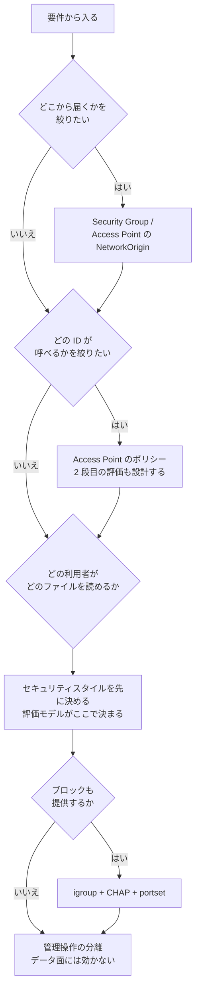

# アクセスを絞る手立ての比較

[🏠 リポジトリトップ](../../../../README.md) | [Reference](../README.md) | [比較](README.md) | [Domain — セキュリティ・ガバナンス](../../domains/security-governance/README.md)

---

## 結論

**「アクセスを絞る」手立ては 1 つの層に並んでいません。** 効く対象が違うので、**どれか 1 つを選ぶ表ではありません。**

| 層 | 何を絞るか | 通れば次の層で再評価されるか |
|---|---|---|
| ネットワーク | **どこから届くか** | される |
| 認可（AWS 側） | **どの ID が API / Access Point を呼べるか** | される |
| プロトコル側の権限 | **どの利用者がどのファイルを読めるか** | ここが最終 |
| 管理操作の分離 | **誰が構成を変えられるか** | 別系統。データ面には効きません |

**上の層で通したものが下の層で止まることはあり、逆もあります。** 片方だけを設計して「絞った」と扱うと、もう片方が空いたままになります。

**この表が答えないこと**: どれが安全かは要件で決まります。**推奨は置いていません。** 各手立ての制約は、推奨したい側も含めて対称に書いています。

---

## 比較

| 手立て | 絞る対象 | 変更できるか | 引き受ける制約 | 一次情報 |
|---|---|---|---|---|
| **Security Group** | ファイルシステムに届くネットワーク | 後から変更可 | **プロトコルのポートを開けた先は絞りません。** 届いた後は下の層の話になります | [AWS: Security Group によるアクセス制限](https://docs.aws.amazon.com/fsx/latest/ONTAPGuide/limit-access-security-groups.html) |
| **FSx for ONTAP S3 AP のポリシー** | どの ID が Access Point を呼べるか | **ポリシーは後から変更可。それ以外は作成時に確定** | **Access Point のパラメータは Policy 以外は変更できません。** `NetworkOrigin` を含みます | [AP 側のパラメータ — Policy 以外は作成時に確定](../../domains/security-governance/notes/access-point-authorization-layers.md#ap-側のパラメータ--policy-以外は作成時に確定) |
| **同上（2 段目の評価）** | 上を通ったリクエストの ONTAP 側での扱い | — | **2 段あることを前提に書かないと、片方だけで絞ったつもりになります。** 症状から落ちた段を逆引きする手順が必要です | [Layer 1 — 結合で評価されることの帰結](../../domains/security-governance/notes/access-point-authorization-layers.md#layer-1--結合で評価されることの帰結) |
| **エクスポートポリシー（NFS）** | どのクライアントがボリュームをマウントできるか | 後から変更可 | **セキュリティスタイルによって、この後の評価モデルが変わります。** NFS だけを見て設計できません | [セキュリティスタイルと権限評価の対応](../../domains/multiprotocol-identity/notes/security-style-and-permission-evaluation.md#セキュリティスタイルと権限評価の対応) |
| **NTFS ACL / UNIX モード** | どの利用者がどのファイルを読めるか | 後から変更可 | **スタイルが NTFS の場合、ID マッピングを止めても SMB アクセスは止まりません。** 止められるものと止められないものが分かれます | [止められるものと止められないもの](../../domains/multiprotocol-identity/notes/security-style-and-permission-evaluation.md#止められるものと止められないもの) |
| **igroup（ブロック）** | どのイニシエータが LUN を見られるか | 後から変更可 | **これだけではありません。** CHAP と portset が別の軸で効き、portset はパス数も減らします | [どれを使うかの判断](../../domains/block-storage/notes/igroups-are-not-the-only-access-control.md#どれを使うかの判断) |
| **管理者権限の分離** | 誰が構成を変えられるか | 後から変更可 | **データ面には効きません。** 逆に、データを読めない管理者が構成を壊せる状態は残ります | [権限設計 — 管理者の分離](../../domains/security-governance/notes/what-the-platform-gives-and-what-stays-yours.md#権限設計--管理者の分離) |
| **窓口を作って権限を渡さない** | 利用者に管理者権限を渡さずに操作させる | 設計次第 | **認可・資源・寿命の 3 つを別に縛る必要があります。** 載せてはいけない操作があります | [責務の分割](../../domains/security-governance/notes/self-service-without-storage-admin.md#責務の分割) |

**数値と実測結果は転記していません。** 条件キーの実測や設定例は、それを持つノートにあります（同じ値を 2 か所に置くと片方が古くなります）。

---

## 選び方

**要件から入ります。手立てから入ると、層をまたいだ穴に気づけません。**

| 要件 | 先に決める層 | その後に必要になるもの |
|---|---|---|
| 特定のサブネットからだけ届かせたい | ネットワーク | **プロトコル側の権限。** 届いた先は絞られていません |
| 部門ごとにファイル単位で分けたい | プロトコル側の権限 | **セキュリティスタイル。** 評価モデルがここで決まり、後から変えると挙動が変わります |
| AI / 分析パイプラインから読ませたい | 認可（AWS 側） | **元の ACL は引き継がれません。** [平坦化の意味](../../domains/data-utilization/notes/reaching-data-without-copies.md#権限が平坦化されることの意味)を読んでから設計します |
| ブロックで特定ホストにだけ見せたい | igroup | **CHAP と portset。** igroup だけでは認証にならず、パス数も別問題です |
| 利用者に自分でボリュームを作らせたい | 管理操作の分離 | **窓口の設計。** 認可・資源・寿命を別に縛ります |
| 監査で「誰が読んだか」に答えたい | — | **答えられない範囲があります。** [監査の 2 つの面と、片方の穴の存在](../../domains/security-governance/notes/what-the-platform-gives-and-what-stays-yours.md#監査の-2-つの面と片方の穴の存在)を先に読みます |

**不可逆な選択が混じる場合は、順序が安全性を決めます。** 有効化とロックが別の段になっている仕組みでは、後戻りできる順に試す必要があります（[不可逆な操作は別の承認を要する](../../domains/security-governance/notes/irreversible-operations-need-separate-approval.md)）。

---

## 同じ内容の図

**下の図は上の 2 つの表の要約です。** 図が読めない環境でも判断できるように、内容は表側にあります。

---

## この比較が答えないこと

| 問い | どこにあるか |
|---|---|
| Access Point のポリシーの具体例 | [設定例 — 6 パターン](../../domains/security-governance/notes/access-point-authorization-layers.md#設定例--6-パターン) |
| 条件キーが実際にどう効いたか | [条件キーの実測結果](../../domains/security-governance/notes/access-point-authorization-layers.md#条件キーの実測結果) |
| 監査ログの宛先が枯渇したときに何が止まるか | [監査宛先の枯渇はアクセスを止める](../../domains/security-governance/notes/audit-log-space-and-client-access.md) |
| SMB のログオン監査で何が記録されるか | [SMB のログオン監査が拾う事象の範囲](../../domains/security-governance/notes/smb-logon-audit-event-coverage.md) |

**規制対応の判断は含みません。** ここにあるのは設計上の考慮事項で、法務・コンプライアンス上の判断ではありません。

---

## 関連ドキュメント

- [Domain — セキュリティ・ガバナンス](../../domains/security-governance/README.md)
- [S3 Access Point 経由のリクエストはどう判定されるか](../decision-trees/access-point-authorization.md)
- [Domain — マルチプロトコルと ID](../../domains/multiprotocol-identity/README.md)
