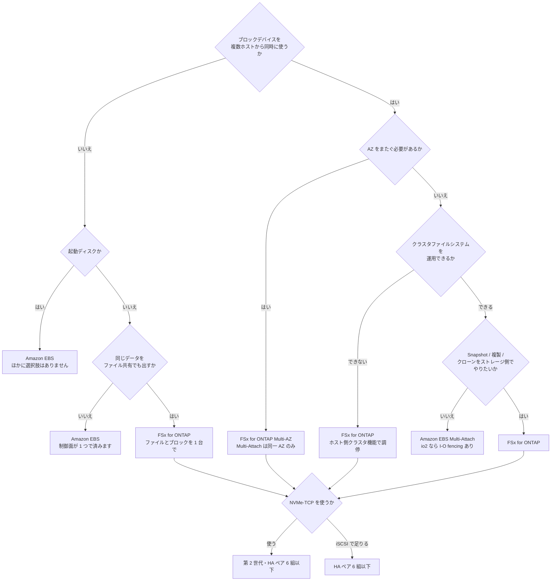

# ブロックストレージの選択肢の比較

[🏠 リポジトリトップ](../../../../README.md) | [Reference](../README.md) | [比較マトリクス](README.md)

---

## 結論

**分岐点は 1 つです。ブロックデバイスを複数のホストから同時に使う必要があるか。**

必要ないなら Amazon EBS が素直です。1 インスタンスに 1 ボリュームという形がそのまま課金単位で、制御面も EC2 だけで済みます。**単一インスタンスの起動ディスクや、そのインスタンスだけが使うデータ領域に FSx for ONTAP を持ち込む理由はありません。**

必要になった時点で、選択肢は Amazon EBS Multi-Attach と FSx for ONTAP のブロックに絞られます。**そしてこの 2 つは共有の意味が違います。** Multi-Attach は 1 ボリュームを最大 16 インスタンスに見せる仕組みで、整合性はホスト側のクラスタファイルシステムが担保します。FSx for ONTAP は LUN を igroup に見せる仕組みで、同じストレージから NFS・SMB も同時に出せ、Snapshot と SnapMirror がストレージ側で動きます。

> **区分**: `documented` — 各サービスの制約と上限は AWS 公式ドキュメントの記載に基づきます（2026-09-05 に確認）。
> **性能値と価格の比率は含めません。** どちらも改定されるため、現行の料金ページと自環境の測定で判断してください。FSx for ONTAP 側の最小構成コストのみ、判断に効くので後述します。

---

## 比較

| 観点 | Amazon EBS（`gp3` / `io2`） | Amazon EBS Multi-Attach（`io1` / `io2`） | FSx for ONTAP iSCSI | FSx for ONTAP NVMe/TCP |
|---|---|---|---|---|
| **同時に接続できるホスト数** | 1 | **最大 16**（Nitro、同一 AZ） | igroup に登録した initiator（AWS は上限を文書化していません） | subsystem に登録した host NQN（同上） |
| **AZ をまたげるか** | いいえ | **いいえ（同一 AZ のみ）** | Multi-AZ なら 2 AZ | Multi-AZ なら 2 AZ |
| **起動ディスクにできるか** | **はい** | **いいえ** | いいえ | いいえ |
| **整合性の担保** | 単独接続なので不要 | **クラスタファイルシステムが必須**。XFS / EXT4 は非対応。`io2` は NVMe reservation による I/O fencing に対応、`io1` は非対応 | ホスト側のクラスタ機能（WSFC など） | 同左 |
| **マルチパスの構成** | 不要 | ホスト側 | **必須**。multipath / MPIO をホストに構成します | 必須だが **iSCSI より構成が単純**とされています |
| **世代・構成の前提** | なし | Nitro、`io1` は 3 リージョンのみ | HA ペア **6 組以下** | **第 2 世代**かつ HA ペア 6 組以下 |
| **同じストレージからファイルも出せるか** | いいえ | いいえ | **はい**（同一ファイルシステム・SVM から NFS / SMB / S3 AP） | 同左 |
| **Snapshot の課金** | 別課金（S3 に GB-月） | 同左 | **確保済みの SSD 容量を消費**（別建ての課金項目にはなりません） | 同左 |
| **クローン** | Snapshot から新規ボリューム作成（コピー） | 同左 | **FlexClone**（実データをコピーせず書き込み可能な複製） | 同左 |
| **別リージョンへの複製** | Snapshot コピー | 同左 | **SnapMirror**（ボリューム単位。宛先で LUN マップと再スキャンが必要） | 同左 |
| **重複排除・圧縮** | なし | なし | **ボリューム単位で有効化可能** | 同左 |
| **制御面** | EC2 の API だけ | 同左 | **AWS の API と ONTAP の 2 つ**。LUN・igroup は AWS 側に存在しません | 同左（NVMe subsystem も同じ） |
| **課金の形** | ボリューム単位（容量 + IOPS + スループット） | 同左 | **ファイルシステム単位**（SSD 容量 + スループット容量 + 超過 IOPS） | 同左 |
| **最小の footprint** | 1 GiB から | 4 GiB から（`io2`） | **SSD 1,024 GiB + スループット 384 MBps** | 同左（第 2 世代のみ） |
| **フェイルオーバー時の挙動** | 単独接続なのでインスタンス側の問題 | ホスト側クラスタが判断 | **スループット変更時のフェイルオーバーは iSCSI に透過的と文書化**されています | **文書化されていません**（controller loss timeout 1800 秒の指示のみ） |
| **主なトレードオフ** | **共有できません。** 複数ホストから使いたくなった時点で作り直しになります | **クラスタファイルシステムの運用が増えます。** 標準ファイルシステムでは使えず、同一 AZ に閉じます | **HA ペア 6 組の天井があり、ホスト側 multipath と整合性は利用者の責任です。** 最小構成でもファイルシステム 1 台分のコストが立ちます | 上記に加え、**第 2 世代限定で、Windows 手順が文書化されていません** |
| **運用負荷** | 低い | 中（クラスタファイルシステム） | 中（2 つの制御面 + ホスト側 multipath） | 中（同左。MPIO は単純） |

**表のどこにも「速い」「優れている」を書いていないのは、それが構成で決まるからです。** 性能の比較をするなら、[公開ベンチマークの読み方](../../domains/block-storage/notes/when-shared-block-changes-the-design.md#公開ベンチマークの読み方) にある条件をそろえた上で自環境で測ってください。

---

## 共有の意味の違い

**「複数ホストから使える」は同じ言葉で 2 つの違うことを指しています。**

| | Amazon EBS Multi-Attach | FSx for ONTAP のブロック |
|---|---|---|
| 共有されているもの | **1 つのボリューム**そのもの | **1 つの LUN / namespace**。ファイルシステムには他の LUN も NFS ボリュームも同居できます |
| 書き込みの調停 | ホスト側のクラスタファイルシステム。`io2` は I/O fencing に対応 | ホスト側のクラスタ機能。ストレージ側は SCSI / NVMe の予約を通すのみ |
| 障害時に何が起きるか | インスタンスが落ちても他のインスタンスは書き続けます | **ファイルサーバーが切り替わる**ため、ホストは別パスへ切り替えます |
| 増やせる方向 | インスタンスを 16 まで | initiator を追加。**ただしスループットは HA ペア単位で共有**されます |

**どちらも「整合性はホスト側の責任」という点は共通です。** ストレージを共有ブロックにしても、2 つのホストが同じブロックに同時に書くことを止める仕組みは自動では付いてきません。

---

## FSx for ONTAP のブロックが設計を変える 4 点

**これは優劣ではなく、構造の違いです。** 該当しない要件なら Amazon EBS のほうが素直です。

| 構造 | 何が変わるか | 該当しない場合 |
|---|---|---|
| ファイルとブロックが同じストレージから出る | 同じデータを NFS で分析し iSCSI で DB に載せる、という構成が 1 台で組めます | 用途が 1 つなら関係ありません |
| Snapshot が確保済み容量を消費する | 世代を多く持っても別建ての課金項目が増えません。**ただし容量を食うので、SSD が満杯になると LUN が read-only に落ちます** | Snapshot を数世代しか持たないなら差は小さいです |
| SnapMirror がボリューム単位で動く | LUN を含むボリュームをそのまま別リージョンへ複製できます。**宛先で LUN マップと再スキャンは必要です** | 単一 AZ で完結するなら不要です |
| FlexClone が実データをコピーしない | 本番 LUN の書き込み可能な複製を短時間で作れます | 検証環境を都度作らないなら不要です |

**逆に、これらが要らない構成で FSx for ONTAP を選ぶと、SSD 1,024 GiB とスループット 384 MBps の最小構成コストが乗ります。** 東京リージョンの On-Demand で月あたり約 $927（Price List API、2026-09-05 取得）です。1 インスタンス用の数十 GiB のディスクにこれを充てる理由はありません。

---

## 選び方

**判断が分かれる典型を 3 つ挙げます。**

| 状況 | 選ぶもの | 理由 |
|---|---|---|
| 単一の EC2 に 100 GiB のデータ領域 | Amazon EBS `gp3` | 共有もファイル共有も要らず、制御面が 1 つで済みます |
| SQL Server FCI を 2 ノードで、同一 AZ | どちらも成立します | Multi-Attach なら EC2 の制御面だけ。FSx for ONTAP なら Snapshot と SnapMirror がストレージ側に来ます。**運用したい道具で選んでください** |
| SQL Server FCI を 2 ノードで、AZ をまたぐ | FSx for ONTAP Multi-AZ | **Multi-Attach は同一 AZ のみ**なので選択肢に入りません |

---

## よくある誤解

| 誤解 | 実際 |
|---|---|
| 共有ブロックにすれば複数ホストから安全に書ける | **書き込みの調停はホスト側の責任です。** どちらの選択肢でも、クラスタ機能なしに同じ領域へ同時に書くと壊れます |
| FSx for ONTAP なら 1 つのボリュームでファイルとブロックを混ぜるのが普通 | **同一ファイルシステム・SVM から両方出せます。** ただし NetApp は **SAN の LUN と NAS 共有を同じ FlexVol に混在させることを推奨していません** |
| Multi-Attach は 16 インスタンスまで無条件で使える | Nitro、同一 AZ、`io1` は 3 リージョンのみ、Windows は `io2` のみ、起動ディスク不可という条件が付きます |
| FSx for ONTAP の Snapshot はタダ | **別建ての課金項目にならないだけです。** 確保済み SSD 容量を消費し、満杯になると LUN が read-only に落ちます |
| NVMe/TCP は iSCSI の置き換えなのでどの構成でも使える | **第 2 世代のファイルシステムに限られます。** 第 1 世代では作り直し以外に道がありません |
| ブロックにすれば HA ペアを増やして性能を伸ばせる | **7 組目からブロックプロトコルが使えなくなります。** 上限は 6 組です |

---

## 参照した一次情報

| 論点 | 出典 |
|---|---|
| Multi-Attach の 16 インスタンス、同一 AZ、Nitro、`io1`/`io2` の別、Windows は `io2` のみ、起動ディスク不可、クラスタファイルシステム必須、`io2` の I/O fencing | [AWS: Attach an EBS volume to multiple EC2 instances using Multi-Attach](https://docs.aws.amazon.com/ebs/latest/userguide/ebs-volumes-multi.html) |
| `io2` Block Express の容量・IOPS・スループットの上限、`gp3` の IOPS 範囲 | [AWS: Amazon EBS Provisioned IOPS SSD volumes](https://docs.aws.amazon.com/ebs/latest/userguide/provisioned-iops.html) |
| iSCSI は HA ペア 6 組以下、NVMe/TCP は第 2 世代かつ 6 組以下 | [AWS: Accessing your FSx for ONTAP data](https://docs.aws.amazon.com/fsx/latest/ONTAPGuide/accessing-data-from-on-premises.html) |
| 第 2 世代 1 HA ペアの最小スループット 384 MBps、最小 SSD 1,024 GiB | [AWS: Quotas](https://docs.aws.amazon.com/fsx/latest/ONTAPGuide/limits.html) |
| スループット変更時のフェイルオーバーが NFS / SMB / iSCSI に透過的であること | [AWS: Managing throughput capacity](https://docs.aws.amazon.com/fsx/latest/ONTAPGuide/managing-throughput-capacity.html) |
| NVMe/TCP が iSCSI に比べ MPIO の構成を単純にすること | [AWS: FSx for ONTAP supports NVMe-over-TCP](https://aws.amazon.com/about-aws/whats-new/2024/07/amazon-fsx-netapp-ontap-nvme-over-tcp) |
| SAN の LUN と NAS 共有を同じ FlexVol に混在させることが推奨されないこと | [NetApp: SAN volumes](https://docs.netapp.com/us-en/ontap/volumes/san-volumes-concept.html) |
| SnapMirror 宛先で LUN マップと再スキャンが必要であること | [NetApp: Destination volume data access](https://docs.netapp.com/us-en/ontap/data-protection/configure-destination-volume-data-access-concept.html) |
| ボリュームが thin provisioned で、LUN 内のデータ削除で容量が戻ること | [AWS: How FSx for ONTAP works](https://docs.aws.amazon.com/fsx/latest/ONTAPGuide/how-it-works-fsx-ontap.html) |
| 満杯時に LUN が read-only に落ちること | [AWS re:Post: LUN in read-only mode](https://repost.aws/knowledge-center/fsx-ontap-lun-in-read-only-mode) |

---

## 関連ドキュメント

- [比較マトリクス](README.md) — このモジュールのハブ
- [共有ブロックが設計を変える条件](../../domains/block-storage/notes/when-shared-block-changes-the-design.md) — この比較の設計ノート版
- [ブロックプロトコルとレイアウトの決定木](../decision-trees/block-protocol-and-layout.md) — FSx for ONTAP を選んだ後の判断
- [容量は 3 か所で数えられる](../../domains/block-storage/notes/capacity-is-counted-in-three-places.md) — read-only に落ちる経路
- [デプロイタイプは一度しか決められない](../../playbooks/02-design/notes/deployment-type-is-decided-once.md) — HA ペア 6 組の天井
- [ブロックストレージ横断リソースマップ](../block-storage-resource-map.md) — 一次情報の索引
- [知見の分類ポリシー](../../evidence-policy.md)

---

[🏠 リポジトリトップ](../../../../README.md) | [Reference](../README.md) | [比較マトリクス](README.md)
