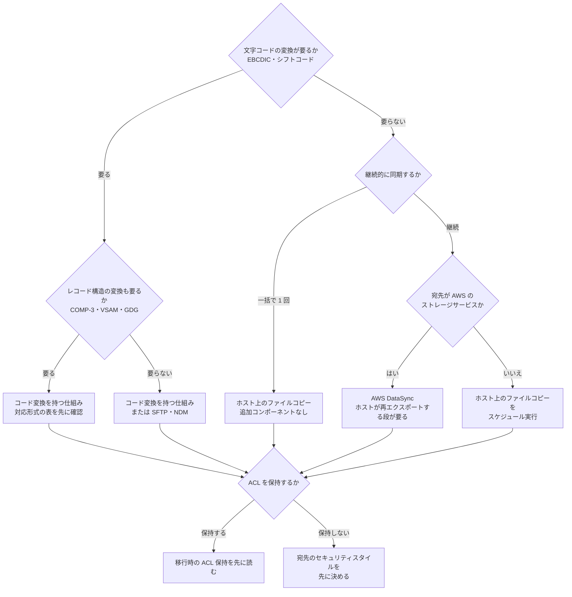

# ブロックからファイルへ運ぶ経路の比較

[🏠 リポジトリトップ](../../../../README.md) | [Reference](../README.md) | [比較マトリクス](README.md)

---

## 結論

**どの経路もホストを 1 台経由します。** LUN の中のファイルシステムを解釈できるのはホストだけなので、そこは選択肢になりません（[LUN の中身はファイルプロトコルに現れない](../../domains/block-storage/notes/lun-contents-do-not-reach-file-protocols.md)）。

**選択肢になるのは、ホストから先の運び方です。** そして選ぶ軸は 2 段あります。

| 段 | 何を変換するか | これが不要なら |
|---|---|---|
| 1 | **文字コード**（EBCDIC ↔ ASCII、1 バイト / 2 バイトコード、シフトコード） | ホスト上のファイルコピーか AWS DataSync で足ります |
| 2 | **レコード構造**（固定長、COMP / COMP-3 のパック 10 進数、VSAM のキー、GDG の世代） | 段 1 の機能を持つものだけで足ります |

AWS はこの境界を明示しています。**mainframe の COMP や COMP-3 といったバイナリフィールドを持たないファイルであれば、SFTP や NDM がそのまま使えます**（EBCDIC を ASCII か選んだ文字セットへ変換する）。**バイナリフィールドを持つファイルには専用の変換ソフトウェアが必要**です。

**Windows / .NET からの移行は段 1 も 2 も不要なことが多く、メインフレームからの移行は両方必要になります。** 同じ「ブロックからファイルへ」でも、必要な道具が違います。

> **Evidence**: `documented` — 各経路が対応するソースと変換機能は、AWS および各製品の公開ドキュメントの記載に基づきます（2026-09-11 に確認）。
> **性能値・価格・所要時間は含めません。** また **1 件を `hypothesis` として明示しています**（後述）。

---

## 3 つの経路

| 観点 | ホスト上のファイルコピー（`rsync` / `robocopy`） | AWS DataSync | コード変換を持つ転送の仕組み |
|---|---|---|---|
| **ソースにできるもの** | ホストがマウントした任意のファイルシステム | **NFS / SMB / HDFS / 自己管理オブジェクトストレージと AWS のストレージサービス。LUN は location にできません** | ホスト上のファイル、またはメインフレームのデータセット |
| **LUN からの経路** | LUN をマウントしたホストで直接実行 | **ホストが NFS か SMB で再エクスポートする段が要ります** | ホスト上のファイルとして送信、またはエージェント経由 |
| **持ち込む機能** | なし（OS の標準機能） | スケジュール、再送、チェックサム検証。**所有権・タイムスタンプ・アクセス権限を転送** | **文字コード変換**、再送、ジョブ連携 |
| **文字コードの変換** | **ありません** | **ありません** | **あります**（持ち方は 3 通り、次節） |
| **レコード構造の変換** | ありません | ありません | **製品によります。** 対応表を確認してください |
| **追加コンポーネント** | 不要 | DataSync のエージェントまたは AWS 内 location | 製品のインストールとライセンス |
| **主なトレードオフ** | **転送の管理を自分で組みます。** スケジュール、再送、進捗、検証をスクリプトで書くことになります | **LUN を直接読めません。** 再エクスポートの段を建てるなら、ファイルコピーのほうが短い経路になる場合があります | **初回の一括コピーだけが目的なら過剰です。** ライセンスと運用の追加が乗ります |
| **向く場面** | 一括で 1 回運ぶ。段 1・2 が不要 | 継続同期。宛先が AWS のストレージサービス。段 1・2 が不要 | 段 1 か 2 が必要。業務ジョブと連携する。並行稼働期間がある |

**推奨の 1 つに絞れる比較ではありません。** 段 1・2 が不要なら追加コンポーネントのない経路が素直で、必要なら文字コード変換を持つ経路以外に選択肢がありません。**判断は要件で決まります。**

---

## コード変換の持ち方の 3 通り

**「コード変換を持つ」の中に、運用の見え方が違う 3 通りがあります。** 機能の有無ではなく、**どこに置かれているか**が運用に効きます。

| 持ち方 | 運用への影響 | 実例 |
|---|---|---|
| **製品機能** | 転送の設定として表現され、転送ログと同じ場所に残ります | HULFT、IBM Sterling Connect:Direct |
| **外部ユーティリティの呼び出し** | 転送とは別に、呼び出すスクリプトとユーティリティを保守します | Progress MOVEit Automation |
| **マネージドサービスの機能** | インストールと保守が不要。**ただし転送先と対応形式がサービスの仕様で決まります** | AWS Mainframe Modernization File Transfer |

### 実例 4 件

**製品の優劣を並べたものではありません。** 変換をどこに置くかで運用の形が変わるので、自分の体制で選べるように出典を添えています。**同種の製品は他にもあります。**

| 実例 | コード変換の持ち方 | 出典 |
|---|---|---|
| HULFT | **製品機能。** 1 バイトコードと 2 バイトコード、数値データ、およびそれらが混在したデータを転送し、集信側ホストに合わせて変換します。EBCDIC 系から ASCII 系への変換ルールが個別に文書化されています | [転送タイプ](https://www.hulft.com/help/ja-jp/HULFT-V10/COM-CNV/Content/HULFT_CNV/specific/DataTrns.htm) / [EBCDIC 系から ASCII 系へのコードセットの変換](https://www.hulft.com/help/ja-jp/HULFT-V10/COM-CNV/Content/HULFT_CNV/specific/CnvRule_SndEBCDICtoRcvASCII.htm) |
| IBM Sterling Connect:Direct | **製品機能。** 256 バイトの変換テーブルを `ndmxlt` でコンパイルして差し替える形です。`codepage` 機能もあり、**z/OS から UNIX への転送は既定で EBCDIC から ASCII に変換されます** | [Creating a Translation Table](https://www.ibm.com/docs/en/connect-direct/6.3.0?topic=utilities-creating-translation-table) / [default SYSOPTS statements](https://www.ibm.com/support/pages/what-are-default-sysopts-statements-when-transferring-data-zos-unix) |
| Progress MOVEit Automation | **外部ユーティリティの呼び出し。** 組み込みスクリプト `CommandLineApp` とコマンドラインユーティリティ `ebc2asc` を使う形で、転送そのものの機能ではありません | [Converting EBCDIC Text to ASCII Text](https://docs.progress.com/bundle/moveit-automation-web-admin-help-2023/page/Converting-EBCDIC-Text-to-ASCII-Text.html) |
| AWS Mainframe Modernization File Transfer | **マネージドサービスの機能。** IBM037 / IBM1047 / IBM01140–01149 / SHIFT_JIS など多数のコードページに対応し、sequential / PDS / GDS / GDG / VSAM KSDS を扱います。**転送先は Amazon S3 です** | [File Transfer](https://docs.aws.amazon.com/m2/latest/userguide/filetransfer.html) / [Supported source and target encodings](https://docs.aws.amazon.com/m2/latest/userguide/filetransfer-encodings.html) |

**4 行目だけ、転送先が固定されています。** 中間の Amazon S3 バケットへ転送し、指定したコードページに変換して、目的の S3 バケットへ移す形です。**FSx for ONTAP のボリュームへ直接置く経路は記載されていません。** これが次節の `hypothesis` につながります。

---

## S3 Access Points を転送先にする経路

> **これは `hypothesis` です。当方では検証していません。**

**FSx for ONTAP S3 Access Points を AWS Mainframe Modernization File Transfer の転送先に指定できれば、経路が 1 段減ります。** 変換済みのデータセットがそのまま NAS ボリュームに載り、NFS / SMB からも S3 API からも読めます。

**成立を疑う理由が 3 つあります。**

| # | 懸念 | 根拠 |
|---|---|---|
| 1 | **中間の S3 バケットが必須と記載されている** | 少なくとも中間は Amazon S3 です。**最終ターゲットがアクセスポイントの ARN やエイリアスを受け付けるかは記載がありません** |
| 2 | **オブジェクトサイズの上限** | FSx for ONTAP S3 Access Points はオブジェクト全体で 50 GiB 水準です（実測。[FSx for ONTAP S3 Access Points の前提条件](../../domains/data-utilization/notes/s3-access-point-constraints.md)）。**VSAM や GDG はこれを超えることがあります** |
| 3 | **対応する S3 API 操作が Amazon S3 バケットと同一でない** | 同上。File Transfer が使う操作が対応表に含まれるかは未確認です |

**成立すれば経路が 1 本減ります。未検証です。** 試す場合、上の 3 点を先に確認してから転送を仕掛けてください。**懸念 2 に当たると、全ペイロードを転送し終えた後に `CompleteMultipartUpload` で失敗します。**

---

## 選び方

**判断が分かれる典型を 3 つ挙げます。**

| 状況 | 選ぶもの | 理由 |
|---|---|---|
| Windows の .NET アプリが使っていた LUN のデータを、Linux から NFS で読ませたい | **ホスト上のファイルコピー** | 段 1・2 が不要です。**ACL の保持が要件なら [移行時の ACL 保持](../../playbooks/03-migrate/notes/preserving-acls-during-migration.md) が前提**になります |
| 同じ移行で、切替まで 3 か月の並行稼働がある | **AWS DataSync のスケジュール実行、または転送の仕組み** | 差分同期の管理を自分で書かずに済みます。**DataSync なら再エクスポートの段が要ります** |
| メインフレームのデータセットを FSx for ONTAP に載せたい | **コード変換を持つ仕組み** | 段 1 が確実に必要で、COMP-3 を含むなら段 2 も必要です。**AWS ネイティブの選択肢は転送先が Amazon S3 なので、そこから先の段が別に要ります** |

---

## 整合性を担保する場所

**経路の選択とは独立した軸です。両方決めないと設計になりません。**

**FlexClone は Snapshot 由来なので、中の LUN のファイルシステムは crash-consistent です。** クローンをマウントした時点で `fsck` や `chkdsk` が走る可能性があり、**そこからコピーしたファイルはアプリケーション側の整合性保証を受けていません**（[LUN の Snapshot は既定で crash-consistent](../../domains/block-storage/notes/a-snapshot-of-a-lun-is-crash-consistent.md)）。

| 担保する場所 | 何をするか | トレードオフ |
|---|---|---|
| **ストレージ側**（FlexClone / Snapshot） | クローンをマウントしてコピーする | **crash-consistent です。** 本番を止めずに済みますが、整合性はアプリケーションの保証外です |
| **アプリケーション側**（dump / エクスポート） | アプリケーションに出力させ、その出力を運ぶ | **整合性が確実です。** ただしアプリケーションの停止か静止化が必要になることがあります |

| 用途 | 許容できるか |
|---|---|
| 傾向の分析、機械学習の学習データ | 多くの場合、ストレージ側の担保で足ります |
| **監査・照合・会計の証跡** | **許容するという判断を明示的にしてください。** 不足ならアプリケーション側に切り替えます |

---

## よくある誤解

| 誤解 | 実際 |
|---|---|
| AWS DataSync なら LUN から直接運べる | **LUN は location にできません。** ソースは NFS / SMB / HDFS / オブジェクトストレージと AWS のストレージサービスです |
| どのツールでも文字コードは変換される | **`rsync` と DataSync は変換しません。** バイト列をそのまま運びます |
| コード変換ができれば mainframe のデータは扱える | **COMP / COMP-3 などのバイナリフィールドには専用の変換が必要**と AWS が述べています。文字コードの変換とは別の段です |
| AWS ネイティブの選択肢なら FSx for ONTAP に直接置ける | **転送先は Amazon S3 です。** アクセスポイントを指定できるかは未検証です |
| FlexClone から運べば整合性も保たれる | **crash-consistent です。** アプリケーション側の保証は受けていません |
| 経路を選べばコピーを作らずに済む | **ホストを経由するのでコピーが 1 本発生します。** FlexClone が省くのは本番への影響です |
| 一括コピーができれば並行稼働も同じ道具で足りる | 差分の検出と再送、順序の管理が別に必要になります。**一括と継続は別の要件です** |

---

## 比較時点

**2026-09-11 時点の情報です。** 各製品の対応形式と AWS のサービス仕様はいずれも変わります。**とくに対応コードページと対応データセット形式は、採用前に出典を再確認してください。**

---

## 参照した一次情報

| 論点 | 出典 |
|---|---|
| バイナリフィールドを持たないファイルなら SFTP / NDM が使え、バイナリフィールドには専用の変換ソフトウェアが必要であること | [AWS: Integration architectures between mainframe and AWS for coexistence](https://aws.amazon.com/blogs/migration-and-modernization/integration-architectures-between-mainframe-and-aws-for-coexistence/) |
| AWS DataSync のソースが NFS / SMB / HDFS / 自己管理オブジェクトストレージと AWS のストレージサービスであること | [AWS: Configuring AWS DataSync transfers with an NFS file server](https://docs.aws.amazon.com/datasync/latest/userguide/create-nfs-location.html) |
| DataSync が所有権・タイムスタンプ・アクセス権限を転送すること、FSx for ONTAP を location にできること | [AWS: Migrating to FSx for ONTAP using AWS DataSync](https://docs.aws.amazon.com/fsx/latest/ONTAPGuide/migrate-files-to-fsx-datasync.html) |
| AWS Mainframe Modernization File Transfer が中間の S3 バケットを経由し、コードページを変換して目的の S3 バケットへ移すこと、sequential / PDS / GDS / GDG / VSAM KSDS に対応すること | [AWS: File Transfer in AWS Mainframe Modernization](https://docs.aws.amazon.com/m2/latest/userguide/filetransfer.html) |
| 対応するコードページの一覧 | [AWS: Supported source and target encodings](https://docs.aws.amazon.com/m2/latest/userguide/filetransfer-encodings.html) |
| HULFT が集信側ホストに合わせてコード変換できること、EBCDIC 系から ASCII 系への変換ルール | [転送タイプ](https://www.hulft.com/help/ja-jp/HULFT-V10/COM-CNV/Content/HULFT_CNV/specific/DataTrns.htm) / [変換ルール](https://www.hulft.com/help/ja-jp/HULFT-V10/COM-CNV/Content/HULFT_CNV/specific/CnvRule_SndEBCDICtoRcvASCII.htm) |
| Connect:Direct の変換テーブルと `ndmxlt`、z/OS から UNIX への転送で既定で EBCDIC から ASCII に変換されること | [Creating a Translation Table](https://www.ibm.com/docs/en/connect-direct/6.3.0?topic=utilities-creating-translation-table) / [default SYSOPTS statements](https://www.ibm.com/support/pages/what-are-default-sysopts-statements-when-transferring-data-zos-unix) |
| MOVEit Automation が `CommandLineApp` と `ebc2asc` で EBCDIC と ASCII を変換すること | [Converting EBCDIC Text to ASCII Text](https://docs.progress.com/bundle/moveit-automation-web-admin-help-2023/page/Converting-EBCDIC-Text-to-ASCII-Text.html) |
| LUN が FC / FCoE / iSCSI からアクセスされること | [NetApp: Learn about ONTAP client protocols](https://docs.netapp.com/us-en/ontap/concepts/client-protocols-concept.html) |

---

## 関連ドキュメント

- [比較マトリクス](README.md) — このモジュールのハブ
- [`examples/multiprotocol-ad/`](../../../../examples/multiprotocol-ad/) — 段 1 と段 2 を動かせる最小構成。段 3 の運び方はこの比較で選びます
- [LUN の中身はファイルプロトコルに現れない](../../domains/block-storage/notes/lun-contents-do-not-reach-file-protocols.md) — なぜホストが必要か
- [`volume rehost` が変えるものと変えないもの](../../domains/block-storage/notes/volume-rehost-changes-ownership-not-contents.md) — SVM を移しても残る工程
- [LUN の Snapshot は既定で crash-consistent](../../domains/block-storage/notes/a-snapshot-of-a-lun-is-crash-consistent.md) — 整合性の前提
- [移行時の ACL 保持](../../playbooks/03-migrate/notes/preserving-acls-during-migration.md) — 権限を保ったまま運ぶ場合
- [SMB で運用中のボリュームに NFS を足すのに複製は要らない](../../domains/multiprotocol-identity/notes/adding-a-protocol-does-not-need-a-clone.md) — 宛先側のセキュリティスタイル
- [FSx for ONTAP S3 Access Points の前提条件](../../domains/data-utilization/notes/s3-access-point-constraints.md) — 転送先にする場合の制約
- [ファイルストレージの選択肢の比較](file-storage-options.md) — 宛先そのものを選び直す場合
- [知見の分類ポリシー](../../evidence-policy.md) — `documented` と `hypothesis` の扱い

---

[🏠 リポジトリトップ](../../../../README.md) | [Reference](../README.md) | [比較マトリクス](README.md)
