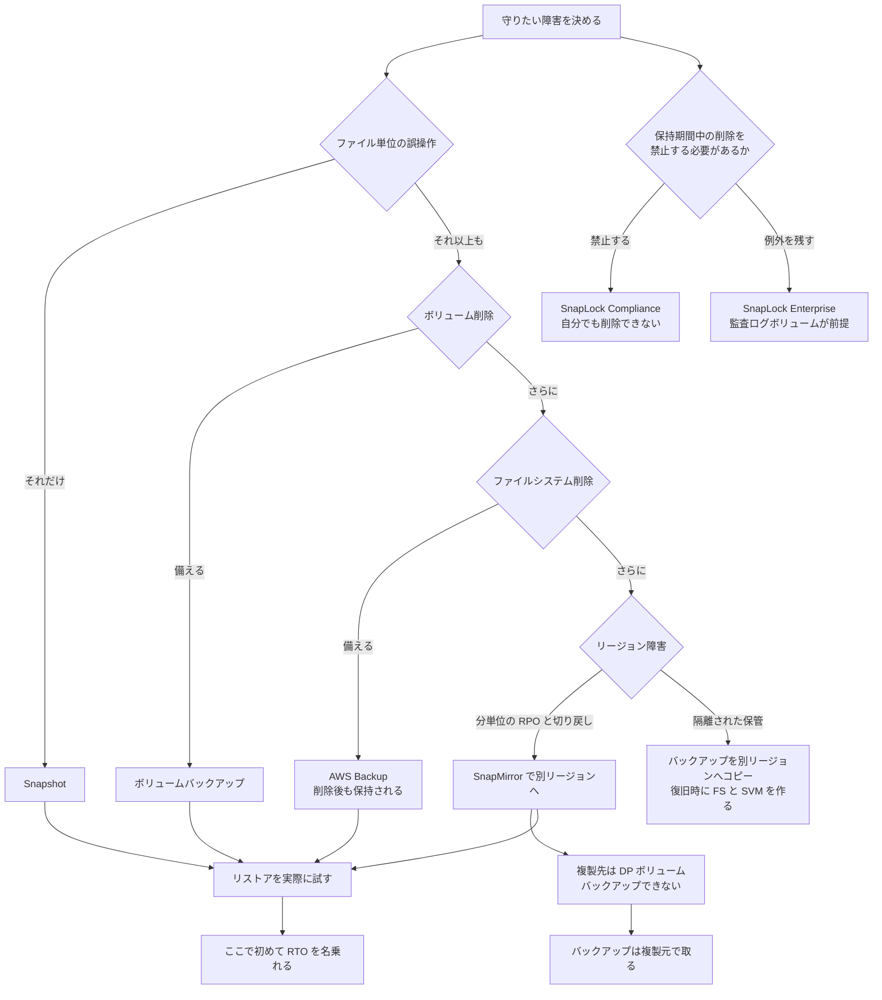

# データ保護方式の比較

[🏠 リポジトリトップ](../../../../README.md) | [Reference](../README.md) | [比較マトリクス](README.md)

---

## 結論

**Snapshot、バックアップ、SnapMirror は、復旧点の置き場所と更新方法が違います。** 守る障害、必要な整合性、管理資格情報の分離を決めて組み合わせます。

- **Snapshot** は同一 volume 内の変更前状態へ戻す用途です。volume や file system の喪失からは独立しません。
- **ボリュームバックアップ / AWS Backup** は file system と論理的に分離した復旧点です。別リージョン・別アカウントへコピーできますが、復旧にはリストア先の file system と SVM が必要です。
- **SnapMirror** は別 file system の宛先 volume を更新する用途です。ソースの変更も次回更新で届くため、保持世代を別に設計します。

> **区分** — `documented`。範囲と制約は AWS / NetApp の一次情報に基づきます。
> **復旧時間の実測値は含みません。** RTO を名乗るには自環境でのリストア訓練が必要です。

---

## 比較

### 判定基準

| 判定 | 意味 |
|---|---|
| **Protected** | 通常の取得・更新が成功し、障害前の復旧点が保持されていれば、その方式の標準範囲で復旧できる |
| **Not protected** | その方式だけでは障害から独立した復旧点を持たない |
| **Conditional** | 配置、コピー先、資格情報分離、保持期間、アプリケーション連携の条件で判定が変わる |

資格情報侵害は、その方式の復旧点を削除または変更できる管理資格情報が侵害された場合を指します。
`Protected` も復旧訓練、権限、容量、依存サービスの確認を省略できるという意味ではありません。

### 障害シナリオ別の保護範囲

| 障害・要件 | Snapshot | ボリュームバックアップ / AWS Backup | SnapMirror replication |
|---|---|---|---|
| ファイルの誤削除・誤更新 | **Protected** — 変更前の Snapshot を保持 [S] | **Protected** — 変更前の backup を保持 [B] | **Conditional** — 更新前か、宛先 Snapshot が残る場合 [R] |
| volume の喪失 | **Not protected** — Snapshot も同じ volume に存在 [S] | **Conditional** — user-initiated / final backup を保持し、新規 volume へ復元 [B] | **Protected** — 別 volume への転送が完了 [R] |
| file system の喪失 | **Not protected** — file system と共に失う [S] | **Conditional** — user-initiated / final backup を保持し、復元先の file system と SVM がある [B] | **Protected** — 宛先が別 file system にあり利用可能 [R] |
| AZ の停止 | **Not protected** — AZ 独立性は Snapshot ではなく deployment type の責務 [A] | **Protected** — backup は複数 AZ に冗長保管。復元先は別途必要 [B] | **Conditional** — 宛先が停止 AZ の外にあり、切り替え可能 [R] |
| Region の停止 | **Not protected** — 同一 file system 内 [S] | **Conditional** — 別 Region への copy が完了し、復元先を用意できる [C] | **Conditional** — cross-Region 宛先と切り替え手順がある [R] |
| 管理資格情報 / アカウントの侵害 | **Not protected** — Snapshot 管理権限があれば削除可能 [D] | **Conditional** — 分離アカウントへの copy と独立した保持・復元権限がある [C] | **Not protected** — 継続更新する replica は offline copy ではない [C] [R] |
| アプリケーション整合性 | **Conditional** — アプリケーションの I/O 静止 / 連携が必要。複数 volume は consistency group で同時取得 [F] [G] | **Conditional** — backup 前の I/O 静止 / 連携が必要。標準 backup は crash-consistent [F] | **Conditional** — アプリケーション整合性を確保したソース Snapshot を転送 [R] [G] |
| ソース側の論理破損 | **Conditional** — 破損前の世代を検知まで保持 [S] | **Conditional** — 破損前の backup を検知まで保持 [B] | **Conditional** — 破損の転送前か、宛先に正常な Snapshot を保持 [R] |

出典記号は [S] Snapshot、[B] backup、[C] backup copy、[R] SnapMirror、[A] AZ 可用性、[D] Snapshot 削除、[F] backup consistency、[G] consistency group です。

### 方式ごとの用途と制約

| 方式 | 向いている状況 | 制約 | 一次情報 |
|---|---|---|---|
| Snapshot | 同一 volume 内のファイル・フォルダを変更前へ戻す | 同じ volume / file system に依存し、変更ブロックが容量を消費 | [AWS][S] |
| Amazon FSx volume backup | volume 単位の独立した復旧点を保持 | RW volume のみ。保存 Region 内の既存 file system / SVM へ新規 volume として復元 | [AWS][B] |
| AWS Backup | スケジュール、vault、cross-account copy を一元管理 | 権限、vault、copy rule の設計が増える。FSx for ONTAP backup と同じ file system consistency | [AWS][B] |
| SnapMirror | 別 file system に更新済み volume を用意 | 変更を追従。宛先は break まで read-only。FSx for ONTAP は volume-level の非同期 replication のみ | [AWS][R] |

**`DP`（データ保護）・ロードシェアリングミラー・FlexCache / SnapMirror の宛先 volume は backup できません。** backup は複製元で取得します。

[S]: https://docs.aws.amazon.com/fsx/latest/ONTAPGuide/snapshots-ontap.html
[B]: https://docs.aws.amazon.com/fsx/latest/ONTAPGuide/using-backups.html
[C]: https://docs.aws.amazon.com/fsx/latest/ONTAPGuide/copy-backups.html
[R]: https://docs.aws.amazon.com/fsx/latest/ONTAPGuide/scheduled-replication.html
[A]: https://docs.aws.amazon.com/fsx/latest/ONTAPGuide/high-availability-AZ.html
[D]: https://docs.aws.amazon.com/fsx/latest/ONTAPGuide/manually-delete-snapshots.html
[F]: https://aws.amazon.com/fsx/netapp-ontap/features/
[G]: https://docs.netapp.com/us-en/ontap/consistency-groups/index.html

---

## レプリケーションとコピーは別の操作

**表の「複製」（SnapMirror）と「コピー」（ボリュームバックアップ / AWS Backup）は、別の操作です。** どちらも「別リージョンにデータを持つ」と言えてしまうので、要件を詰める前にここを揃えてください。分かれ目は**宛先に何が残るか**です。

| | SnapMirror の**レプリケーション（複製）** | ボリュームバックアップ / AWS Backup の**コピー** |
|---|---|---|
| 宛先に置かれるもの | **ボリューム**（宛先 SVM 上の `DP` ボリューム） | **バックアップ（リカバリポイント）。** ボリュームはありません |
| ソースの変更 | **追従します**（スケジュールごとに差分転送） | **追従しません**（取得時点の像） |
| 宛先を使うには | 関係を break して昇格 | **リストアが必要で、できるのは新規ボリューム** |
| 関係の継続 | **続きます** | **続きません**（1 回ごとに独立した成果物） |
| RPO を決めるもの | レプリケーションのスケジュール（5 分まで） | バックアップの間隔（目安 60 分） |
| 平常時に宛先で払うもの | ファイルシステムの容量とスループット | バックアップストレージのみ |
| スタンバイ系からアクティブ系へのデータの切り戻し | 逆向きに `snapmirror resync` | **経路がありません** |

**AWS 側の語も分かれています。** AWS Backup のコンソールとドキュメントはこの操作を一貫して「コピー」と呼び、画面にも Copy jobs / Copy rule / `Copy type` と出ます。FSx for ONTAP 側の API 名も `CopyBackup` です。レプリケーションは、Amazon S3 のクロスリージョンレプリケーションのように**宛先が実体として追従する機構**に使われる語です。

この違いは RTO に出ます。**レプリケーションなら宛先のボリュームを昇格するだけですが、コピーからはファイルシステムと SVM を作ってリストアするところから始まります。** 逆に SnapMirror を「バックアップ」と呼ぶのもずれます。宛先は追従するので、**ソースで消したファイルは次の転送のあと宛先の最新状態からも消えます**（宛先の Snapshot に残る範囲は別）。世代を残すのは Snapshot か SnapVault の役割です。

詳細は [バックアップコピーはリストアするまでファイルシステムを持たない](../../domains/data-protection/notes/backup-copies-across-regions-and-accounts.md#レプリケーションとコピーは別の操作) にあります。

---

## DR 設計を決めるこの制約

**「本番を SnapMirror で別リージョンへ複製し、複製先をバックアップする」という構成は成立しません。** 複製先は `DP` ボリュームで、バックアップ対象外です。

したがって **バックアップは複製元で取ります。** 別リージョンに世代を持ちたい場合は、複製先で別途 Snapshot を運用するか、複製元のバックアップを前提に組みます。

---

## 選び方

**上から順に確認してください。** 答えが決まった時点で必要な方式が決まります。

| # | 確認項目 | 判断への影響 |
|---|---|---|
| 1 | 守りたい障害はどこまでか（file / volume / file system / AZ / Region / 管理資格情報 / 論理破損） | 障害シナリオ表で `Not protected` の方式を単独採用しない |
| 2 | 複数 volume やデータベースでアプリケーション整合性が必要か | アプリケーションの I/O 静止 / 連携を必須とし、複数 volume は consistency group で同時取得する |
| 3 | ソース側の管理資格情報が侵害されても復旧点を残す必要があるか | 管理権限を分離したアカウントへの backup copy と保持制御を検討する |
| 4 | file system を削除しても残す必要があるか | user-initiated backup または final backup の保持を確認する |
| 5 | 別 Region に備える必要があるか | 分単位の RPO と切り戻しが要件なら SnapMirror、時点 copy と管理境界の分離が要件なら backup copy を起点にする |
| 6 | SnapMirror を使うか | backup は複製元で取得し、宛先 Snapshot の保持も決める |
| 7 | 経路に NAT があるか | SnapMirror のネットワーク経路を先に確認する |
| 8 | 保持したい世代数と期間 | 検知までの期間を含め、Snapshot / backup の保持と容量を設計する |
| 9 | リストアにかけられる時間（RTO） | Snapshot restore、backup restore、SnapMirror failover を同じ手順として扱わない |
| 10 | リストアと切り戻しを実際に試したか | 未実施なら RTO と復旧可能性は未確認のまま |

手順 10 を確認項目に入れているのは、**取得の成功監視と復旧可能性は別物**だからです。手順は [Snapshot があることと復旧できることは別](../../domains/data-protection/notes/snapshots-are-not-a-recovery-plan.md#自環境での確認手順) にあります。

---

## 不変性が必要な場合

上の 4 方式はいずれも**削除できます。** 保持期間中の削除そのものを禁止したい場合は WORM の領域で、別の判断になります。

| 観点 | SnapLock Compliance | SnapLock Enterprise |
|---|---|---|
| 向いている状況 | 保持期間中の削除を一切許容しない | 認可された管理者による例外を残したい |
| トレードオフ | **自分でも削除できません。** 保持期間ぶんの容量を確約することになります | 特権削除の運用と監査ログボリュームの管理が増えます |
| 前提条件 | — | **同一 SVM に監査ログボリューム**（最小保持 6 か月。**この間ボリューム・SVM・ファイルシステムのいずれも削除できません**） |

**モードは一度設定すると変更できません。** 詳細は [SnapLock は有効化とロックが別](../../domains/data-protection/notes/snaplock-and-layered-ransomware-readiness.md) にあります。

---

## 判断フロー

---

## よくある誤解

| 誤解 | 実際 |
|---|---|
| Snapshot があれば復旧できる | 同一ファイルシステム内にあります。**ボリューム削除には対応できません** |
| バックアップだけではリージョン障害に備えられない | **別リージョンへコピーできます**（2026 年 8 月以降）。リストア先はバックアップと同一リージョンのままなので、**そこに FS を作る時間が RTO に乗ります** |
| 別リージョンへコピーすれば、そこから直接リストアできる | リストアにはコピー先リージョンの**ファイルシステムと SVM が必要**です |
| SnapMirror の複製先をバックアップすればよい | **複製先はバックアップ対象外**です。複製元で取ります |
| 4 つのうちどれか 1 つを選ぶ | 守れる範囲が違います。**組み合わせる対象**です |
| どの方式でも同じ RTO を名乗れる | 世代で変わります。第 2 世代はリストア開始から数分で読めます |
| SnapLock は保護方式の 1 つ | 削除を禁止する仕組みで、復旧手段ではありません |
| Compliance にすれば安全側に振れる | **自分でも削除できません。** 保持期間ぶんの容量を確約します |
| バックアップの成功監視ができていれば復旧できる | 取得とリストアは別です。試していなければ RTO は推測値です |

---

## 参照した一次情報

| 論点 | 出典 |
|---|---|
| Snapshot の配置、誤削除からの復元、容量消費 | [AWS: Protecting your data with snapshots](https://docs.aws.amazon.com/fsx/latest/ONTAPGuide/snapshots-ontap.html) |
| backup の複数 AZ 保管、RW volume 制約、保持、同一 Region 内への restore、crash-consistent な性質 | [AWS: Protecting your data with volume backups](https://docs.aws.amazon.com/fsx/latest/ONTAPGuide/using-backups.html) / [AWS: FSx for ONTAP features](https://aws.amazon.com/fsx/netapp-ontap/features/) |
| cross-Region / cross-account copy と資格情報・KMS key 侵害への分離 | [AWS: Copying backups](https://docs.aws.amazon.com/fsx/latest/ONTAPGuide/copy-backups.html) |
| SnapMirror の周期更新、in-Region / cross-Region、volume-level の対象範囲 | [AWS: Replicating your data using SnapMirror](https://docs.aws.amazon.com/fsx/latest/ONTAPGuide/scheduled-replication.html) |
| Multi-AZ の AZ 障害時 failover と backup の複数 AZ 保管 | [AWS: Availability, durability, and deployment options](https://docs.aws.amazon.com/fsx/latest/ONTAPGuide/high-availability-AZ.html) |
| 複数 volume の crash-consistent / application-consistent Snapshot | [NetApp: ONTAP consistency groups](https://docs.netapp.com/us-en/ontap/consistency-groups/index.html) |
| backup copy と SnapMirror の復旧経路の違い | [AWS: Choosing between backup copies and SnapMirror](https://docs.aws.amazon.com/fsx/latest/ONTAPGuide/copying-backups-same-account.html) |
| SnapLock の 2 つの保持モードと監査ログ volume の前提 | [AWS: How SnapLock works](https://docs.aws.amazon.com/fsx/latest/ONTAPGuide/how-snaplock-works.html) |
| Snapshot / backup の上限と自動 backup の保持期間 | [AWS: Quotas](https://docs.aws.amazon.com/fsx/latest/ONTAPGuide/limits.html) |

---

## 比較時点

2026-09-20 時点の情報です。**機能は変わります。** 設計に使う前に各出典の現行版を確認してください。

**この表は一度実際に変わりました。** 2026 年 8 月まで「バックアップのリストア先は同一リージョン」を「バックアップではリージョン障害に備えられない」と書いていましたが、別リージョンへのコピーが可能になり、前提が崩れました。しかも [ONTAP ユーザーガイドの Document History には項目がありません](../recent-updates.md#更新の追跡方法)。

---

## 関連ドキュメント

- [比較マトリクス](README.md) — このディレクトリのハブ
- [Snapshot があることと復旧できることは別](../../domains/data-protection/notes/snapshots-are-not-a-recovery-plan.md) — 各方式の守備範囲の詳細
- [バックアップコピーはリストアするまでファイルシステムを持たない](../../domains/data-protection/notes/backup-copies-across-regions-and-accounts.md) — 別リージョン・別アカウントへの経路と実測
- [SnapLock は有効化とロックが別](../../domains/data-protection/notes/snaplock-and-layered-ransomware-readiness.md) — 不可逆な選択
- [切り戻せる時点はクライアントが書き始めた瞬間に閉じる](../../playbooks/03-migrate/notes/where-the-rollback-window-closes.md) — SnapMirror の切り替えと切り戻し
- [課金は「確保した量」と「使った量」に分かれる](../../domains/cost/notes/provisioned-versus-consumed.md) — 各方式のコスト特性
- [移行方式 決定ツリー](../decision-trees/migration-method.md) — 移行方式の選択
- [知見の分類ポリシー](../../evidence-policy.md)

---

[🏠 リポジトリトップ](../../../../README.md) | [Reference](../README.md) | [比較マトリクス](README.md)
