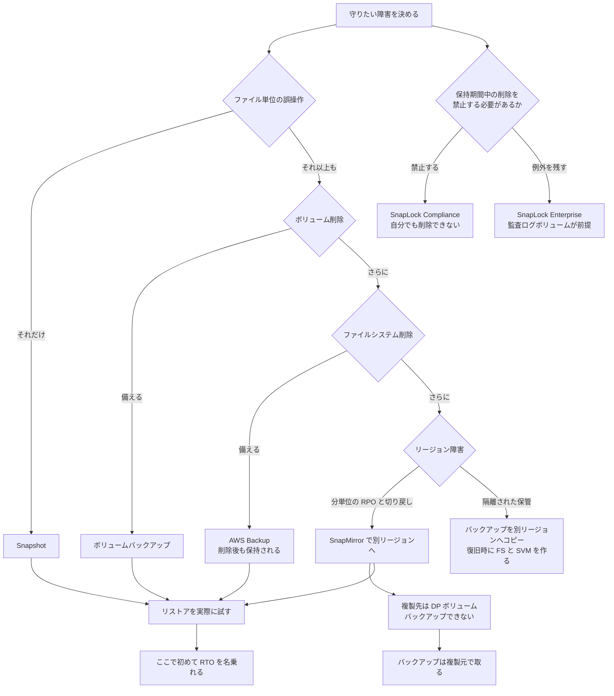

# データ保護方式の比較

[🏠 リポジトリトップ](../../../../README.md) | [Reference](../README.md) | [比較マトリクス](README.md)

---

## 結論

**4 つの方式は代替関係ではなく、守れる障害の範囲が違います。** 選ぶのではなく、どこまで守るかを決めて組み合わせる対象です。

- **Snapshot** は同一ファイルシステム内。最速で戻せますが、**ボリュームやファイルシステムが失われると一緒に失われます。**
- **ボリュームバックアップ**はボリューム削除に耐えます。**別リージョン・別アカウントへコピーできます**（2026 年 8 月以降）。ただしリストア先は**バックアップが保存されているリージョン**です。
- **AWS Backup のユーザー起動バックアップ**は、**ボリュームやファイルシステムを削除しても保持されます。**
- **SnapMirror** は別ファイルシステム・別リージョンへ複製できます。ただし**複製先はバックアップ対象外**です。

> **区分**: `documented`。範囲と制約は AWS 公式ドキュメントの記載に基づきます。
> **復旧時間の実測値は含みません。** RTO を名乗るには自環境でのリストア訓練が必要です。

---

## 比較

| 観点 | Snapshot | ボリュームバックアップ | AWS Backup | SnapMirror |
|---|---|---|---|---|
| **向いている状況** | 直近の誤削除・誤更新を秒単位で戻したい | ボリューム単位で世代を残したい | **ファイルシステム削除にも耐える保管が必要** | 別リージョン・別ファイルシステムへ備えたい |
| **保管される場所** | 同一ファイルシステム内 | FSx for ONTAP が管理するバックアップ領域 | 同上（AWS Backup 管理） | 別ファイルシステム |
| **ファイル誤削除** | ○ 最速 | ○ | ○ | △ 複製先から取り出す |
| **ボリューム削除** | **✕** | ○ | ○ | ○ |
| **ファイルシステム削除** | **✕** | △ | **○ 保持される** | ○ |
| **リージョン障害** | ✕ | △ **コピーすれば可**。復旧時に宛先 FS が必要 | 構成次第 | ○ 別リージョンへ複製時 |
| **トレードオフ** | 同一ファイルシステム内にあるため、その障害に共倒れする | リストア先はバックアップと同一リージョン。**別リージョンで復旧するにはそこに FS と SVM を作る時間が乗る**（実測 20 分） | 別サービスの設定と権限が増える | **複製先は読み取り専用**で、かつ**バックアップできない** |
| **前提条件** | ボリュームの容量と inode を消費する | **読み書き（RW）ボリュームのみ** | 同左 | クラスタ間ピアリング。**NAT 非対応** |
| **運用負荷** | 保持数の設計（1 ボリューム 1,023 個の上限） | 保持期間の設計（自動は最大 90 日） | ライフサイクルとボールトの管理 | 関係の監視と、切り替え・切り戻し手順 |
| **コスト特性** | ボリューム容量として現れる | 消費量課金・**増分** | 同左 | 複製先の容量とスループット |

**`DP`（データ保護）・ロードシェアリングミラー・FlexCache / SnapMirror の宛先ボリュームはバックアップできません。** これが表の中で最も設計を左右する制約です。

---

## レプリケーションとコピーは別の操作

**表の「複製」（SnapMirror）と「コピー」（ボリュームバックアップ / AWS Backup）は、別の操作です。** どちらも「別リージョンにデータを持つ」と言えてしまうので、要件を詰める前にここを揃えてください。分かれ目は**宛先に何が残るか**です。

| | SnapMirror の**レプリケーション（複製）** | ボリュームバックアップ / AWS Backup の**コピー** |
|---|---|---|
| 宛先に置かれるもの | **ボリューム**（宛先 SVM 上の `DP` ボリューム） | **バックアップ（リカバリポイント）。** ボリュームはありません |
| ソースの変更 | **追従します**（スケジュールごとに差分転送） | **追従しません**（取得時点の像） |
| 宛先を使うには | 関係を break して昇格 | **リストアが必要で、できるのは新規ボリューム** |
| 関係の継続 | **続きます** | **続きません**（1 回ごとに独立した成果物） |
| RPO を決めるもの | レプリケーションのスケジュール（5 分まで） | バックアップの間隔（目安 60 分） |
| 平常時に宛先で払うもの | ファイルシステムの容量とスループット | バックアップストレージのみ |
| 本番へ戻す | 逆向きに `snapmirror resync` | **経路がありません** |

**AWS 側の語も分かれています。** AWS Backup のコンソールとドキュメントはこの操作を一貫して「コピー」と呼び、画面にも Copy jobs / Copy rule / `Copy type` と出ます。FSx for ONTAP 側の API 名も `CopyBackup` です。レプリケーションは、Amazon S3 のクロスリージョンレプリケーションのように**宛先が実体として追従する機構**に使われる語です。

この違いは RTO に出ます。**レプリケーションなら宛先のボリュームを昇格するだけですが、コピーからはファイルシステムと SVM を作ってリストアするところから始まります。** 逆に SnapMirror を「バックアップ」と呼ぶのもずれます。宛先は追従するので、**ソースで消したファイルは次の転送のあと宛先の最新状態からも消えます**（宛先の Snapshot に残る範囲は別）。世代を残すのは Snapshot か SnapVault の役割です。

詳細は [バックアップコピーはリストアするまでファイルシステムを持たない](../../domains/data-protection/notes/backup-copies-across-regions-and-accounts.md#レプリケーションとコピーは別の操作) にあります。

---

## この制約が DR 設計を決めます

**「本番を SnapMirror で別リージョンへ複製し、複製先をバックアップする」という構成は成立しません。** 複製先は `DP` ボリュームで、バックアップ対象外です。

したがって **バックアップは複製元で取ります。** 別リージョンに世代を持ちたい場合は、複製先で別途 Snapshot を運用するか、複製元のバックアップを前提に組みます。

---

## 選び方

**上から順に確認してください。** 答えが決まった時点で必要な方式が決まります。

| # | 確認項目 | 判断への影響 |
|---|---|---|
| 1 | 守りたい障害はどこまでか（ファイル / ボリューム / ファイルシステム / リージョン） | **これだけで必要な方式が決まります。** 上の比較表の該当行を見ます |
| 2 | ファイルシステムを削除しても残す必要があるか | 必要なら **AWS Backup のユーザー起動バックアップ**が前提になります |
| 3 | 別リージョンに備える必要があるか | 必要なら **SnapMirror** か **バックアップコピー**です。分単位の RPO と切り戻しが要件なら SnapMirror、隔離された保管が要件ならコピーが起点になります（[比較](../../domains/data-protection/notes/backup-copies-across-regions-and-accounts.md#snapmirror-との選び分け)） |
| 4 | SnapMirror を使うか | 使うなら **バックアップは複製元で取る**設計になります |
| 5 | 経路に NAT があるか | あると SnapMirror は使えません。経路設計を先に確認します |
| 6 | 保持したい世代数と期間 | Snapshot は 1 ボリューム 1,023 個、自動バックアップは最大 90 日が上限です。**1,023 は容量が足りている場合の上限で、小さいボリュームでは先に容量で止まります**（[実測](../limits/)） |
| 7 | リストアにかけられる時間（RTO） | **世代で挙動が変わります。** 第 2 世代はリストア開始から数分で読めます |
| 8 | リストアを実際に試したか | **試していなければ RTO は推測値です。** ここが最後の確認項目です |

手順 8 を確認項目に入れているのは、**取得の成功監視と復旧可能性は別物**だからです。手順は [Snapshot があることと復旧できることは別](../../domains/data-protection/notes/snapshots-are-not-a-recovery-plan.md#自分の環境で確かめる) にあります。

---

## 不変性が必要な場合

上の 4 方式はいずれも**削除できます。** 保持期間中の削除そのものを禁止したい場合は WORM の領域で、別の判断になります。

| 観点 | SnapLock Compliance | SnapLock Enterprise |
|---|---|---|
| 向いている状況 | 保持期間中の削除を一切許容しない | 認可された管理者による例外を残したい |
| トレードオフ | **自分でも削除できません。** 保持期間ぶんの容量を確約することになります | 特権削除の運用と監査ログボリュームの管理が増えます |
| 前提条件 | — | **同一 SVM に監査ログボリューム**（最小保持 6 か月。**この間ボリューム・SVM・ファイルシステムのいずれも削除できません**） |

**モードは一度設定すると変更できません。** 詳細は [SnapLock は有効化とロックが別](../../domains/data-protection/notes/snaplock-and-layered-ransomware-readiness.md) にあります。

---

## 判断フロー

---

## よくある誤解

| 誤解 | 実際 |
|---|---|
| Snapshot があれば復旧できる | 同一ファイルシステム内にあります。**ボリューム削除には対応できません** |
| バックアップだけではリージョン障害に備えられない | **別リージョンへコピーできます**（2026 年 8 月以降）。リストア先はバックアップと同一リージョンのままなので、**そこに FS を作る時間が RTO に乗ります** |
| 別リージョンへコピーすれば、そこから直接リストアできる | リストアにはコピー先リージョンの**ファイルシステムと SVM が必要**です |
| SnapMirror の複製先をバックアップすればよい | **複製先はバックアップ対象外**です。複製元で取ります |
| 4 つのうちどれか 1 つを選ぶ | 守れる範囲が違います。**組み合わせる対象**です |
| どの方式でも同じ RTO を名乗れる | 世代で変わります。第 2 世代はリストア開始から数分で読めます |
| SnapLock は保護方式の 1 つ | 削除を禁止する仕組みで、復旧手段ではありません |
| Compliance にすれば安全側に振れる | **自分でも削除できません。** 保持期間ぶんの容量を確約します |
| バックアップの成功監視ができていれば復旧できる | 取得とリストアは別です。試していなければ RTO は推測値です |

---

## 参照した一次情報

| 論点 | 出典 |
|---|---|
| バックアップ対象が RW ボリュームのみであること、`DP` / LSM / FlexCache / SnapMirror 宛先が対象外であること、リストア先が同一リージョンであること、増分であること | [AWS: Protecting your data with volume backups](https://docs.aws.amazon.com/fsx/latest/ONTAPGuide/using-backups.html) |
| バックアップを別リージョン・別アカウントへコピーできること、バックアップコピーと SnapMirror の RPO / RTO の目安 | [AWS: Copying backups](https://docs.aws.amazon.com/fsx/latest/ONTAPGuide/copy-backups.html) / [Copying backups within the same AWS account](https://docs.aws.amazon.com/fsx/latest/ONTAPGuide/copying-backups-same-account.html) |
| AWS Backup のユーザー起動バックアップがボリューム / ファイルシステム削除後も保持されること | [AWS re:Post: How can I recover a deleted FSx for ONTAP volume?](https://repost.aws/knowledge-center/fsx-ontap-recover-deleted-volume) |
| Snapshot が同一ファイルシステム内にあり、データ移動を伴わないこと | [AWS Storage Blog: Protecting data against ransomware](https://aws.amazon.com/blogs/storage/protecting-data-against-ransomware-with-amazon-fsx-for-netapp-ontap/) |
| 複製先が読み取り専用であること、SnapMirror が NAT 非対応であること | [AWS Storage Blog: Cross-region disaster recovery](https://aws.amazon.com/blogs/storage/cross-region-disaster-recovery-with-amazon-fsx-for-netapp-ontap/) / [AWS re:Post: Optimize SnapMirror performance](https://repost.aws/knowledge-center/fsx-ontap-optimize-snapmirror) |
| 第 2 世代でリストア開始から数分で読めること | [AWS Storage Blog: Second-generation file systems](https://aws.amazon.com/blogs/storage/accelerate-file-workload-performance-with-second-generation-amazon-fsx-for-netapp-ontap-file-systems/) |
| SnapLock の 2 つの保持モードと監査ログボリュームの前提 | [AWS: How SnapLock works](https://docs.aws.amazon.com/fsx/latest/ONTAPGuide/how-snaplock-works.html) |
| Snapshot / バックアップの上限と自動バックアップの保持期間 | [AWS: Quotas](https://docs.aws.amazon.com/fsx/latest/ONTAPGuide/limits.html) |

---

## 比較時点

2026-08-28 時点の情報です。**機能は変わります。** 設計に使う前に各出典の現行版を確認してください。

**この表は一度実際に変わりました。** 2026 年 8 月まで「バックアップのリストア先は同一リージョン」を「バックアップではリージョン障害に備えられない」と書いていましたが、別リージョンへのコピーが可能になり、前提が崩れました。しかも [ONTAP ユーザーガイドの Document History には項目がありません](../recent-updates.md#更新の追跡方法)。

---

## 関連ドキュメント

- [比較マトリクス](README.md) — このディレクトリのハブ
- [Snapshot があることと復旧できることは別](../../domains/data-protection/notes/snapshots-are-not-a-recovery-plan.md) — 各方式の守備範囲の詳細
- [バックアップコピーはリストアするまでファイルシステムを持たない](../../domains/data-protection/notes/backup-copies-across-regions-and-accounts.md) — 別リージョン・別アカウントへの経路と実測
- [SnapLock は有効化とロックが別](../../domains/data-protection/notes/snaplock-and-layered-ransomware-readiness.md) — 不可逆な選択
- [切り戻せる時点はクライアントが書き始めた瞬間に閉じる](../../playbooks/03-migrate/notes/where-the-rollback-window-closes.md) — SnapMirror の切り替えと切り戻し
- [課金は「確保した量」と「使った量」に分かれる](../../domains/cost/notes/provisioned-versus-consumed.md) — 各方式のコスト特性
- [移行方式 決定ツリー](../decision-trees/migration-method.md) — 移行方式の選択
- [知見の分類ポリシー](../../evidence-policy.md)

---

[🏠 リポジトリトップ](../../../../README.md) | [Reference](../README.md) | [比較マトリクス](README.md)
