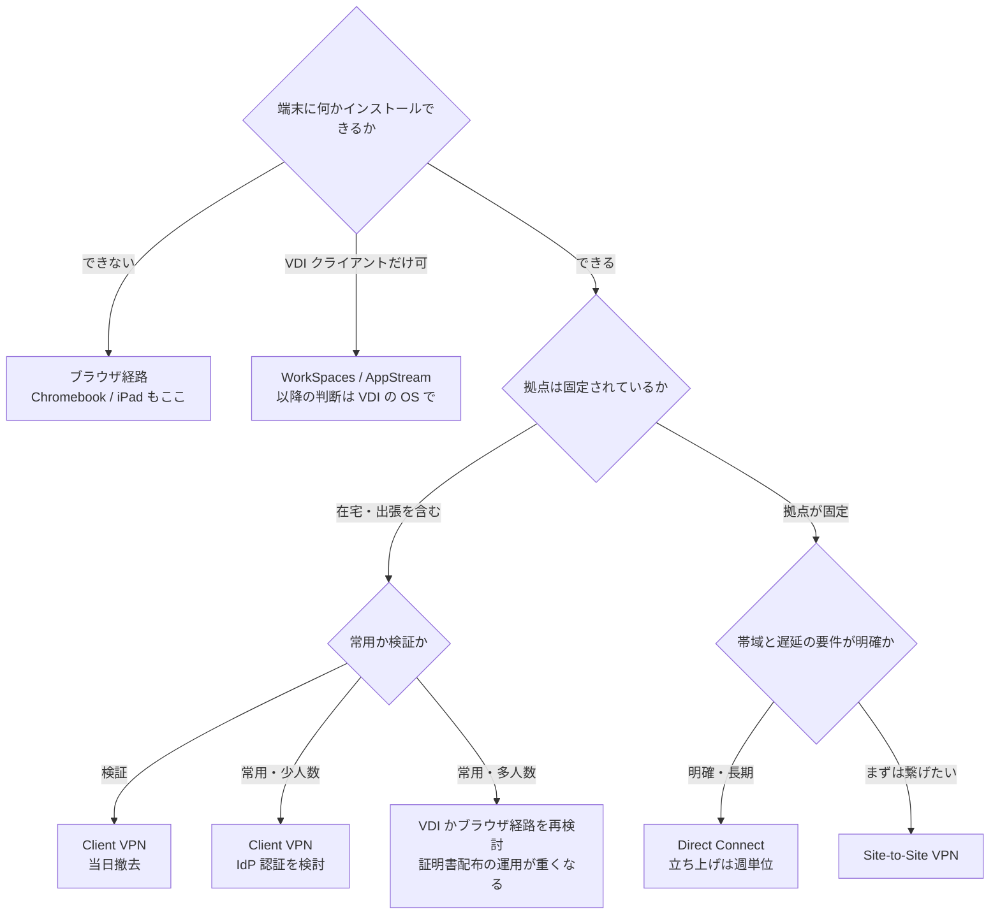

# 端末の到達経路の比較

[🏠 リポジトリトップ](../../../../README.md) | [Reference](../README.md) | [比較マトリクス](README.md) | [Domain — クライアントアクセス](../../domains/client-access/README.md)

---

## 結論

**「インターネット経由」は選択肢にありません。** Amazon FSx はパブリックインターネットからのアクセスをサポートせず、
ファイルシステムの ENI に付いた Elastic IP を自動的に外します。**経路は必ず 5 つのうちのどれかになります。**

| 経路 | 向く状況 | 端末に入れるもの |
|---|---|---|
| **AWS Client VPN** | 端末が散っている。人数が少ない。検証したい | VPN クライアント + 証明書または IdP |
| **Site-to-Site VPN** | 拠点が固定されている。常時接続 | なし（拠点側で終端） |
| **AWS Direct Connect** | 帯域と遅延の要件が明確。長期 | なし（拠点側で終端） |
| **VDI（WorkSpaces / AppStream 2.0）** | 端末側の運用をしたくない。端末が多様 | VDI クライアント |
| **ブラウザ（ファイルポータル）** | **端末に何もインストールできない。** Chromebook / iPad を含む | なし |

**選び方は「人数 × 拠点の固定度 × 端末に何を入れられるか」で決まります。** 帯域から入ると経路を選び直すことになります。

> **区分**: `documented` — 各経路の対応範囲は AWS 公式ドキュメントの記載に基づきます（2026-09-13 に確認）。
> **料金は AWS Price List API、On-Demand、ap-northeast-1、2026-09-13 取得の値です。** 改定されます。
> 月額は既定値に対する算術であり、請求書から読んだ額ではありません。
> **端末での実測はまだ含みません。**

---

## 比較

| 観点 | Client VPN | Site-to-Site VPN | Direct Connect | VDI (WorkSpaces / AppStream) | ブラウザ（ファイルポータル） |
|---|---|---|---|---|---|
| **課金の単位** | **サブネットの関連付け $0.15/時 + 接続 $0.05/時** | **接続 $0.048/時** + データ転送 | ポート時間 + データ転送。**物理またはパートナー接続が前提** | バンドル単位（別サービスの料金） | サーバーレスの構成要素ごと |
| **1 日 3 時間 × 1 端末の概算** | 関連付け $0.45 + 接続 $0.15 = **$0.60** | 接続は常時なので $1.15/日 | 該当しません | バンドル次第 | リクエスト数次第 |
| **放置したときの月額** | **関連付けだけで $109.50** | **$35.04** | ポート契約が続きます | バンドル次第 | ほぼ 0（従量） |
| **止め方** | **サブネットの関連付けを外す。** エンドポイントは残せます | 接続を削除する | 契約の解約 | インスタンスの削除 | 何もしなくてよい |
| **端末に入れるもの** | VPN クライアント + **証明書または IdP の設定** | なし | なし | VDI クライアント | なし |
| **使えるストレージ形態** | 端末の種類が決めます | 同左 | 同左 | **VDI の中の OS が決めます** | **オブジェクト経由の閲覧のみ** |
| **Chromebook / iPad** | クライアントがあっても**マウントできません** | 同左 | 同左 | **VDI クライアントがあれば可** | **これが唯一の経路** |
| **FSx for ONTAP の DNS 名の解決** | **エンドポイントに DNS サーバーを設定しないと端末のローカル DNS に落ちます** | 拠点側の DNS 転送を設計します | 同左 | VPC 内なので素直 | 該当しません |
| **立ち上げ時間** | **分単位** | 分単位（拠点側の設定を除く） | **週単位**（回線の手配） | 分〜十数分 | 既存のポータルがあれば 0 |
| **検証用途への適性** | **最も向きます。** 当日作って当日消せます | 拠点側の設定が要るので重い | **向きません** | 向きます | 向きます |
| **主なトレードオフ** | **端末ごとに証明書か IdP の設定が要り、関連付けを外し忘れると課金が続きます。** 端末数が増えると配布の運用が重くなります | **拠点が固定されている前提です。** 在宅の端末は別経路になります | **帯域と遅延が最も安定し、立ち上げが最も遅く、解約も重いです。** 検証には使えません | **端末側の運用が消える代わりに、VDI の費用と運用が乗ります。** 制約は VDI の OS に移るだけで消えません | **端末に何も入れない代わりに、マウントの選択肢が全部消えます。** ブロックとファイルは扱えません |

**AWS Verified Access も端末からの到達手段として使えます。** FSx for Windows File Server を対象にした
[AWS の構成例](https://aws.amazon.com/blogs/networking-and-content-delivery/securely-access-amazon-fsx-for-windows-file-server-using-aws-verified-access/)
があります。ap-northeast-1 の料金は、アプリケーション 1 つあたり $0.35/時（148,800 時間以降は $0.26/時）、
非 HTTP エンドポイント 1 つあたり $0.26/時 で、**データ処理量あたりの課金が別にあります（当方は単価を取得していません）。**
FSx for ONTAP を対象にした構成はこのリポジトリでは未検証です。

---

## Client VPN を検証の既定にする理由

**当日作って当日消せる経路が、他にありません。**

| 条件 | Client VPN | 他の経路 |
|---|---|---|
| 立ち上げ | 分単位 | Direct Connect は週単位 |
| 撤去 | 関連付けを外すだけ | Site-to-Site は拠点側の設定も戻す |
| 課金の止まり方 | 関連付けを外した時点 | ポート契約・バンドルは期間で残る |
| 端末側の可逆性 | プロファイルと証明書を削除 | VDI クライアントは残る |

**引き換えに負うものも書きます。**

- **証明書の秘密鍵が端末に残ります。** 検証後に消す手順を、作る手順と同じ場所に書いてください
- **関連付けを外し忘れると月 $109.50 です。** 撤去日を先に決めてください
- **端末数が増えると配布が重くなります。** 常用するなら IdP 認証か、経路そのものを見直す判断になります
- **split-tunnel を有効にすると、FSx for ONTAP の DNS 名が解決しない状態になり得ます。** エンドポイントに VPC のリゾルバ（VPC CIDR + 2）を設定してください

**この 4 点のうち 4 つ目が最も踏まれます。** 「VPN は繋がっているのにマウントできない」の形で出ます。

---

## 選び方

**同じ内容を表でも書きます。**

| 端末に入れられるもの | 拠点 | 用途 | 選ぶもの |
|---|---|---|---|
| 何もインストールできない | — | — | ブラウザ（ファイルポータル） |
| VDI クライアントのみ | — | — | WorkSpaces / AppStream |
| 任意 | 在宅・出張を含む | 検証 | **Client VPN** |
| 任意 | 在宅・出張を含む | 常用・少人数 | Client VPN（IdP 認証） |
| 任意 | 在宅・出張を含む | 常用・多人数 | VDI かブラウザ経路を再検討 |
| 任意 | 固定 | 帯域と遅延の要件が明確・長期 | Direct Connect |
| 任意 | 固定 | まずは繋げたい | Site-to-Site VPN |

---

## 自環境での確認手順

| # | 手順 | 確認できること |
|---|---|---|
| 1 | `aws fsx describe-file-systems --query 'FileSystems[].OntapConfiguration.EndpointIpAddressRange'` | **Multi-AZ の場合、エンドポイントの IP 範囲が VPC の CIDR の外にあるかどうか。** 外なら Transit Gateway 側の追加ルーティングが要ります（[詳細](../../domains/block-storage/notes/multi-az-moves-a-route-not-an-address.md)） |
| 2 | `aws ec2 describe-client-vpn-endpoints --query 'ClientVpnEndpoints[].[ClientVpnEndpointId,Status.Code,DnsServers,SplitTunnel]'` | **既に払い出したエンドポイントがあるか。`DnsServers` が空なら名前解決が届きません** |
| 3 | `aws ec2 describe-client-vpn-target-networks --client-vpn-endpoint-id <id>` | **関連付けが残っていないか。$0.15/時 はここに付きます** |
| 4 | `aws ec2 describe-vpc-endpoints --query 'VpcEndpoints[].[ServiceName,VpcEndpointType]'` | インターフェースエンドポイントの有無。**S3 Access Points に端末から届くには必要です** |
| 5 | 端末から `nslookup <svm-dns-name>` と `nc -vz <svm-ip> 445` を別々に実行する | **名前解決と到達性を分けて確認する。** どちらが欠けているかで打つ手が変わります |

**手順 3 を撤去のチェックにも使ってください。** 「エンドポイントを消したから止まった」ではなく、
「関連付けが 0 件になったから止まった」が正しい判定です。

---

## よくある誤解

| 誤解 | 実際 |
|---|---|
| セキュリティグループで許可すればインターネットから届く | **経路自体がありません。** Amazon FSx が Elastic IP を自動的に外します |
| Client VPN のエンドポイントを作った時点で課金が始まる | **課金はサブネットの関連付けに付きます。** 関連付けの無いエンドポイントは $0.15/時 を発生させません |
| VPN が繋がればマウントできる | **DNS サーバーを指定していないと、端末は自分のローカル DNS を使い続けます。** IP でマウントすれば通るので、経路の問題と誤診しがちです |
| split-tunnel は帯域のための設定 | **名前解決の経路も変わります。** 全通信を VPN に流さないかわりに、VPC の名前が引けなくなる場合があります |
| Direct Connect は検証にも使える | **回線の手配が週単位です。** 検証で選べる経路ではありません |
| VDI にすれば端末の制約が消える | **VDI の中の OS に移るだけです。** 消えるのは端末側の運用です |
| ブラウザ経路は機能の少ない代替 | **端末に何もインストールできない場合の唯一の経路です。** 引き換えにマウントの選択肢が消えます |
| Multi-AZ なら Transit Gateway が必ず要る | **エンドポイントの IP 範囲が VPC の CIDR の外にあるときだけです。** iSCSI と NVMe/TCP はこの問いに「不要」で答えます |

---

## 参照した一次情報

| 論点 | 出典 |
|---|---|
| パブリックインターネットからのアクセスが非対応で、Elastic IP が自動的に切り離されること | [AWS: Supported clients](https://docs.aws.amazon.com/fsx/latest/ONTAPGuide/supported-clients-fsx.html) |
| 別 VPC・別アカウント・別リージョン・オンプレミスからは Transit Gateway / Direct Connect / VPN が前提であること | [AWS: Mounting volumes on macOS clients](https://docs.aws.amazon.com/fsx/latest/ONTAPGuide/attach-mac-client.html) |
| Client VPN が OpenVPN ベースのクライアントで任意の場所から接続する managed なサービスであること | [AWS: What is AWS Client VPN?](https://docs.aws.amazon.com/vpn/latest/clientvpn-admin/what-is.html) |
| Client VPN で DNS サーバーを指定しない場合にローカルマシンの DNS が使われること、Private DNS を有効にするとインターフェースエンドポイントの名前が private IP に解決されること | [AWS: Client VPN endpoint での DNS の動作](https://aws.amazon.com/premiumsupport/knowledge-center/client-vpn-how-dns-works-with-endpoint/) · [AWS re:Post](https://repost.aws/questions/QUGbxYw0jdTjermVgyW5kjmQ/dns-resolution-with-clientvpn) |
| Route 53 プライベートホストゾーンを Client VPN から解決する際に、カスタム DNS サーバーを VPC のリゾルバへの forwarder として構成すること | [AWS: Resolve resource records in a private hosted zone using Client VPN](https://aws.amazon.com/premiumsupport/knowledge-center/client-vpn-resolve-resource-records/) |
| Client VPN 関連付け $0.15/時、接続 $0.05/時、Site-to-Site VPN 接続 $0.048/時、インターフェースエンドポイント $0.014/AZ-時、Verified Access アプリケーション $0.35/時（148,800 時間以降 $0.26/時）、非 HTTP エンドポイント $0.26/時 — すべて ap-northeast-1、On-Demand | AWS Price List API、2026-09-13 取得（`APN1-ClientVPN-EndpointHours` / `APN1-ClientVPN-ConnectionHours` / `APN1-VPN-Usage-Hours:ipsec.1` / `APN1-VpcEndpoint-Hours` / `APN1-VerifiedAccess-App-Hours` / `APN1-VerifiedAccess-non-HTTP-App-Hours`） |
| Client VPN 経由でファイル共有を端末にマウントする先行実装（対象は FSx for Windows File Server） | [aws-samples/access-amazon-fsx-through-clientvpn](https://github.com/aws-samples/access-amazon-fsx-through-clientvpn) |
| AWS Verified Access を到達手段に使う構成（対象は FSx for Windows File Server） | [AWS: Securely Access Amazon FSx for Windows File Server using AWS Verified Access](https://aws.amazon.com/blogs/networking-and-content-delivery/securely-access-amazon-fsx-for-windows-file-server-using-aws-verified-access/) |
| WorkSpaces と FSx for ONTAP を併用する手順 | [AWS: Using Amazon WorkSpaces with FSx for ONTAP](https://docs.aws.amazon.com/fsx/latest/ONTAPGuide/using-workspaces.html) |
| Multi-AZ のエンドポイント IP 範囲が VPC の CIDR の外にあるときだけ Transit Gateway の追加ルーティングが要ること | [Multi-AZ が動かすのはアドレスではなくルート](../../domains/block-storage/notes/multi-az-moves-a-route-not-an-address.md)（`verified`） |
| ゲートウェイエンドポイントが VPN / Direct Connect / Transit Gateway / ピアリング経由の流入をルーティングしないこと | [S3 Access Point の権限設計](../../domains/security-governance/notes/access-point-authorization-layers.md)（`verified`） |

---

## 関連ドキュメント

- [比較マトリクス](README.md) — このモジュールのハブ
- [端末別にできることの比較](client-endpoint-capabilities.md) — 経路を決めた後の端末側の可否
- [端末からデータに届く経路の決定木](../decision-trees/client-access-route.md) — この表を判断順に並べた決定木
- [Domain — クライアントアクセス](../../domains/client-access/README.md) — 端末側の罠のノート
- [エンドユーザーがデータに届く経路は 4 つある](../../playbooks/02-design/notes/how-end-users-reach-the-data.md) — ブラウザ経路と SFTP 経路
- [Multi-AZ が動かすのはアドレスではなくルート](../../domains/block-storage/notes/multi-az-moves-a-route-not-an-address.md) — オンプレミスからの経路
- [経路選定チェックリスト](../../domains/observability/checklists/route-selection.md) — 監視側の同じ形の判断
- [知見の分類ポリシー](../../evidence-policy.md)

---

[🏠 リポジトリトップ](../../../../README.md) | [Reference](../README.md) | [比較マトリクス](README.md) | [Domain — クライアントアクセス](../../domains/client-access/README.md)
