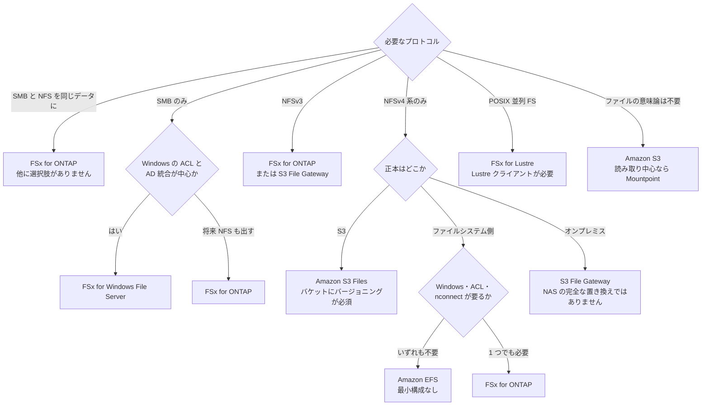

# ファイルストレージの選択肢の比較

[🏠 リポジトリトップ](../../../../README.md) | [Reference](../README.md) | [比較マトリクス](README.md)

---

## 結論

**先に決まるのは性能ではなくプロトコルです。** 必要なプロトコルを書き出した時点で、選択肢は 7 つから 1〜2 つに落ちます。

| 必要なもの | 残る選択肢 |
|---|---|
| SMB と NFS を**同じデータに**同時に出す | **Amazon FSx for NetApp ONTAP だけ** |
| SMB だけ | FSx for Windows File Server / FSx for ONTAP / S3 File Gateway |
| NFSv3 | **FSx for ONTAP / S3 File Gateway だけ**（Amazon EFS と Amazon S3 Files はどちらも NFSv3 非対応） |
| NFSv4 系だけ | Amazon EFS / Amazon S3 Files / FSx for ONTAP |
| POSIX 互換の並列ファイルシステム | FSx for Lustre |
| ファイルの意味論が要らない | Amazon S3（読み取り中心なら Mountpoint for Amazon S3） |

**2 番目に決まるのが正本の位置です。** データの正本が Amazon S3 にあるなら Amazon S3 Files と FSx for Lustre が S3 と同期する形を持っており、正本がファイルシステム側にあるなら FSx for ONTAP・FSx for Windows File Server・Amazon EFS が素直です。オンプレミスに正本を残したままクラウドへ出すなら S3 File Gateway が該当します。

**性能はその後です。** そして単一の数字では比較できません。**上限の置き方がサービスごとに違い、同じ「500 MB/s」が別の理由で出るためです。** 詳細は [上限の形の違い](#上限の形の違い) にあります。

> **区分**: `documented` — 各サービスの対応プロトコルと上限は AWS 公式ドキュメントの記載に基づきます（2026-09-06 に確認）。実測値は [S3-Burst-on-ONTAP-Files](https://github.com/Yoshiki0705/S3-Burst-on-ONTAP-Files) からの引用で、**このリポジトリでは再測定していません。** 分担の原則は [プロジェクト間の引用索引](../cross-repo-index.md) にあります。
> **料金の比率は含めません。** 改定されるため、現行の料金ページと自環境の測定で判断してください。最小構成のサイズのみ、判断に効くので後述します。

---

## 比較

| 観点 | Amazon EFS | Amazon S3 Files | FSx for ONTAP | FSx for Windows File Server | FSx for Lustre | Amazon S3 + Mountpoint | S3 File Gateway |
|---|---|---|---|---|---|---|---|
| **NFS** | **v4.0 / v4.1 のみ** | **v4.1 / v4.2**（[v4.0 の扱いは記載が食い違います](#判断していない論点)） | **v3 / v4 / v4.1 / v4.2** | いいえ | Lustre プロトコル（NFS ではありません） | いいえ | **v3 / v4.1** |
| **SMB** | いいえ | いいえ | **はい** | **はい（2.0〜3.1.1）** | いいえ | いいえ | **v2 / v3** |
| **ブロック** | いいえ | いいえ | **iSCSI / NVMe/TCP** | いいえ | いいえ | いいえ | いいえ |
| **S3 API で同じデータに届くか** | いいえ | **リンク先バケットが正本** | **S3 Access Point 経由**（[制約あり](../../domains/data-utilization/notes/s3-access-point-constraints.md)） | いいえ | **リンク先バケットと同期** | **S3 が正本** | **バケットに 1:1 で対応** |
| **SMB と NFS を同じデータに同時に出せるか** | — | — | **はい** | いいえ | いいえ | — | **共有ごとにどちらか**（同一バケットに両方の共有は作れます） |
| **Windows クライアント** | **非対応**（Windows EC2 からのマウントは非対応） | 同左（EFS 基盤） | **はい** | **はい** | いいえ | **Linux のみ** | **はい（SMB）** |
| **ACL** | **非対応**（POSIX モードビットのみ） | **POSIX パーミッションのみ** | **NTFS ACL / UNIX モードビット / 混在**（ボリュームのセキュリティスタイルで決まる） | **NTFS ACL**（AD 統合が前提） | POSIX | **POSIX パーミッションなし** | 共有の種別による |
| **Kerberos** | **非対応** | 非対応 | **NFS / SMB とも可**（SVM の AD または LDAP 参加が前提） | **AD 前提** | — | — | 共有の種別による |
| **`nconnect`** | **非対応** | **非対応** | **対応** | — | — | — | — |
| **ファイルロック** | **advisory のみ**（mandatory locking 非対応） | 同左 | **対応** | 対応 | 対応 | **非対応** | 対応 |
| **既存ファイルの更新** | 可 | 可 | 可 | 可 | 可 | **不可**（新規作成と読み取りのみ。ディレクトリ削除も不可） | 可 |
| **AZ の範囲** | リージョン内（Standard）/ 1 AZ（One Zone） | リージョン内 | **Single-AZ / Multi-AZ を作成時に決定**（[変更不可](../../playbooks/02-design/notes/deployment-type-is-decided-once.md)） | Single-AZ / Multi-AZ | 1 AZ | リージョン内 | ゲートウェイの設置場所 |
| **最小構成** | **なし**（保管量に対する課金） | 保管は S3 側 | **SSD 1,024 GiB × HA ペア数 + スループット 384 MBps** | **SSD 32 GiB / HDD 2,000 GiB** | **SSD 1.2 TiB / HDD 6 TiB** | **なし** | ゲートウェイ 1 台（VM または EC2） |
| **スナップショットと複製** | AWS Backup / レプリケーション | S3 のバージョニング（**有効化が必須**） | **Snapshot / SnapMirror / FlexClone がストレージ側**。確保済み容量を消費し別建ての課金項目にはなりません | シャドウコピー / バックアップ | バックアップ / S3 へのエクスポート | S3 のバージョニングとレプリケーション | S3 側 |
| **オンプレミスからの利用** | Direct Connect / VPN | 同左 | 同左 | 同左 | 同左 | 同左 | **ゲートウェイをオンプレミスに置く形が本来の用途** |
| **主なトレードオフ** | **NFSv3・SMB・Windows・ACL・`nconnect` がいずれも使えません。** 移行元がこれらに依存していると、そこが移行の作業になります | **リンク先バケットに S3 バージョニングが必須**で、同時更新時はバケットが正本になります。未使用データはファイルシステムから削除されます | **最小構成のコストが立ち、制御面が AWS と ONTAP の 2 つになります。** マルチプロトコルが不要なら過剰です | **NFS が出せません。** Linux からは `cifs-utils` 経由になります | **Lustre クライアントが必要**で、カーネル版の対応表に縛られます。Windows は選択肢に入りません | **ファイルシステムではありません。** 既存ファイルの更新・ディレクトリ削除・ロック・POSIX パーミッションがありません | **AWS が「エンタープライズ NAS の完全な置き換えを意図していない」と明記しています。** ファイルシステムのように振る舞いますが、ファイルシステムではありません |
| **運用負荷** | 低い | 低い | **中**（2 つの制御面 + AD 依存が発生する場合） | 中（AD の運用） | 中（クライアント側のカーネル管理） | 低い | 中（ゲートウェイの保守） |

**表のどこにも「速い」を書いていないのは、それが構成とアクセスパターンで決まるからです。** 性能で選ぶ前に、上限がどこに置かれているかを見てください。

---

## 上限の形の違い

**同じ 500 MB/s が、サービスによって別の理由で出ます。** これを混同すると、効かない手を打ち続けることになります。

| 上限の置き場所 | どのサービス | 接続数を増やすと超えられるか |
|---|---|---|
| **クライアント単位のクォータ** | Amazon EFS。**読み書き合計 500 MiBps**。1,500 MiBps になるのは Elastic スループットかつ Amazon EFS クライアント 2.0 以降または EFS CSI ドライバを使う場合に限られます | **超えられません** |
| **1 ネットワークフローの帯域** | FSx for ONTAP。EC2 の 1 フロー全二重 5 Gbps に当たります | **超えられます**（`nconnect` / SMB Multichannel） |
| **保管量に比例するベースライン** | Amazon EFS の Bursting スループット（EFS Standard / One Zone 1 TiB あたり 50 MB/s） | 保管量かスループットモードの問題です |
| **保管量に比例する単位スループット** | FSx for Lustre（SSD で 1 TiB あたり 50〜1,000 MBps を選択） | 容量か単位スループットの問題です |
| **ファイルシステムのスループット容量** | FSx for ONTAP。ネットワークとキャッシュサイズを決めます | 設定値の問題です |

**実測で最も紛らわしいのが最初の 2 行です。** sibling プロジェクトの測定では、EFS の素マウントが 3 条件すべてで 499.79 MB/s に張り付き、これは 1 フロー上限ではなく documented なクライアント単位クォータに一致しました。マウントヘルパー使用時の倍率は 2.97 で、`倍率 2.97 は **1,500 ÷ 500 = 3.0** に一致しており` とあるとおり、フロー数には比例していません。

**FSx for ONTAP 側の上限は 1 本のデータ LIF ではありません。** 8 台 128 接続で同じファイルを共有した測定では ONTAP 物理ポートの累積カウンタ差分が `12,173 MiB/s = **102 Gbps**` に達しています。単一接続の数字からファイルシステムの上限を外挿できません。

切り分けの順序は [手元のスループット値は何を測ったのかを判定する](../decision-trees/measured-throughput-triage.md) にあります。

---

## プロトコル可否の根拠

**「対応していない」は主張なので、根拠を分けて書きます。**

| 主張 | 根拠 | 出典の種類 |
|---|---|---|
| Amazon EFS は NFSv3 非対応 | `NFSv2 と NFSv3 は非対応` | AWS 公式（EFS quotas） |
| Amazon EFS は NFSv4.2 非対応 | `NFSv4.2 は対応プロトコルとして挙げられていない` | AWS 公式（対応プロトコルの列挙に無いこと） |
| Amazon EFS は Windows から使えない | `Windows を実行する EC2 インスタンスからの EFS のマウントは非対応` | AWS 公式 |
| Amazon EFS は `nconnect` 非対応 | ``EFS は `nconnect` にも非対応`` | AWS 公式 |
| Amazon S3 Files は NFSv3 非対応 | 対応は NFSv4.0 / 4.1 / 4.2 と明記 | AWS 公式 |

**「Amazon EFS は SMB 非対応」を独立の主張として書いていません。** EFS 側にその直接の記述はなく、根拠は上の「Windows EC2 からのマウントが非対応」です。SMB 非対応を独立に断言すると、出典のない主張になります。

**`nconnect` の可否は実効オプションでは判定できません。** sibling 側は `実効オプションではなく接続数で判定した` としています。EFS でも実効オプションに `nconnect=16` は現れ、分かれるのはその先です。自環境で確認するときは TCP 接続数を数えてください。

---

## FSx for ONTAP が適合する条件と適合しない条件

**適合しない条件を先に書きます。** 該当するなら他の選択肢のほうが素直です。

| 適合しない条件 | 代わりに |
|---|---|
| 必要なプロトコルが NFSv4 系だけで、Windows も ACL も要らない | Amazon EFS。最小構成のコストが立ちません |
| 必要なプロトコルが SMB だけで、NFS を出す予定がない | FSx for Windows File Server |
| 正本が Amazon S3 にあり、ファイルの意味論は読み取りのために欲しいだけ | Amazon S3 Files または FSx for Lustre |
| 既存ファイルを更新せず、読み取りが中心 | Amazon S3 + Mountpoint |
| POSIX 互換の並列ファイルシステムが要る | FSx for Lustre |
| 数十 GiB の共有 1 つ | Amazon EFS または FSx for Windows File Server（SSD 32 GiB から） |

| 適合する条件 | 理由 |
|---|---|
| SMB と NFS を**同じデータ**に同時に出す | 他に選択肢がありません。ボリュームのセキュリティスタイルで権限モデルが決まります（[詳細](../../domains/multiprotocol-identity/notes/security-style-and-permission-evaluation.md)） |
| ファイルとブロックを 1 台から出す | NFS / SMB / iSCSI / NVMe/TCP が同一ファイルシステムから出ます（[ブロック側の比較](block-storage-options.md)） |
| 同じデータを S3 API でも読む | S3 Access Point 経由。**ただし [制約](../../domains/data-utilization/notes/s3-access-point-constraints.md)があり、対応オペレーションの一覧は AWS 自身が partial list と明記しているため「X ができない」の網羅にはなりません** |
| スナップショット世代を多く持つ | 別建ての課金項目になりません。**ただし確保済み容量を消費します** |
| 既存の ONTAP 資産（SnapMirror / スクリプト / 運用手順）がある | 同じ道具がそのまま使えます |
| NFSv3 が必要 | Amazon EFS と Amazon S3 Files はどちらも非対応です |

---

## 選び方

**同じ内容を表でも書きます。** 上の図が読めない環境でも判断できるようにするためです。

| 必要なプロトコル | 追加の条件 | 選ぶもの |
|---|---|---|
| SMB と NFS を同じデータに | — | FSx for ONTAP |
| SMB のみ | Windows の ACL と AD 統合が中心 | FSx for Windows File Server |
| SMB のみ | 将来 NFS も出す可能性がある | FSx for ONTAP |
| NFSv3 | — | FSx for ONTAP または S3 File Gateway |
| NFSv4 系のみ | 正本が Amazon S3 | Amazon S3 Files |
| NFSv4 系のみ | 正本がファイルシステム側で、Windows・ACL・`nconnect` がいずれも不要 | Amazon EFS |
| NFSv4 系のみ | 正本がファイルシステム側で、上のどれか 1 つでも必要 | FSx for ONTAP |
| NFSv4 系のみ | 正本がオンプレミス | S3 File Gateway |
| POSIX 並列ファイルシステム | — | FSx for Lustre |
| ファイルの意味論は不要 | 読み取り中心 | Amazon S3 + Mountpoint |

---

## 測定と運用で先に踏むもの

**選定の段階で見落とされ、運用に入ってから効く 3 点です。**

| 論点 | 内容 |
|---|---|
| **容量が埋まると書き込みが落ちる** | sibling 側の測定では、自動日次バックアップのスナップショットが上書き前ブロックを保持して容量を食い、ボリューム使用率 88% → 100% で書き込みが `2,200 MB/s → 267 MB/s` に落ちました。**測定ファイルを `rm` しても空きは戻りません。** 回復には `volume autosize` と `snapshot autodelete` の設定が必要です。原因と回避手段はどちらも公式に記載があり、発見ではなく設計漏れです |
| **同じ構成でも数字が振れる** | キャッシュに何が残っていたかで変わります。ベンチマークはクレジット残高込みで設計してください（[p99 は CloudWatch のメトリクスからは出せない](../../domains/performance/notes/what-you-cannot-read-from-cloudwatch.md)） |
| **S3 Access Point の対応表は網羅ではない** | AWS の対応オペレーション表が自身を partial list と明記しています。ここから作った「非対応の一覧」を網羅として扱わないでください |

---

## SMB の測定済みの範囲と未測定の範囲

**3 項目のうち 2 項目が測定されました。1 項目は未測定のままです。混ぜないでください。**

| 項目 | 状態 |
|---|---|
| 台数試験（1 / 4 / 8 台） | **測定済み。ただし答えは 1 つではありません**（下記） |
| 15 分の持続書き込み | **測定済み** |
| キャッシュ制御下（重ならない領域の読み取り） | **未測定。** 測定器のパラメータ設計をやり直す必要があり、環境は撤去されました |

### 台数試験の結果が 1 つの数字にならない理由

**全台が同じデータを読むかどうかで、逆の結論が出ます。どちらも実測です。**

| 読み方 | 1 台 → 8 台 | 8 台での ONTAP ポート実測 |
|---|---|---|
| 全台が同じファイルを読む | **伸び続けます** | `8 台の 11,194.7 MiB/s は 94 Gbps である` |
| 重ならない領域を読む | **4 台で頭打ち**（`4 台と 8 台で止まった`） | 4,368.8 MiB/s |

**片方の表だけを「SMB の台数を増やしたときの伸び」として引用すると、別の製品の説明になります。** 伸びる側の理由は `同一ファイル側の伸びは、ONTAP のメモリが重なりを供給した結果である` と記録されています。**NFS 側でも同じ形が出ているため、プロトコルの違いではありません。**

したがって sibling 側はこの項目を「検証済み」ではなく **読むデータ次第（実測）** として記録しています。

**この数値はベースラインではありません。** 1 点あたりの定常窓は 180 秒で、6 点を約 40 分の間に連続実行しています。AWS はネットワーク I/O にクレジット機構があると明記しているため、**この窓長ではベースラインとバーストが分離されていません。**

### 持続書き込みの結果

| 項目 | 値 |
|---|---|
| 900 秒の定常窓 | 1,488.03 MB/s（前 1/3 と後 1/3 の差は 0.07%） |
| クライアント型の影響 | `クライアントを 4.5 倍の型に変えても 0.6% しか動かない` |
| 同一環境の NFS との比 | `SMB は NFS の 72.1%` |

**窓の中で減衰していません。** 測定が進んで落ちたのではありません。300 秒の値より 12.4% 低い理由は未確認です。

**公表値との関係は、どちらの側も判定していません。** 一般則（6,144 ÷ 3 = 2,048）にも例外表の 1,024 MBps にも一致しません。**同じファイルシステム・同じノードの同じ物理ポートで、NFS は 2,063.00 MB/s、SMB は 1,488.03 MB/s です。片方が公表値に近いことを根拠にもう一方を疑わないでください。**

### すべての SMB 数値の前提

**SMB Multichannel は ONTAP で既定無効です。** [`ONTAP 9 の SMB Multichannel は無効で出荷される`](https://github.com/Yoshiki0705/S3-Burst-on-ONTAP-Files/blob/main/docs/ja/reference/limits/smb-multichannel-enablement.md) と記録されており、**`dialect=3.1.1` でネゴシエートされていてもチャネルが張られているとは限りません。** `max_connections_per_session` が 32 でも、Multichannel が無効なら 1 チャネルです。

**有効化は既に張られた接続に届きません。** 新規接続（Tree Connect）にのみ効くため、`成功したという応答は、その接続に適用された証拠ではない` と記録されています。既存接続は `LanmanWorkstation` の再起動で切り替わりました。

**この節の数値はすべて Multichannel が有効な SVM での観測です。** 自環境で比べる前に、SVM 側の設定を確認してください。

### 残る留保 2 点

- 観測したチャネル数は 4 で、`max_connections_per_session` を 32 にしても 4 で止まりました。**なぜ 4 なのかは確認されていません。4 が製品の上限だと読まないでください**
- NFS 16 接続の列と SMB Multichannel の列は `キャッシュの温度が揃っていない` と記録されています。**この 2 列から SMB と NFS の優劣を取れません**

---

## 判断していない論点

**両方の記載が食い違っており、このリポジトリでは片方を採りません。**

| 論点 | 食い違い |
|---|---|
| 第 2 世代 6,144 MBps の書き込み上限 | 一般則（読み取りはスループット容量の全量、書き込みはその 3 分の 1 なので 6,144 ÷ 3 = 2,048）と、例外表の Single-AZ 書き込み 1,024 MBps が食い違います。sibling の実測 2,063.00 MB/s は前者と 5.6% で一致し後者とは一致しませんが、**どちらが正しいかは sibling でも判断していません。** 「公表値の 2 倍出た」の形で引用しないでください |
| Amazon EFS の Provisioned スループットの上限 | 1,024 MiB/s は Service Quotas の値で、引き上げ済みのアカウントでは異なります。**リージョンの上限として一般化しないでください。** 表を持っているだけでは足りず、投入値が表と一致しているかを実行前に照合する必要があります |
| Amazon S3 Files が NFSv4.0 に対応するか | 制約の一覧は「NFSv4.1 と NFSv4.2 に対応」と書き、機能の説明は「NFSv4.2・NFSv4.1・NFSv4.0」と書いています。どちらも AWS 公式です。**上の表は狭いほう（v4.1 / v4.2）を採りました。** v4.0 のクライアントしか使えない場合は、実機で確認してください（2026-09-06 時点） |

---

## よくある誤解

| 誤解 | 実際 |
|---|---|
| Amazon EFS は NFS なら何でもマウントできる | **v4.0 と v4.1 だけです。** NFSv3 も v4.2 も対応プロトコルに入っていません |
| Amazon EFS でも Windows から使える | **Windows を実行する EC2 からのマウントは非対応です** |
| 単一クライアントで 500 MB/s なら、それがサービスの上限 | **上限の種類が違います。** EFS はクライアント単位のクォータで接続数では超えられず、FSx for ONTAP は 1 フロー上限なので接続数で超えられます |
| Mountpoint for Amazon S3 を使えば S3 がファイルシステムになる | **既存ファイルの更新・ディレクトリ削除・シンボリックリンク・ファイルロック・POSIX パーミッションがありません。** 完全な POSIX が必要なら AWS は FSx for Lustre を案内しています |
| S3 File Gateway は NAS の置き換えになる | **AWS が「エンタープライズ NAS の完全な置き換えを意図していない」と明記しています。** ファイルシステムのように振る舞いますが、ファイルシステムではありません |
| Amazon S3 Files はバケットをそのままマウントする | **リンク先バケットに S3 バージョニングが必須**で、同時更新時はバケットが正本になります。未使用データはファイルシステムから削除されます |
| FSx for ONTAP を選べば性能で有利 | **上限の形が違うだけです。** 同じデータに複数プロトコルで届く必要がなく最小構成が過剰なら、他の選択肢のほうが素直です |
| SMB Multichannel のチャネル数は設定で増やせる | 観測では設定値を上げても 4 で止まりました。**ただし 4 が製品の上限である根拠は確認されていません** |

---

## 参照した一次情報

| 論点 | 出典 |
|---|---|
| Amazon EFS が NFSv2 / NFSv3 非対応で NFSv4.0 / 4.1 に対応すること、ACL・Kerberos・mandatory locking が非対応であること、クライアント単位のスループットが 500 MiBps で、1,500 MiBps は Elastic スループットかつ Amazon EFS クライアント 2.0 以降または EFS CSI ドライバの場合に限られること、Windows での利用が非対応であること | [AWS: Amazon EFS quotas](https://docs.aws.amazon.com/efs/latest/ug/limits.html) |
| Amazon EFS が `nconnect` に非対応であること、Windows を実行する EC2 インスタンスからのマウントが非対応であること | [AWS: Using Network File System to mount EFS file systems](https://docs.aws.amazon.com/efs/latest/ug/mounting-fs-old.html) |
| Amazon EFS の Bursting スループットが EFS Standard / One Zone 1 TiB あたり 50 MB/s のベースラインであること | [AWS: Amazon EFS volumes](https://docs.aws.amazon.com/AmazonECS/latest/bestpracticesguide/storage-efs.html) |
| Amazon S3 Files が NFSv4.0 / 4.1 / 4.2 に対応し POSIX パーミッションで制御すること、リンク先バケットに S3 バージョニングが必須であること、同時更新時はバケットが正本になること、未使用データがファイルシステムから削除されること | [AWS: S3 Files](https://docs.aws.amazon.com/help-panel/AmazonS3/latest/console/hp-s3-files-page.html) |
| Amazon S3 Files が ACL・Kerberos・`nconnect`・NFSv4.2 の任意機能に非対応であること | [AWS: Unsupported features, limits, and quotas（S3 Files）](https://docs.aws.amazon.com/AmazonS3/latest/userguide/s3-files-quotas.html) |
| FSx for ONTAP が NFS v3 / v4 / v4.1 / v4.2 と SMB、iSCSI、NVMe/TCP に対応すること | [AWS: How Amazon FSx for NetApp ONTAP works](https://docs.aws.amazon.com/fsx/latest/ONTAPGuide/how-it-works-fsx-ontap.html) |
| FSx for ONTAP の最小 SSD 容量が 1,024 GiB × HA ペア数であること、FSx for Windows File Server の最小が SSD 32 GiB / HDD 2,000 GiB であること、FSx for Lustre の容量刻み | [AWS: CreateFileSystem storageCapacity](https://docs.aws.amazon.com/sdk-for-kotlin/api/latest/fsx/aws.sdk.kotlin.services.fsx.model/-create-file-system-request/storage-capacity.html) |
| FSx for ONTAP 1 HA ペアの最小スループット 384 MBps | [AWS: Quotas（FSx for ONTAP）](https://docs.aws.amazon.com/fsx/latest/ONTAPGuide/limits.html) |
| FSx for Windows File Server が SMB 2.0〜3.1.1 に対応し、Linux からは `cifs-utils` で接続すること | [AWS: Accessing your data（FSx for Windows File Server）](https://docs.aws.amazon.com/fsx/latest/WindowsGuide/supported-fsx-clients.html) |
| FSx for Lustre の最小容量が SSD 1.2 TiB / HDD 6 TiB で、単位スループットが SSD 50〜1,000 MBps であること、リンク先 S3 バケットからのファイル更新が月 1,000 万件であること | [AWS: Service quotas for Amazon FSx for Lustre](https://docs.aws.amazon.com/fsx/latest/LustreGuide/limits.html) |
| FSx for Lustre のクライアントがカーネル版の対応表に縛られること | [AWS: Lustre file system and client kernel compatibility](https://docs.aws.amazon.com/fsx/latest/LustreGuide/lustre-client-matrix.html) |
| Mountpoint for Amazon S3 が既存ファイルの更新・ディレクトリ削除・シンボリックリンク・ファイルロックに非対応で、POSIX スタイルのパーミッションを持たず Linux 限定であること、完全な POSIX には FSx for Lustre が案内されること | [AWS: Mount an Amazon S3 bucket as a local file system](https://docs.aws.amazon.com/AmazonS3/latest/userguide/mountpoint.html) |
| S3 File Gateway が NFSv3 / NFSv4.1 と SMBv2 / SMBv3 に対応すること | [AWS: File Gateway setup requirements](https://docs.aws.amazon.com/filegateway/latest/files3/Requirements.html) |
| S3 File Gateway が NFS / SMB でファイルとオブジェクトを 1:1 に対応させること、エンタープライズ NAS の完全な置き換えを意図していないこと、ファイルシステムのように振る舞うがファイルシステムではないこと | [AWS: Maximizing S3 File Gateway throughput](https://docs.aws.amazon.com/filegateway/latest/files3/Performance-Throughput.html) |
| EFS のクライアント単位クォータに一致した実測値、マウントヘルパー使用時の倍率 2.97、ONTAP 物理ポートの累積カウンタ差分 102 Gbps、SMB Multichannel のチャネル数と理由の未確認、NFS 16 接続列とのキャッシュ温度の不揃い | [S3-Burst-on-ONTAP-Files: プロトコル別測定の結果](https://github.com/Yoshiki0705/S3-Burst-on-ONTAP-Files/blob/main/docs/ja/verification/perf-matrix-results.md) |
| Amazon EFS の非対応プロトコルの実測確認、`nconnect` を実効オプションではなく接続数で判定したこと | [S3-Burst-on-ONTAP-Files: プロトコル可否の実測](https://github.com/Yoshiki0705/S3-Burst-on-ONTAP-Files/blob/main/docs/ja/verification/protocol-matrix-efs-vs-ontap.md) |
| 容量使用率の上昇による書き込み低下と、`rm` では空きが戻らないこと | [S3-Burst-on-ONTAP-Files: 性能測定のガイド](https://github.com/Yoshiki0705/S3-Burst-on-ONTAP-Files/blob/main/docs/ja/reference/performance-testing-guide.md) |

---

## 関連ドキュメント

- [比較マトリクス](README.md) — このモジュールのハブ
- [どの AWS ファイルストレージかを決める](../decision-trees/file-storage-selection.md) — この表を判断順に並べた決定木
- [ブロックストレージの選択肢の比較](block-storage-options.md) — ブロック側の同じ形式の比較
- [スループットを動かす手段の比較](throughput-levers.md) — FSx for ONTAP を選んだ後の調整
- [手元のスループット値は何を測ったのかを判定する](../decision-trees/measured-throughput-triage.md) — どの上限に当たっているかの切り分け
- [単一接続で測った値はストレージの性能ではない](../../domains/performance/notes/a-single-connection-measures-the-client.md) — 実測値の条件付き転記
- [ボリュームのセキュリティスタイルが権限モデルを決める](../../domains/multiprotocol-identity/notes/security-style-and-permission-evaluation.md) — マルチプロトコルを選んだ後の権限設計
- [FSx for ONTAP の S3 Access Point は「S3 として使える」わけではない](../../domains/data-utilization/notes/s3-access-point-constraints.md) — S3 API 経由の制約
- [プロジェクト間の引用索引](../cross-repo-index.md) — 実測値の分担と検証の仕組み
- [知見の分類ポリシー](../../evidence-policy.md)

---

[🏠 リポジトリトップ](../../../../README.md) | [Reference](../README.md) | [比較マトリクス](README.md)
