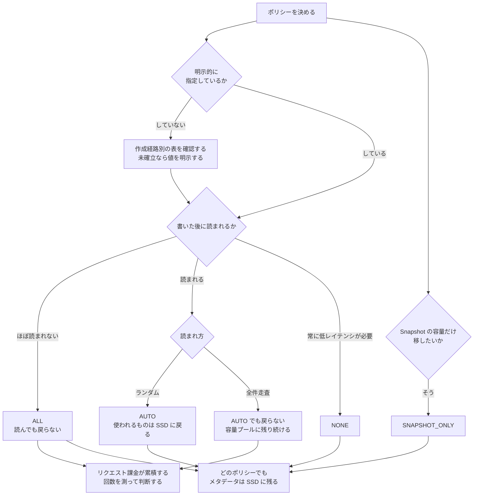

# 階層化ポリシーの比較

[🏠 リポジトリトップ](../../../../README.md) | [Reference](../README.md) | [比較マトリクス](README.md)

---

## 結論

**4 つのポリシーの差は「何を移すか」と「読んだときに戻るか」の 2 点です。** どちらもコストと性能の両方に効きます。

作成時の既定値は経路ごとに確認します。ラッパー自身が設定しない値を、ラッパー固有の既定値とは扱いません。

| 作成方法 | 経路が定める既定値 | 根拠 | 変更可否 |
|---|---|---|---|
| Amazon FSx コンソール | `AUTO` / 31 日 | [AWS](https://docs.aws.amazon.com/fsx/latest/ONTAPGuide/volume-storage-capacity.html) | 変更可 |
| AWS CLI / Amazon FSx API | CLI: `Not established` API: `SNAPSHOT_ONLY` / 2 日 | [API](https://docs.aws.amazon.com/fsx/latest/APIReference/API_TieringPolicy.html) | 変更可 |
| CloudFormation / CDK | CFN: `SNAPSHOT_ONLY` / 2 日 CDK: `Not established` | [CFN](https://docs.aws.amazon.com/AWSCloudFormation/latest/TemplateReference/aws-properties-fsx-volume-tieringpolicy.html) / [CDK](https://docs.aws.amazon.com/cdk/api/v2/docs/aws-cdk-lib.aws_fsx.CfnVolume.TieringPolicyProperty.html) | 中断なし |
| Terraform AWS Provider | `Not established` | [schema](https://github.com/hashicorp/terraform-provider-aws/blob/941220630893c456f38d54e804e3201c90d4e654/internal/service/fsx/ontap_volume.go) | 変更可 |
| ONTAP CLI | FlexVol: `snapshot-only` / 2 日 FlexGroup: `none` | [ONTAP CLI](https://docs.netapp.com/us-en/ontap-cli/volume-create.html) | 変更可 |

`Not established` の経路では、下流の Amazon FSx API または CloudFormation が返す値と、ツール自身が
設定する値を区別します。AWS CLI で省略した場合の実測結果は API の既定値と一致しますが、公開リファレンスでは
CLI 固有の既定値を確認できません。再現性が必要なら、どの経路でもポリシーと cooling period を明示します。
詳細と実測範囲は[階層化の既定値は作成方法で違う](../../playbooks/06-optimize/notes/tiering-defaults-differ-by-creation-method.md)にあります。

> **区分**: `documented`。動作と既定値は AWS 公式ドキュメントと API リファレンスの記載に基づきます。
> 既定値の一部は検証環境で実測して一致を確認しました（下記）。

---

## 比較

| ポリシー | 移す対象 | 読み取り時 | 用途と制約 |
|---|---|---|---|
| `NONE` | なし | SSD に留まる | 低レイテンシ向け。SSD を消費 |
| `SNAPSHOT_ONLY` | Snapshot | SSD へ戻る | Snapshot のみ。ユーザーデータは移らない |
| `AUTO` | コールドデータと Snapshot | ランダムは戻る。順次は戻らない | 通常アクセス向け。全件走査では戻らない |
| `ALL` | 全データと Snapshot | 戻らない | 保管向け。反復読み取りはリクエスト課金 |

**どのポリシーでも共通する 2 点があります。**

- **すべての書き込みは最初に SSD に書かれます。** その後で容量プールへ移動します。
- **ファイルのメタデータは常に SSD に残ります。** 目安は SSD : 容量プール = 1 : 10 です。

つまり **`ALL` にしても SSD 消費はゼロになりません。**

---

## 判断の分かれ目 — 「読んだときに戻るか」

`AUTO` と `ALL` の差はここに集約されます。

| アクセスの型 | `AUTO` | `ALL` |
|---|---|---|
| 通常のファイルアクセス（ランダム読み取り） | **SSD に戻る** | 戻らない |
| 全件走査（ウイルススキャンなど、シーケンシャル読み取り） | **コールドのまま残る** | 戻らない |

**`AUTO` の設計意図は明確です。** 使われているデータは SSD に戻し、スキャンのような一括読み取りでは戻さない。**スキャンのたびに全データが SSD に戻ることを避けています。**

**`ALL` は戻らないので、繰り返し読まれるデータではリクエスト課金が累積します。** GB 単価が安いことと、総額が安いことは別です。

---

## 検証環境での既定値

実測値、検証環境、作成経路を制御した AWS CLI の因果確認は
[上限値・クォータ](../limits/#fsx-for-ontap--既定値の実測--measured-defaults)に集約しています。
この比較では、作成経路が記録されていない在庫観測を経路別の既定値の根拠に使いません。

---

## 選び方

| # | 確認項目 | 判断への影響 |
|---|---|---|
| 1 | そのデータは書いた後に読まれるか | 読まれないなら `ALL` が候補。読まれるなら `ALL` は避けます |
| 2 | 読まれ方はランダムか全件走査か | 全件走査主体なら `AUTO` でも戻りません |
| 3 | 常に低レイテンシが必要か | 必要なら `NONE` |
| 4 | Snapshot の容量だけ移したいか | `SNAPSHOT_ONLY` |
| 5 | ポリシーを明示的に指定しているか | **していないなら作成経路で既定が変わります。** 明示してください |
| 6 | cooling period は既定のままか | アクセス実態と合っているかを確認します |
| 7 | 容量プールへのリクエスト数を測ったか | **`ALL` と `AUTO` の判断に必要な唯一の実測値です** |

**手順 5 が最初に確認すべき項目です。** 検証環境をコンソールで、本番を IaC で作っている場合、既定に任せていると挙動が違います。

---

## 判断フロー

---

## よくある誤解

| 誤解 | 実際 |
|---|---|
| 既定のポリシーは 1 つ | 作成経路とボリューム形式で異なります。`Not established` は下流の既定値と区別します |
| `SNAPSHOT_ONLY` でもユーザーデータは移る | 移りません。Snapshot のみです |
| `ALL` にすれば SSD は不要 | 全書き込みは SSD 経由で、**メタデータは常に SSD**です |
| `ALL` は常に一番安い | 読まれるデータでは**リクエスト課金が累積**します |
| 一度容量プールに移ったら戻らない | ポリシー次第です。`AUTO` はランダム読み取りで戻ります |
| ウイルススキャンで全データが SSD に戻る | `AUTO` ではシーケンシャル読み取りはコールドのまま扱われます |
| cooling period は固定 | 2〜183 日で設定できます |
| ポリシー変更には停止が伴う | 無停止で変更できます |

---

## 参照した一次情報

| 論点 | 出典 |
|---|---|
| 4 つのポリシーの動作、cooling period の既定（`AUTO` 31 日 / `SNAPSHOT_ONLY` 2 日）、作成経路による既定の差、ランダム読み取りで戻りシーケンシャル読み取りでは戻らないこと、`ALL` では戻らないこと、メタデータが常に SSD に残ること、変更が随時可能なこと | [AWS: Volume storage capacity](https://docs.aws.amazon.com/fsx/latest/ONTAPGuide/volume-storage-capacity.html) |
| cooling period の範囲 2〜183 日、既定ポリシーが `SNAPSHOT_ONLY` であること | [AWS API Reference: TieringPolicy](https://docs.aws.amazon.com/fsx/latest/APIReference/API_TieringPolicy.html) |
| CloudFormation の既定値と中断を伴わない変更 | [AWS CloudFormation: TieringPolicy](https://docs.aws.amazon.com/AWSCloudFormation/latest/TemplateReference/aws-properties-fsx-volume-tieringpolicy.html) |
| CDK L1 の省略可能なプロパティ | [AWS CDK: `CfnVolume.TieringPolicyProperty`](https://docs.aws.amazon.com/cdk/api/v2/docs/aws-cdk-lib.aws_fsx.CfnVolume.TieringPolicyProperty.html) |
| Terraform AWS Provider が省略時に値を設定しないこと | [Terraform AWS Provider: `ontap_volume.go`](https://github.com/hashicorp/terraform-provider-aws/blob/941220630893c456f38d54e804e3201c90d4e654/internal/service/fsx/ontap_volume.go) |
| ONTAP CLI の FlexVol / FlexGroup 別の既定値 | [NetApp: `volume create`](https://docs.netapp.com/us-en/ontap-cli/volume-create.html) |
| 容量プールに読み書きのリクエスト課金があること | [AWS: FSx for ONTAP 料金](https://aws.amazon.com/fsx/netapp-ontap/pricing/) |
| 全書き込みが SSD 経由であること、1 : 10 の目安 | [AWS: Migrating to FSx for ONTAP using NetApp SnapMirror](https://docs.aws.amazon.com/fsx/latest/ONTAPGuide/migrating-fsx-ontap-snapmirror.html) |
| 検証環境で観測した既定値 | 実測。[上限値・クォータ](../limits/) に記録 |

---

## 比較時点

2026-09-20 時点の情報です。**機能は変わります。** 設計に使う前に各出典の現行版を確認してください。

---

## 関連ドキュメント

- [比較マトリクス](README.md) — このディレクトリのハブ
- [階層化の既定値は作成方法で違う](../../playbooks/06-optimize/notes/tiering-defaults-differ-by-creation-method.md) — 既定値の差と変更順序
- [課金は「確保した量」と「使った量」に分かれる](../../domains/cost/notes/provisioned-versus-consumed.md) — リクエスト課金の位置づけ
- [監視は平均値で失敗する](../../playbooks/05-operate/notes/monitoring-fails-on-averages.md) — SSD 利用率の帯域
- [上限値・クォータ](../limits/) — 実測値と検証環境
- [知見の分類ポリシー](../../evidence-policy.md)

---

[🏠 リポジトリトップ](../../../../README.md) | [Reference](../README.md) | [比較マトリクス](README.md)
