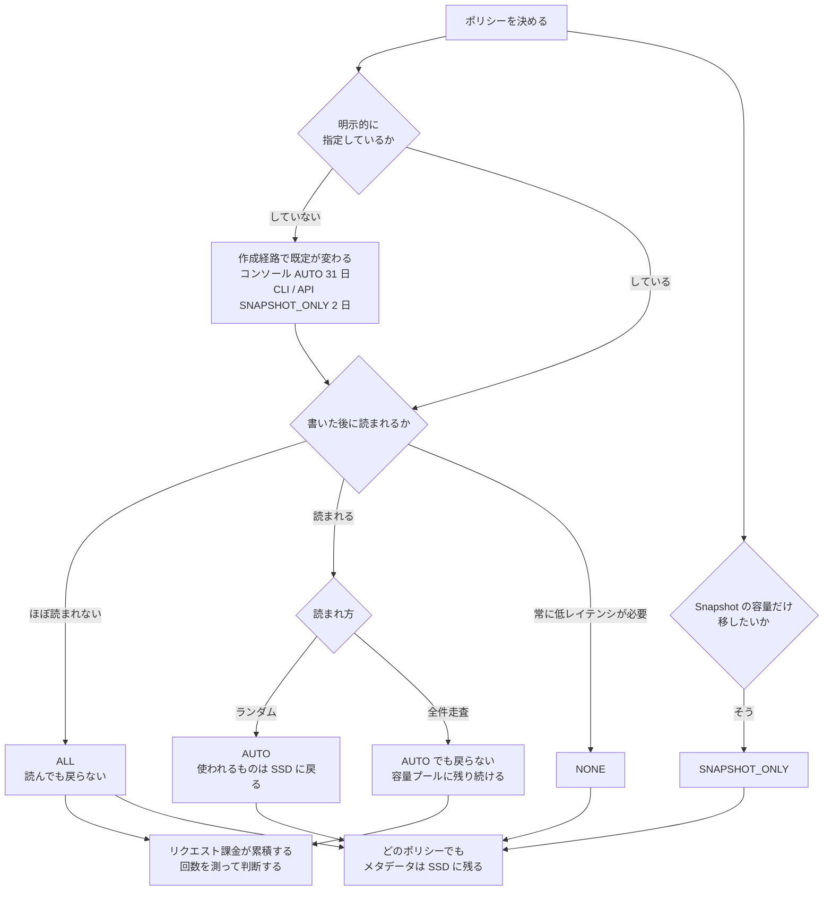

# 階層化ポリシーの比較

[🏠 リポジトリトップ](../../../../README.md) | [Reference](../README.md) | [比較マトリクス](README.md)

---

## 結論

**4 つのポリシーの差は「何を移すか」と「読んだときに戻るか」の 2 点です。** どちらもコストと性能の両方に効きます。

そして**既定値は作成方法で変わります。** コンソールは `AUTO`（cooling 31 日）、AWS CLI / Amazon FSx API / ONTAP CLI は `SNAPSHOT_ONLY`（cooling 2 日）です。**この 2 つは移す対象そのものが違います。** <!-- allow:naming - AWS の API 名 -->

> **区分**: `documented`。動作と既定値は AWS 公式ドキュメントと API リファレンスの記載に基づきます。
> 既定値の一部は検証環境で実測して一致を確認しました（下記）。

---

## 比較

| 観点 | `NONE` | `SNAPSHOT_ONLY` | `AUTO` | `ALL` |
|---|---|---|---|---|
| **移す対象** | 何も移さない | **Snapshot のみ** | コールドなユーザーデータと Snapshot | すべてのユーザーデータと Snapshot |
| **cooling period の既定** | — | **2 日** | **31 日** | — |
| **cooling period の範囲** | — | 2〜183 日 | 2〜183 日 | — |
| **読んだときの挙動** | 常に SSD 上 | 読むと SSD に**書き戻される** | **ランダム読み取りは書き戻し、シーケンシャル読み取りはコールドのまま** | **書き戻されない** |
| **向いている状況** | 常に低レイテンシが必要 | Snapshot の容量だけ移したい | 通常のファイル共有。**アクセスされるものは SSD に残したい** | 書いたら基本的に読まれない保管 |
| **トレードオフ** | **SSD 容量をそのまま消費します** | ユーザーデータは移らないため SSD 削減幅は小さい | シーケンシャル読み取りでは戻らないため、全件走査主体だと容量プールに残り続けます | **読むたびにリクエスト課金が発生し続けます** |
| **前提条件** | — | — | — | — |
| **運用負荷** | 低い | 低い | cooling period の調整 | アクセス頻度の見直し |
| **コスト特性** | SSD の確保容量が支配的 | SSD をやや削減 | アクセス実態に追随する | 容量プール単価は安いが**リクエスト課金が乗る** |

**どのポリシーでも共通する 2 点があります。**

- **すべての書き込みは最初に SSD に書かれます。** その後で容量プールへ移動します。
- **ファイルのメタデータは常に SSD に残ります。** 目安は SSD : 容量プール = 1 : 10 です。

つまり **`ALL` にしても SSD 消費はゼロになりません。**

---

## 「読んだときに戻るか」が判断の分かれ目です

`AUTO` と `ALL` の差はここに集約されます。

| アクセスの型 | `AUTO` | `ALL` |
|---|---|---|
| 通常のファイルアクセス（ランダム読み取り） | **SSD に戻る** | 戻らない |
| 全件走査（ウイルススキャンなど、シーケンシャル読み取り） | **コールドのまま残る** | 戻らない |

**`AUTO` の設計意図は明確です。** 使われているデータは SSD に戻し、スキャンのような一括読み取りでは戻さない。**スキャンのたびに全データが SSD に戻ることを避けています。**

**`ALL` は戻らないので、繰り返し読まれるデータではリクエスト課金が累積します。** GB 単価が安いことと、総額が安いことは別です。

---

## 検証環境での既定値

**実測して記載と一致することを確認した項目です。**

| 項目 | 実測値 | 対象 |
|---|---|---|
| `AUTO` の cooling period | **31 日** | 該当ボリューム 17 本すべて |
| `SNAPSHOT_ONLY` の cooling period | **2 日** | 該当ボリューム 15 本すべて |
| `NONE` の cooling period | 値なし | 該当ボリューム |
| 既定以外の値 | 7 日 / 90 日の実例 | 設定可能であることの確認 |

検証環境: `ap-northeast-1`、`SINGLE_AZ_1`（第 1 世代）、ファイルシステム 2 台・ボリューム 43 本、検証日 2026-08-06。読み取り専用の観測のみ。**この検証の時点では ONTAP バージョンを取得していません**（ONTAP REST API 経由なら取得できます）。記録は [上限値・クォータ](../limits/) にあります。

**同一ファイルシステム内に `AUTO` と `SNAPSHOT_ONLY` が混在していました。** これは作成経路によって既定が変わるという記載と整合しますが、**どのボリュームがどの経路で作られたかは記録が残っていないため、因果は確認していません。**

---

## 選び方

| # | 確認項目 | 判断への影響 |
|---|---|---|
| 1 | そのデータは書いた後に読まれるか | 読まれないなら `ALL` が候補。読まれるなら `ALL` は避けます |
| 2 | 読まれ方はランダムか全件走査か | 全件走査主体なら `AUTO` でも戻りません |
| 3 | 常に低レイテンシが必要か | 必要なら `NONE` |
| 4 | Snapshot の容量だけ移したいか | `SNAPSHOT_ONLY` |
| 5 | ポリシーを明示的に指定しているか | **していないなら作成経路で既定が変わります。** 明示してください |
| 6 | cooling period は既定のままか | アクセス実態と合っているかを確認します |
| 7 | 容量プールへのリクエスト数を測ったか | **`ALL` と `AUTO` の判断に必要な唯一の実測値です** |

**手順 5 が最初に確認すべき項目です。** 検証環境をコンソールで、本番を IaC で作っている場合、既定に任せていると挙動が違います。

---

## 判断フロー

---

## よくある誤解

| 誤解 | 実際 |
|---|---|
| 既定のポリシーは 1 つ | **作成方法で違います。** コンソールは `AUTO`、CLI / API / ONTAP CLI は `SNAPSHOT_ONLY` |
| `SNAPSHOT_ONLY` でもユーザーデータは移る | 移りません。Snapshot のみです |
| `ALL` にすれば SSD は不要 | 全書き込みは SSD 経由で、**メタデータは常に SSD**です |
| `ALL` は常に一番安い | 読まれるデータでは**リクエスト課金が累積**します |
| 一度容量プールに移ったら戻らない | ポリシー次第です。`AUTO` はランダム読み取りで戻ります |
| ウイルススキャンで全データが SSD に戻る | `AUTO` ではシーケンシャル読み取りはコールドのまま扱われます |
| cooling period は固定 | 2〜183 日で設定できます |
| ポリシー変更には停止が伴う | 無停止で変更できます |

---

## 参照した一次情報

| 論点 | 出典 |
|---|---|
| 4 つのポリシーの動作、cooling period の既定（`AUTO` 31 日 / `SNAPSHOT_ONLY` 2 日）、作成経路による既定の差、ランダム読み取りで戻りシーケンシャル読み取りでは戻らないこと、`ALL` では戻らないこと、メタデータが常に SSD に残ること、変更が随時可能なこと | [AWS: Volume storage capacity](https://docs.aws.amazon.com/fsx/latest/ONTAPGuide/volume-storage-capacity.html) |
| cooling period の範囲 2〜183 日、既定ポリシーが `SNAPSHOT_ONLY` であること | [AWS API Reference: TieringPolicy](https://docs.aws.amazon.com/fsx/latest/APIReference/API_TieringPolicy.html) |
| 容量プールに読み書きのリクエスト課金があること | [AWS: FSx for ONTAP 料金](https://aws.amazon.com/fsx/netapp-ontap/pricing/) |
| 全書き込みが SSD 経由であること、1 : 10 の目安 | [AWS: Migrating to FSx for ONTAP using NetApp SnapMirror](https://docs.aws.amazon.com/fsx/latest/ONTAPGuide/migrating-fsx-ontap-snapmirror.html) |
| 検証環境で観測した既定値 | 実測。[上限値・クォータ](../limits/) に記録 |

---

## 比較時点

2026-08-06 時点の情報です。**機能は変わります。** 設計に使う前に各出典の現行版を確認してください。

---

## 関連ドキュメント

- [比較マトリクス](README.md) — このディレクトリのハブ
- [階層化の既定値は作成方法で違う](../../playbooks/06-optimize/notes/tiering-defaults-differ-by-creation-method.md) — 既定値の差と変更順序
- [課金は「確保した量」と「使った量」に分かれる](../../domains/cost/notes/provisioned-versus-consumed.md) — リクエスト課金の位置づけ
- [監視は平均値で失敗する](../../playbooks/05-operate/notes/monitoring-fails-on-averages.md) — SSD 利用率の帯域
- [上限値・クォータ](../limits/) — 実測値と検証環境
- [知見の分類ポリシー](../../evidence-policy.md)

---

[🏠 リポジトリトップ](../../../../README.md) | [Reference](../README.md) | [比較マトリクス](README.md)
