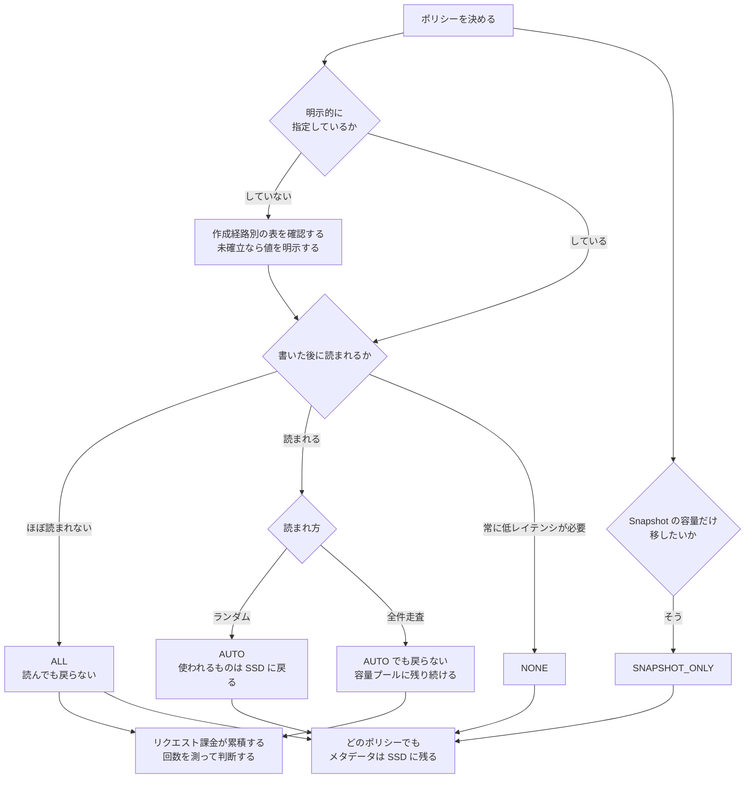

# 階層化ポリシーの比較

[🏠 リポジトリトップ](../../../../README.md) | [Reference](../README.md) | [比較マトリクス](README.md)

---

## 結論

**4 つのポリシーの差は「何を移すか」と「読んだときに戻るか」の 2 点です。** どちらもコストと性能の両方に効きます。

作成時の既定値は経路ごとに確認します。ラッパー自身が設定しない値を、ラッパー固有の既定値とは扱いません。

| 作成方法 | 経路が定める既定値 | 根拠 | 変更可否 |
|---|---|---|---|
| Amazon FSx コンソール | `AUTO` / 31 日 | [AWS](https://docs.aws.amazon.com/fsx/latest/ONTAPGuide/volume-storage-capacity.html) | 変更可 |
| AWS CLI / Amazon FSx API | CLI: `Not established` API: `SNAPSHOT_ONLY` / 2 日 | [API](https://docs.aws.amazon.com/fsx/latest/APIReference/API_TieringPolicy.html) | 変更可 |
| CloudFormation / CDK | CFN: `SNAPSHOT_ONLY` / 2 日 CDK: `Not established` | [CFN](https://docs.aws.amazon.com/AWSCloudFormation/latest/TemplateReference/aws-properties-fsx-volume-tieringpolicy.html) / [CDK](https://docs.aws.amazon.com/cdk/api/v2/docs/aws-cdk-lib.aws_fsx.CfnVolume.TieringPolicyProperty.html) | 中断なし |
| Terraform AWS Provider | `Not established` | [schema](https://github.com/hashicorp/terraform-provider-aws/blob/941220630893c456f38d54e804e3201c90d4e654/internal/service/fsx/ontap_volume.go) | 変更可 |
| ONTAP CLI | FlexVol: `snapshot-only` / 2 日 FlexGroup: `none` | [ONTAP CLI](https://docs.netapp.com/us-en/ontap-cli/volume-create.html) | 変更可 |

`Not established` の経路では、下流の Amazon FSx API または CloudFormation が返す値と、ツール自身が
設定する値を区別します。AWS CLI で省略した場合の実測結果は API の既定値と一致しますが、公開リファレンスでは
CLI 固有の既定値を確認できません。再現性が必要なら、どの経路でもポリシーと cooling period を明示します。
詳細と実測範囲は[階層化の既定値は作成方法で違う](../../playbooks/06-optimize/notes/tiering-defaults-differ-by-creation-method.md)にあります。

> **区分**: `documented`。動作と既定値は AWS 公式ドキュメントと API リファレンスの記載に基づきます。
> 既定値の一部は検証環境で実測して一致を確認しました（下記）。

---

## 比較

| ポリシー | 移す対象 | 読み取り時 | 用途と制約 |
|---|---|---|---|
| `NONE` | なし | SSD に留まる | 低レイテンシ向け。SSD を消費 |
| `SNAPSHOT_ONLY` | Snapshot | SSD へ戻る | Snapshot のみ。ユーザーデータは移らない |
| `AUTO` | コールドデータと Snapshot | ランダムは戻る。順次は戻らない | 通常アクセス向け。全件走査では戻らない |
| `ALL` | 全データと Snapshot | 戻らない | 保管向け。反復読み取りはリクエスト課金 |

**どのポリシーでも共通する 2 点があります。**

- **すべての書き込みは最初に SSD に書かれます。** その後で容量プールへ移動します。
- **ファイルのメタデータは常に SSD に残ります。** 目安は SSD : 容量プール = 1 : 10 です。

つまり **`ALL` にしても SSD 消費はゼロになりません。**

---

## 判断の分かれ目 — 「読んだときに戻るか」

`AUTO` と `ALL` の差はここに集約されます。

| アクセスの型 | `AUTO` | `ALL` |
|---|---|---|
| 通常のファイルアクセス（ランダム読み取り） | **SSD に戻る** | 戻らない |
| 全件走査（ウイルススキャンなど、シーケンシャル読み取り） | **コールドのまま残る** | 戻らない |

**`AUTO` の設計意図は明確です。** 使われているデータは SSD に戻し、スキャンのような一括読み取りでは戻さない。**スキャンのたびに全データが SSD に戻ることを避けています。**

**`ALL` は戻らないので、繰り返し読まれるデータではリクエスト課金が累積します。** GB 単価が安いことと、総額が安いことは別です。

---

## 検証環境での既定値

実測値、検証環境、作成経路を制御した AWS CLI の因果確認は
[上限値・クォータ](../limits/#fsx-for-ontap--既定値の実測--measured-defaults)に集約しています。
この比較では、作成経路が記録されていない在庫観測を経路別の既定値の根拠に使いません。

---

## 選び方

| # | 確認項目 | 判断への影響 |
|---|---|---|
| 1 | そのデータは書いた後に読まれるか | 読まれないなら `ALL` が候補。読まれるなら `ALL` は避けます |
| 2 | 読まれ方はランダムか全件走査か | 全件走査主体なら `AUTO` でも戻りません |
| 3 | 常に低レイテンシが必要か | 必要なら `NONE` |
| 4 | Snapshot の容量だけ移したいか | `SNAPSHOT_ONLY` |
| 5 | ポリシーを明示的に指定しているか | **していないなら作成経路で既定が変わります。** 明示してください |
| 6 | cooling period は既定のままか | アクセス実態と合っているかを確認します |
| 7 | 容量プールへのリクエスト数を測ったか | **`ALL` と `AUTO` の判断に必要な唯一の実測値です** |

**手順 5 が最初に確認すべき項目です。** 検証環境をコンソールで、本番を IaC で作っている場合、既定に任せていると挙動が違います。

---

## 判断フロー

```mermaid
graph TD
    A[ポリシーを決める] --> EXPLICIT{明示的に<br/>指定しているか}
    EXPLICIT -->|していない| DEFAULT[作成経路別の表を確認する<br/>未確立なら値を明示する]
    EXPLICIT -->|している| READ

    DEFAULT --> READ{書いた後に読まれるか}
    READ -->|ほぼ読まれない| ALL["ALL<br/>読んでも戻らない"]
    READ -->|読まれる| HOW{読まれ方}
    READ -->|常に低レイテンシが必要| NONE[NONE]

    HOW -->|ランダム| AUTO["AUTO<br/>使われるものは SSD に戻る"]
    HOW -->|全件走査| AUTO2["AUTO でも戻らない<br/>容量プールに残り続ける"]

    A --> SNAP{Snapshot の容量だけ<br/>移したいか}
    SNAP -->|そう| SO[SNAPSHOT_ONLY]

    ALL --> REQ["リクエスト課金が累積する<br/>回数を測って判断する"]
    AUTO2 --> REQ

    AUTO --> META["どのポリシーでも<br/>メタデータは SSD に残る"]
    ALL --> META
    SO --> META
    NONE --> META
```

---

以下の 6 節は 2026-10 の TR 委任で追加したものです。**TR-4598 と TR-4695 の記載は ONTAP 一般の FabricPool についてのもので、FSx for ONTAP で同じかは、AWS の記載を添えた箇所を除いて未確認です。**

## Cache ボリュームと階層化の関係

**次の 3 つは別の事実です。1 つの文にまとめないでください。**

1. **FlexCache の Cache ボリューム自体は階層化できません。** 出典は NetApp の [Supported and unsupported features for ONTAP FlexCache volumes](https://docs.netapp.com/us-en/ontap/flexcache/supported-unsupported-features-concept.html)（2026-07-02 更新）の FabricPool の行と、隣のリポジトリの [対応表](https://github.com/Yoshiki0705/S3-Burst-on-ONTAP-Files/blob/main/docs/ja/support-matrix.md) の FabricPool 階層化の行です。
2. **別の事実として、FabricPool の階層化が有効な Origin ボリュームに対して Cache を作ることはできます。** ONTAP 9.7 以降の対応です。出典は同じ NetApp のページの同じ行と、同じ対応表の同じ行の括弧書きです。
3. **配置は階層化とは別です。** FSx for ONTAP では、Cache を FabricPool が有効なアグリゲートに置くために `use_tiered_aggregate` を有効にする必要があるという観測があります（[コピーを増やさずにデータへ届けるには](../../domains/data-utilization/notes/reaching-data-without-copies.md#作成経路で成否が変わること)）。**置き場所が階層化アグリゲートでも、Cache が階層化されるわけではありません。**

**FSx for ONTAP で Cache ボリュームに階層化ポリシーを指定したときに拒否されるのか、黙って無視されるのかは未確認です。**

FlexGroup では、階層化ポリシーは FlexGroup の単位で設定し、コンスティチュエントごとには設定できません（[TR-4598（FabricPool の推奨事項）](https://www.netapp.com/pdf.html?item=/media/17239-tr4598.pdf)「Volume tiering policies」）。FlexGroup の配置の性質は [FlexGroup は新しいファイルを作るときに分散し、置いた後は動かさない](../../domains/performance/notes/flexgroup-balances-at-file-creation-not-afterward.md) にあります。

## cooling period と読み戻しの挙動

| 項目 | TR-4598 の記載（ONTAP 一般） | FSx for ONTAP についての AWS の記載 |
|---|---|---|
| 階層化が始まる条件 | ローカル層の使用率が 50% を超えたときだけ階層化します（`All` を除く）。閾値は ONTAP 9.5 以降で変えられます | SSD の使用率 50% 以下では `All` だけが階層化し、50% を超えると `Auto` と `Snapshot-only` が cooling period に従って階層化します。閾値を変えられるかの記載はありません |
| ランダム読み取りと順次読み取り | `Auto` では、ランダムに読まれたブロックはローカル層へ書き戻され、順次に読まれたブロックは容量層に残ります | 上の「[比較](#比較)」の `AUTO` の行と同じ記載です |
| 書き戻しの抑止 | ローカル層が 90% を超えると、読んだデータを書き戻しません（ONTAP 9.7 より前は 70%） | SSD の使用率 90% 以上では、`Auto` と `Snapshot-only` で読んだデータを SSD に戻しません。98% 以上で階層化の機能全体が止まります |
| cooling period を延ばす影響 | ローカル層に残る非アクティブなデータが増え、**読まれて書き戻されたデータが再び階層化されるまでにも時間がかかります。** 60 日・90 日・180 日の設定は時間ベースの SLA のためには要りうるが、ベストプラクティスではないとしています | cooling period は 2〜183 日。期限切れから 24〜48 時間で階層化されます |
| cooling period を縮める影響 | まだアクティブなデータを冷たいと判定しないようにします。7 日目に大量の書き込みがある複数日のワークロードなら 8 日未満にしないという例を挙げています。**短すぎる設定で変更が続くと、オブジェクトの断片化と読み取り性能の低下を招きます** | 記載を見つけていません |
| 読み戻しの方針の上書き | ONTAP 9.8 以降、cloud retrieval policy（`default` / `never` / `on-read` / `promote`）で読み戻しの挙動を上書きできます | 同じ 4 つの値が記載され、ONTAP CLI の advanced モードで `volume modify -cloud-retrieval-policy` により設定する手順があります |

出典: TR-4598（ONTAP 9.14.1、2024 年 1 月）「Data movement」「Volume tiering policies」「Cloud retrieval」「Volume tiering minimum cooling days」。AWS の列は [AWS: Volume storage capacity](https://docs.aws.amazon.com/fsx/latest/ONTAPGuide/volume-storage-capacity.html) の「Tiering cooling period」「Cloud retrieval policies」「Tiering thresholds」と [AWS: Updating a volume's cloud retrieval policy](https://docs.aws.amazon.com/fsx/latest/ONTAPGuide/set-cloud-retrieval.html)（いずれも 2026-10-02 に確認）。**Amazon FSx API の `TieringPolicy` が持つのは `Name` と `CoolingPeriod` だけで、cloud retrieval policy のフィールドはありません**（[API Reference: TieringPolicy](https://docs.aws.amazon.com/fsx/latest/APIReference/API_TieringPolicy.html)）。AWS が示す設定手順は ONTAP CLI です。

## 階層化とストレージ効率の関係

| 項目 | TR-4598 の記載（ONTAP 一般） |
|---|---|
| 容量層へ移るときの効率化 | 圧縮、重複排除、コンパクションの効果は容量層へ移っても保たれます |
| アグリゲートのインライン重複排除 | ローカル層では使えますが、その効果は容量層のオブジェクトには持ち越されません |
| `All` とバックグラウンドの重複排除 | `All` ではデータがすぐに階層化されるため、バックグラウンドの重複排除による効果が小さくなることがあります |

出典: TR-4598「ONTAP storage efficiencies」。FSx for ONTAP では、長期に容量プールへ置くデータを移行するときは `Auto` を推奨すると AWS が記載しています。`Auto` ではデータが cooling period の間（最短 2 日）SSD 層にとどまり、その SSD 層のデータに ONTAP が post-process の重複排除を定期的に実行する、という理由です（[AWS: Volume storage capacity](https://docs.aws.amazon.com/fsx/latest/ONTAPGuide/volume-storage-capacity.html)「Volume tiering policies」）。**TR の 3 行が FSx for ONTAP の容量プールで同じかは未確認です。**

## SnapMirror の宛先での階層化

| 項目 | 記載（ONTAP 一般） | 出典 |
|---|---|---|
| 宛先での書き込み先 | 送り元と宛先のポリシーの組み合わせで決まります。たとえば宛先が `All` なら容量層、宛先が `None` ならローカル層、両側が `Auto` ならローカルはローカルへ・容量層は容量層へ書かれます | TR-4598「SnapMirror behavior」の Table 1 |
| カスケード | `All` を使う場合、カスケードの SnapMirror 関係は非対応です。`All` は最終の宛先だけで使います | 同表の注記 |
| 送り元を `All` にする影響 | データがすぐに階層化されるため、SnapMirror が容量層から読むことになり、転送が遅くなります。後に並ぶ別の SnapMirror も遅れることがあります | TR-4598「Volume tiering policies」 |
| 複製先の用途 | 復旧にだけ使う複製は一般に `All`、**複製先をクローンにも使うなら `Auto`** と、クローンで使う期間を含む cooling period が向くとしています | [TR-4695: Database Storage Tiering with NetApp FabricPool](https://www.netapp.com/pdf.html?item=/media/9138-tr4695.pdf)（2021 年 4 月）「Snapshot replication」 |

**FSx for ONTAP の SnapMirror の宛先でこの表のとおりに書き込み先が決まるかは未確認です。**

## AUTO が向かないワークロードの条件

| 条件 | 記載（ONTAP 一般） | 出典 |
|---|---|---|
| 定期的に全件を読む | **どんなアクセスもヒートマップをリセットします。** データベースの全表走査や、元ファイルを読むバックアップがあると、cooling period に届かず階層化されません | TR-4695「FabricPool and database workloads」 |
| ログを切り詰めるデータベース | Microsoft SQL Server のようにバックアップ時にトランザクションログを切り詰める場合、アクティブなファイルシステムに冷えたログがほとんど残らないため、ログに `Auto` は役に立たないとしています。`Snapshot-Only` で容量を減らせる場合があります | TR-4695「Log archiving」 |
| SAN で容量層に届かなくなる | 容量層に 2 分届かないとホストに読み取りエラーが返ります。`Auto` と `All` はアクティブな LUN のデータを階層化するため、可用性に影響しえます | TR-4695「Object store access interruptions」 |
| 冷えたデータを頻繁に書き換える | オブジェクトストレージはトランザクショナルではないため、短すぎる cooling period で変更が続くと、オブジェクトの断片化と読み取り性能の低下を招きます | TR-4598「Volume tiering policies」 |

**SAN の行が、AWS が管理する FSx for ONTAP の容量プールに当てはまるかは未確認です。**

## TR と AWS の記載が食い違う点

**`SNAPSHOT_ONLY` で階層化された Snapshot のブロックを読んだときの挙動が、2 つの文書で逆です。**

| 文書 | 記載 |
|---|---|
| TR-4598「Volume tiering policies」（ONTAP 一般） | 読まれても冷たいまま残り、ローカル層へ書き戻されません |
| [AWS: Volume storage capacity](https://docs.aws.amazon.com/fsx/latest/ONTAPGuide/volume-storage-capacity.html)「Volume tiering policies」（FSx for ONTAP） | 読まれると hot になり、SSD 層へ書かれます |

上の「[比較](#比較)」の `SNAPSHOT_ONLY` の行は AWS の記載に従っています。**このリポジトリは FSx for ONTAP について AWS の記載を採り、どちらの挙動も測っていません。** TR の記載は ONTAP 一般のものです。

---

## よくある誤解

| 誤解 | 実際 |
|---|---|
| 既定のポリシーは 1 つ | 作成経路とボリューム形式で異なります。`Not established` は下流の既定値と区別します |
| `SNAPSHOT_ONLY` でもユーザーデータは移る | 移りません。Snapshot のみです |
| `ALL` にすれば SSD は不要 | 全書き込みは SSD 経由で、**メタデータは常に SSD**です |
| `ALL` は常に一番安い | 読まれるデータでは**リクエスト課金が累積**します |
| 一度容量プールに移ったら戻らない | ポリシー次第です。`AUTO` はランダム読み取りで戻ります |
| ウイルススキャンで全データが SSD に戻る | `AUTO` ではシーケンシャル読み取りはコールドのまま扱われます |
| cooling period は固定 | 2〜183 日で設定できます |
| ポリシー変更には停止が伴う | 無停止で変更できます |
| Cache を階層化アグリゲートに置けば Cache も階層化される | **Cache ボリューム自体は階層化できません。** 配置と階層化は別です |
| FabricPool 上の Origin は Cache できない | **ONTAP 9.7 以降は Cache を作れます。** Cache 自体が階層化できないこととは別の事実です |
| cooling period は長いほど安全 | ローカル層に残るデータが増え、読み戻したデータが再び冷えるのも遅れます。TR-4598 は 60〜180 日をベストプラクティスとしていません |
| `AUTO` なら全件を読むワークロードでも冷えたデータは移る | どんなアクセスもヒートマップをリセットします。定期的な全件走査があると cooling period に届きません（TR-4695） |

---

## 参照した一次情報

| 論点 | 出典 |
|---|---|
| 4 つのポリシーの動作、cooling period の既定（`AUTO` 31 日 / `SNAPSHOT_ONLY` 2 日）、作成経路による既定の差、ランダム読み取りで戻りシーケンシャル読み取りでは戻らないこと、`ALL` では戻らないこと、メタデータが常に SSD に残ること、変更が随時可能なこと | [AWS: Volume storage capacity](https://docs.aws.amazon.com/fsx/latest/ONTAPGuide/volume-storage-capacity.html) |
| cooling period の範囲 2〜183 日、既定ポリシーが `SNAPSHOT_ONLY` であること | [AWS API Reference: TieringPolicy](https://docs.aws.amazon.com/fsx/latest/APIReference/API_TieringPolicy.html) |
| CloudFormation の既定値と中断を伴わない変更 | [AWS CloudFormation: TieringPolicy](https://docs.aws.amazon.com/AWSCloudFormation/latest/TemplateReference/aws-properties-fsx-volume-tieringpolicy.html) |
| CDK L1 の省略可能なプロパティ | [AWS CDK: `CfnVolume.TieringPolicyProperty`](https://docs.aws.amazon.com/cdk/api/v2/docs/aws-cdk-lib.aws_fsx.CfnVolume.TieringPolicyProperty.html) |
| Terraform AWS Provider が省略時に値を設定しないこと | [Terraform AWS Provider: `ontap_volume.go`](https://github.com/hashicorp/terraform-provider-aws/blob/941220630893c456f38d54e804e3201c90d4e654/internal/service/fsx/ontap_volume.go) |
| ONTAP CLI の FlexVol / FlexGroup 別の既定値 | [NetApp: `volume create`](https://docs.netapp.com/us-en/ontap-cli/volume-create.html) |
| 容量プールに読み書きのリクエスト課金があること | [AWS: FSx for ONTAP 料金](https://aws.amazon.com/fsx/netapp-ontap/pricing/) |
| 全書き込みが SSD 経由であること、1 : 10 の目安 | [AWS: Migrating to FSx for ONTAP using NetApp SnapMirror](https://docs.aws.amazon.com/fsx/latest/ONTAPGuide/migrating-fsx-ontap-snapmirror.html) |
| 検証環境で観測した既定値 | 実測。[上限値・クォータ](../limits/) に記録 |
| Cache ボリューム自体は階層化できないこと、FabricPool が有効な Origin を Cache できること（9.7 以降） | [NetApp: Supported and unsupported features for ONTAP FlexCache volumes](https://docs.netapp.com/us-en/ontap/flexcache/supported-unsupported-features-concept.html)（2026-07-02 更新、FabricPool の行）、[S3-Burst-on-ONTAP-Files: 対応表](https://github.com/Yoshiki0705/S3-Burst-on-ONTAP-Files/blob/main/docs/ja/support-matrix.md) |
| 50% の閾値、ランダムと順次の読み戻し、90% での書き戻しの抑止、cooling period の延長と短縮の影響、cloud retrieval policy、効率化の扱い、SnapMirror の書き込み先とカスケード、送り元を `All` にする影響、Snapshot-Only の読み取りで冷たいまま残ること、FlexGroup の単位でのポリシー設定（ONTAP 一般） | [TR-4598（FabricPool の推奨事項）](https://www.netapp.com/pdf.html?item=/media/17239-tr4598.pdf)（ONTAP 9.14.1、2024 年 1 月）「Data movement」「SnapMirror behavior」「ONTAP storage efficiencies」「Volume tiering policies」「Cloud retrieval」「Volume tiering minimum cooling days」（2026-10-02 に確認） |
| 全件走査とバックアップがヒートマップをリセットすること、ログの切り詰めと `Auto`、SAN での 2 分のタイムアウト、複製先の用途とポリシー（ONTAP 一般） | [TR-4695: Database Storage Tiering with NetApp FabricPool](https://www.netapp.com/pdf.html?item=/media/9138-tr4695.pdf)（2021 年 4 月）「FabricPool and database workloads」「Log archiving」「Snapshot replication」「Object store access interruptions」 |
| FSx for ONTAP の SSD 使用率の閾値（50% / 90% / 98%）、cooling period の 24〜48 時間後の階層化、cloud retrieval policy の 4 つの値、長期保管データの移行で `Auto` を推奨すること | [AWS: Volume storage capacity](https://docs.aws.amazon.com/fsx/latest/ONTAPGuide/volume-storage-capacity.html)「Tiering cooling period」「Cloud retrieval policies」「Tiering thresholds」「Volume tiering policies」（2026-10-02 に確認） |
| FSx for ONTAP で cloud retrieval policy を ONTAP CLI で設定する手順 | [AWS: Updating a volume's cloud retrieval policy](https://docs.aws.amazon.com/fsx/latest/ONTAPGuide/set-cloud-retrieval.html) |
| TR の索引 | [NetApp: ONTAP technical reports — Tiering](https://docs.netapp.com/us-en/ontap-technical-reports/tiering.html) |

---

## 比較時点

2026-09-20 時点の情報です。TR 委任で追加した 6 節は 2026-10-02 時点です。**機能は変わります。** 設計に使う前に各出典の現行版を確認してください。

---

## 関連ドキュメント

- [比較マトリクス](README.md) — このディレクトリのハブ
- [階層化の既定値は作成方法で違う](../../playbooks/06-optimize/notes/tiering-defaults-differ-by-creation-method.md) — 既定値の差と変更順序
- [課金は「確保した量」と「使った量」に分かれる](../../domains/cost/notes/provisioned-versus-consumed.md) — リクエスト課金の位置づけ
- [監視は平均値で失敗する](../../playbooks/05-operate/notes/monitoring-fails-on-averages.md) — SSD 利用率の帯域
- [上限値・クォータ](../limits/) — 実測値と検証環境
- [コピーを増やさずにデータへ届けるには](../../domains/data-utilization/notes/reaching-data-without-copies.md#flexcache-の無効化と整合) — FlexCache の無効化と整合、Cache の配置
- [FlexGroup は新しいファイルを作るときに分散し、置いた後は動かさない](../../domains/performance/notes/flexgroup-balances-at-file-creation-not-afterward.md) — FlexGroup の配置と変換
- [知見の分類ポリシー](../../evidence-policy.md)

---

[🏠 リポジトリトップ](../../../../README.md) | [Reference](../README.md) | [比較マトリクス](README.md)
