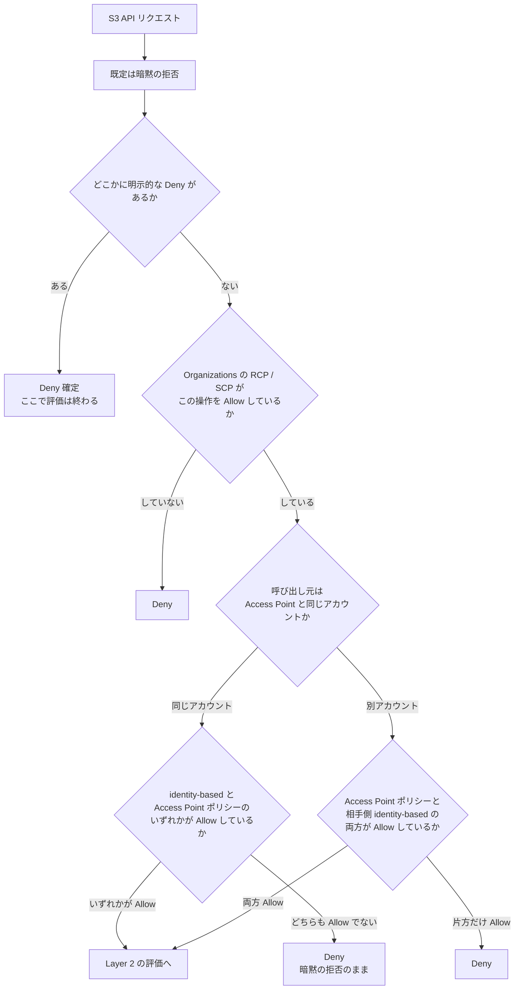
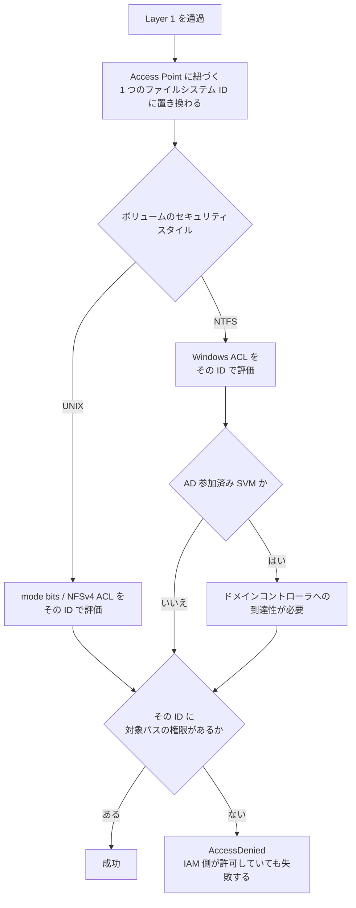

# S3 Access Point 経由のリクエストはどう判定されるか

[🏠 リポジトリトップ](../../../../README.md) | [Reference](../README.md)

---

## 結論

**FSx for ONTAP の S3 Access Point 経由のリクエストは、二段で判定されます。** 一段目は AWS の
標準的なポリシー評価、二段目はファイルシステム側の権限評価です。**一段目を通っても二段目で落ちます。**

そして一段目には**順序があります。** 順序を知らないまま「許可を書いたのに通らない」「絞ったつもりが
通ってしまう」を追いかけると、原因のない場所を探すことになります。

| 段 | 何が判定するか | 落ちたときの症状 |
|---|---|---|
| **Layer 1: AWS 側** | 明示的な `Deny` → Organizations の RCP / SCP → identity-based ポリシーと Access Point ポリシー | `AccessDenied`。resource-based の明示 `Deny` に当たった場合はエラー本文に `with an explicit deny in a resource-based policy` が入ります |
| **Layer 2: ファイルシステム側** | Access Point に紐づく**1 つのファイルシステム ID** の、対象パスに対する権限 | `AccessDenied`。**IAM 側は許可しているのに失敗するのはここです** |

**最も間違いやすいのは、同一アカウントとクロスアカウントで規則が違う点です。**

| 呼び出し元 | 規則 |
|---|---|
| Access Point と**同じアカウント** | identity-based と Access Point ポリシーの **いずれかが** `Allow` すれば通ります（**和**） |
| **別アカウント** | Access Point ポリシーと相手側 identity-based の **両方が** `Allow` する必要があります |

> **Evidence**: `documented` — 評価順序と、同一アカウントが和・クロスアカウントが両方であることは
> AWS の公式ドキュメントの記載です（[出典](#参照した一次情報)）。
> **この順序を FSx for ONTAP の S3 Access Point で確認した実測**は
> [アクセスポイントポリシーの Allow は上限にならない](../../domains/security-governance/notes/access-point-policy-allow-is-not-a-cap.md)
> にあり、そちらが `verified` です。本ツリーは仕組みの整理で、測定値は持ちません。

---

## Layer 1 — AWS 側の評価順序

図と同じ内容を順序で書くと次のとおりです。**上から順に評価され、決まった時点で終わります。**

| # | ステップ | 判定 | 設計上の含意 |
|---|---|---|---|
| 1 | 既定 | 暗黙の拒否 | 何も書かなければ通りません |
| 2 | **明示的な `Deny`** | 1 つでもあれば **Deny 確定** | **絞る手段はこれだけです。** `Allow` を狭く書くことは絞ることではありません |
| 3 | Organizations の RCP / SCP | `Allow` が無ければ Deny | アカウントの外側から止められます。AP ポリシーを直しても通りません |
| 4a | 同一アカウント | identity-based と AP ポリシーの **和** | **AP ポリシーは上限になりません。** 呼び出し元の権限だけで通ります |
| 4b | 別アカウント | **両方**が必要 | AP ポリシーで許可すれば別アカウントから読めます。相手側の権限も必要です |
| 5 | permissions boundary / session policy | 存在すればすべてが `Allow` する必要あり | 一時認証情報を使う経路で効きます |

**2 と 4a が対になっています。** 「`Allow` に書いた範囲しか通らない」と読むと 4a を見落とし、
「明示的な `Deny` を書かないと絞れない」という結論に到達できません。

---

## Layer 2 — ファイルシステム側の評価

**Layer 1 を通過したリクエストは、呼び出し元が誰であったかを失います。**

| 論点 | 内容 |
|---|---|
| 誰として評価されるか | Access Point 作成時に指定した **UNIX ユーザーまたは Windows ユーザー 1 つ**。呼び出し元の IAM プリンシパルとは無関係です |
| 元のファイル ACL | **引き継がれません。** 「その ID が見えるもの」が見える範囲になります |
| ID の変更 | **できません。** Access Point の作り直しになります。用途ごとに Access Point を分ける設計になります |
| AD 参加済み SVM | S3 経由の**すべてのデータ操作**にドメインコントローラへの到達性が必要です。`HeadBucket` は AD が到達不能でも成功するため、疎通確認に使うと偽陽性になります |

**この段があるおかげで、IAM より硬い制限が書けます。** 読み取り専用の ID を紐づけると、
**Layer 1 の設定を変えても書き込みは通りません。** ポリシー 1 行の変更で書けるようになる状態を
避けたい場合は、ここで担保します。

権限が平坦化されることの影響（分析基盤・AI / RAG の索引設計）は
[S3 Access Point は全リクエストを 1 つの ID で認可する](../../domains/data-utilization/notes/reaching-data-without-copies.md)
にあります。

---

## 症状から評価ステップへの逆引き

**どの段で落ちたかが分かれば、探す場所が 1 つに決まります。**

| 症状 | 落ちている可能性が高い段 | 最初に見るもの |
|---|---|---|
| エラー本文に `with an explicit deny in a resource-based policy` | Layer 1 のステップ 2 | Access Point ポリシーの `Deny` 文と、その `Condition` |
| 絞ったつもりの主体が通ってしまう | Layer 1 のステップ 4a | **`Allow` しか書いていないこと。** 明示的な `Deny` を足します |
| 別アカウントから `AccessDenied` | Layer 1 のステップ 4b | AP ポリシー側だけでなく、**相手側の identity-based ポリシー** |
| 組織内なのに全員 `AccessDenied` | Layer 1 のステップ 3 | RCP / SCP。AP ポリシーを直しても変わりません |
| `ListBucket` は通るが `GetObject` が落ちる | Layer 2 | 対象パスの実効権限。`Resource` の粒度も併せて確認します |
| IAM で許可しているのに落ちる | Layer 2 | Access Point に紐づく ID の権限 |
| `HeadBucket` は成功するがデータ操作が落ちる | Layer 2（AD 参加済み SVM） | ドメインコントローラへの到達性 |

---

## よくある誤解

| 誤解 | 実際 |
|---|---|
| Access Point ポリシーに書いた範囲しか通らない | 同一アカウントでは和で評価されます。絞るには明示的な `Deny` が必要です |
| ポリシーを付けていない Access Point は誰も使えない | 呼び出し元の identity-based ポリシーが許可していれば使えます |
| 評価の順序は関係ない | 明示的な `Deny` は最初に見られ、当たった時点で終わります |
| 同一アカウントとクロスアカウントで規則は同じ | 違います。和と両方です |
| 同一アカウント所有が必須だから別アカウントからは読めない | 制約は Access Point を**作る**側です。ポリシーで許可すれば読めます |
| IAM で許可すればデータに届く | Layer 2 が別に評価します |
| ファイルごとの ACL が S3 経由でも効く | 効きません。1 つの ID として評価されます |

---

## このツリーの限界

- **Layer 1 の順序は AWS の公開ドキュメントの記載で、本ツリー自身は測定していません。** FSx for ONTAP の S3 Access Point で確認した範囲は [対応するノート](../../domains/security-governance/notes/access-point-policy-allow-is-not-a-cap.md)にあり、そこに実測日と環境が書かれています。
- **permissions boundary と session policy の分岐は実測していません。** 図に入れてあるのは、順序を欠けたまま示すと「boundary があるのに通った / 通らない」の切り分けができなくなるためです。
- **図は判定の順序を示すもので、性能や監査の経路は含みません。** 誰が読んだかは CloudTrail と IAM 側で追えますが、Layer 2 では区別されません。

---

## 参照した一次情報

| 論点 | 出典 |
|---|---|
| 評価順序（暗黙の拒否 → 明示的な `Deny` → RCP / SCP → 各ポリシー）、明示的な `Deny` が `Allow` を上書きすること | [AWS: How AWS enforcement code logic evaluates requests](https://docs.aws.amazon.com/IAM/latest/UserGuide/reference_policies_evaluation-logic_policy-eval-denyallow.html) |
| 同一アカウントは identity-based と resource-based の**和**で評価されること | [AWS: Policy evaluation logic](https://docs.aws.amazon.com/IAM/latest/UserGuide/reference_policies_evaluation-logic.html) |
| 同一アカウントで片方だけが許可しても許可されること | [AWS: Policy evaluation for requests within a single account](https://docs.aws.amazon.com/IAM/latest/UserGuide/reference_policies_evaluation-logic_policy-eval-basics.html) |
| クロスアカウントは**両方**の評価が真である必要があること | [AWS: Cross-account policy evaluation logic](https://docs.aws.amazon.com/IAM/latest/UserGuide/reference_policies_evaluation-logic-cross-account.html) |
| 二段階認可モデル、ファイルシステム ID による認可、Block Public Access が固定であること | [AWS: Managing access point access](https://docs.aws.amazon.com/fsx/latest/ONTAPGuide/s3-ap-manage-access-fsxn.html) |
| Access Point は HTTPS のみ、HTTP はリダイレクトされること | [AWS: Access points restrictions and limitations](https://docs.aws.amazon.com/AmazonS3/latest/userguide/access-points-restrictions-limitations-naming-rules.html) |

---

## 関連ドキュメント

- [アクセスポイントポリシーの Allow は上限にならない](../../domains/security-governance/notes/access-point-policy-allow-is-not-a-cap.md) — **本ツリーの各ステップを実環境で確認した結果とポリシー設定例**
- [S3 Access Point は全リクエストを 1 つの ID で認可する](../../domains/data-utilization/notes/reaching-data-without-copies.md) — Layer 2 が索引設計に効く理由
- [FSx for ONTAP S3 AP は「S3 として使える」わけではない](../../domains/data-utilization/notes/s3-access-point-constraints.md) — Access Point を作る前の前提条件
- [エンドユーザーがデータに届く経路は 4 つある](../../playbooks/02-design/notes/how-end-users-reach-the-data.md#ブラウザ経路--認可が-3-層になる) — ブラウザ経路では認証の層がもう 1 つ増えます
- [決定ツリー一覧](README.md)
- [知見の分類ポリシー](../../evidence-policy.md)

---

[🏠 リポジトリトップ](../../../../README.md) | [Reference](../README.md)
