# ブロックプロトコルとレイアウトの選択

[🏠 リポジトリトップ](../../../../README.md) | [Reference](../README.md) | [決定木](README.md) | [Domain — ブロックストレージ](../../domains/block-storage/README.md)

---

## 結論

**順序があります。プロトコルを選ぶ前に、選択肢を狭めている条件を確認してください。**

1. **デプロイタイプと世代** — NVMe/TCP は第 2 世代のみ。作成後に変更できません
2. **HA ペア数** — 6 組を超えるとブロックプロトコルが使えなくなり、増やした HA ペアは削除できません
3. **ホスト OS** — **Windows Server との NVMe/TCP は ONTAP 側で非対応です**（AWS 固有の制約ではありません）
4. **LUN のレイアウト** — 決めているのは復旧の粒度です
5. **容量** — 3 か所で数えられ、足りなくなると LUN が read-only に落ちます
6. **整合性** — 既定は crash-consistent です

**1 と 2 は作り直し以外に戻す方法がありません。** そこから順に確認してください。ブロックにするかどうか自体の判断は [ブロックストレージの選択肢の比較](../comparison/block-storage-options.md) にあります。

> **区分**: `documented` — 分岐の条件は AWS / NetApp 公式ドキュメントの記載に基づきます（2026-09-05 に確認）。
> **性能値は含めません。** どの分岐も性能ではなく可否と粒度の判断です。

---

## 決定フロー

```mermaid
graph TD
    START[ブロックで提供すると決めた] --> DT{デプロイタイプは決まっているか}

    DT -->|未決定| GEN{NVMe-TCP を使いたいか}
    GEN -->|使いたい| G2["第 2 世代を選ぶ<br/>SINGLE_AZ_2 または MULTI_AZ_2"]
    GEN -->|iSCSI で足りる| GANY["第 1 世代でも可"]

    DT -->|既存の第 1 世代| ONLY["iSCSI のみ<br/>NVMe-TCP は作り直しが必要"]

    G2 --> HA{HA ペアを 7 組以上に<br/>増やす計画があるか}
    GANY --> HA
    ONLY --> HA

    HA -->|ある| STOP["ブロックは使えません<br/>6 組を上限に設計し直す"]
    HA -->|ない| OS{ホスト OS}

    OS -->|Linux| PROTO{プロトコルの選択}
    OS -->|Windows| WIN["iSCSI を選ぶ<br/>NVMe/TCP は ONTAP 側で非対応"]

    PROTO -->|レイテンシ重視・MPIO を単純にしたい| KERNEL{"カーネルに<br/>CONFIG_NVME_MULTIPATH があるか"}
    PROTO -->|実績と手順の豊富さ| ISCSI["iSCSI<br/>ポート 3260 を開ける"]

    KERNEL -->|ある| NVME["NVMe-TCP<br/>ポート 4420 と 8009 を開ける"]
    KERNEL -->|ない| NOMP["フェイルオーバーが効きません<br/>iSCSI にするか<br/>有効なディストリビューションにする"]

    NOMP --> ISCSI
    WIN --> LAYOUT
    NVME --> LAYOUT
    ISCSI --> LAYOUT

    LAYOUT{復旧したい粒度は<br/>LUN ごとに違うか}
    LAYOUT -->|違う| SPLIT["別ボリュームに分ける<br/>Snapshot と SnapMirror が別スケジュールになる"]
    LAYOUT -->|同じ| TOGETHER["同じボリュームに置く<br/>1 つの Snapshot で相互整合が取れる"]

    SPLIT --> CAP
    TOGETHER --> CAP

    CAP{容量設計}
    CAP --> CAP1["ボリュームを LUN より 5% 以上大きく"]
    CAP1 --> CAP2["space-allocation を有効化"]
    CAP2 --> CAP3{Snapshot を<br/>このボリュームで取るか}
    CAP3 -->|取る| CAP4["snapshot 予約を見積もる<br/>autodelete と autogrow を設定"]
    CAP3 -->|SnapCenter に任せる| CAP5["snapshot policy を none に"]

    CAP4 --> CONS
    CAP5 --> CONS

    CONS{アプリケーションを<br/>その時点から起動したいか}
    CONS -->|はい| SC["静止させる仕組みが必要<br/>SnapCenter など"]
    CONS -->|クラッシュ復旧で足りる| CC["既定の Snapshot で足ります"]

    SC --> AUTO
    CC --> AUTO

    AUTO{自動化の範囲}
    AUTO --> A1["ファイルシステム・SVM・ボリューム<br/>= AWS の API / CloudFormation"]
    A1 --> A2{LUN より下も IaC にするか}
    A2 -->|する| A3["NetApp Terraform provider または<br/>Ansible netapp.ontap または ONTAP REST"]
    A2 -->|手順書で運用| A4["ONTAP CLI<br/>ただし手順書は 2 つの制御面をまたぎます"]
```

---

## 各分岐の根拠

| 分岐 | 条件 | 出典 |
|---|---|---|
| NVMe/TCP は第 2 世代のみ | 「第 2 世代かつ HA ペア 6 組以下」 | [AWS: Accessing your data](https://docs.aws.amazon.com/fsx/latest/ONTAPGuide/accessing-data-from-on-premises.html) |
| iSCSI は世代を問わない | 「HA ペア 6 組以下のすべてのファイルシステム」 | 同上 |
| デプロイタイプは変更不可 | 変更操作が存在せず、移行手段はバックアップ復元・SnapMirror・DataSync・サードパーティ | [AWS: Availability and deployment options](https://docs.aws.amazon.com/fsx/latest/ONTAPGuide/high-availability-AZ.html) |
| 7 組目でブロックが使えなくなる。HA ペアは削除不可 | 「6 組を超えるファイルシステムではサポートされません」 | [AWS: Adding HA pairs](https://docs.aws.amazon.com/fsx/latest/ONTAPGuide/adding-HA-pairs.html) |
| **Windows Server との NVMe/TCP は ONTAP 側で非対応** | Windows のサポート範囲はネイティブ NVMe ディスク（JBOD）に限られる。回避策として挙げられている NVMe/FC は、FC を提供しない FSx for ONTAP では使えません | [NetApp KB: Does ONTAP SAN support NVMe/TCP with Windows Server](https://kb.netapp.com/on-prem/ontap/da/SAN/SAN-KBs/Does_NetApp_ONTAP_SAN_support_NVMe_TCP_with_Windows_Server) |
| AWS が列挙しているブロックの手順は 3 つ | iSCSI for Linux / iSCSI for Windows / NVMe/TCP for Linux | [AWS: Accessing your data](https://docs.aws.amazon.com/fsx/latest/ONTAPGuide/accessing-data-from-on-premises.html) |
| Windows 版が無いことを欠落と見なさない判断 | **これは当方の推論で、出典の記述ではありません。** 上流が非対応であることから、AWS 側に手順が無いことは説明が付く、という読みです | — |
| NVMe/TCP は MPIO の構成が単純 | 「iSCSI に比べて multi-path IO の構成を単純にする」 | [AWS: NVMe-over-TCP support](https://aws.amazon.com/about-aws/whats-new/2024/07/amazon-fsx-netapp-ontap-nvme-over-tcp) |
| **カーネルに `CONFIG_NVME_MULTIPATH` が無いとフェイルオーバーが効かない** | Amazon Linux 2023（kernel 6.18.44）では無効で、1 つの namespace が同じ `wwid` の 2 デバイスとして現れます。フェイルオーバーの実測で、iSCSI が 1,161 サンプル失敗 0 の一方、NVMe/TCP は 423.8 秒使えませんでした | [パスはフェイルオーバーの仕組みそのもの](../../domains/block-storage/notes/paths-are-the-failover-mechanism.md#実測したフェイルオーバー)（`verified`） |
| NVMe/TCP は 8009 も要る | discovery が 8009、データが 4420 | [Multi-AZ が動かすのはアドレスではなくルート](../../domains/block-storage/notes/multi-az-moves-a-route-not-an-address.md)（`verified`） |
| ポートは 3260 と 4420 | 3260 は要件表に、4420 は手順と re:Post の前提条件に | [AWS: Security groups](https://docs.aws.amazon.com/fsx/latest/ONTAPGuide/limit-access-security-groups.html) · [re:Post](https://repost.aws/knowledge-center/ec2-mount-fsx-ontap-nvme-tcp) |
| Snapshot と SnapMirror はボリューム単位 | 関連する LUN を同居させると相互に整合した複製が 1 回で取れる | [NetApp: LUN placement](https://docs.netapp.com/us-en/ontap-apps-dbs/oracle/oracle-storage-san-config-lun-placement.html) |
| ボリュームは LUN より 5% 以上大きく | 「ボリューム Snapshot の余地を残すため」 | [AWS: Creating an iSCSI LUN](https://docs.aws.amazon.com/fsx/latest/ONTAPGuide/create-iscsi-lun.html) |
| `space-allocation` を有効化 | 容量切れをホストに通知でき、削除された領域を回収できる | 同上 |
| 既定の Snapshot は crash-consistent | application-consistent のフラグは記録用で、ONTAP から見た違いはない | [NetApp: Snapshot consistency](https://docs.netapp.com/us-en/ontap-restapi/application_applications_application.uuid_snapshots_endpoint_overview.html) |
| SnapCenter を使うなら snapshot policy は none | スケジュール Snapshot は application-consistent ではないため | [AWS: SnapCenter for SQL Server](https://aws.amazon.com/blogs/storage/using-netapp-snapcenter-with-amazon-fsx-for-netapp-ontap-to-protect-your-sql-server-workloads) |
| LUN は AWS の API では作れない | CloudFormation の Amazon FSx のリソースタイプは 6 種のみ | [AWS: CloudFormation Amazon FSx resource types](https://docs.aws.amazon.com/AWSCloudFormation/latest/TemplateReference/AWS_FSx.html) |

---

## 自環境での確認手順

**この決定木の 1 と 2 は、作ってから確かめると手遅れになります。** 設計レビューの段階で確認してください。

| # | 手順 | 確認できること |
|---|---|---|
| 1 | `aws fsx describe-file-systems --query 'FileSystems[].OntapConfiguration.[DeploymentType,HAPairs]'` | 世代と HA ペア数。NVMe/TCP が選べるか |
| 2 | ホスト OS の一覧を作り、Windows が含まれるかを確認する | NVMe/TCP を選べる範囲 |
| 3 | セキュリティグループに 3260 と、NVMe/TCP を使うなら 4420 と 8009 の受信規則があるかを確認する | **要件表に 4420 がないため、iSCSI 用に書いた規則では通りません** |
| 3b | NVMe/TCP を選ぶ前に `grep CONFIG_NVME_MULTIPATH /boot/config-$(uname -r)` を実行する | **無効ならフェイルオーバーが効きません。** ここで選択が変わります |
| 4 | 復旧したい単位を関係者と合意し、その単位でボリュームを分けるかを決める | LUN のレイアウトの根拠 |
| 5 | 検証環境で LUN を作り、`lun show -fields space-reserve,space-allocation` と `volume show -fields size,available` を並べて記録する | 容量が 3 か所で数えられることの確認 |
| 6 | Snapshot を取り、`snapshot show -fields snapshot,state` で既定の整合性区分を確認する | 静止の仕組みが必要かどうか |

手順 5 と 6 は**検証環境で行ってください。** 本番の LUN で `space-reserve` を変えると、ボリュームの空き容量の計算が変わります。

---

## よくある誤解

| 誤解 | 実際 |
|---|---|
| プロトコルは後から変えられる | **iSCSI から NVMe/TCP へ移るには第 2 世代が必要**で、第 1 世代なら作り直しです |
| iSCSI 用のセキュリティグループがあれば NVMe/TCP も通る | **ポートが違います**（3260 と、4420 + 8009）。しかも 4420 は AWS の要件表に載っていません |
| NVMe/TCP のほうが MPIO が単純なので可用性も有利 | **カーネル次第です。** `CONFIG_NVME_MULTIPATH` が無効なディストリビューションでは切り替わりませんでした |
| 1 LUN 1 ボリュームが常に正解 | NetApp は 1:1 を formal best practice としていません。**決めているのは復旧の粒度です** |
| ボリュームと LUN を同じサイズにすればよい | **ボリュームは LUN より 5% 以上大きく**することが推奨されています |
| Snapshot があればデータベースをその時点から起動できる | 既定は crash-consistent です。起動できるかはアプリケーション側の復旧処理に依存します |
| HA ペアを増やしてブロックの性能を伸ばす | **7 組目からブロックが使えなくなります** |

---

## 関連ドキュメント

- [決定木](README.md) — このモジュールのハブ
- [Domain — ブロックストレージ](../../domains/block-storage/README.md) — 各分岐の詳細なノート
- [ブロックストレージの選択肢の比較](../comparison/block-storage-options.md) — ブロックにするかどうかの判断
- [ブロックプロトコルの選択肢は世代と HA ペア数で先に狭まる](../../domains/block-storage/notes/protocol-choice-is-bounded-before-you-choose.md) — 分岐 1〜3 の詳細
- [LUN の並べ方が決めているのは復旧の粒度](../../domains/block-storage/notes/lun-layout-decides-recovery-granularity.md) — 分岐 4 の詳細
- [容量は 3 か所で数えられる](../../domains/block-storage/notes/capacity-is-counted-in-three-places.md) — 分岐 5 の詳細
- [LUN の Snapshot は既定で crash-consistent](../../domains/block-storage/notes/a-snapshot-of-a-lun-is-crash-consistent.md) — 分岐 6 の詳細
- [デプロイタイプは一度しか決められない](../../playbooks/02-design/notes/deployment-type-is-decided-once.md) — 分岐 1〜2 の不可逆性
- [ブロックストレージ横断リソースマップ](../block-storage-resource-map.md) — 一次情報の索引
- [知見の分類ポリシー](../../evidence-policy.md)

---

[🏠 リポジトリトップ](../../../../README.md) | [Reference](../README.md) | [決定木](README.md) | [Domain — ブロックストレージ](../../domains/block-storage/README.md)
