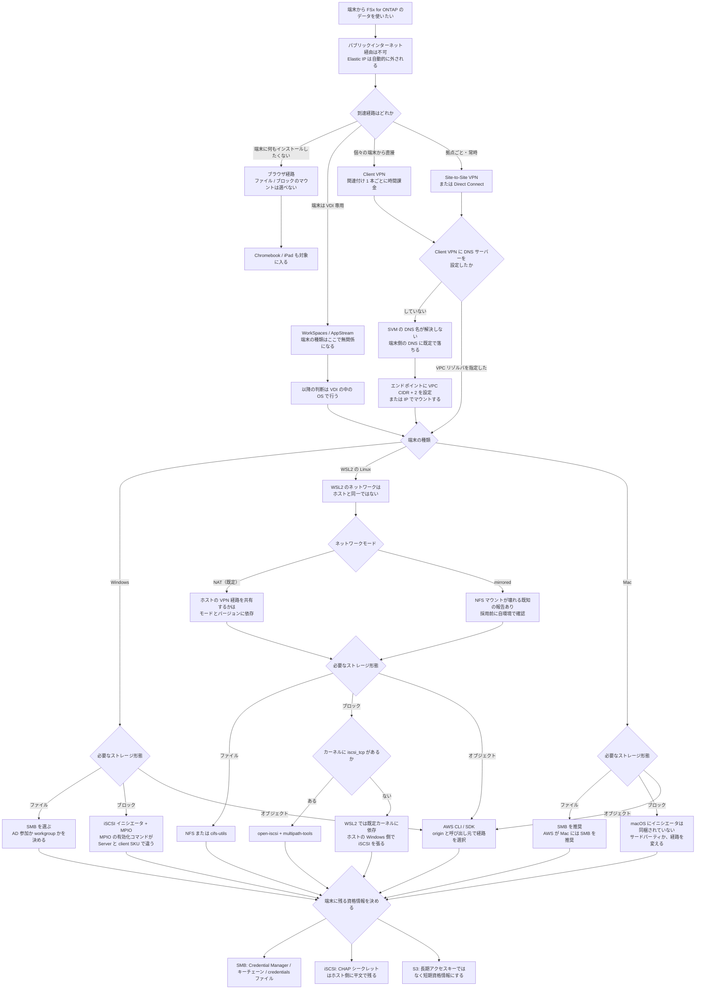

# 端末からデータに届く経路の選択

[🏠 リポジトリトップ](../../../../README.md) | [Reference](../README.md) | [決定木](README.md) | [Domain — クライアントアクセス](../../domains/client-access/README.md)

---

## 結論

**順序があります。端末の種類より先に、到達経路が決まっています。**

1. **パブリックインターネットからは届きません** — Amazon FSx は、ファイルシステムの ENI に付いた Elastic IP を自動的に外します。ここが分岐ではなく前提です
2. **到達経路** — VPN / Direct Connect / VDI / ブラウザのどれか。**これがストレージ形態を狭めます**
3. **端末の種類** — Windows / WSL2 / Mac。**ここで初めてプロトコルが絞られます**
4. **認証の置き場所** — Active Directory 参加か workgroup か。SMB の場合に効きます
5. **資格情報の置き場所** — 端末に何が残るか

**2 を飛ばして 3 から始めると、マウントコマンドは正しいのに届かない状態になります。** これがこの決定木の存在理由です。

> **区分**: `documented` — 分岐の条件は AWS / NetApp / Microsoft / Apple 公式ドキュメントの記載に基づきます（2026-09-13 に確認）。
> **実測はまだ含みません。** 端末での再現は [Domain — クライアントアクセス](../../domains/client-access/README.md) のノート側に、測定した項目だけ順次入ります。
> **性能値は含めません。** どの分岐も可否の判断であり、この経路で帯域を測ると VPN のトンネルと端末の NIC を測ることになります（[理由](#この決定木で帯域を測らない理由)）。

---

## 決定フロー

**同じ内容を表でも書きます。** 図が読めない環境でも判断できるようにするためです。

| 到達経路 | 端末の種類は関係するか | 使えるストレージ形態 | 端末に入れるもの |
|---|---|---|---|
| ブラウザ（ファイルポータル） | **しません。** ブラウザがあれば足ります | オブジェクト経由のファイル閲覧のみ | なし |
| VDI（WorkSpaces / AppStream） | **しません。** 判断は VDI の中の OS に移ります | VDI の中の OS が決めます | VDI クライアント |
| Client VPN | **します** | 端末の種類が決めます | VPN クライアント + 証明書 |
| Site-to-Site VPN / Direct Connect | **します** | 端末の種類が決めます | なし（拠点側で終端） |

| 端末 | ファイル | ブロック | オブジェクト |
|---|---|---|---|
| Windows | SMB（標準機能） | iSCSI イニシエータ + MPIO。**MPIO の有効化が SKU で違う** | AWS CLI / SDK |
| WSL2 の Linux | NFS または `cifs-utils`。**ネットワーク境界が先に来る** | **既定カーネルに依存** | AWS CLI / SDK |
| Mac | SMB（AWS の推奨）。NFS も可 | **同梱されていません** | AWS CLI / SDK |

---

## 各分岐の根拠

| 分岐 | 条件 | 出典 |
|---|---|---|
| **パブリックインターネットからは届かない** | 「Amazon FSx はパブリックインターネットからのファイルシステムへのアクセスをサポートしません」。ENI に付いた Elastic IP は自動的に切り離されます | [AWS: Supported clients](https://docs.aws.amazon.com/fsx/latest/ONTAPGuide/supported-clients-fsx.html) |
| 端末が別 VPC・別アカウント・別リージョン・オンプレミスなら、経路を先に用意する | 「Transit Gateway、Direct Connect、または VPN をセットアップしてください」と各手順ページの前提条件に書かれています | [AWS: Mounting volumes on macOS clients](https://docs.aws.amazon.com/fsx/latest/ONTAPGuide/attach-mac-client.html) · [AWS: Provisioning iSCSI for Windows](https://docs.aws.amazon.com/fsx/latest/ONTAPGuide/mount-iscsi-windows.html) |
| **Client VPN に DNS サーバーを設定しないと端末側の DNS に落ちる** | 「Client VPN で DNS サーバーが指定されていない場合、ローカルマシンに設定された DNS が既定になります」。VPC のリゾルバは VPC CIDR + 2 です | [AWS re:Post: DNS Resolution with ClientVPN](https://repost.aws/questions/QUGbxYw0jdTjermVgyW5kjmQ/dns-resolution-with-clientvpn) · [AWS: Client VPN endpoint での DNS の動作](https://aws.amazon.com/premiumsupport/knowledge-center/client-vpn-how-dns-works-with-endpoint/) |
| Client VPN の課金はサブネットの関連付け単位 | ap-northeast-1 で関連付け $0.15/時、接続 $0.05/時。**エンドポイントを残したまま関連付けを外せば関連付け分は止まります** | AWS Price List API、On-Demand、2026-09-13 取得 |
| Mac には SMB を推奨 | 「Mac クライアントには SMB プロトコルでボリュームを接続することを推奨します」 | [AWS: Mounting volumes on macOS clients](https://docs.aws.amazon.com/fsx/latest/ONTAPGuide/attach-mac-client.html) |
| macOS の SMB マウントは `mount -t smbfs`、既定共有は `C$` | `sudo mount -t smbfs <svm-dns>:/C$ /fsx`。`C$` は SVM 名前空間のルートを見る既定の共有です | 同上 |
| **macOS にはブロックの手順が存在しない** | AWS が列挙するブロックの手順は iSCSI for Linux / iSCSI for Windows / NVMe/TCP for Linux の 3 つで、macOS はありません。**macOS 側にイニシエータが同梱されていないことが上流の理由です** | [AWS: Accessing your FSx for ONTAP data](https://docs.aws.amazon.com/fsx/latest/ONTAPGuide/accessing-data-from-on-premises.html) · [Apple Support Communities](https://discussions.apple.com/thread/250425330) · [iscsi-osx/iSCSIInitiator](https://github.com/iscsi-osx/iSCSIInitiator) |
| Windows の SMB は AD 参加が必須ではない | 「ボリュームの SVM が組織の Active Directory に参加しているか、**または workgroup を使っている**必要があります」 | [AWS: Mounting volumes on Microsoft Windows clients](https://docs.aws.amazon.com/us_en/fsx/latest/ONTAPGuide/attach-windows-client.html) |
| Windows の iSCSI は `MSiSCSI` の起動とイニシエータ名の取得から始まる | `Start-Service MSiSCSI`、`(Get-InitiatorPort).NodeAddress` が `iqn.1991-05.com.microsoft:...` を返します | [AWS: Provisioning iSCSI for Windows](https://docs.aws.amazon.com/fsx/latest/ONTAPGuide/mount-iscsi-windows.html) |
| **AWS の Windows iSCSI 手順は Windows Server を前提にしている** | 手順は「Windows Server 2019 の AMI を実行する EC2 インスタンス」を前提とし、MPIO の有効化に `Install-WindowsFeature Multipath-IO` を使います。**`Install-WindowsFeature` はサーバー管理用で、Windows 10 / 11 のクライアント SKU では使えません** | 同上 · [Stack Overflow: How to enable a Windows feature via Powershell](https://stackoverflow.com/questions/14236406/how-to-enable-a-windows-feature-via-powershell) |
| Windows iSCSI のセッション設計は 8 セッション / ポータル | 1 セッションあたり最大 625 MBps。2 ポータル × 8 で 16 セッション、集計 40 Gbps（5,000 MBps）に達する構成として記載されています | [AWS: Provisioning iSCSI for Windows](https://docs.aws.amazon.com/fsx/latest/ONTAPGuide/mount-iscsi-windows.html) |
| **Windows iSCSI の接続には端末のローカル IP を渡す** | 手順の `.ps1` は `InitiatorPortalAddress` に「Windows インスタンスの IP アドレス」を渡します。**VPN 経由の端末ではこの値が接続ごとに変わるため、固定値で書いたスクリプトは次回動きません** | 同上（`$LocaliSCSIAddress = "ec2_ip"`） |
| NetApp Windows Host Utilities のインストールには NetApp Support アカウントが要る | 「インストーラのダウンロードには NetApp Support アカウントが必要です」 | 同上 |
| iSCSI は HA ペア 6 組以下のファイルシステムで使える | 「6 組以下のすべてのファイルシステムで利用できます」 | 同上 |
| WSL2 のネットワークは既定でホストと同一ではない | WSL2 は仮想化されたネットワークインターフェースと NAT を持ちます。mirrored モードでは Windows ホストと WSL2 が `localhost` で相互に到達できます | [Microsoft: Accessing network applications with WSL](https://learn.microsoft.com/en-us/windows/wsl/networking) |
| **mirrored モードで NFS マウントが壊れる報告がある** | Microsoft の WSL リポジトリに `WSL 2 mirrored networking breaks NFS mounts ("Connection timed out")` として Issue が立っています。**未解決の報告であり、当方でも未確認です** | [microsoft/WSL Issue #12508](https://github.com/microsoft/WSL/issues/12508) |
| SMB の同時利用に Multichannel を使う場合、ONTAP 側は既定無効 | このリポジトリの比較表に記録があります | [ファイルストレージの選択肢の比較](../comparison/file-storage-options.md#すべての-smb-数値の前提) |
| **VPN / Direct Connect / Transit Gateway / ピアリング経由で VPC に入る端末通信を私設経路に限定するにはインターフェースエンドポイントが要る** | ゲートウェイエンドポイントは VPC 内で発生した通信には使えますが、VPC 外から入るトラフィックをルーティングしません | [S3 Access Point の権限設計](../../domains/security-governance/notes/access-point-authorization-layers.md) |
| AD 参加 SVM の全データ操作における DC 依存と `HeadBucket` の挙動は未解決 | AWS は Windows ID の解決と名前サービス到達性を要件にしますが、既存の universal claim を支える完全な公開記録はありません | [端末から S3 Access Points に届く条件](../../domains/client-access/notes/what-an-endpoint-needs-to-reach-s3-access-points.md#AD-参加-SVM-に関する未解決の範囲) |

### 出典の性質が違う 2 行

**上の表には、AWS 公式ではない出典が 2 行あります。** 判断に使う前に性質を分けてください。

| 行 | 出典の性質 |
|---|---|
| macOS にイニシエータが同梱されていない | **Apple の「対応していない」という明示的な記述は見つけていません。** Apple のコミュニティスレッドとサードパーティ実装の存在から成り立つ主張です。より強い根拠が要る場合は、実機で `iscsiadm` 相当のコマンドが無いことを確認してください |
| `Install-WindowsFeature` がクライアント SKU で使えない | Microsoft の公式リファレンスは `ServerManager` モジュールに属することを示しますが、「クライアントでは使えない」という一文の形では確認していません。**Windows 実機での確認が測定項目に入っています** |

---

## この決定木で帯域を測らない理由

**この経路で測った数値は、ストレージの性能を表しません。** 測っているのは端末の NIC、家庭や社内の回線、VPN のトンネル、そして端末とリージョン間の距離です。
どれもファイルシステムの構成とは無関係に変わります。

既存のノートが同じ形の誤りを扱っています。単一接続の値をストレージの上限として読めない理由は
[単一接続で測った値はストレージの性能ではない](../../domains/performance/notes/a-single-connection-measures-the-client.md) にあります。
**端末経路の場合は、そこに VPN のトンネルという追加の直列要素が入るだけで、構図は同じです。**

性能を測る必要がある場合は、VPC 内の EC2 から測ってください。切り分けの順序は
[手元のスループット値は何を測ったのかを判定する](measured-throughput-triage.md) にあります。

---

## 自環境での確認手順

**分岐 1 と 2 は、端末の設定を始める前に確認してください。** ここが成り立っていないと、端末側の作業はすべて空振りになります。

| # | 手順 | 確認できること |
|---|---|---|
| 1 | `aws fsx describe-file-systems --query 'FileSystems[].OntapConfiguration.Endpoints.Nfs.DNSName'` を VPC 内から実行する | DNS 名が引けるか。**端末からではなく VPC 内から確認するのが先です** |
| 2 | 端末を VPN に接続した状態で `nslookup <svm-dns-name>` を実行する | **VPN 越しに名前解決が届くか。** 解決しない場合は Client VPN の DNS サーバー設定が未指定です |
| 3 | 解決しなかった場合、`aws ec2 describe-client-vpn-endpoints --query 'ClientVpnEndpoints[].DnsServers'` を確認する | 空なら端末側の DNS に落ちています。VPC CIDR + 2 を設定してください |
| 4 | 端末から `nc -vz <svm-ip> 445`（SMB）または `445` / `2049` / `3260` を試す | 経路とセキュリティグループの受信規則。**名前解決と到達性は別に確認してください** |
| 5 | Windows: `Get-WindowsOptionalFeature -Online -FeatureName MultiPathIO` | クライアント SKU で MPIO をどう有効化するか。**`Install-WindowsFeature` が使えるかはここで分かります** |
| 6 | Mac: `which iscsiadm; ls /usr/sbin \| grep -i iscsi` | イニシエータの不在。**「無い」ことの確認は自環境で取るのがいちばん確実です** |
| 7 | WSL2: `wsl.exe --version` と `cat /etc/wsl.conf` でネットワークモードを確認し、`ip route` を Windows 側の `route print` と比べる | WSL2 がホストの VPN 経路を共有しているか |
| 8 | 端末から `aws s3api list-objects-v2 --bucket <access-point-alias>` を試す | S3 Access Points への到達。VPC 外から入る端末通信を私設経路に限定する場合は、インターフェースエンドポイントと名前解決を確認します |

手順 4 から 8 は**検証用のファイルシステムで行ってください。** 本番の SVM に対して端末から試すと、
失敗した認証が監査ログに残り、ロックアウトの閾値に近づきます（[fsxadmin はロックされる](../../playbooks/05-operate/notes/admin-account-lockout-and-recovery.md)）。

---

## よくある誤解

| 誤解 | 実際 |
|---|---|
| 端末に Elastic IP を許可すればインターネットから使える | **Amazon FSx が Elastic IP を自動的に外します。** 設定の問題ではなく、経路が存在しません |
| VPN に繋がればマウントできる | **名前解決と到達性は別です。** Client VPN に DNS サーバーを指定していないと、端末は自分のローカル DNS を使い続けます |
| AWS の Windows iSCSI 手順はそのまま Windows 端末で動く | **手順は Windows Server 2019 の EC2 を前提にしています。** MPIO の有効化コマンドがクライアント SKU では通らず、`InitiatorPortalAddress` に渡す IP も VPN では接続ごとに変わります |
| Mac でも iSCSI が使える | **macOS にイニシエータは同梱されていません。** サードパーティを入れるか、ブロックが必要な処理を別の端末に寄せるかの判断になります |
| WSL2 は Windows ホストと同じネットワークにいる | **既定は NAT です。** ホストが VPN に繋がっていても、WSL2 から同じ経路が使えるとは限りません |
| WSL2 を mirrored モードにすれば解決する | **NFS マウントが壊れるという未解決の報告があります。** 解決策として選ぶ前に自環境で確認してください |
| SMB を使うには Active Directory が必要 | **workgroup でも使えます。** AWS の手順ページが両方を挙げています。ID の写像が要るかどうかで決めてください |
| ブラウザ経路は機能が少ない代替手段 | **端末に何もインストールせずに済む唯一の経路です。** Chromebook や iPad はここでしか対象に入りません。引き換えにマウントの選択肢が消えます |
| Client VPN のエンドポイントを消さないと課金が続く | **課金はサブネットの関連付けに付きます。** 関連付けを外せば $0.15/時 は止まります |

---

## 参照した一次情報

| 論点 | 出典 |
|---|---|
| パブリックインターネットからのアクセスが非対応で、Elastic IP が自動的に切り離されること。対応する NFS / SMB / iSCSI のバージョン | [AWS: Supported clients](https://docs.aws.amazon.com/fsx/latest/ONTAPGuide/supported-clients-fsx.html) |
| macOS への SMB 推奨、`mount -t smbfs` の形、既定共有 `C$`、第 2 世代では DNS 名の使用が推奨されること、別 VPC / オンプレミスなら Transit Gateway / Direct Connect / VPN が前提であること | [AWS: Mounting volumes on macOS clients](https://docs.aws.amazon.com/fsx/latest/ONTAPGuide/attach-mac-client.html) |
| Windows の SMB マウントに AD 参加または workgroup が必要であること | [AWS: Mounting volumes on Microsoft Windows clients](https://docs.aws.amazon.com/us_en/fsx/latest/ONTAPGuide/attach-windows-client.html) |
| Windows の iSCSI 手順、`MSiSCSI` の起動、イニシエータ名の取得、`Install-WindowsFeature Multipath-IO`、NetApp Windows Host Utilities と Support アカウント、8 セッション / ポータルと 1 セッション 625 MBps、`InitiatorPortalAddress` にローカル IP を渡すこと、HA ペア 6 組以下という条件、`CheckiSCSI.ps1` の配布 | [AWS: Provisioning iSCSI for Windows](https://docs.aws.amazon.com/fsx/latest/ONTAPGuide/mount-iscsi-windows.html) |
| Linux クライアントの NFS マウントが既定で hard mount であること | [AWS: Mounting volumes on Linux clients](https://docs.aws.amazon.com/fsx/latest/ONTAPGuide/attach-linux-client.html) |
| AWS が列挙するブロックの手順が Linux iSCSI / Windows iSCSI / Linux NVMe/TCP の 3 つであること | [AWS: Accessing your FSx for ONTAP data](https://docs.aws.amazon.com/fsx/latest/ONTAPGuide/accessing-data-from-on-premises.html) |
| WorkSpaces と併用する手順が存在すること | [AWS: Using Amazon WorkSpaces with FSx for ONTAP](https://docs.aws.amazon.com/fsx/latest/ONTAPGuide/using-workspaces.html) |
| Client VPN の DNS の動作と、指定しない場合にローカルの DNS が使われること | [AWS: Client VPN endpoint での DNS の動作](https://aws.amazon.com/premiumsupport/knowledge-center/client-vpn-how-dns-works-with-endpoint/) · [AWS re:Post](https://repost.aws/questions/QUGbxYw0jdTjermVgyW5kjmQ/dns-resolution-with-clientvpn) |
| Client VPN が OpenVPN ベースのクライアントで任意の場所から接続する仕組みであること | [AWS: What is AWS Client VPN?](https://docs.aws.amazon.com/vpn/latest/clientvpn-admin/what-is.html) |
| Client VPN の関連付け $0.15/時、接続 $0.05/時（ap-northeast-1、On-Demand、2026-09-13 取得） | AWS Price List API（`APN1-ClientVPN-EndpointHours` / `APN1-ClientVPN-ConnectionHours`） |
| WSL2 が仮想化されたネットワークと NAT を持ち、mirrored モードで `localhost` 相互到達になること | [Microsoft: Accessing network applications with WSL](https://learn.microsoft.com/en-us/windows/wsl/networking) |
| mirrored モードで NFS マウントが失敗する未解決の報告 | [microsoft/WSL Issue #12508](https://github.com/microsoft/WSL/issues/12508) |
| macOS にイニシエータが同梱されておらず、サードパーティ実装が使われていること | [Apple Support Communities](https://discussions.apple.com/thread/250425330) · [iscsi-osx/iSCSIInitiator](https://github.com/iscsi-osx/iSCSIInitiator) |
| Client VPN でファイル共有を端末にマウントする構成の先行実装（対象は FSx for Windows File Server） | [aws-samples/access-amazon-fsx-through-clientvpn](https://github.com/aws-samples/access-amazon-fsx-through-clientvpn) |
| 到達経路として AWS Verified Access を使う構成（対象は FSx for Windows File Server） | [AWS: Securely Access Amazon FSx for Windows File Server using AWS Verified Access](https://aws.amazon.com/blogs/networking-and-content-delivery/securely-access-amazon-fsx-for-windows-file-server-using-aws-verified-access/) |

---

## 関連ドキュメント

- [決定木](README.md) — このモジュールのハブ
- [Domain — クライアントアクセス](../../domains/client-access/README.md) — 各分岐の詳細なノート
- [端末別にできることの比較](../comparison/client-endpoint-capabilities.md) — 端末 × ストレージ形態の可否
- [端末の到達経路の比較](../comparison/endpoint-reachability-options.md) — 分岐 2 の費用と引き換え
- [エンドユーザーがデータに届く経路は 4 つある](../../playbooks/02-design/notes/how-end-users-reach-the-data.md) — ブラウザ経路の設計
- [S3 Access Point 経由のリクエストはどう判定されるか](access-point-authorization.md) — オブジェクト側の認可
- [ブロックプロトコルとレイアウトの選択](block-protocol-and-layout.md) — LUN 側の設計
- [SMB のユーザー管理と監査は 2 つの選択で決まる](smb-identity-and-audit.md) — workgroup と AD 参加の分岐
- [知見の分類ポリシー](../../evidence-policy.md)

---

[🏠 リポジトリトップ](../../../../README.md) | [Reference](../README.md) | [決定木](README.md) | [Domain — クライアントアクセス](../../domains/client-access/README.md)
