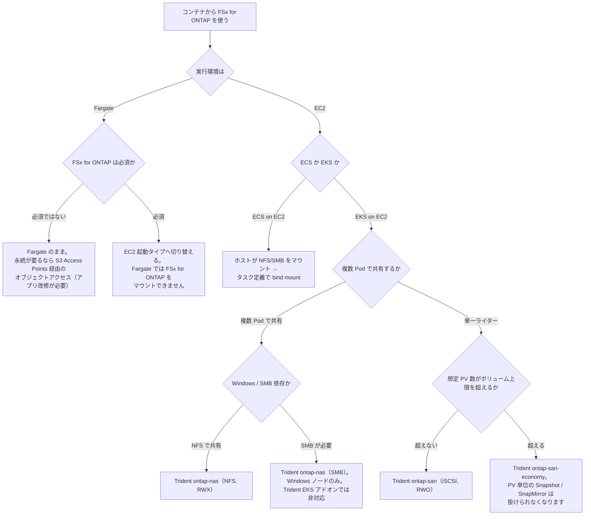

# コンテナから FSx for ONTAP をデータストアにできるか

[🏠 リポジトリトップ](../../../../README.md) | [Reference](../README.md) | [決定木](README.md) | [Domain — ブロックストレージ](../../domains/block-storage/README.md)

---

## 結論

**この決定木の最初の分岐は、コンテナのオーケストレータでも、必要なプロトコルでもありません。実行環境が Fargate か EC2 かです。**

Amazon ECS / Amazon EKS 上のコンテナから FSx for ONTAP を永続ボリューム（PV）やデータ領域として使えるかは、**AWS Fargate を選んだ時点で決まります。** Fargate は ECS・EKS のどちらでも FSx for ONTAP をマウントできません。ここが最も強い制約なので最初に置きます。

**そして「コンテナ化すると FSx for ONTAP 連携が付いてくる」わけではありません。** AWS Transform のコンテナ化はソースコードを Docker 化してデプロイするところまでで、永続ストレージの構成は生成物に含まれません。連携は NetApp Trident（EKS）やホストマウント（ECS on EC2）を**別途**組み込む作業です。

**最初の 2 問で経路がほぼ決まります。**

| 順 | 問い | なぜここが先か |
|---|---|---|
| 1 | 実行環境は Fargate か EC2 か | **Fargate なら FSx for ONTAP は付けられません。** 性能や共有要件を見る前に候補が消えます |
| 2 | ECS か EKS か | 到達形態が変わります。ECS on EC2 は**ホストのマウントを bind mount**、EKS on EC2 は **Trident の CSI ドライバ** |
| 3 | 複数 Pod で共有するか単一ライターか | EKS の場合、共有なら `ontap-nas`（NFS/SMB, RWX）、単一ライターなら `ontap-san`（iSCSI, RWO） |
| 4 | 想定 PV 数がボリューム上限を超えるか | 超えるなら `ontap-san-economy`。判断は [Kubernetes のブロック PV はボリューム数の上限に当たる](../../domains/block-storage/notes/kubernetes-block-volumes-and-the-volume-limit.md) |
| 5 | Windows / SMB 依存か | SMB PV は `ontap-nas` かつ **Windows ノードのみ**。Trident EKS アドオンでは非対応 |

> **区分**: `documented` — 分岐の条件は AWS / NetApp 公式ドキュメントの記載に基づきます（2026-09-22 に確認）。
> **コンテナ経路の連携は実機で確認していません。** このリポジトリと sibling が持つ実測は EC2 リホスト経路のみで、コンテナから FSx for ONTAP へ至る経路（Trident の PV、ホストマウント）は文献調査の段階です。
> 実装（5 構成の CloudFormation テンプレート）は [FSx-for-ONTAP-Container-Datastore-Patterns](https://github.com/Yoshiki0705/FSx-for-ONTAP-Container-Datastore-Patterns) が持ちます。

---

## 選択のフロー

**同じ内容を表でも書きます。** mermaid が描画されない環境があり、スクリーンリーダーからも確実には読めず、クローラも抽出できないためです。**図の中だけに存在する判断を作りません。**

| # | 問い | 答え | 行き先 |
|---|---|---|---|
| 1 | 実行環境は | Fargate | 2 へ |
| 1 | 同上 | EC2 | 3 へ |
| 2 | FSx for ONTAP は必須か | 必須ではない | **Fargate のまま。** 永続が要るなら S3 Access Points 経由のオブジェクトアクセス（アプリに S3 SDK の改修が必要） |
| 2 | 同上 | 必須 | **EC2 起動タイプへ切り替える。** Fargate では FSx for ONTAP をマウントできません |
| 3 | ECS か EKS か | ECS on EC2 | **ホストが NFS/SMB をマウントし、タスク定義で bind mount。** コンテナランタイムが直接マウントするのではありません |
| 3 | 同上 | EKS on EC2 | 4 へ |
| 4 | 複数 Pod で共有するか | 単一ライター | 5 へ |
| 4 | 同上 | 複数 Pod で共有 | 6 へ |
| 5 | 想定 PV 数がボリューム上限を超えるか | 超えない | **Trident `ontap-san`（iSCSI, RWO）** |
| 5 | 同上 | 超える | **Trident `ontap-san-economy`。** PV 単位の Snapshot / SnapMirror / QoS を掛けられなくなります |
| 6 | Windows / SMB 依存か | NFS で共有 | **Trident `ontap-nas`（NFS, RWX）** |
| 6 | 同上 | SMB が必要 | **Trident `ontap-nas`（SMB）。** Windows ノードのみで、Trident EKS アドオンでは非対応です |

---

## FSx for ONTAP に到達しない終端

**この決定木は 2 つの終端で FSx for ONTAP に到達しません。** どちらも Fargate を選んだ場合です。

| 終端 | どういう状況か | FSx for ONTAP を使えない理由 |
|---|---|---|
| **S3 Access Points 経由のオブジェクトアクセス** | Fargate で動かし、永続領域は要るが FSx for ONTAP のマウントは必須でない | **Fargate はボリュームマウントで FSx for ONTAP を使えません。** ECS Fargate のタスク定義は bind mount host ボリュームと Amazon EFS のみ、EKS Fargate は Trident の node pod（DaemonSet・特権）を動かせません。オブジェクトとして読み書きするなら S3 Access Points 経由が残りますが、**アプリを S3 SDK に改修する必要があります** |
| **EC2 起動タイプへの切り替え** | Fargate で動かしたいが FSx for ONTAP のマウントが必須 | 同上。**この場合は Fargate の運用簡素化を諦めて EC2 ワーカーノード（EKS）または EC2 起動タイプ（ECS）を選びます。** 両立しません |

**Fargate の運用簡素化と FSx for ONTAP の永続ボリュームはトレードオフです。** どちらかを選ぶと他方を諦めます。ステートレスなワークロードなら Fargate が適し、FSx for ONTAP は不要です。

---

## 各分岐の根拠

| 分岐 | 何に基づくか |
|---|---|
| Fargate で FSx for ONTAP をマウントできない（ECS） | ECS Fargate のタスク定義が対応するボリュームは bind mount host ボリュームと Amazon EFS のみで、`dockerVolumeConfiguration` は非対応です |
| Fargate で FSx for ONTAP をマウントできない（EKS） | Trident は各ワーカーノードで node pod（DaemonSet・特権）を動かす設計で、EKS Fargate は DaemonSet・特権 Pod・HostNetwork を動かせません。Fargate で使える永続は Amazon EFS（静的のみ）に限られます |
| ECS on EC2 がホストマウント経由であること | AWS の手順は EC2 Linux に NFS でマウントして bind mount、EC2 Windows で SMB グローバルマッピングを作って bind mount、と文書化されています。**コンテナランタイムが直接 FSx for ONTAP をマウントするのではありません** |
| EKS on EC2 が Trident であること | AWS の EKS ユーザーガイドが、EKS から FSx for ONTAP を使う手段として NetApp Trident（CSI 準拠ドライバ）を案内しています。AWS 独自の FSx for ONTAP 用 CSI ドライバは別に存在しません |
| 共有か単一ライターかでドライバが分かれること | NetApp の統合ガイドが「複数 Pod が同一 PVC を共有するなら NAS ドライバ、非共有なら iSCSI ブロックドライバ」を既定の選択としています |
| PV 数の上限で `ontap-san-economy` を選ぶこと | `ontap-san` は PV ごとに FlexVol + LUN を作るため、PV 数がボリューム数の上限に直接当たります。NetApp は想定 PV 数がボリューム上限を超える場合にのみ `ontap-san-economy` を使うよう記載しています。詳細は [Kubernetes のブロック PV はボリューム数の上限に当たる](../../domains/block-storage/notes/kubernetes-block-volumes-and-the-volume-limit.md) |
| SMB PV が Windows ノードのみであること | SMB ボリュームは `ontap-nas` ドライバのみ、Windows ノードのみで、Trident EKS アドオンでは非対応です |
| AWS Transform のコンテナ化が永続ストレージを構成しないこと | コンテナ化のスコープは Docker 化とデプロイまでで、生成物（Helm チャート / Terraform モジュール）に PV / PVC / StorageClass の構成は含まれません |

出典の URL と実測・未確認の区分は、実装リポジトリ [FSx-for-ONTAP-Container-Datastore-Patterns](https://github.com/Yoshiki0705/FSx-for-ONTAP-Container-Datastore-Patterns) の派生ドキュメント（コンテナ化への派生と FSx for ONTAP の連携可否）に全項目あります。

---

## この決定木が送り出す先

**終端が決まったあとの実装は、このリポジトリでは扱いません。**

[FSx-for-ONTAP-Container-Datastore-Patterns](https://github.com/Yoshiki0705/FSx-for-ONTAP-Container-Datastore-Patterns) が 5 構成の CloudFormation テンプレートを持ちます。**そちらは実装を持ち、このリポジトリは判断を持つ分担**です。

**両方を通す順序はこうです。**

| 段 | どちらの決定木か | 決めること |
|---|---|---|
| 1 | この決定木 | 実行環境と到達形態、どのドライバか |
| 2 | [Kubernetes のブロック PV はボリューム数の上限に当たる](../../domains/block-storage/notes/kubernetes-block-volumes-and-the-volume-limit.md) | `ontap-san` と `ontap-san-economy` のどちらか。**ボリューム上限に PV 数が当たるかで決まります** |
| 3 | sibling の CloudFormation テンプレート | 選んだ構成を最小構成で動かす。EKS on EC2 の Trident、ECS on EC2 のホストマウント、Fargate の S3 Access Points |

**Fargate を選んで S3 Access Points 経由に落ちた場合**は、[S3 Access Points 経由のリクエストはどう判定されるか](access-point-authorization.md) と、data-utilization の [コピーを作らずにデータへ届く](../../domains/data-utilization/notes/reaching-data-without-copies.md) が認可とアクセス経路を扱います。

---

## この決定木が答えないこと

| 問い | 置き場所 |
|---|---|
| `ontap-san` と `ontap-san-economy` の詳細な違い、ボリューム上限の数値 | [Kubernetes のブロック PV はボリューム数の上限に当たる](../../domains/block-storage/notes/kubernetes-block-volumes-and-the-volume-limit.md) |
| どの AWS ファイルストレージかという手前の判断 | [どの AWS ファイルストレージかを決める](file-storage-selection.md) |
| ここへ来るまでの移行経路（ソースコード / VM / 専用ツール）の仕分け | [コンテナ / モダナイゼーションへの移行経路は 3 つに分かれる](../../playbooks/03-migrate/notes/migration-paths-to-containers.md) |
| FSx for ONTAP を選んだ後のブロックのレイアウト | [ブロックプロトコルとレイアウトの選択](block-protocol-and-layout.md) |
| S3 Access Points 経由の認可の評価順序 | [S3 Access Points 経由のリクエストはどう判定されるか](access-point-authorization.md) |
| 5 構成それぞれの CloudFormation テンプレート | [FSx-for-ONTAP-Container-Datastore-Patterns](https://github.com/Yoshiki0705/FSx-for-ONTAP-Container-Datastore-Patterns) |
| **コンテナ経路の連携の実機挙動** | **未確認です。** データ整合性、フェイルオーバー時の挙動、iSCSI 使用時の Amazon EBS multipath 競合の回避は、実装リポジトリの実機検証段階で扱います |
| AWS Transform のコンテナ化の対応言語・スコープ | 実装リポジトリ [FSx-for-ONTAP-Container-Datastore-Patterns](https://github.com/Yoshiki0705/FSx-for-ONTAP-Container-Datastore-Patterns) の派生ドキュメント |

---

## よくある誤解

| 誤解 | 実際 |
|---|---|
| コンテナ化すれば FSx for ONTAP 連携が付いてくる | **付いてきません。** AWS Transform のコンテナ化は Docker 化とデプロイまでで、永続ストレージの構成は生成物に含まれません。Trident やホストマウントを別途組み込みます |
| Fargate でも CSI ドライバを入れれば FSx for ONTAP を使える | **使えません。** Trident は node pod（DaemonSet・特権）を要し、EKS Fargate はそれを動かせません。ECS Fargate はタスク定義が FSx for ONTAP を対応ボリュームに含みません |
| まずオーケストレータ（ECS / EKS）で選ぶ | **実行環境（Fargate / EC2）が先に決まります。** Fargate なら ECS でも EKS でも FSx for ONTAP は付けられません |
| EKS なら常に Trident の PV を使う | ECS on EC2 は Trident ではなく**ホストマウントの bind mount**です。EKS on EC2 が Trident です |
| 複数 Pod で共有するなら iSCSI を RWX にすればよい | ブロックの RWX は raw block device が複数ノードに見えるだけで、調停はクラスタファイルシステムの責任です。**共有は `ontap-nas`（NFS/SMB）が既定**です |
| `ontap-san-economy` のほうが常に良い | **ボリューム単位の Snapshot・SnapMirror・QoS を PV 単位で掛けられなくなります。** PV 数がボリューム上限を超える見込みのときだけ選びます |
| SMB の PV は Linux ノードでも使える | **Windows ノードのみ**で、Trident EKS アドオンでは非対応です |
| ECS Fargate は EFS が使えるなら FSx for ONTAP も使えるはず | **別物です。** ECS Fargate の対応ボリュームは bind mount host ボリュームと Amazon EFS のみで、FSx for ONTAP は含まれません |

---

## 関連ドキュメント

- [決定木](README.md) — 他の決定木
- [コンテナ / モダナイゼーションへの移行経路は 3 つに分かれる](../../playbooks/03-migrate/notes/migration-paths-to-containers.md) — この決定木へ合流する手前の移行経路の仕分け
- [どの AWS ファイルストレージかを決める](file-storage-selection.md) — コンテナに入る手前、そもそもどのファイルストレージか
- [Kubernetes のブロック PV はボリューム数の上限に当たる](../../domains/block-storage/notes/kubernetes-block-volumes-and-the-volume-limit.md) — Trident のドライバ選択とボリューム上限
- [ブロックプロトコルとレイアウトの選択](block-protocol-and-layout.md) — FSx for ONTAP を選んだ後のブロックの判断
- [S3 Access Points 経由のリクエストはどう判定されるか](access-point-authorization.md) — Fargate から S3 Access Points 経由に落ちた場合の認可
- [コピーを作らずにデータへ届く](../../domains/data-utilization/notes/reaching-data-without-copies.md) — S3 Access Points 経由のアクセス経路
- [FSx-for-ONTAP-Container-Datastore-Patterns](https://github.com/Yoshiki0705/FSx-for-ONTAP-Container-Datastore-Patterns) — 5 構成の CloudFormation テンプレート（実装）
- [プロジェクト間の引用索引](../cross-repo-index.md) — sibling をどう引いているか
- [知見の分類ポリシー](../../evidence-policy.md)

---

[🏠 リポジトリトップ](../../../../README.md) | [Reference](../README.md) | [決定木](README.md) | [Domain — ブロックストレージ](../../domains/block-storage/README.md)

<!-- lang-switcher:start -->
🌐 [日本語](container-datastore-selection.md) | [English](../../../en/reference/decision-trees/container-datastore-selection.md) | [🏠 リポジトリトップ](../../../../README.md)
<!-- lang-switcher:end -->
