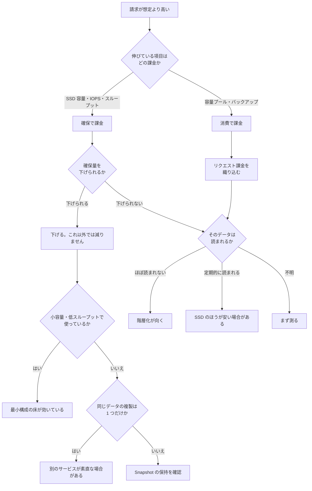

# 請求が想定より高いとき

[🏠 リポジトリトップ](../../../../README.md) | [Reference](../README.md) | [決定木](README.md) | [Domain — コスト](../../domains/cost/README.md)

---

## 結論

**最初に決めるのは「どこを削るか」ではありません。その項目が確保で課金されているのか、消費で課金されているのかです。**

確保で課金される項目は、**使用量を減らしても請求が変わりません。** 確保量そのものを下げるまで下がりません。
消費で課金される項目は使用量に連動しますが、**容量プールにはリクエスト課金が伴う**ため、移すこと自体に費用が発生します。

**この 1 段を飛ばすと、効かない対策に時間を使います。** 実際に起こる形が 2 つあります。

| やったこと | 期待 | 実際 |
|---|---|---|
| 重複排除・圧縮を有効化した | SSD の請求が下がる | **空きは増えますが請求は変わりません。** 確保容量を下げて初めて下がります |
| 使っていないデータを容量プールへ移した | すぐ下がる | 下がりますが、**移動と以後の読み取りにリクエスト課金が乗ります。** 定期的に読まれるデータでは合計が増えることがあります |

出典と数値は転記していません。**それぞれの一次情報を持つ文書へ送ります**（同じ数値を 2 か所に置くと、片方だけが古くなります）。

---

## 判断の順序

**上から順に確認します。1 段目で答えが出たら、その先は読まなくてよいように並べています。**

| 段 | 確かめること | 分岐 | 次に読むもの |
|---|---|---|---|
| 1 | **請求の内訳のうち、伸びている項目はどれか** | SSD 容量 / SSD IOPS / スループット容量 → **確保で課金**。容量プール / バックアップ → **消費で課金** | [何が課金対象か](../../domains/cost/notes/provisioned-versus-consumed.md#課金対象) |
| 2 | **確保で課金**の場合、確保量を下げられるか | 下げられる → 下げる。下げられない → 3 へ | [階層化が常に安くなるとは限らない理由](../../domains/cost/notes/provisioned-versus-consumed.md#階層化が常に安くなるとは限らない理由) |
| 3 | そのデータは読まれるか | ほぼ読まれない → 階層化が向く。定期的に読まれる → **SSD に置くほうが安い場合があります**。不明 → **まず測る** | [階層化ポリシーの比較](../comparison/tiering-policies.md#判断の分かれ目--読んだときに戻るか) |
| 4 | **消費で課金**の場合、リクエスト課金を織り込んだか | 織り込んでいない → 3 の分岐をやり直す | [階層化ポリシーの比較](../comparison/tiering-policies.md#比較) |
| 5 | **最小構成そのものが高い**のではないか | 小容量・低スループットで使っている → 構成の下限が効いています | [最小構成の床](../../domains/block-storage/notes/when-ebs-stops-being-the-cheaper-answer.md#最小構成の床) |
| 6 | 同じデータの**複製が 1 つだけ**ではないか | 1 つだけ → 別のサービスが素直な場合があります | [台数の問いから複製の問いへの置き換え](../../domains/block-storage/notes/when-ebs-stops-being-the-cheaper-answer.md#台数の問いから複製の問いへの置き換え) |
| 7 | Snapshot が容量として乗っていないか | 乗っている → 保持世代とポリシーを確認 | [Snapshot は容量として現れます](../../domains/cost/notes/provisioned-versus-consumed.md#容量として現れる-snapshot) |

**5 と 6 がブロックストレージのノートを指しているのは、単価を取得して計算した記録がそこにあるためです。** ファイルプロトコルで使っている場合も、最小構成の床と複製数の考え方は同じです。

---

## 同じ内容の図

**下の図は上の表の要約です。** 図が読めない環境でも判断できるように、内容は表側にあります。

---

## この決定木が答えないこと

**具体的な金額と、どの構成が安いかは答えません。** 単価はリージョンと時期で変わり、この文書に書くと更新されないまま残ります。

| 問い | どこにあるか |
|---|---|
| 単価そのもの | [AWS の料金ページ](https://aws.amazon.com/jp/fsx/netapp-ontap/pricing/)。取得日を添えて記録する形は [取得した単価](../../domains/block-storage/notes/when-ebs-stops-being-the-cheaper-answer.md#取得した単価) にあります |
| コストと可用性・性能のトレードオフ | [トレードオフの見比べかた](../../domains/cost/notes/provisioned-versus-consumed.md#トレードオフの見比べかた) |
| 見積もりが外れる前提 | [見積もりが外れる典型的な前提](../../domains/cost/notes/provisioned-versus-consumed.md#見積もりが外れる典型的な前提) |

**「安くする」ことが目的でない場合もあります。** 可用性や性能の要件で確保量が決まっているなら、削れるのは要件を変えたときだけです。

---

## 関連ドキュメント

- [Domain — コスト](../../domains/cost/README.md)
- [階層化ポリシーの比較](../comparison/tiering-policies.md)
- [確保で課金される量と消費で課金される量](../../domains/cost/notes/provisioned-versus-consumed.md)
- [EBS が安くなくなる境目は台数ではなく同じデータの複製の数](../../domains/block-storage/notes/when-ebs-stops-being-the-cheaper-answer.md)
