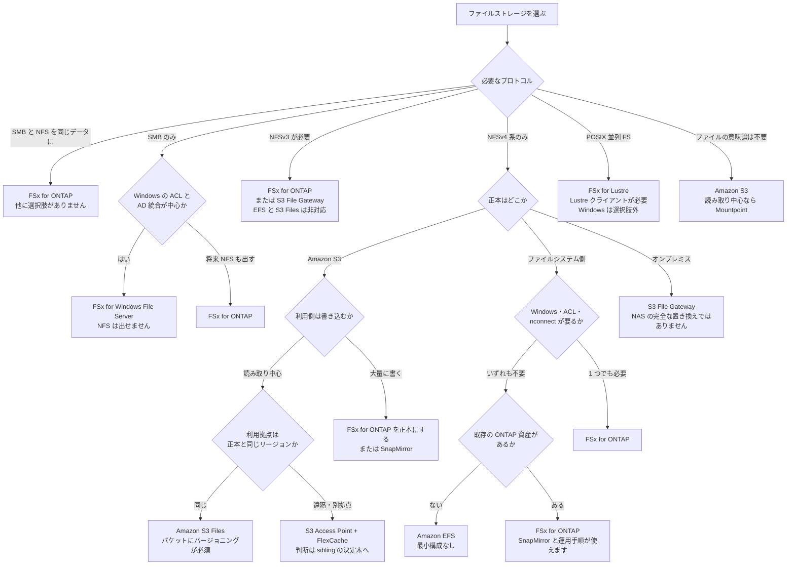

# どの AWS ファイルストレージかを決める

[🏠 リポジトリトップ](../../../../README.md) | [Reference](../README.md) | [決定木](README.md)

---

## 結論

**この決定木の入口は「FSx for ONTAP を使うか」ではありません。「どのファイルストレージか」です。**

このリポジトリの他の決定木は、FSx for ONTAP を選んだ後の判断を扱います。**その手前が空いていました。**

**そして最初の 2 問で候補がほぼ決まります。**

| 順 | 問い | なぜここが先か |
|---|---|---|
| 1 | 必要なプロトコルは何か | **7 つの選択肢が 1〜2 つになります。** 性能や費用ではなく、対応の有無で落ちます |
| 2 | データの正本はどこか | S3 なのか、ファイルシステム側なのか、オンプレミスなのかで、残った候補が分かれます |
| 3 | 読み書きの比率 | 読み取り中心なら S3 を正本にできる場合があります |
| 4 | 既存の ONTAP 資産の有無 | あるなら SnapMirror と運用手順がそのまま使えます |
| 5 | 拠点の位置 | 遠隔拠点があると、キャッシュか複製かの判断が入ります |

**性能は候補が 2 つ以下になってから見ます。** 順序を逆にすると、対応していないサービスの性能を比べることになります。

> **区分**: `documented` — 分岐の条件は AWS 公式ドキュメントの記載に基づきます（2026-09-06 に確認）。各選択肢の対応表と出典は [ファイルストレージの選択肢の比較](../comparison/file-storage-options.md) にあります。
> **このリポジトリでは再測定していません。** 実測は [S3-Burst-on-ONTAP-Files](https://github.com/Yoshiki0705/S3-Burst-on-ONTAP-Files) が持ちます。

---

## 選択のフロー

**同じ内容を表でも書きます。** mermaid が描画されない環境があり、スクリーンリーダーからも確実には読めず、クローラも抽出できないためです。**図の中だけに存在する判断を作りません。**

| # | 問い | 答え | 行き先 |
|---|---|---|---|
| 1 | 必要なプロトコル | SMB と NFS を**同じデータ**に | **FSx for ONTAP。** 他に選択肢がありません |
| 1 | 同上 | SMB のみ | 2 へ |
| 1 | 同上 | NFSv3 が必要 | **FSx for ONTAP または S3 File Gateway。** Amazon EFS と Amazon S3 Files はどちらも NFSv3 非対応です |
| 1 | 同上 | NFSv4 系のみ | 3 へ |
| 1 | 同上 | POSIX 並列ファイルシステム | **FSx for Lustre。** Lustre クライアントが必要で、Windows は選択肢に入りません |
| 1 | 同上 | ファイルの意味論は不要 | **Amazon S3。** 読み取り中心なら Mountpoint for Amazon S3 |
| 2 | Windows の ACL と AD 統合が中心か | はい | **FSx for Windows File Server。** NFS は出せません |
| 2 | 同上 | 将来 NFS も出す可能性がある | **FSx for ONTAP** |
| 3 | 正本はどこか | Amazon S3 | 4 へ |
| 3 | 同上 | ファイルシステム側 | 6 へ |
| 3 | 同上 | オンプレミス | **S3 File Gateway。** AWS が「エンタープライズ NAS の完全な置き換えを意図していない」と明記しています |
| 4 | 利用側は書き込むか | 大量に書く | **FSx for ONTAP を正本にするか SnapMirror。** S3 を正本にしたまま大量に書く形は避けます |
| 4 | 同上 | 読み取り中心 | 5 へ |
| 5 | 利用拠点は正本と同じリージョンか | 同じ | **Amazon S3 Files。** リンク先バケットに S3 バージョニングが必須です |
| 5 | 同上 | 遠隔・別拠点 | **S3 Access Point + FlexCache。** ここから先は [sibling の決定木](#この決定木が送り出す先) が扱います |
| 6 | Windows・ACL・`nconnect` のいずれかが要るか | 1 つでも必要 | **FSx for ONTAP** |
| 6 | 同上 | いずれも不要 | 7 へ |
| 7 | 既存の ONTAP 資産があるか | ない | **Amazon EFS。** 最小構成のコストが立ちません |
| 7 | 同上 | ある | **FSx for ONTAP。** SnapMirror と既存の運用手順がそのまま使えます |

---

## FSx for ONTAP に落ちない終端

**この決定木は 7 つの終端のうち 4 つで FSx for ONTAP に落ちません。** そこを明示しないと選定の道具になりません。

| 終端 | どういう状況か | FSx for ONTAP を選ばない理由 |
|---|---|---|
| **Amazon EFS** | NFSv4 系だけで足り、Windows・ACL・`nconnect` が不要で、既存の ONTAP 資産もない | **最小構成のコストが立ちます。** FSx for ONTAP は SSD 1,024 GiB × HA ペア数とスループット 384 MBps が下限で、EFS には最小構成がありません |
| **FSx for Windows File Server** | SMB だけで、Windows の ACL と AD 統合が中心 | SSD 32 GiB から始められます。**マルチプロトコルが不要なら 2 つの制御面を持つ理由がありません** |
| **Amazon S3 Files** | 正本が S3 で、読み取り中心で、利用拠点が同一リージョン | **正本を移す必要がありません。** バケットがそのままファイルシステムとして見えます |
| **Amazon S3 + Mountpoint / FSx for Lustre** | ファイルの意味論が不要、または POSIX 並列ファイルシステムが必要 | 用途が違います。Mountpoint は既存ファイルの更新・ディレクトリ削除・ロック・POSIX パーミッションを持ちません |

**逆に、FSx for ONTAP でなければならない終端は 1 つだけです。** SMB と NFS を同じデータに同時に出す場合です。他の 2 つ（NFSv3、既存 ONTAP 資産）は S3 File Gateway や運用の継続性という別の理由で選ばれています。

---

## 各分岐の根拠

| 分岐 | 何に基づくか |
|---|---|
| Amazon EFS が NFSv3 非対応 | AWS の EFS quotas に「NFSv2 と NFSv3 は非対応」と明記されています |
| Amazon EFS が Windows 非対応 | Windows を実行する EC2 インスタンスからのマウントが非対応と明記されています。**「EFS は SMB 非対応」の根拠はこれで、SMB 非対応という直接の記述はありません** |
| Amazon EFS が `nconnect` 非対応 | AWS の EFS ドキュメントに明記されています。**可否は実効オプションでは判定できません。** EFS でも実効オプションに `nconnect=16` は現れます |
| Amazon S3 Files が NFSv3 非対応 | 対応は NFSv4.1 と NFSv4.2 です。**v4.0 の扱いは AWS の 2 ページで記載が食い違っており、[狭いほうを採っています](../comparison/file-storage-options.md#判断していない論点)** |
| FSx for ONTAP がマルチプロトコル | NFS v3 / v4.0 / v4.1 / v4.2 と SMB が同一ファイルシステムから出ます |
| FSx for Windows File Server が NFS を出せない | 対応プロトコルは SMB 2.0〜3.1.1 です |
| FSx for Lustre で Windows が選択肢外 | Lustre クライアントの対応表は Linux のカーネル版で構成されています |
| Mountpoint がファイルシステムでない | 既存ファイルの更新・ディレクトリ削除・シンボリックリンク・ファイルロックに非対応で、POSIX スタイルのパーミッションを持ちません。**完全な POSIX には AWS が FSx for Lustre を案内しています** |
| S3 File Gateway が NAS の置き換えでない | AWS が「エンタープライズ NAS の完全な置き換えを意図していない」「ファイルシステムを模したものであってファイルシステムではない」と明記しています |
| Amazon S3 Files でバージョニングが必須 | リンク先バケットの前提条件です。**同時更新時はバケットが正本になります** |
| 読み書き比率が分岐になること | S3 を正本にしたまま利用側が大量に書く形は、正本の位置と書き込みの向きが食い違います。**sibling の決定木も同じ位置に同じ分岐を置いています** |
| 最小構成のサイズ | FSx for ONTAP は SSD 1,024 GiB × HA ペア数、FSx for Windows File Server は SSD 32 GiB / HDD 2,000 GiB、FSx for Lustre は SSD 1.2 TiB / HDD 6 TiB。**Amazon EFS と Amazon S3 に最小構成はありません** |

出典の URL は [ファイルストレージの選択肢の比較](../comparison/file-storage-options.md#参照した一次情報) に全項目あります。一次情報の索引は [ファイルプロトコル横断リソースマップ](../file-protocol-resource-map.md) です。

---

## この決定木が送り出す先

**終端 5（正本が S3、読み取り中心、遠隔拠点）から先は、このリポジトリでは扱いません。**

[S3-Burst-on-ONTAP-Files の「この構成を採るかどうか」](https://github.com/Yoshiki0705/S3-Burst-on-ONTAP-Files/blob/main/docs/ja/reference/decision-trees/choosing-this-architecture.md) が入口を「この構成を採るか」に置いており、5 つの分岐で判断します。**そちらは実測環境を持っています。**

**両方を通す順序はこうです。**

| 段 | どちらの決定木か | 決めること |
|---|---|---|
| 1 | この決定木 | そもそもどのファイルストレージか |
| 2 | sibling の決定木 | S3 Access Point + FlexCache の構成を採るか。オブジェクト名が NAS フレンドリか、S3 固有機能が要るか、利用拠点が Origin と同一かで分かれ、同一なら `S3 Access Point のみでよい。ファンアウトは不要` になります |
| 3 | sibling の設計ノート | 採ると決めたあと、利用拠点で NFS か SMB か。**Origin ボリュームを作る前に決める必要があります** |

---

## この決定木が答えないこと

| 問い | 置き場所 |
|---|---|
| 各選択肢のトレードオフを対称に並べたもの | [ファイルストレージの選択肢の比較](../comparison/file-storage-options.md) |
| 一次情報がどこにあるか | [ファイルプロトコル横断リソースマップ](../file-protocol-resource-map.md) |
| 出た数値がどの上限に当たっているか | [手元のスループット値は何を測ったのかを判定する](measured-throughput-triage.md) |
| FSx for ONTAP を選んだ後のブロックの判断 | [ブロックプロトコルとレイアウトの選択](block-protocol-and-layout.md) |
| SMB の ID と監査の設計 | [SMB のユーザー管理と監査は 2 つの選択で決まる](smb-identity-and-audit.md) |
| マルチプロトコルの権限モデル | [ボリュームのセキュリティスタイルが権限モデルを決める](../../domains/multiprotocol-identity/notes/security-style-and-permission-evaluation.md) |
| **SMB のキャッシュ制御下の読み取り** | **未測定です。** 分岐条件に使っていません |
| **SMB の台数試験と持続書き込み** | **測定されましたが、分岐条件にはしていません。** 台数試験は全台が同じデータを読むかどうかで逆の結論が出るため、単一の値になりません。範囲と両方の表は [SMB の測定済みの範囲と未測定の範囲](../comparison/file-storage-options.md#smb-の測定済みの範囲と未測定の範囲) にあります |
| 費用の比較 | 料金は改定されます。[単価の確認先](../file-protocol-resource-map.md#単価と提供地点の確認先)から現行の値を引いてください |

---

## よくある誤解

| 誤解 | 実際 |
|---|---|
| まず性能で絞る | **プロトコルで絞るほうが先に決まります。** 対応していないサービスの性能を比べても意味がありません |
| Amazon EFS は NFS なら何でもマウントできる | **v4.0 と v4.1 だけです。** NFSv3 も v4.2 も対応プロトコルに入っていません |
| 「EFS は SMB 非対応」と書いてある | **書いてありません。** 根拠は Windows を実行する EC2 からのマウントが非対応であることです。独立の主張として引かないでください |
| `nconnect` が使えるかはマウント後の実効オプションで分かる | **分かりません。** EFS でも `nconnect=16` は実効オプションに現れます。TCP 接続数で判定してください |
| マルチプロトコルが要らなくても FSx for ONTAP のほうが速い | **上限の形が違うだけです。** そして最小構成のコストが立ちます |
| S3 を正本にしたまま利用側で大量に書ける | 正本の位置と書き込みの向きが食い違います。**書き込みが主なら正本を移す判断が先です** |
| Mountpoint for Amazon S3 を使えば S3 がファイルシステムになる | **既存ファイルの更新もディレクトリ削除もできません。** ロックも POSIX パーミッションもありません |
| S3 File Gateway でオンプレミスの NAS を置き換えられる | **AWS が意図していないと明記しています** |
| 既存の ONTAP 資産は判断に関係ない | **SnapMirror と運用手順がそのまま使えるかどうかは、移行の作業量を大きく変えます。** 分岐 7 に置いているのはこのためです |

---

## 関連ドキュメント

- [決定木](README.md) — 他の決定木
- [ファイルストレージの選択肢の比較](../comparison/file-storage-options.md) — この決定木の各終端の詳細
- [ファイルプロトコル横断リソースマップ](../file-protocol-resource-map.md) — 一次情報の索引
- [手元のスループット値は何を測ったのかを判定する](measured-throughput-triage.md) — 選んだ後に数値が出なかったとき
- [ボリュームのセキュリティスタイルが権限モデルを決める](../../domains/multiprotocol-identity/notes/security-style-and-permission-evaluation.md) — マルチプロトコルを選んだ後
- [プロジェクト間の引用索引](../cross-repo-index.md) — sibling の決定木をどう引いているか
- [知見の分類ポリシー](../../evidence-policy.md)

---

[🏠 リポジトリトップ](../../../../README.md) | [Reference](../README.md) | [決定木](README.md)
