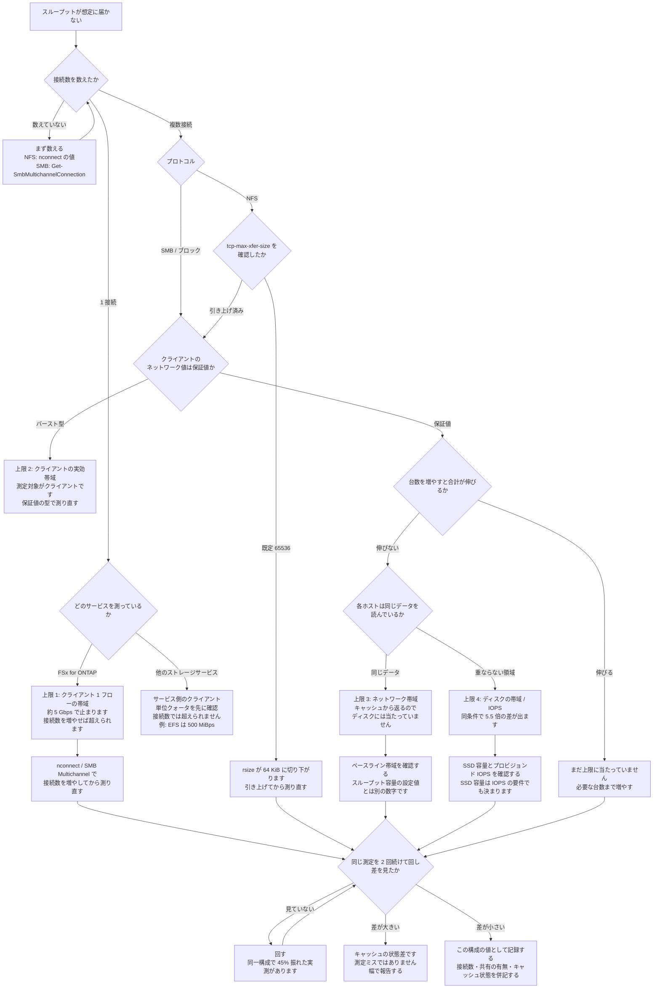

# 手元のスループット値は何を測ったのかを判定する

[🏠 リポジトリトップ](../../../../README.md) | [Reference](../README.md) | [決定木](README.md) | [Domain — 性能](../../domains/performance/README.md)

---

## 結論

**「思ったより遅い」という数字を持ってきたとき、最初にすべきことはチューニングではなく、その数字が何の上限を測ったのかの切り分けです。**

上限は 4 か所にあり、**当たっている場所によって打つ手が正反対になります。**

| # | 上限の場所 | 当たっている合図 | 打つ手 |
|---|---|---|---|
| 1 | **クライアント 1 フローの帯域**、またはサービス側のクライアント単位クォータ | 単一マウント・単一セッションで止まる | **どちらかを先に切り分けます。** 1 フロー上限なら接続数を増やせば超えられ、サービス側クォータなら超えられません |
| 2 | **クライアントの実効帯域** | 複数接続にしても伸びず、時間経過で落ちる | クライアントの型を保証値のものに替える |
| 3 | **ファイルシステムのネットワーク帯域** | 台数を増やすと合計が天井に張り付く | スループット容量ではなくベースライン帯域を確認する |
| 4 | **ディスクの帯域 / IOPS** | 読むデータがキャッシュに無いときだけ遅い | SSD 容量とプロビジョンド IOPS、キャッシュの効き方を見る |

**1 と 2 はクライアント側、3 と 4 はファイルシステム側です。** 順序を守って切り分けないと、効かない側を触り続けることになります。

> **区分**: `documented` — 分岐の条件は AWS 公式ドキュメントの記載と、[プロジェクト間の引用索引](../cross-repo-index.md) に登録した sibling プロジェクトの実測に基づきます（2026-09-05 に確認）。
> **このリポジトリでは再測定していません。** 実測値そのものは [単一接続で測った値はストレージの性能ではない](../../domains/performance/notes/a-single-connection-measures-the-client.md) に条件付きで転記しています。
> **引用元の測定環境は削除済みです。**

---

## 切り分けのフロー

---

## 各分岐の根拠

| 分岐 | 何に基づくか |
|---|---|
| FSx for ONTAP の単一接続で約 5 Gbps | AWS は 1 ネットワークフローあたり全二重 5 Gbps の上限を明記しています。実測では NFS 591.62 MB/s（4.7 Gbps）、SMB 574.24 MB/s（4.6 Gbps） |
| 他サービスは別の上限に当たりうること | 同じ測定で Amazon EFS の素マウントは 499.79 MB/s でした。**これは 5 Gbps ではなく EFS のクライアント単位クォータ 500 MiBps に一致します。** 引用元は当初この 3 行を同じ上限として説明し、あとで訂正しています |
| `tcp-max-xfer-size` の既定値 | 既定 65,536 のままだとクライアントの `rsize` が 64 KiB に切り下がります |
| クライアントの保証値とバーストの違い | インスタンス型によってネットワーク性能が保証値かバーストかが違います。バースト型では測定対象がクライアントになります |
| 同じデータか重ならない領域か | 8 台・128 接続の実測で、同一ファイル共有 11,916.29 MB/s に対し重ならない領域が 2,173.37 MB/s（0.18 倍）でした |
| スループット容量とベースライン帯域が別 | 実測構成はスループット容量 6,144 MBps で、ネットワークのベースラインは 12,500 MBps でした |
| 45% の幅 | 同一設定・同一パラメータ・同一測定器で 2 回測って 3,551.18 と 5,148.56 MB/s。差はキャッシュの状態だけです |

数値の測定条件は [単一接続で測った値はストレージの性能ではない](../../domains/performance/notes/a-single-connection-measures-the-client.md#測定条件) に全項目あります。

---

## この決定木が答えないこと

| 問い | 置き場所 |
|---|---|
| 接続数を増やす手段の選び方 | [スループットを上げる手段の比較](../comparison/throughput-levers.md) |
| スループット容量の設定値が何を決めているか | [スループットは 1 つの設定値では決まらない](../../domains/performance/notes/where-throughput-is-determined-and-shared.md) |
| p99 レイテンシをどう見るか | [p99 は CloudWatch のメトリクスからは出せない](../../domains/performance/notes/what-you-cannot-read-from-cloudwatch.md) |
| 世代差・S3 API との比較 | **未測定です。** 引用元が未測定として挙げている範囲は [引用元が未測定としている範囲](../../domains/performance/notes/a-single-connection-measures-the-client.md#引用元が未測定としている範囲) にあります |
| コストとの兼ね合い | [EBS が安くなくなる境目](../../domains/block-storage/notes/when-ebs-stops-being-the-cheaper-answer.md) |

---

## 関連ドキュメント

- [決定木](README.md) — 他の決定木
- [Domain — 性能](../../domains/performance/README.md) — このモジュールのハブ
- [スループットを上げる手段の比較](../comparison/throughput-levers.md) — 上限 1 に当たっているときの選択肢
- [プロジェクト間の引用索引](../cross-repo-index.md) — この数値をどこから引いているか
- [知見の分類ポリシー](../../evidence-policy.md)
