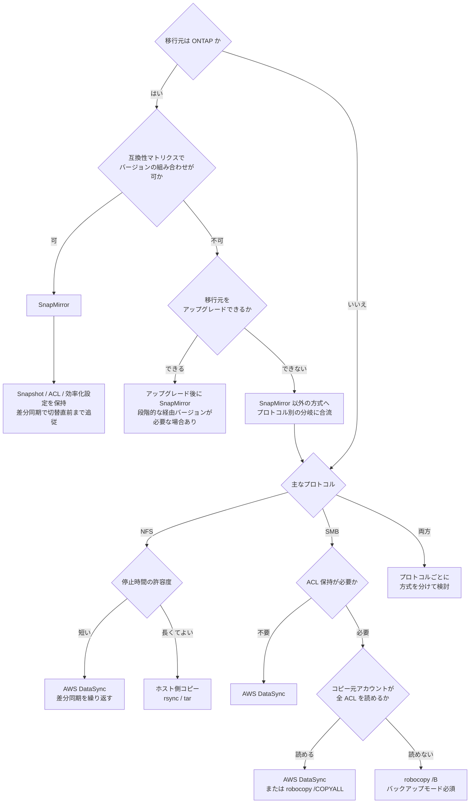

# 移行方式の選択

[🏠 リポジトリトップ](../../../../README.md) | [Reference](../README.md)

---

## 結論

**移行元が ONTAP なら SnapMirror が第一候補**です。ブロックレベルの複製で、Snapshot・ACL・
効率化設定を保ったまま差分同期でき、切り替え直前まで同期を続けられます。

ただし**先にバージョン互換性を確認してください。** 移行元と移行先のバージョンの組み合わせが
互換性マトリクスにない場合、SnapMirror は選択肢になりません。確認手順と、不可だった場合の
経路は [バージョン互換性の確認](#バージョン互換性の確認移行元が-ontap-の場合) にあります。

**移行元が ONTAP でない場合**は、プロトコルと ACL 保持要件で分岐します。SMB で ACL を保持する
必要があるなら、コピー元アカウントが読めない ACL を扱えるかどうかが方式選択の分かれ目になります。

**この決定ツリーが扱うのは、移行元が ONTAP かオンプレミス NAS の場合です。** 移行元が SaaS / クラウドストレージ（Box、Dropbox、OneDrive、Google Drive、Wasabi、Nextcloud など）の場合は、方式選択の前に**移行元がストレージエンドポイントを公開しているか**の判定が入ります。判定手順と、方式の前に確定させる項目は [SaaS からの移行は転送方式より先に移行元の群を確定させる](../../playbooks/03-migrate/notes/saas-source-migration-scoping.md) にあります。

> **Evidence**: `documented` — 方式の対応関係は AWS / ベンダーのドキュメントに基づきます。
> 各方式のスループットや所要時間は環境に強く依存するため、必ず自環境で測定してください。

---

## 決定フロー

---

## バージョン互換性の確認（移行元が ONTAP の場合）

**「前後 N バージョンまで」という覚え方は使えません。** SnapMirror の互換性は**マトリクス表で定義**されており、単純なバージョン数の窓ではないためです。クラウド専用リリースや一部プラットフォーム限定リリースの扱い、特定機能を有効にした場合の追加制約が表に織り込まれています。

**移行を計画する前に、必ず表を引いてください。** 参照先は [Compatible ONTAP versions for SnapMirror relationships](https://docs.netapp.com/us-en/ontap/data-protection/compatible-ontap-versions-snapmirror-concept.html) です。

### 確認する 3 点

| # | 確認項目 | 補足 |
|---|---|---|
| 1 | 移行元の ONTAP バージョン | ONTAP CLI の `version`、または ONTAP REST API で確認します |
| 2 | 移行先（FSx for ONTAP）の ONTAP バージョン | **任意に選べません。** AWS が管理するため、実際の値をファイルシステム側で確認します |
| 3 | 使う関係の種類 | ボリューム単位の複製（XDP）か、SVM 単位かで表が変わります |

### 表を引くときに効く前提

| 前提 | 内容 | 出典 |
|---|---|---|
| 統合レプリケーション（XDP）の相互運用は**双方向** | どちらが新しいかではなく、組み合わせが表にあるかで判断します | [NetApp Docs](https://docs.netapp.com/us-en/ontap/data-protection/compatible-ontap-versions-snapmirror-concept.html) |
| SVM 単位（SVM DR / SVM 移行）は**最大 2 メジャーバージョン差**、かつ宛先が同一以上 | ボリューム単位より条件が厳しくなります | 同上 |
| ONTAP 9.16.1 以降で advanced capacity balancing を有効にしたボリュームは、9.16.1 より古いクラスタへ転送できない | 機能の有効化が互換性の制約を追加する例です | 同上 |
| FSx for ONTAP は**ボリュームレベルの SnapMirror のみ**対応。Synchronous / StrictSync は非対応 | 同期複製を前提にした移行計画は成立しません | [AWS: Replicating your data using NetApp SnapMirror](https://docs.aws.amazon.com/fsx/latest/ONTAPGuide/scheduled-replication.html) |

プラットフォームや OS の相互運用性は別の資料です。そちらは [NetApp Interoperability Matrix Tool](https://imt.netapp.com/matrix/) を参照してください。**バージョン互換性の判断に IMT を使わないでください。** 目的が違います。

### 組み合わせが不可だった場合

**移行できない、という結論にはなりません。** 3 つの経路があります。

| 経路 | 内容 | トレードオフ / 考慮事項 |
|---|---|---|
| **移行元をアップグレードして SnapMirror** | 表にある組み合わせまで移行元を上げる | 本番システムのアップグレードが先行します。保守契約・検証・停止時間の調整が必要。移行そのものより大きな作業になることがあります |
| **経由バージョンを挟んで段階的にアップグレード** | 目標バージョンへ直接上げられない場合、中間バージョンを経由する | 工程が増え、期間が伸びます。各段でアップグレードパスの確認が必要です |
| **SnapMirror を使わない方式に切り替える** | 上の決定フローでプロトコル別の分岐に合流します | Snapshot 履歴と ONTAP 固有の設定は引き継げません。ACL 保持はツールと権限設計に依存します |

**判断の分かれ目は「Snapshot 履歴と ONTAP 固有設定を引き継ぐ必要があるか」です。** 引き継ぐ必要があるならアップグレードを検討する価値があります。必要ないなら、アップグレードの手間をかけずに別方式へ切り替えるほうが早く終わります。

> **アップグレードを選ぶ場合の注意**: アップグレードは移行先との互換性だけでなく、**移行元で現在動いている構成との互換性**も確認が必要です。バージョンを上げること自体が別の検証作業になります。

---

## 方式の比較

推奨案の制約も含めて対称に記載しています。

| 方式 | 向いている状況 | トレードオフ / 考慮事項 |
|---|---|---|
| **SnapMirror** | 移行元が ONTAP。Snapshot 履歴や効率化設定を引き継ぎたい。停止時間を最小化したい | 移行元が ONTAP でないと使えない。ネットワーク経路とバージョン互換の確認が必要。初期同期に時間がかかる |
| **AWS DataSync** | ONTAP 以外からの移行。差分同期を繰り返して停止時間を詰めたい。マネージドに任せたい | ファイル単位の転送のため小ファイル大量だと効率が落ちる。ACL 保持は設定と権限次第。Snapshot 履歴は引き継げない |
| **robocopy（Windows）** | SMB で NTFS ACL を確実に保持したい。移行元が Windows ファイルサーバー | ホスト側のリソースと運用が必要。読めない ACL を扱うには `/B`（バックアップモード）と特権が必要 |
| **ホスト側コピー（rsync / tar）** | 停止時間を長く取れる。構成が単純。少量データ | 権限・属性の保持が方式依存。大容量では現実的な時間に収まらないことがある |

---

## 選び方

順に確認してください。上のほうが制約として強く、方式の候補を絞り込みます。

| # | 確認項目 | 判断への影響 |
|---|---|---|
| 1 | 移行元は ONTAP か | ONTAP なら SnapMirror が候補の中心になる |
| 2 | バージョンの組み合わせが互換性マトリクスにあるか | **無ければ SnapMirror は候補から外れます。** アップグレードか別方式かの分岐になります |
| 3 | 許容できる停止時間 | 短いほど差分同期を繰り返せる方式が必須になる |
| 4 | ACL / 権限の保持要件 | SMB + ACL 保持は方式と権限設計を大きく左右する |
| 5 | ファイル数とサイズ分布 | 小ファイル大量はファイル単位転送の効率を落とす |
| 6 | ネットワーク帯域と経路 | 初期同期の所要時間を決める。実測が必要 |
| 7 | Snapshot 履歴の引き継ぎ要否 | 必要なら SnapMirror 以外では満たせない |

---

## よくある誤解

| 誤解 | 実際 |
|---|---|
| コピーツールを使えば ACL は自動的に保たれる | コピー実行アカウントが読めない ACL はスキップされます。Windows では `/B`（バックアップモード）と対応する特権が必要です |
| 停止時間はコピー時間と同じ | 差分同期を繰り返せる方式なら、停止時間は最後の差分同期分に縮められます |
| SnapMirror なら設定はすべて引き継がれる | 引き継がれる範囲は機能とバージョンによります。移行前に対象範囲を確認してください |
| SnapMirror の互換性は「前後 N バージョン」で覚えられる | マトリクス表で定義されており、単純なバージョン数の窓ではありません。**必ず表を引いてください** |
| 移行先のバージョンは自分で選べる | FSx for ONTAP のバージョンは AWS が管理します。移行元側を合わせる前提で計画します |
| バージョンが合わなければ移行できない | アップグレード、段階アップグレード、別方式への切り替えの 3 経路があります |
| 同期複製で切り替え時のデータ差分をゼロにできる | FSx for ONTAP はボリュームレベルの SnapMirror のみ対応で、Synchronous / StrictSync は非対応です |
| 帯域から所要時間を計算できる | 小ファイル大量ではファイル単位のオーバーヘッドが支配的になります。実測が必要です |

---

## 関連ドキュメント

- [Playbook 01 — 評価](../../playbooks/01-assess/) — 移行前に測るべき項目
- [容量が余っていても書けなくなる](../../playbooks/01-assess/notes/counting-bytes-is-not-counting-files.md) — 方式を選ぶ前に数えるもの。ファイル数とディレクトリあたりの上限は移行ツールの完走に影響します
- [Playbook 03 — 移行](../../playbooks/03-migrate/) — 各方式の実行手順
- [SaaS からの移行は転送方式より先に移行元の群を確定させる](../../playbooks/03-migrate/notes/saas-source-migration-scoping.md) — 移行元が SaaS / クラウドストレージの場合。このツリーの前段に入る判定です
- [Domain — マルチプロトコル・ID](../../domains/multiprotocol-identity/) — ACL と ID マッピング
- [Domain — データ保護](../../domains/data-protection/) — SnapMirror の位置づけ
- [知見の分類ポリシー](../../evidence-policy.md)

---

[🏠 リポジトリトップ](../../../../README.md) | [Reference](../README.md)
