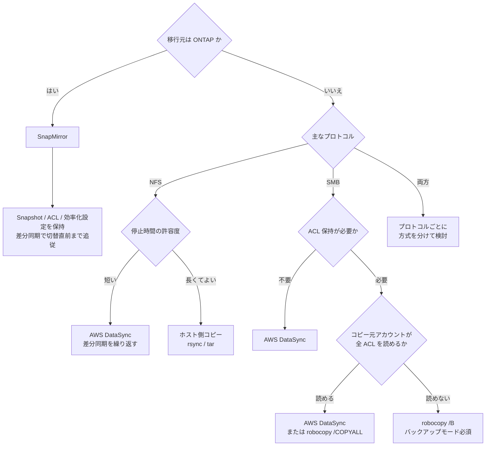

# 移行方式の選択

[🏠 リポジトリトップ](../../../../README.md) | [Reference](../README.md)

---

## 結論

**移行元が ONTAP なら SnapMirror が第一候補**です。ブロックレベルの複製で、Snapshot・ACL・
効率化設定を保ったまま差分同期でき、切り替え直前まで同期を続けられます。

**移行元が ONTAP でない場合**は、プロトコルと ACL 保持要件で分岐します。SMB で ACL を保持する
必要があるなら、コピー元アカウントが読めない ACL を扱えるかどうかが方式選択の分かれ目になります。

> **Evidence**: `documented` — 方式の対応関係は AWS / ベンダーのドキュメントに基づきます。
> 各方式のスループットや所要時間は環境に強く依存するため、必ず自環境で測定してください。

---

## 決定フロー

---

## 方式の比較

推奨案の制約も含めて対称に記載しています。

| 方式 | 向いている状況 | トレードオフ / 考慮事項 |
|---|---|---|
| **SnapMirror** | 移行元が ONTAP。Snapshot 履歴や効率化設定を引き継ぎたい。停止時間を最小化したい | 移行元が ONTAP でないと使えない。ネットワーク経路とバージョン互換の確認が必要。初期同期に時間がかかる |
| **AWS DataSync** | ONTAP 以外からの移行。差分同期を繰り返して停止時間を詰めたい。マネージドに任せたい | ファイル単位の転送のため小ファイル大量だと効率が落ちる。ACL 保持は設定と権限次第。Snapshot 履歴は引き継げない |
| **robocopy（Windows）** | SMB で NTFS ACL を確実に保持したい。移行元が Windows ファイルサーバー | ホスト側のリソースと運用が必要。読めない ACL を扱うには `/B`（バックアップモード）と特権が必要 |
| **ホスト側コピー（rsync / tar）** | 停止時間を長く取れる。構成が単純。少量データ | 権限・属性の保持が方式依存。大容量では現実的な時間に収まらないことがある |

---

## 選び方

順に確認してください。上のほうが制約として強く、方式の候補を絞り込みます。

| # | 確認項目 | 判断への影響 |
|---|---|---|
| 1 | 移行元は ONTAP か | ONTAP なら SnapMirror が候補の中心になる |
| 2 | 許容できる停止時間 | 短いほど差分同期を繰り返せる方式が必須になる |
| 3 | ACL / 権限の保持要件 | SMB + ACL 保持は方式と権限設計を大きく左右する |
| 4 | ファイル数とサイズ分布 | 小ファイル大量はファイル単位転送の効率を落とす |
| 5 | ネットワーク帯域と経路 | 初期同期の所要時間を決める。実測が必要 |
| 6 | Snapshot 履歴の引き継ぎ要否 | 必要なら SnapMirror 以外では満たせない |

---

## よくある誤解

| 誤解 | 実際 |
|---|---|
| コピーツールを使えば ACL は自動的に保たれる | コピー実行アカウントが読めない ACL はスキップされます。Windows では `/B`（バックアップモード）と対応する特権が必要です |
| 停止時間はコピー時間と同じ | 差分同期を繰り返せる方式なら、停止時間は最後の差分同期分に縮められます |
| SnapMirror なら設定はすべて引き継がれる | 引き継がれる範囲は機能とバージョンによります。移行前に対象範囲を確認してください |
| 帯域から所要時間を計算できる | 小ファイル大量ではファイル単位のオーバーヘッドが支配的になります。実測が必要です |

---

## 関連ドキュメント

- [Playbook 01 — 評価](../../playbooks/01-assess/) — 移行前に測るべき項目
- [Playbook 03 — 移行](../../playbooks/03-migrate/) — 各方式の実行手順
- [Domain — マルチプロトコル・ID](../../domains/multiprotocol-identity/) — ACL と ID マッピング
- [Domain — データ保護](../../domains/data-protection/) — SnapMirror の位置づけ
- [知見の分類ポリシー](../../evidence-policy.md)

---

[🏠 リポジトリトップ](../../../../README.md) | [Reference](../README.md)
