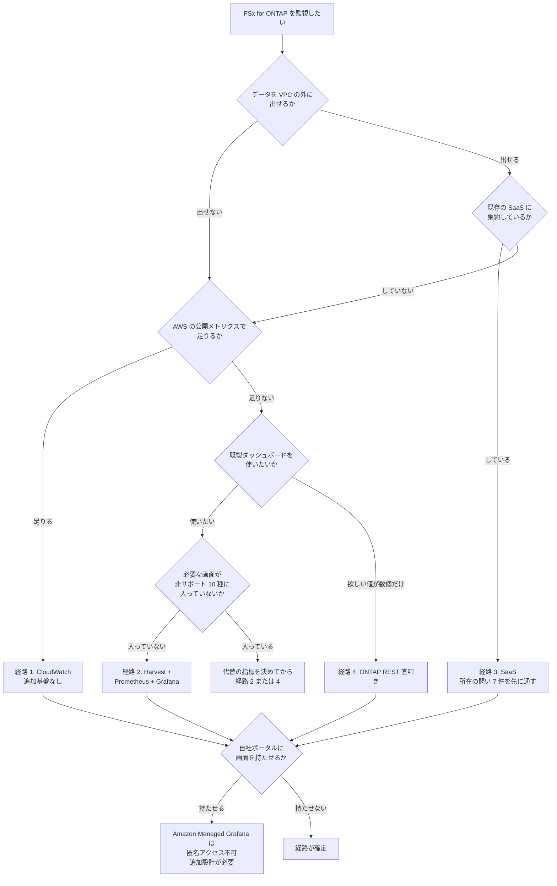

# 監視経路の選択

[🏠 リポジトリトップ](../../../../README.md) | [Reference](../README.md) | [決定木](README.md) | [Domain — 可観測性](../../domains/observability/README.md)

---

## 結論

**Amazon FSx for NetApp ONTAP の監視に、共通の出発点はありません。**

「まず Amazon CloudWatch から始める」は、**ONTAP 内部の粒度が最初から要件なら捨てる作業になります。** 逆に、公開メトリクスで足りる要件に対して収集基盤を建てると、運用対象を増やしただけになります。

したがって最初に確認するのは **2 つの制約**で、見たいものより前に決まっていることが多い条件です。

1. **データを AWS の VPC の外に出せるか**（出せないなら SaaS 経路が落ちます）
2. **AWS が公開するメトリクスで足りるか**（足りないなら追加基盤を持つ判断になります）

> **Evidence**: `documented` — 各経路の性質と制約は AWS / ベンダーの公式ドキュメントに基づきます（**取得日 2026-09-05**）。**当リポジトリでの実測は含みません。** 段階的な広げ方のうち拠点をまたぐ部分は設計上の推論で、検証していません（節内に明記）。

---

## 決定フロー

**図と同じ内容を表でも持ちます。** 図が読めない環境でも判断できるようにするためです。

| # | 確認する条件 | はい | いいえ |
|---|---|---|---|
| 1 | データを AWS の VPC の外に出せるか | 条件 2 へ | **経路 3 を除外**して条件 3 へ |
| 2 | 既存の SaaS に監視を集約しているか | **経路 3**（所在の問い 7 件を先に通す） | 条件 3 へ |
| 3 | AWS が公開するメトリクスで足りるか | **経路 1**（CloudWatch） | 条件 4 へ |
| 4 | 既製ダッシュボードを使いたいか | 条件 5 へ | **経路 4**（ONTAP REST 直叩き） |
| 5 | 必要な画面が非サポート 10 種に入っていないか | **経路 2**（Harvest + Prometheus + Grafana） | 代替の指標を決めてから経路 2 または 4 |
| 6 | 自社ポータルに画面を持たせるか | **経路によらず追加設計**（匿名アクセス不可） | 経路が確定 |

---

## 各分岐の根拠

| 分岐 | 根拠 |
|---|---|
| **所在を最初に置く理由** | 所在の要件は後から変えられない場合があり、選択の時点が唯一の判断点になります。粒度は後から足せますが、**データが出た後に出さなかったことにはできません** |
| **条件 2 で「集約しているか」を問う理由** | SaaS 経路の価値は既存投資の活用にあります。**この経路のために新規に契約するなら、比較の前提が変わります** |
| **条件 3 の位置** | 公開メトリクスで足りるなら、追加基盤を持たない選択が最も運用が軽くなります。**ただしレイテンシは平均のみで、Health / Headroom 相当は自分で組みます** |
| **条件 5 を経路 2 の前に置く理由** | **既製ダッシュボードのうち 10 種が非サポート**です。必要な画面がそこに入っていると、経路 2 を選んでも目的を達しません。[オンプレのダッシュボードはそのまま移らない](../../domains/observability/notes/on-prem-dashboards-do-not-transfer.md) |
| **条件 6 を全経路の後に置く理由** | Amazon Managed Grafana は匿名アクセスをサポートせず、IdP 起点ログインも未サポートです。**経路の選択とは独立した制約**なので、どの経路を選んでも同じ検討が必要になります |

**条件 4 で「欲しい値が数個だけ」なら経路 4 に振れる理由**は、収集基盤を持つコストが得られる値に見合わなくなる点です。逆に対象が増えるほど、自作の保守コストが既製の運用コストを上回ります。**分岐の閾値は台数ではなく「保守を続けられるか」です。**

---

## 段階的な広げ方

**これは経路の選択ではなく規模の軸です。** どの経路でも段階は共通ですが、**到達できる段階と、段階を上げたときに変わる内容が経路ごとに違います。**

| 段階 | 内容 | 経路 1 | 経路 2 | 経路 3 | 経路 4 |
|---|---|---|---|---|---|
| 1. PoC | 1 ファイルシステムを 1 か所から監視 | 設定のみ | 到達可能 | 到達可能 | 到達可能 |
| 2. 単一アカウント | 同一アカウントの複数ファイルシステム | 到達可能 | 到達可能 | 到達可能 | 到達可能 |
| 3. クロスアカウント | 別アカウントのファイルシステムを含める | **アカウントごとの設定**。到達性の問題は生じません | **到達性の確保が必要** | ベンダー側が集約点。接続の追加で済む場合があります | 実装次第 |
| 4. クロスプラットフォーム | オンプレミスや他クラウドの ONTAP を含める | **対象外** | **構成が分散型に変わります** | 拠点ごとの接続を足す形 | 実装次第 |

### 段階 3 で変わること

**クロスアカウントは IAM の設定ではなく、ネットワーク到達性の確保です。** Harvest の接続先は ONTAP の管理エンドポイントで、AWS の API ではありません。

必要になる構成要素と双方向のルート設計は [クロスアカウントは IAM ではなくネットワークの問題](../../domains/observability/notes/cross-account-is-a-network-problem.md) にあります。**経路 1 ではこの段階で到達性の問題が生じません**が、その代わりアカウントごとにダッシュボードとアラームを持つことになります。

### 段階 4 で変わること

> **確度に関する補足**: **この節は設計上の推論で、検証していません。** 出典があるのは段階 3 までです。

拠点をまたぐと、**収集元を 1 か所に集める形から、拠点ごとに置く形に変わります。** 接続機構が拠点ごとに異なり、資格情報の管理主体も分かれます。**「アカウントを増やす」と「拠点を増やす」は同じ作業ではありません。**

さらに拠点ごとに ONTAP の版が違うと、**取れるメトリクスがそろいません。** 対比表は [拠点をまたぐと変わること](../../domains/observability/notes/cross-account-is-a-network-problem.md#拠点をまたぐと変わること) にあります。

### 段階を上げる前に確認すること

| 段階 | 確認すること |
|---|---|
| 1 → 2 | サイジングが対象数に見合うか。**出典間で食い違うため自分で測る必要があります** |
| 2 → 3 | 資格情報を対象ごとに分離しているか。**共有していると 1 つのロックが全対象に波及します** |
| 3 → 4 | Transit Gateway で到達できるか。**できないなら構成の作り直しではなく分散型の設計に切り替えます** |

---

## 自環境での確認手順

| # | 手順 | 確認できること |
|---|---|---|
| 1 | データを VPC 外に出せるかを、監査要件と照らして確定させる | **最初の分岐。** 後から変えられない場合があります |
| 2 | 現在見ている画面・指標を列挙し、AWS の公開メトリクスで再現できるか照合する | 条件 3 の答え |
| 3 | 手順 2 で再現できなかった指標を、Harvest の非サポート 10 種と突き合わせる | **条件 5 の答え。** ここで代替設計が必要か決まります |
| 4 | 欲しい値の数を数える | 条件 4 の閾値。**保守を続けられるかで判断します** |
| 5 | 画面を見せる相手が ID プロバイダ側に存在するか確認する | 条件 6 の前提 |
| 6 | 到達したい段階（1〜4）を先に決める | **段階 4 が視野にあるなら、段階 1 の構成から分散を前提にします** |
| 7 | 段階 3 以降を想定する場合、資格情報の分離方針を先に決める | ロック時の影響範囲 |

**手順 6 を後回しにすると、段階 3 か 4 の時点で構成の作り直しになります。**

---

## よくある誤解

| 誤解 | 実際 |
|---|---|
| まず CloudWatch から始めるのが定石である | **内部粒度が要件なら捨てる作業になります。** 共通の出発点はありません |
| 経路は見たいものだけで決まる | **所在と認証の制約が先に狭めます** |
| 粒度は後から足せるので所在は後回しでよい | **粒度は足せますが、出したデータを出さなかったことにはできません** |
| Harvest を選べば既存の画面が再現できる | **非サポート 10 種に入っていないかを先に確認します** |
| クロスアカウントは IAM の設定である | ネットワーク到達性の確保です |
| クロスプラットフォームはクロスアカウントの延長 | **収集元を分散させる構成に変わります**（未検証の推論です） |
| 段階は後から上げればよい | **段階 4 が視野にあるなら、段階 1 の構成から前提が変わります** |
| 経路は 1 つに絞る必要がある | 組み合わせが成立します。[監視経路の比較](../comparison/observability-routes.md#組み合わせが成立する場合) を参照してください |

---

## 参照した一次情報

| 論点 | 出典 | 取得日 |
|---|---|---|
| 既製ダッシュボードの分類（サポート 19 / 既定で無効 8 / 非サポート 10）、サイジング指針が対象数と収集メトリクス数に依存すること、AWS 提供テンプレートの構成 | [AWS: Monitoring FSx for ONTAP file systems using Harvest and Grafana](https://docs.aws.amazon.com/fsx/latest/ONTAPGuide/monitoring-harvest-grafana.html) | 2026-09-05 |
| クロスアカウント構成が Transit Gateway と RAM 共有と双方向の静的ルートとセキュリティグループの CIDR 許可で成ること | [re:Post: Harvest と Grafana によるクロスアカウント監視](https://repost.aws/knowledge-center/fsx-ontap-monitor-cross-accounts) | 2026-09-05 |
| Amazon Managed Grafana の認証方式が SAML 2.0 と IAM Identity Center の列挙であること、IdP 起点ログインが未サポートであること | [AWS: Authenticate users in Amazon Managed Grafana workspaces](https://docs.aws.amazon.com/grafana/latest/userguide/authentication-in-AMG.html) | 2026-09-05 |
| ボリュームのレイテンシが合計値から平均としてのみ得られること | [AWS: Volume metrics](https://docs.aws.amazon.com/fsx/latest/ONTAPGuide/volume-metrics.html) | 2026-09-05 |

---

## 関連ドキュメント

- [Domain — 可観測性](../../domains/observability/README.md) — このモジュールのハブ
- [監視経路の比較](../comparison/observability-routes.md) — トレードオフとデータの所在
- [経路選定チェックリスト](../../domains/observability/checklists/route-selection.md) — 選定前の確認項目
- [オンプレのダッシュボードはそのまま移らない](../../domains/observability/notes/on-prem-dashboards-do-not-transfer.md) — 条件 5 の根拠
- [クロスアカウントは IAM ではなくネットワークの問題](../../domains/observability/notes/cross-account-is-a-network-problem.md) — 段階 3・4 の根拠
- [経路は認証とアクセス経路で先に狭まる](../../domains/observability/notes/route-choice-is-bounded-by-access-and-auth.md) — 条件 6 とサイジング
- [監視は平均値で失敗する](../../playbooks/05-operate/notes/monitoring-fails-on-averages.md) — 経路を選んだ後の閾値設計
- [知見の分類ポリシー](../../evidence-policy.md)

---

[🏠 リポジトリトップ](../../../../README.md) | [Reference](../README.md) | [決定木](README.md) | [Domain — 可観測性](../../domains/observability/README.md)
