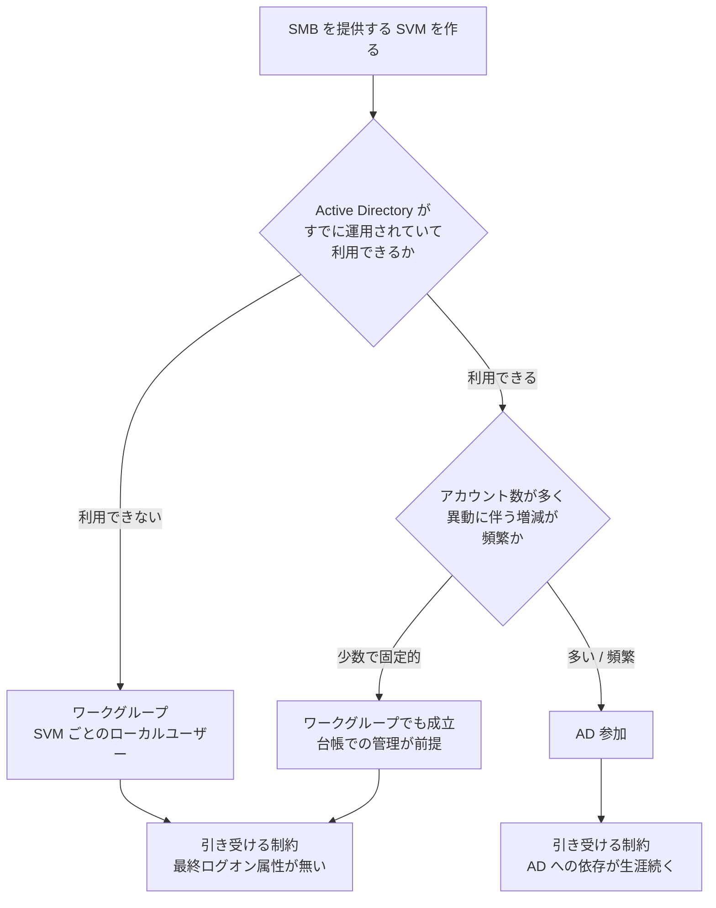
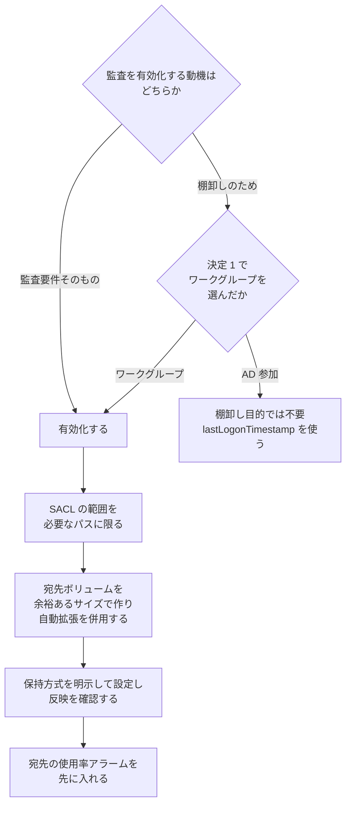

# SMB のユーザー管理と監査は 2 つの選択で決まる

<!-- lang-switcher:start -->
🌐 [日本語](smb-identity-and-audit.md) | [English](../../../en/reference/decision-trees/smb-identity-and-audit.md) | [🏠 リポジトリトップ](../../../../README.md)
<!-- lang-switcher:end -->

[決定ツリー一覧](README.md)

---

## 結論

**Amazon FSx for NetApp ONTAP で SMB を提供するとき、後から変えにくい選択は 2 つです。**

| # | 選択 | いつ決まるか |
|---|---|---|
| 1 | **ID をどこに置くか** — ワークグループ（SVM ごとのローカルユーザー）か、Active Directory 参加か | SVM 作成時。**後から変えると CIFS サーバーの削除を伴います** |
| 2 | **監査を常時有効にするか** — 監査要件のため、または棚卸しのため | 設計時。有効化すると可用性の設計項目が増えます |

**この 2 つは独立ではありません。** 選択 1 でワークグループを選ぶと最終ログオン日時を持つ属性が無くなるため、棚卸しの経路がファイルアクセス監査だけになり、**選択 2 が「やるかどうか」ではなく「どう安全にやるか」に変わります。**

**そして各枝には、公開ドキュメントに記載のない帰結が付いてきます。** それらは踏んでから調べると原因の特定に時間がかかる種類のもので、本ツリーの主な用途は分岐そのものより**枝ごとに何を引き受けるかを先に見せること**です。

> **Evidence**: `documented` — **どの選択肢が存在するか**は AWS と NetApp のドキュメントの記載です
> （[出典](#参照した一次情報)）。**本ツリーは測定値を持ちません。** 各枝の帰結は対応するノートに
> あり、そこに実測日・リージョン・ONTAP バージョンが書かれています。数値・閾値・所要時間を
> 引用する場合は、本ツリーではなくノート側を参照してください。

---

## 決定 1 — ID の置き場所

**枝の根拠**は次のとおりです。**推奨側の制約も併記します。**

| 観点 | ワークグループ + ローカルユーザー | AD 参加 |
|---|---|---|
| 最終ログオン日時の取得 | **属性が存在しません。** ファイルアクセス監査の有効化・保管・解析が必要 | AD の `lastLogonTimestamp` |
| 外部依存 | なし | **AD の可用性に生涯依存します。** 参加時だけの作業ではありません |
| ユーザーの一元管理 | **SVM ごとに独立。** 使い回せません | ドメイン単位 |
| AD 運用主体との調整 | 不要 | 必要 |
| 監査ログ容量の管理責任 | **棚卸しのために負います** | 棚卸し目的では不要 |
| 認証失敗時の調査範囲 | SVM 内で閉じます | ドメインコントローラへの到達性を含みます |

**選び方**: アカウント数と増減の頻度で決まります。**数十以上あり異動に伴う増減が頻繁なら AD 参加**、**少数で固定的ならワークグループと台帳管理**が目安です。ワークグループを選ぶ場合、棚卸しのために監査を有効化するコストと、AD を運用するコストを比べる形になります。**どちらの枝にも運用コストがあり、置き場所が違うだけです。**

---

## 決定 2 — 監査の常時有効化

**枝の根拠**です。

| 論点 | 内容 |
|---|---|
| 有効化の副作用 | **監査宛先ボリュームが枯渇すると、クライアントアクセスが止まります。** 止まるのは満杯になった瞬間ではありません |
| 止まる範囲 | **SACL を付けたパスだけ**です。同一 SVM の監査対象外ボリュームは影響を受けません |
| 検知手段 | **書き込み失敗を直接示す EMS イベントは、利用者から参照できません。** 残るのは容量側の代理指標です |
| 健全性の判定 | `vserver audit show` の `Auditing State` は**停止中も `true`** を返します。健全性の指標に使えません |
| 保持設定 | ローテーション本数による方式と保持期間による方式は**排他**です。片方を設定すると他方が無効化されます |
| 棚卸しへの副作用 | **棚卸しのために SACL を付けた共有こそが、枯渇で最初に止まる側になります。** 対象範囲を広げるほど停止範囲も広がります |

**選び方**: 監査要件がある場合は選択の余地がありません。**棚卸しのためだけに有効化する場合は、決定 1 で AD 参加を選べる状況かを先に確認してください。** AD が使えるなら、可用性の設計項目を増やさずに棚卸しができます。

**有効化する場合、順序が重要です。** 検知してから対処する設計より、**埋まらない設計**（保持の明示・余裕のある初期サイズ・自動拡張）を先に置いてください。**予告から停止までの猶予は一定しません。** 実測値と再現しない理由は[監査宛先の枯渇のノート](../../domains/security-governance/notes/audit-log-space-and-client-access.md)にあります。

---

## 各枝が引き受ける制約

**枝を選んだ時点で決まる帰結を、選択の前に読める形で並べます。** いずれも実測の詳細はノート側にあります。

| どの枝か | 引き受ける制約 | 詳細 |
|---|---|---|
| **両方の枝に共通** | **CIFS サーバーを削除すると、その SVM は SMB を提供できなくなります。** AD 構成の解除も削除を伴います。ONTAP CLI での再作成では戻らず、ONTAP REST が必要です | [SMB を提供できない SVM がある](../../domains/multiprotocol-identity/notes/smb-service-lost-on-cifs-server-delete.md) |
| **両方の枝に共通** | **サービスポリシーを変更できる管理ロールは存在しません。** ロールを変えて回避する試みは不要です | [同上の `fsxadmin` の節](../../domains/multiprotocol-identity/notes/smb-service-lost-on-cifs-server-delete.md#fsxadmin-では追加できないこと) |
| ワークグループ | **ローカルユーザーに最終ログオン属性がありません。** 棚卸しは監査ログから起こすことになり、「実績なし」は「不要」と同義ではないため削除の自動化は別の判断になります | [最終ログオン属性は無い](../../domains/multiprotocol-identity/notes/local-user-inventory-without-last-logon.md) |
| ワークグループ | **ログオン監査のイベントはセッション単位で、ログイン操作の回数ではありません。** 数え方を誤ると棚卸しの判定に誤検知が出ます | [4624 は記録される。ただし数えられるのはセッション](../../domains/security-governance/notes/smb-logon-audit-event-coverage.md) |
| AD 参加 | **AD への依存は参加時ではなく生涯続きます。** サービスアカウントの資格情報の失効は平常時に無症状で、次のメンテナンスで顕在化します | [AD への依存は参加時ではなく生涯続く](../../domains/multiprotocol-identity/notes/ad-dependency-lasts-the-lifetime.md) |
| 監査を有効化 | **宛先の枯渇がクライアントアクセスを止めます。** 書き込み失敗を直接示す EMS は参照できず、容量側の代理指標だけが残ります | [監査宛先の枯渇はアクセスを止める](../../domains/security-governance/notes/audit-log-space-and-client-access.md) |

---

## 症状から枝への逆引き

**どの枝の制約を踏んだかが分かれば、探す場所が 1 つに決まります。**

| 症状 | 踏んでいる可能性が高い制約 | 最初に見るもの |
|---|---|---|
| CIFS サーバーは作成できたのに SMB で接続できない | 両方の枝に共通（CIFS 削除） | データ LIF のサービス一覧に `data-cifs` が含まれるか |
| 過去は接続できていた SVM が、AD 構成を作り直した後で接続できない | 同上。**構成解除が削除を伴います** | 同上。作成日は関係しません |
| サービスポリシーを直そうとして「認識されないコマンド」が返る | 同上（ロールの制限） | `security login role show -role <role>` の当該コマンドファミリ |
| SMB クライアントが監査の失敗を示すエラーで止まる | 監査を有効化した枝 | 監査宛先ボリュームの使用率 |
| 監査が有効なのに宛先にファイルが増えていない | 同上 | 宛先の空き容量。**`Auditing State` は判定に使えません** |
| 棚卸しで「未使用」と判定したアカウントが実際は使われていた | ワークグループの枝（セッション粒度） | ログオンイベントの数え方と、対象パスの SACL |
| 平常時は動作するがメンテナンス後に認証できない | AD 参加の枝 | サービスアカウントの資格情報の有効性 |

---

## よくある誤解

| 誤解 | 実際 |
|---|---|
| CIFS サーバーを作り直せば SMB は戻る | **ONTAP CLI での再作成では戻りません。** コマンドは成功しますが、失われたサービスは復元されません |
| 別の管理ロールを使えばサービスポリシーを直せる | **利用できるロールはすべて読み取り専用**で、変更できるロールは存在しません |
| SMB を提供できないのは SVM の作成時期による | 相関しているのは作成時期ではなく **CIFS サーバーの削除履歴**です |
| 監査を有効化しても、止まるのは監査だけ | **SACL を付けたパスへのクライアントアクセスが止まります** |
| 監査が書けているかは `vserver audit show` で分かる | **停止中も `Auditing State: true`** を返します |
| 書き込み失敗は EMS イベントで検知できる | **直接示すイベントは利用者から参照できません。** 容量側の代理指標を使うことになります |
| ローカルユーザーにも最終ログオンの記録がある | **属性が存在しません** |
| ログオンイベントを数えればログイン回数が分かる | **セッション単位**です。既存セッションの再利用は新しいイベントを生みません |
| AD 参加は初期構築時だけの作業 | **依存は生涯続きます** |
| 保持設定は本数と期間の両方を指定できる | **排他**です。片方の設定が他方を無効化します |

---

## このツリーの限界

- **どの選択肢が存在するかは公開ドキュメントの記載ですが、各枝の帰結は本ツリーでは測定していません。** 実測日・リージョン・ONTAP バージョンは、上の表からリンクした各ノートに書かれています。**数値を引用する場合はノート側を参照してください。**
- **帰結はいずれも単一の検証環境での観測に由来します。** 一般化できる範囲は各ノートの記載に従ってください。**本ツリーは「起こり得ること」を先に見せるものであり、発生率を示すものではありません。**
- **オンプレミスの ONTAP との比較は行っていません。** 管理者がサービスポリシーを直接編集できる環境では復旧経路が異なります。他の ONTAP 環境向けの手順をそのまま適用できない場合があります。
- **ID の置き場所として LDAP や他のディレクトリサービスを使う構成は扱っていません。** 本ツリーはワークグループと AD 参加の 2 択に限定しています。
- **決定 2 の順序（範囲を絞る → 容量に余裕を持たせる → 保持を明示する → アラームを入れる）は設計判断で、測定から導いたものです。** この順序そのものを比較検証したわけではありません。

---

## 参照した一次情報

| 論点 | 出典 |
|---|---|
| ファイルアクセス監査の構成と、監査対象の指定方法 | [AWS: Auditing file access](https://docs.aws.amazon.com/fsx/latest/ONTAPGuide/file-access-auditing.html) |
| 監査の保存先が専用ボリュームまたは qtree であること、既定のログサイズ | [NetApp: ONTAP SVM の監査設定を計画する](https://docs.netapp.com/ja-jp/ontap/nas-audit/plan-auditing-config-concept.html) |
| 宛先ボリュームの枯渇が SMB 共有の停止につながること | [NetApp KB: 監査ログのデスティネーションがフルのため、CIFS 共有でデータが提供されていません](https://kb-ja.netapp.com/on-prem/ontap/da/NAS/NAS-KBs/CIFS_share_not_serving_data_because_the_Audit_Log_Destination_is_full) |
| 書き込み失敗を示す EMS イベントの定義と、SACL 付きオブジェクトでのサービス拒否 | [NetApp EMS: `adt.dest` events](https://docs.netapp.com/us-en/ontap-ems/adt-dest-events.html) |
| AD 参加に必要な前提と、サービスアカウントに求められる委任権限 | [AWS: Prerequisites for using a self-managed Microsoft AD](https://docs.aws.amazon.com/fsx/latest/ONTAPGuide/self-manage-prereqs.html) |
| ローテーション本数と保持期間が択一であること | [NetApp: `vserver audit modify`](https://docs.netapp.com/us-en/ontap-cli/vserver-audit-modify.html) |
| ボリュームの自動拡張による使用率しきい値での拡張 | [AWS: 自動サイズ調整の有効化](https://docs.aws.amazon.com/ja_jp/fsx/latest/ONTAPGuide/enable-volume-autosizing.html) |

---

## 関連ドキュメント

- [SMB を提供できない SVM がある](../../domains/multiprotocol-identity/notes/smb-service-lost-on-cifs-server-delete.md) — **両方の枝に共通する制約。** 原因と、ONTAP REST での復旧手順
- [最終ログオン属性は無い。棚卸しは監査ログから起こすしかない](../../domains/multiprotocol-identity/notes/local-user-inventory-without-last-logon.md) — ワークグループの枝。段階的な導入手順を含みます
- [4624 は記録される。ただし数えられるのはセッション](../../domains/security-governance/notes/smb-logon-audit-event-coverage.md) — 棚卸しの判定に使うイベントの性質
- [監査宛先の枯渇はアクセスを止める。ただし満杯の瞬間ではない](../../domains/security-governance/notes/audit-log-space-and-client-access.md) — 決定 2 の帰結。実測値と観測できる信号
- [AD への依存は参加時ではなく生涯続く](../../domains/multiprotocol-identity/notes/ad-dependency-lasts-the-lifetime.md) — AD 参加の枝
- [セキュリティスタイルが権限評価のモデルを決める](../../domains/multiprotocol-identity/notes/security-style-and-permission-evaluation.md) — NFS と併用する場合の前提
- [決定ツリー一覧](README.md)
- [知見の分類ポリシー](../../evidence-policy.md)

---

<!-- lang-switcher:start -->
🌐 [日本語](smb-identity-and-audit.md) | [English](../../../en/reference/decision-trees/smb-identity-and-audit.md) | [🏠 リポジトリトップ](../../../../README.md)
<!-- lang-switcher:end -->
