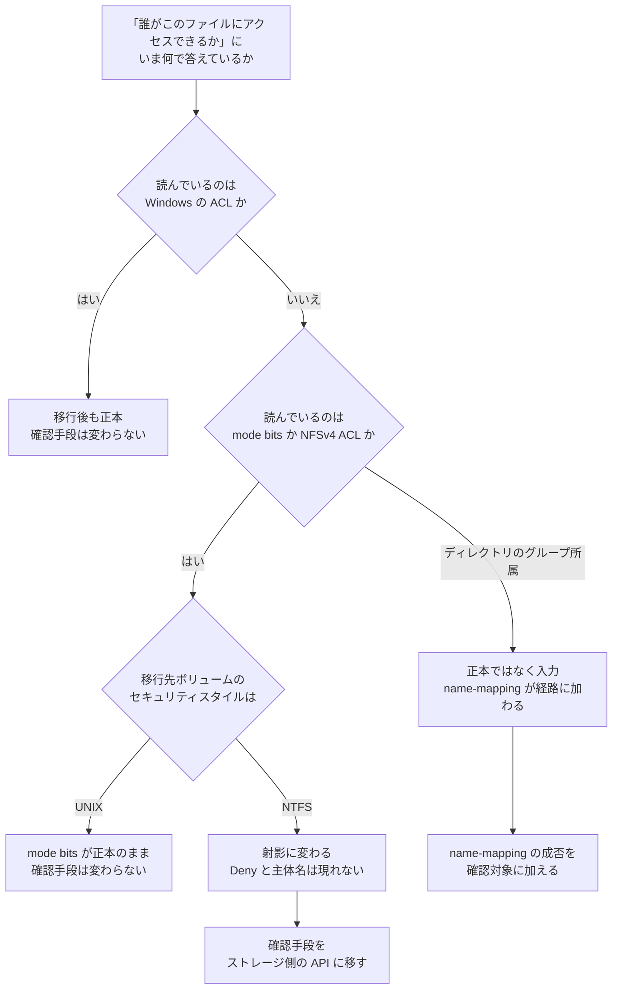

# プロトコルを変えたあと「誰がこのファイルにアクセスできるか」をどこで確認するか

[決定ツリー一覧](README.md)

---

## 結論

**移行の設計で見落としやすいのは、権限そのものではなく「権限を確認する手段」です。**

データは移ります。アクセスも通ります。**変わるのは、いま運用が「誰がアクセスできるか」に答えるために
使っている道具が、移行後も同じ問いに答えられるかどうかです。** ここが変わると、監査の受け答え、
障害時の切り分け、権限変更のレビューが、移行の当日ではなく数週間後に詰まります。

判定は 2 段です。

| 段 | 問い |
|---|---|
| 1 | いまその問いに答えている手段は、**正本**を読んでいるか、**射影**を読んでいるか |
| 2 | 移行後、その手段は正本を読み続けるか。射影に変わるか。**読めなくなるか** |

> **Evidence**: `documented` — どのモデルで権限が評価されるかは
> [出典](#参照した一次情報)の記載です。**このツリーは測定値を持ちません。**
> 各枝の帰結と実測は [NFS 側から見える権限表現が実際の可否と一致しない](../../domains/multiprotocol-identity/notes/nfs-side-view-does-not-explain-ntfs-denials.md)
> にあり、実測日・リージョン・ONTAP バージョンはそちらに書かれています。

---

### 対象範囲 — ACL の喪失とは別の論点

**移行で ACL が失われるかどうかは別の論点です。** 本ツリーが扱うのは、移行後に**権限を確認する
手段**が同じ問いに答え続けるかです。ACL の保持そのものは
[移行時の ACL 保持](../../playbooks/03-migrate/notes/preserving-acls-during-migration.md) を参照して
ください。

また、**ブロック（LUN）として提供しているデータはこの話に入りません。** LUN の中身はファイル
プロトコルに現れないため、そもそもファイル単位の権限という概念が成立しません
（[LUN の中身はファイルプロトコルに現れない](../../domains/block-storage/notes/lun-contents-do-not-reach-file-protocols.md)）。
データベースを LUN で載せている場合、本ツリーの対象外です。

## 決定 1 — いま読んでいるものの判定

自分の現在の構成が左列のどれかを選びます。**製品名ではなく、確認に使っている仕組みで選んでください。**
どの製品を使っていても、権限の確認は最終的に下の 4 つの仕組みのどれかに落ちます。

| いま「誰がアクセスできるか」に答えている手段 | 読んでいるもの | 移行後に同じ問いに答える手段 |
|---|---|---|
| Windows のセキュリティタブ、`icacls`、`Get-Acl` | **正本**（NTFS ACL） | 変わりません。NTFS セキュリティスタイルのボリュームでは、これが引き続き正本です |
| Linux の `ls -l`、`stat`（NFS 経由） | 移行前は**正本**（mode bits） | **射影に変わります。** NTFS スタイルでは ONTAP が合成した値で、Deny も主体名も含みません |
| `nfs4_getfacl`（NFSv4 ACL） | 移行前は正本 | **既定では読めません。** SVM で NFSv4 ACL が無効なうえ、有効化しても NTFS スタイルでは合成 3 エントリしか返りません |
| ディレクトリ側のグループ所属（AD / LDAP の管理画面） | 権限の**入力**（誰が誰か） | 変わりません。ただし UNIX ID と Windows ID を結ぶ name-mapping が新たに評価経路に入ります |
| 何らかの管理ツールやレポートの権限一覧 | **上の 4 つのどれか**を読んでいます | **どれを読んでいるかを先に確認してください。** ツール固有の答えは存在せず、上のどれかに帰着します |
| オブジェクトストレージのポリシー（バケットポリシー等） | 別のモデル | 併用する場合、認可が層になります（[S3 Access Point 経由のリクエストはどう判定されるか](access-point-authorization.md)） |

### 判定が「射影に変わる」に落ちた場合の帰結

**mode bits と NFSv4 ACL は、可否を説明できなくなります。** 具体的には、明示 Deny は表現に現れず、
ACE を付けた相手の名前も現れません。実測では、拒否される NTFS ディレクトリと書き込める UNIX
ディレクトリが**同一の表現**になりました。

つまり「NFS 側から見て問題なさそうだから大丈夫」という確認は、移行後は成立しません。

---

## 決定 2 — 確認手段の移し先

射影に変わる場合、確認の正本はストレージ側になります。

| 確認したいこと | 経路 | 注意 |
|---|---|---|
| いま付いている ACE | `GET /protocols/file-security/permissions/{svm.uuid}/{path}` | 返るのは `advanced_rights` で、`rights` は返りません |
| ある利用者に何が許可されるか | `GET /protocols/file-security/effective-permissions/{svm.uuid}/{path}?user=` | フィールドは `file_permissions`（複数形・配列） |
| ACE を変更する | `POST /protocols/file-security/permissions/{svm.uuid}/{path}` | SMB クライアントを介さず、継承フラグも指定できます |
| ID が結びついているか | `GET /name-services/name-mappings` と ONTAP のイベントログ | 失敗は「AD にその名前が無い」と表示され、規則の書き方の問題だと分かりません |

**この 3 つを揃えないと所見になりません。** 設定した ACE、移行後の表現、実際の成否です。2 つでは、
表現と可否が食い違ったときにどちらが正しいかを決められません。

**3 点セットは JSON で出力されます**（`set-test-acls.sh --out`、`read-effective-permissions.sh --out`）。
環境（ONTAP バージョン、リージョン、セキュリティスタイル、測定時刻）を同じファイルに含むので、
**第三者が条件を確認したうえで再測できます。** 監査で参照する場合、表ではなくこの JSON を証跡に
してください。

### 変更の受け入れの決定者

確認手段が変わることは、技術的な事実であると同時に**手続きの変更**です。規制対象や内部統制の
対象になっているデータでは、次を移行前に決めてください。**決めた記録がないことが所見になります。**

| 決めること | なぜ移行前か |
|---|---|
| 新しい確認手段を受け入れる決定の所有者 | 手段が変わった事実を誰も承認していない状態が残ります |
| ONTAP 資格情報の保持者と、その付与の承認者 | 確認できる人がいなければ手続きは成立しません |
| 変更前後の確認記録の保管場所と保管期間 | 「以前はこう確認していた」を後から示せません |

**技術的な検証は、法務・コンプライアンス・プライバシーの評価を代替しません。** 本ツリーは前者だけを
扱います。

再現できる最小環境とスクリプトは
[`examples/multiprotocol-ad/`](../../../../examples/multiprotocol-ad/README.md) にあります。

---

## 「では NTFS と UNIX のどちらにするか」への回答

本ツリーは確認手段を扱いますが、読者が実際に決めるのはスタイルです。**確認手段の話を踏まえた回答は
1 行で言えます。**

**必要な権限表現が mode bits で足りるなら UNIX、足りないなら NTFS です。**

判断材料は次の 3 つだけです。詳細は
[セキュリティスタイルが権限評価のモデルを決める](../../domains/multiprotocol-identity/notes/security-style-and-permission-evaluation.md)
にあります。

| 必要なもの | 成立するスタイル |
|---|---|
| 明示的な拒否（特定の利用者にだけ禁止する） | **NTFS のみ。** mode bits に拒否の表現がありません |
| 継承（親の権限を子へ自動適用） | **NTFS のみ** |
| 所有者・グループ・その他の 3 区分で足りる | **UNIX。** そして NFS 側からそのまま確認できます |

**「両方のプロトコルから使うから NTFS」ではありません。** どちらのスタイルでも NFS と SMB の両方から
アクセスできます。スタイルが決めるのは**どちらの権限モデルを正本にするか**だけです。

したがって選択の代償は次のとおりです。**NTFS を選ぶと、権限の確認手段が Windows 側かストレージ側の
API に限られます。** UNIX を選ぶと、その制約はない代わりに拒否と継承が表現できません。**どちらにも
制約があり、片方だけが優れているという関係ではありません。**

## 移行の設計に落とすときの確認項目

| # | 確認 | なぜ移行前に必要か |
|---|---|---|
| 1 | 監査や内部統制の手続き書に、確認手段が**手段名で**書かれていないか | 「`ls -l` で確認する」と書かれていれば、移行後にその手続きは成立しません |
| 2 | 権限変更のレビューを誰がどの画面で行うか | 射影しか見えない側にレビュー担当がいると、変更の妥当性を判断できません |
| 3 | 障害時の一次切り分けを誰が行うか | NFS 側の担当者が拒否の理由に到達できない構成になりえます |
| 4 | 自動化やスクリプトが mode bits を読んでいないか | 読んでいる場合、移行後も動き続けて**間違った答えを返します**（エラーになりません） |
| 5 | セキュリティスタイルをボリュームごとにどう決めるか | [セキュリティスタイルが権限評価のモデルを決める](../../domains/multiprotocol-identity/notes/security-style-and-permission-evaluation.md) |

**4 が最も見つけにくい項目です。** エラーを出さずに答えを変えるため、テストは通ります。

---

## 参照した一次情報

| 情報 | 出典 |
|---|---|
| セキュリティスタイルが権限評価のモデルを決めること、スタイルはアクセスできるクライアント種別を制限しないこと | [Security styles and their effects](https://docs.netapp.com/us-en/ontap/smb-admin/security-styles-their-effects-concept.html) (NetApp) |
| クライアントを介さずに NTFS ファイルセキュリティを管理する API | [Manage file security permissions and audit policies](https://docs.netapp.com/us-en/ontap-restapi-991/manage_file_security_permissions_and_audit_policies.html) (NetApp) |
| 同じ API を FSx for ONTAP で使う手順と継承フラグ | [Manage NTFS permissions at scale on Amazon FSx for NetApp ONTAP](https://aws.amazon.com/blogs/storage/manage-ntfs-permissions-at-scale-on-amazon-fsx-for-netapp-ontap/) (AWS Storage Blog) |

## 関連ドキュメント

- [NFS 側から見える権限表現が実際の可否と一致しない](../../domains/multiprotocol-identity/notes/nfs-side-view-does-not-explain-ntfs-denials.md) — 実測
- [セキュリティスタイルが権限評価のモデルを決める](../../domains/multiprotocol-identity/notes/security-style-and-permission-evaluation.md)
- [SMB で運用中のボリュームに NFS を足すのに複製は要らない](../../domains/multiprotocol-identity/notes/adding-a-protocol-does-not-need-a-clone.md)
- [移行方式の選択](migration-method.md)
- [この設定はどこから作るか](where-a-setting-is-created.md)
