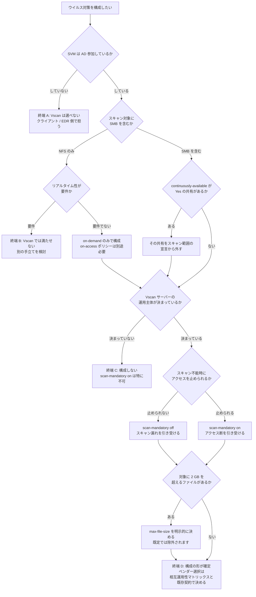

# ウイルス対策の適用範囲をどこまでにするか

[🏠 リポジトリトップ](../../../../README.md) | [Reference](../README.md) | [決定木](README.md) | [Domain — セキュリティ・ガバナンス](../../domains/security-governance/README.md)

---

## 結論

**この決定木の終端にベンダー名は現れません。**

Amazon FSx for NetApp ONTAP のウイルス対策で最初に見つかる資料は対応 6 社の一覧ですが、**6 社の差はこの決定木では判定できません。** 版の組み合わせは NetApp 相互運用性マトリックスにあり、費用と運用は既存の契約で決まります。**このリポジトリに材料がありません。**

**判定できるのは、ベンダーを選ぶ前に決まる 5 つです。**

1. **Vscan がそもそも選べるか**（SVM が AD 参加しているか）
2. **リアルタイムにスキャンできるか**（対象プロトコルが SMB を含むか）
3. **スキャン範囲から外れる共有があるか**（`continuously-available`）
4. **アクセス断とスキャン漏れのどちらを引き受けるか**（`scan-mandatory`）
5. **既定の除外に落ちるファイルがあるか**（2 GB）

> **区分**: `documented` — 各分岐は AWS / NetApp の公式ドキュメントと NetApp KB の記載に基づきます（**取得日 2026-09-15**）。**当リポジトリでの実測は含みません。** `fsxadmin` の権限で `vserver vscan` 系コマンドがどこまで実行できるかは**未確認**で、条件 1 の手前に制約が 1 つ増える可能性があります。

---

## 決定フロー

**図と同じ内容を表でも持ちます。** 図が読めない環境でも判断できるようにするためです。

| # | 確認する条件 | はい | いいえ |
|---|---|---|---|
| 1 | SVM は AD 参加しているか | 条件 2 へ | **終端 A。** Vscan の privileged user はドメインユーザーで、選択肢から外れます |
| 2 | スキャン対象に SMB を含むか | 条件 3 へ | 条件 2-1 へ（NFS のみ） |
| 2-1 | NFS のみで、リアルタイム性が要件か | **終端 B。** on-access は SMB のみで満たせません | on-demand のみで構成。**on-access ポリシーは別途必要** |
| 3 | `continuously-available` が `Yes` の共有があるか | **その共有を宣言から外す**。条件 4 へ | 条件 4 へ |
| 4 | Vscan サーバーの運用主体が決まっているか | 条件 5 へ | **終端 C。** 構成しない |
| 5 | スキャン不能時にアクセスを止められるか | `scan-mandatory on`。条件 6 へ | `scan-mandatory off`。条件 6 へ |
| 6 | 対象に 2 GB を超えるファイルがあるか | `max-file-size` を明示的に決める。**終端 D** | **終端 D** |

---

## 各分岐の根拠

| 分岐 | 根拠 |
|---|---|
| **条件 1 を最初に置く理由** | **最も強い制約です。** Vscan サーバーが SVM に接続するための privileged user はドメインユーザーアカウントで、scanner pool の privileged user 一覧に存在する必要があります。ワークグループ運用の SVM ではこの前提が満たせません |
| **条件 2 が条件 3 より前に来る理由** | プロトコルが on-access の可否を決めます。on-access ポリシーの作成が受け付けるプロトコルは `CIFS` で、NFS エクスポートには構成できません。**リアルタイム性の要件はここで落ちます** |
| **条件 2-1 で「別の手立て」に振る理由** | on-demand は cron スケジュールまたは手動実行です。**書き込みの瞬間には介入しません。** リアルタイム性が要件なら、Vscan とは別の層で担うことになります |
| **条件 3 を構成の前に置く理由** | `continuously-available` を `Yes` にした SMB 共有では**ウイルススキャンが行われません。有効化する手段がありません。** 構成後に気づくと、宣言していた適用範囲を訂正することになります |
| **条件 4 を `scan-mandatory` の前に置く理由** | **`scan-mandatory on` は運用の穴をアクセス断に変換します。** Vscan サーバーが応答しなければクライアントのアクセス要求は拒否されます。運用主体・パッチ適用・監視の担当が決まっていない状態でこの設定を選ぶと、停止が可用性の事故になります |
| **条件 5 が二択である理由** | どちらを選んでも何かを引き受けます。`on` は**アクセス断**、`off` は**スキャンされないままのアクセス**。**片方が正解ではありません。** 選べるのはどちらを引き受けるかだけです |
| **条件 6 を最後に置く理由** | 除外条件は `scan-mandatory` の設定に関係なく効きます。**`on` にしても既定で 2 GB を超えるファイルは対象外です。** 条件 5 の後に置くのは、`on` を選んだ人がここを見落とすと「必須スキャンだから全部見ている」と誤解するためです |
| **終端 D にベンダー名が無い理由** | 6 社の差は版の組み合わせ・費用・既存契約で決まり、**このリポジトリに判定材料がありません。** ここで止めるほうが、材料のない推奨を書くより正確です |

**条件 2 は共有とエクスポートのプロトコルを問うもので、書き込みの着地経路とは別です。** 同じボリュームに **S3 Access Point 経由でも書き込みが着地する**場合、**その経路には on-access が届きません。** ポリシーのプロトコルは `CIFS` なので、S3 Access Point 経由の書き込みは on-demand で後から拾う対象になります。**記録と検知は別の機構で成立します**（ONTAP 監査は記録し、ARP は検知します）が、**着地の瞬間に拒否する手立てはありません。** 経路ごとの対応は [書き込みの着地経路によるインラインでの拒否の可否](../../domains/security-governance/notes/vscan-scope-is-bounded-before-the-vendor.md#書き込みの着地経路によるインラインでの拒否の可否) にあります。

**条件 2-1 で on-demand を選んだ場合も、on-access ポリシーの作成が必要です。** NetApp のドキュメントは on-demand スキャンに on-access ポリシーが必要と記載し、on-access スキャンを避けたい場合は `-scan-files-with-no-ext false` と `-file-ext-to-exclude *` で全拡張子を除外する形を案内しています。**「NFS だけだから on-access は無関係」で構成すると、ここで止まります。**

---

## 終端ごとに次に読むもの

| 終端 | 状態 | 次に読むもの |
|---|---|---|
| **A** | Vscan が選べない | [アクセスを絞る手立ての比較](../comparison/access-restriction-options.md) — 手立てが並ぶ層の違い |
| **B** | on-access が要件だが NFS のみ | [ウイルス対策の選択はベンダーより前に決まる — 選択肢の対称な比較](../../domains/security-governance/notes/vscan-scope-is-bounded-before-the-vendor.md#選択肢の対称な比較) |
| **C** | 運用主体が未決 | [監査宛先が枯渇するとクライアントアクセスは止まる](../../domains/security-governance/notes/audit-log-space-and-client-access.md) — 同じ構造の先例 |
| **D** | 構成の形が確定 | NetApp 相互運用性マトリックスで ONTAP 版と AV 製品版の組み合わせを確認。**その先はこのリポジトリの範囲外です** |

---

## 自環境での確認手順

| # | 手順 | 確認できること |
|---|---|---|
| 1 | SVM の AD 参加状態を確認する | 条件 1 |
| 2 | 共有とエクスポートをプロトコル別に列挙する | 条件 2。**NFS 分は on-demand のみになります** |
| 3 | `continuously-available` が `Yes` の SMB 共有を列挙する | 条件 3。**宣言から外す対象** |
| 4 | 既定の `default_CIFS` ポリシーの状態を確認する | 「未構成」と「既定が有効」は違います |
| 5 | `fsxadmin` で `vserver vscan on-access-policy show` を実行してみる | **未確認の項目。** 権限境界が条件 1 の手前に来るかどうか |
| 6 | 対象データの最大ファイルサイズを測る | 条件 6。既定の除外は 2 GB |
| 7 | Vscan サーバーの運用主体・パッチ適用・監視の担当を書き出す | 条件 4。**空欄があるなら終端 C です** |

---

## よくある誤解

| 誤解 | 実際 |
|---|---|
| この決定木でベンダーが決まる | **決まりません。** 終端 D は構成の形までで、6 社の差は相互運用性マトリックスと既存契約で決まります |
| 最初に決めるのは製品である | **最初に決まるのは AD 参加の有無です。** 満たしていなければ Vscan は候補から外れます |
| NFS でもリアルタイムにスキャンできる | on-access は SMB に対するものです。NFS エクスポートは on-demand の対象です |
| NFS のみなら on-access ポリシーは要らない | **on-demand スキャンに on-access ポリシーが必要です** |
| `scan-mandatory on` が安全側の選択である | **アクセス断を引き受ける選択です。** どちらを選んでも何かを引き受けます |
| `scan-mandatory on` なら全ファイルがスキャンされる | 除外条件に合致するファイルは対象外です。**既定の除外サイズは 2 GB** |
| 共有を作れば範囲に入る | `continuously-available` が `Yes` の共有はスキャンされず、**有効化する手段がありません** |
| 構成前なのでスキャンは動いていない | ONTAP は `default_CIFS` を作成し全 SVM で有効化します |
| 条件 2 で SMB を含むなら全書き込みが on-access の対象になる | **共有のプロトコルと書き込みの着地経路は別です。** S3 Access Point 経由で着地する書き込みに on-access は届きません |
| これらは FSx for ONTAP 固有の制約である | **すべて ONTAP 一般の性質です。** FSx for ONTAP 固有の差分は確認できていません |

---

## 参照した一次情報

| 論点 | 出典 | 取得日 |
|---|---|---|
| FSx for ONTAP が Vscan 経由でサードパーティのウイルス対策に対応すること、対応 6 社 | [AWS: Use NetApp ONTAP Vscan with FSx for ONTAP](https://docs.aws.amazon.com/fsx/latest/ONTAPGuide/using-vscan.html) | 2026-09-15 |
| privileged user がドメインユーザーアカウントであること、scanner policy が 3 種のシステム定義であること、`vscan-fileop-profile` の 4 種 | [NetApp: Antivirus architecture with ONTAP Vscan](https://docs.netapp.com/us-en/ontap/antivirus/architecture-concept.html) | 2026-09-15 |
| on-access ポリシーの `-protocol CIFS`、`scan-mandatory` の挙動と除外条件の優先、既定の除外サイズ 2 GB、`continuously-available` が `Yes` の SMB 共有が非スキャン、`default_CIFS` の既定作成、on-demand に on-access ポリシーが必要であること | [NetApp: Create ONTAP Vscan on-access policies](https://docs.netapp.com/us-en/ontap/antivirus/create-on-access-policy-task.html) | 2026-09-15 |
| on-demand が NFS エクスポートを対象にできること、既存の Vscan サーバーを流用すること | [NetApp KB: How does vscan work](https://kb.netapp.com/on-prem/ontap/da/NAS/NAS-KBs/How_does_vscan_work) | 2026-09-15 |

---

## 関連ドキュメント

- [ウイルス対策の選択はベンダーより前に決まる](../../domains/security-governance/notes/vscan-scope-is-bounded-before-the-vendor.md) — この決定木の根拠となるノート
- [課題別 ISV / SaaS ソリューションマップ](../isv-solution-map.md) — 他の課題領域の選択肢
- [Domain — セキュリティ・ガバナンス](../../domains/security-governance/README.md) — このモジュールのハブ
- [アクセスを絞る手立ての比較](../comparison/access-restriction-options.md) — 終端 A の次
- [監査宛先が枯渇するとクライアントアクセスは止まる](../../domains/security-governance/notes/audit-log-space-and-client-access.md) — 終端 C の次
- [この設定はどこから作るか](where-a-setting-is-created.md) — `fsxadmin` の権限境界
- [知見の分類ポリシー](../../evidence-policy.md)

---

[🏠 リポジトリトップ](../../../../README.md) | [Reference](../README.md) | [決定木](README.md) | [Domain — セキュリティ・ガバナンス](../../domains/security-governance/README.md)

<!-- lang-switcher:start -->
🌐 [日本語](vscan-antivirus-scope.md) | [English](../../../en/reference/decision-trees/vscan-antivirus-scope.md) | [🏠 リポジトリトップ](../../../../README.md)
<!-- lang-switcher:end -->
