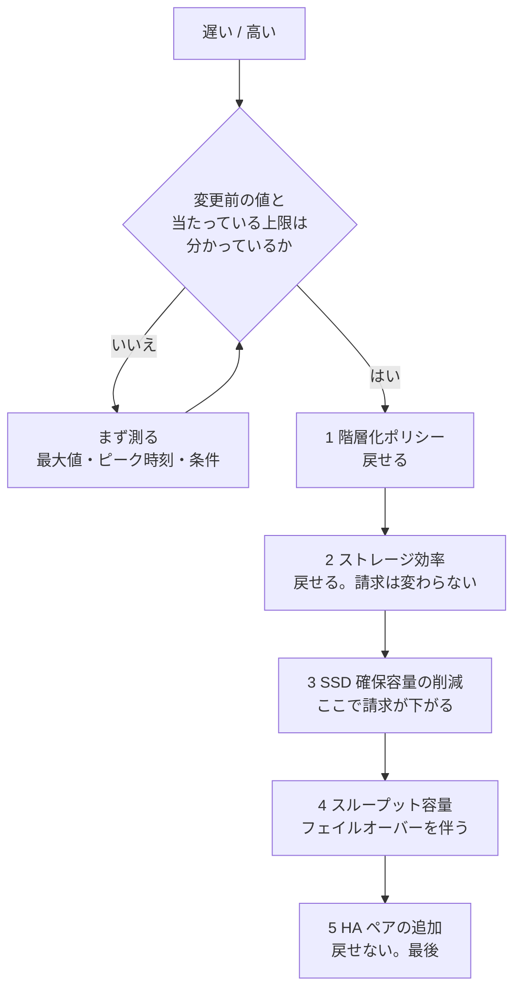

# 最適化で何をどの順に変えるか

[🏠 リポジトリトップ](../../../../README.md) | [Reference](../README.md) | [決定木](README.md) | [Playbook — 06 最適化](../../playbooks/06-optimize/README.md)

---

## 結論

**順序を効果の大きさで決めると、効かなかったときに戻れません。** 戻せる変更から試します。

**そして、変更の前に 2 つが確定していないと最適化として成立しません。**

| 確定させるもの | 確定していないと |
|---|---|
| **変更前の値** | 効果を主張できません。**変更後の値だけでは、良くなったのか元からそうだったのか分かりません** |
| **どの上限に当たっているか** | **当たっている場所によって打つ手が正反対になります。** 別の上限に効く変更は、費用だけが増えます |

---

## 判断の順序

**上の 2 つが埋まってから、下の表に入ります。** 埋まっていない場合は、この決定木の答えは「まず測る」です。

| 段 | 変更 | 戻せるか | 効くもの | 前提 |
|---|---|---|---|---|
| 0 | **測る** | — | — | 変更前の値と、当たっている上限。[性能劣化の切り分け順](../../playbooks/05-operate/notes/monitoring-fails-on-averages.md#性能劣化の切り分け順) |
| 1 | 階層化ポリシーと cooling period | **戻せる**（無停止）| 容量プールへ移る量 | **既定値は作成経路で違います。** 現在値の確認から |
| 2 | ストレージ効率（重複排除・圧縮）| 戻せる | SSD の実使用量 | **請求は変わりません。** 確保容量を下げるまでは |
| 3 | SSD 確保容量の削減 | 戻せる | SSD の請求 | 2 の効果が出てから |
| 4 | スループット容量の変更 | 戻せる（**フェイルオーバーを伴う**）| スループット上限と請求 | **設定を上げただけでは上限に届きません。** SSD 容量と IOPS の構成が伴う必要があります |
| 5 | **HA ペアの追加** | **戻せません** | HA ペアあたりの上限 | **最後です。** 追加した HA ペアは削除できず、SSD 容量も同じ比率で増えます |

**5 が最後である理由は効果の小ささではありません。** 不可逆だからです。

---

## 測るときの前提

**測り方を間違えると、変更の効果が読めません。**

| 測るもの | 注意 |
|---|---|
| SSD 利用率 | **平均ではなく最大で見ます。** 平均は飽和を隠します |
| 容量プールのリクエスト数 | 階層化の是非を決める主要な入力 |
| SSD の実使用量と確保容量 | **分けて記録します。** 効率化は実使用量を下げますが、確保容量を下げないと請求は変わりません |
| ピーク時刻 | 再現条件。平均値だけでは比較できません |
| リージョン・世代・デプロイタイプ | **上限も単価も変わります** |

---

## 同じ内容の図

**下の図は上の表の要約です。** 図が読めない環境でも判断できるように、内容は表側にあります。

---

## この決定木が答えないこと

| 問い | どこにあるか |
|---|---|
| どこがボトルネックかの切り分け | [性能劣化の切り分け順](../../playbooks/05-operate/notes/monitoring-fails-on-averages.md#性能劣化の切り分け順) |
| 請求のどの項目が伸びているか | [請求が想定より高いとき](cost-higher-than-expected.md) |
| 階層化ポリシーをどれにするか | [階層化ポリシーの比較](../comparison/tiering-policies.md) |
| スループットを上げる手段の比較 | [スループットを上げる手段の比較](../comparison/throughput-levers.md) |
| HA ペアを足したときに何が起きるか | [HA ペアを足すときに起きること](../../playbooks/02-design/notes/deployment-type-is-decided-once.md#ha-ペアを足すときに起きること) |

**具体的な効果量は答えません。** 変更の効き方は構成と負荷で変わり、このリポジトリはこの順序について効果量を測っていません。**順序は「戻せるか」で決まっており、効果の大きさで決まっていません。**

---

## 関連ドキュメント

- [階層化の既定値は作成方法で違う](../../playbooks/06-optimize/notes/tiering-defaults-differ-by-creation-method.md)
- [Playbook — 06 最適化](../../playbooks/06-optimize/README.md)
