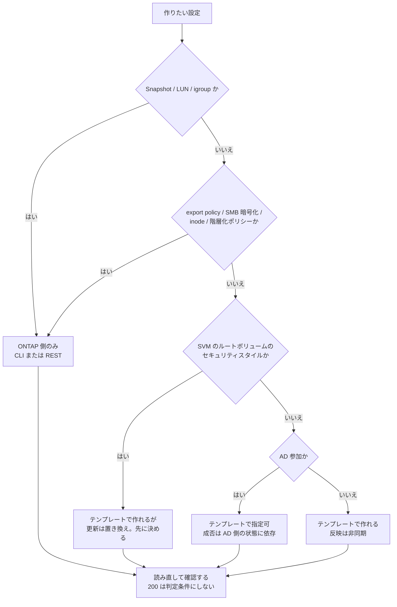

# この設定はどこから作るか

[🏠 リポジトリトップ](../../../../README.md) | [Reference](../README.md) | [決定木](README.md) | [Playbook — 04 構築](../../playbooks/04-build/README.md)

---

## 結論

**設定ごとに「作れる面」が違います。** AWS の API で作れるもの、ONTAP 側にしかないもの、テンプレートで作れるが更新するとリソースが作り直されるものが混ざっています。

**この 3 つを取り違えると、症状が 3 通りに分かれます。**

| 取り違え | 症状 |
|---|---|
| ONTAP 側のものを AWS API で作ろうとした | **エラーが出ます。** ただし「ボリュームが見つからない」のように、原因と無関係に読める文言のことがあります |
| AWS API で作れるものを ONTAP 側で作った | 作れますが、**テンプレートの管理外**になります。次の更新で差分として現れません |
| 置き換えを伴うプロパティを更新した | **リソースが作り直されます。** SVM のルートボリュームのセキュリティスタイルがこれです |

**「テンプレートが成功した」は「構成が完成した」ではありません。** 検証は 2 層に分けて組みます。

---

## 判断の順序

**作りたい設定を 1 つ選び、上から当てはめます。**

| 段 | 問い | 該当したら | 根拠 |
|---|---|---|---|
| 1 | **Snapshot を作る操作か** | **ONTAP 側。** Snapshot ポリシーまたは ONTAP CLI / REST | `CreateSnapshot` は FSx for OpenZFS 専用で、ONTAP ボリュームに実行すると**ボリュームが `CREATED` でも「見つからない」と返ります**（[実測で見つかった境界](../../playbooks/04-build/notes/what-iac-cannot-reach.md#実測で見つかった境界)） |
| 2 | **LUN / igroup / namespace か** | **ONTAP 側のみ。** AWS の API に存在しません | CloudFormation の Amazon FSx のリソースは 6 種のみ（[LUN と igroup は AWS の API の外側にある](../../domains/block-storage/notes/block-objects-are-outside-the-aws-api.md)） |
| 3 | **export policy / SMB 暗号化の強制 / inode 上限 / 階層化ポリシーか** | **ONTAP 側。** テンプレート後に別経路で入れます | [構築後検証の自動化](../../playbooks/04-build/notes/what-iac-cannot-reach.md#構築後検証の自動化) |
| 4 | **SVM のルートボリュームのセキュリティスタイルか** | **テンプレートで作れますが、更新は置き換えです。** 先に決めます | [テンプレートで扱えるものと、その更新挙動](../../playbooks/04-build/notes/what-iac-cannot-reach.md#テンプレートで扱えるものとその更新挙動) |
| 5 | **AD 参加か** | **テンプレートで指定できますが、成否は AD 側の状態に依存します。** 参加状態は SVM のライフサイクル状態で確認します | [Active Directory 連携の自動化](../../playbooks/04-build/notes/what-iac-cannot-reach.md#active-directory-連携の自動化) |
| 6 | **上のどれでもない AWS リソースの属性か** | **テンプレートで作れます。** ただし反映は非同期です | 次節 |

---

## 成功応答を成功と読めない 3 つの操作

**いずれも実測です。** 検証の判定条件をここに合わせないと、誤診します。

| 操作 | 応答 | 実際に確認する場所 |
|---|---|---|
| `UpdateVolume` | 成功。**`AdministrativeActions` は `null`** | **120〜180 秒後に `DescribeVolumes` を読み直す。** 30 秒では未確認でした。短い待ち時間で一度「無視された」と誤診しています |
| `delete-volume`（失敗時） | **エラーを含みません。** `DELETING` に入って `CREATED` に戻ります | `DescribeVolumes` の `LifecycleTransitionReason` |
| SnapLock 監査ログボリュームの削除 | 通常の削除も `BypassSnaplockEnterpriseRetention=true` も効きません | **ONTAP REST で解除できますが、削除できるようにはなりません。** [監査ログボリュームによるファイルシステム全体の 6 か月固定](../../domains/data-protection/notes/snaplock-and-layered-ransomware-readiness.md#監査ログボリュームによるファイルシステム全体の-6-か月固定) |

**判定条件は「API が 200 を返したか」ではなく「読み直して意図した値になっているか」です。**

> **この節の区分**: `verified`（検証日 2026-08-06、`ap-northeast-1`、`SINGLE_AZ_1`、ONTAP `9.17.1P7D1`）。

---

## 同じ内容の図

**下の図は上の表の要約です。** 図が読めない環境でも判断できるように、内容は表側にあります。

---

## この決定木が答えないこと

| 問い | どこにあるか |
|---|---|
| ONTAP 側へどの経路で届くか | [ONTAP 側の設定に届く経路の比較](../comparison/ontap-configuration-routes.md) |
| 本番前に何を試すか | [本番投入前レビュー](../../playbooks/04-build/checklists/pre-production-review.md) |
| セキュリティスタイルをどう選ぶか | [セキュリティスタイルが権限評価のモデルを決める](../../domains/multiprotocol-identity/notes/security-style-and-permission-evaluation.md) |

**網羅した一覧ではありません。** 上の 6 段は実測で境界を確認したものと、既定値が経路で変わるものです。**ここに無い設定は、どちらの面にあるか未確認**として扱ってください。

---

## 関連ドキュメント

- [IaC の境界は API の表面で決まる](../../playbooks/04-build/notes/what-iac-cannot-reach.md)
- [Playbook — 04 構築](../../playbooks/04-build/README.md)
